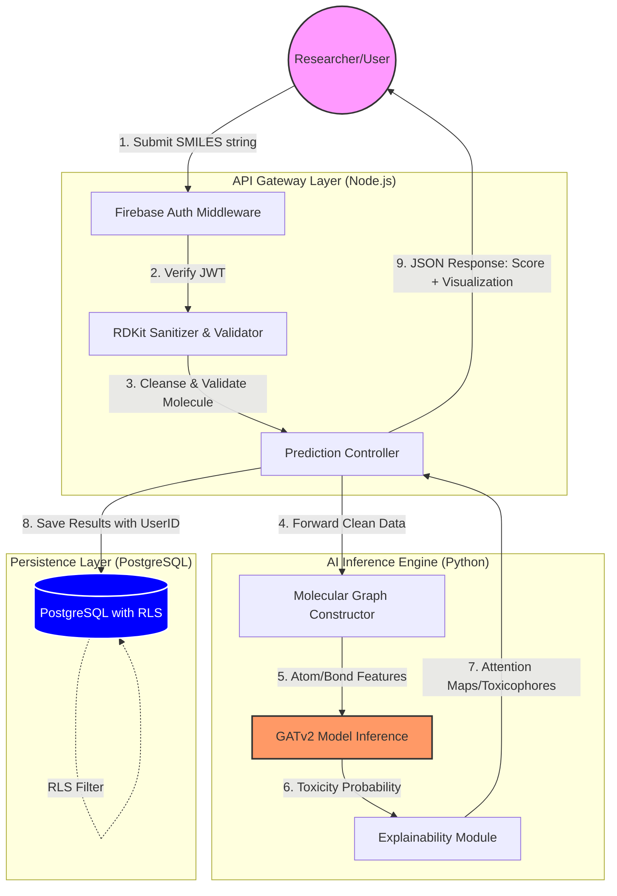

# Architecture: Tox-Agent System Overview

## Goal

The Tox-Agent platform provides a specialized deep learning service for molecular toxicity prediction. It is designed to bridge the gap between complex bioinformatics research based on graph neural networks and production-grade software engineering, ensuring that research results are accessible, secure, and reproducible.

## High-Level Components

### 1. API Gateway (Node.js)

**Role**: Acts as the primary orchestrator and secure entry point.

**Responsibilities**:

- authentication through Firebase
- authorization through Row-Level Security context propagation
- input validation and SMILES sanitization through RDKit-based workflows
- request orchestration and task scheduling

**Pattern**:

- follows the Model-View-Controller (MVC) pattern to decouple research logic from system operations

### 2. GNN Inference Engine (Python)

**Role**: The brain of the system.

**Architecture**:

- built with DGL (Deep Graph Library) and PyTorch

**Model**:

- implements GATv2 (Graph Attention Network v2)
- uses custom attention heads for molecular interpretability and explainable AI workflows

**Communication**:

- communicates with the Node.js layer through internal REST or gRPC

### 3. Data Layer (PostgreSQL)

**Role**: Persistent storage for chemical compounds, prediction history, and metadata.

**Security**:

- uses PostgreSQL Row-Level Security (RLS) so researchers can access only their own proprietary molecular data

## Data Flow

1. A researcher submits a SMILES string such as `CCO` from the dashboard.
2. The Node.js layer verifies the Firebase JWT and sanitizes the chemical string.
3. The SMILES string is converted into a molecular graph where nodes represent atoms and edges represent bonds.
4. The graph is passed to the GATv2 model for inference.
5. The model produces both a toxicity probability and an attention map.
6. Results are stored in PostgreSQL within the user-specific RLS context.
7. The user receives a toxicity score and a visualization of the atoms that contributed most to the prediction.

## External Dependencies

- **Firebase Auth**: identity management and session handling
- **PostgreSQL / Google Cloud SQL**: relational storage with strict data isolation
- **RDKit**: cheminformatics library for molecular sanitization and manipulation
- **Google Cloud Build**: CI/CD for both the API layer and the Python inference engine

## Key Design Choices & Trade-offs

### 1. Hybrid Language Stack (Node.js + Python)

**Choice**:

- Node.js for the API and web-facing orchestration layer
- Python for the AI and bioinformatics layer

**Trade-off**:

- increases deployment complexity because the platform must support multiple runtimes

**Reasoning**:

- Python remains the industry standard for AI and bioinformatics tooling such as PyTorch and DGL
- Node.js provides strong concurrency characteristics for API handling and modern web integrations

### 2. Row-Level Security (RLS) over Schema Isolation

**Choice**:

- use PostgreSQL RLS policies instead of maintaining a separate database per user

**Trade-off**:

- requires strict discipline in SQL and controller-layer context propagation

**Reasoning**:

- lowers infrastructure overhead
- simplifies operations
- still supports aggregate research metrics while maintaining strong data privacy

### 3. Interpretability (XAI) over Raw Performance

**Choice**:

- use GATv2 rather than simpler GCNs or traditional machine learning models such as Random Forest

**Trade-off**:

- higher per-request computational cost and increased latency

**Reasoning**:

- in bioinformatics, explaining why a molecule is toxic is nearly as important as the prediction itself
- the GATv2 attention mechanism helps identify toxicophores and supports scientific interpretability

### 4. MVC Architecture in a Research Platform

**Choice**:

- enforce MVC even for prototype and experimental features

**Trade-off**:

- slows down some early experimentation

**Reasoning**:

- prevents research code from degrading into tightly coupled scripts
- improves maintainability as the system grows and new team members join the project

## Reliability & Security Posture

- **Zero Trust**: Every request is authenticated. No internal network path is treated as inherently trusted.
- **Data Integrity**: RDKit validation ensures only valid chemical structures enter the inference pipeline.
- **Observability**: Custom metrics track model confidence and inference latency to detect drift and performance degradation in production.

## System Diagram

