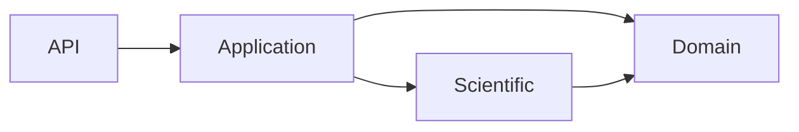
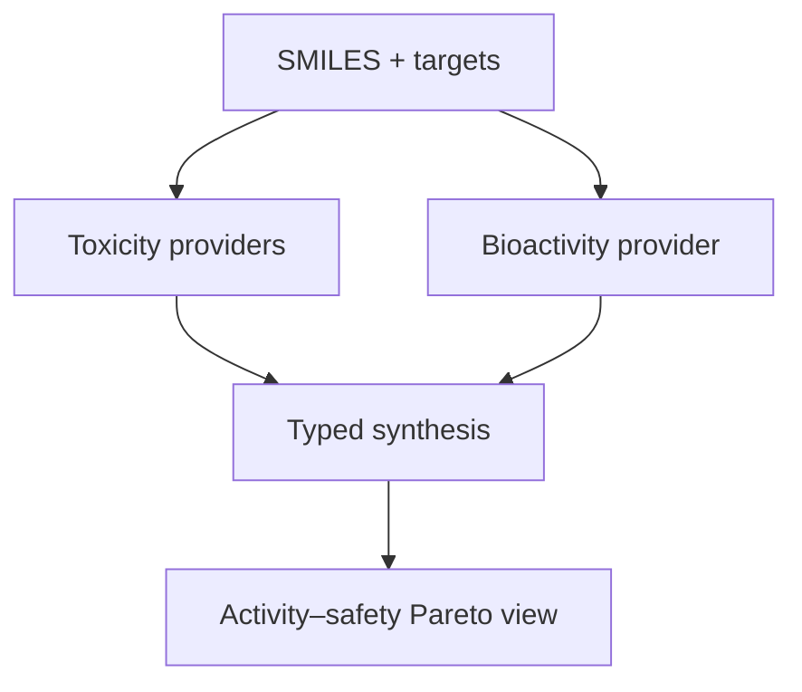
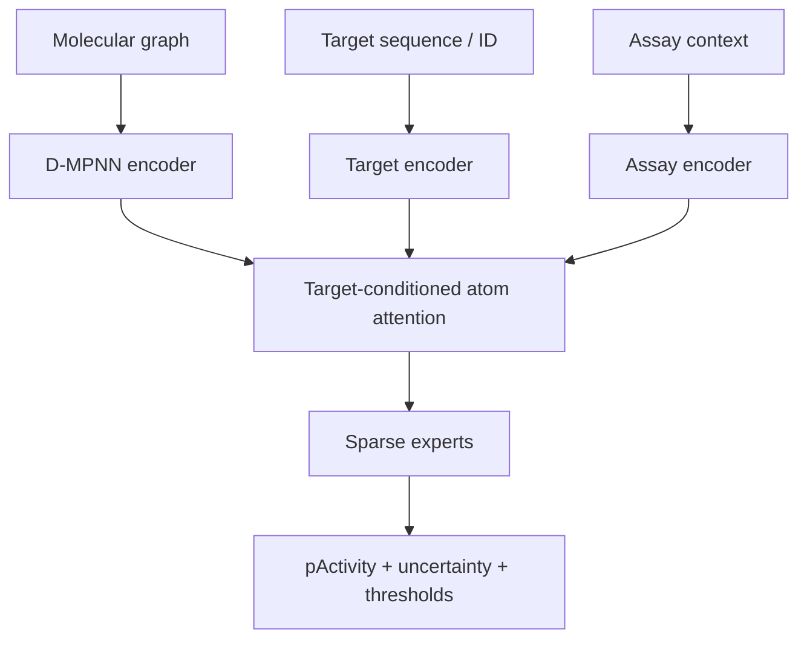

# Kế hoạch xây dựng và benchmark nhánh hoạt tính cho ToxAgent

**Phiên bản:** 1.1  
**Ngày:** 13/09/2026 (bản gốc); cập nhật model matrix 15/09/2026  
**Phạm vi repo:** [`NEU-Bio-Research-Team/tox-agent`, branch `docs/harness-master-plan`](https://github.com/NEU-Bio-Research-Team/tox-agent/tree/docs/harness-master-plan)  
**Commit đã audit:** `a3ee63a69443635da2764cf59abbe759cc81c4aa`  
**Trạng thái tài liệu:** đề xuất thiết kế và protocol; chưa phải báo cáo kết quả thực nghiệm.

**Ghi chú cập nhật 15/09/2026:** đã chạy xong P0–P2 (data contract, panel 16 target/27 task, 4 split view, baseline B0–B2b) trên dữ liệu thật; xem `backend/predictor/research/bioactivity/README.md` cho kết quả benchmark. Đồng thời đã rà soát lại literature hiện hành (không chỉ dựa vào các citation gốc của tài liệu) để kiểm tra model matrix ở mục 5 còn đúng SOTA không; kết quả rà soát được thêm vào mục 5.1/5.2 và footnote [^19]–[^21].

**Đã chạy B3.5 (CheMeleon) thật và có kết quả, không chỉ là đề xuất:** baseline B0–B2b trên panel thật có cliff direction accuracy chỉ 0.50–0.58 (gần random) trên view temporal — đúng điểm yếu CheMeleon[^19] công bố cải thiện mạnh nhất (97% win rate trên MoleculeACE). Sau khi fine-tune multi-task thật (40 epoch, early-stop patience 5, cả 4 split view, ~45–70 phút/view trên 1x RTX 3090): **macro MAE gần như hòa với LightGBM** (temporal 0.971 so với 0.943, cluster/scaffold nhỉnh hơn LightGBM một chút, random kém hơn một chút — chênh lệch đều trong vài %, không có view nào CheMeleon thắng rõ ràng về MAE), nhưng **cliff direction accuracy tăng nhất quán ở cả 4 view** so với LightGBM (temporal 0.527→0.560, cluster 0.655→0.703, scaffold 0.690→0.718, random 0.766→0.824). Đây là hiệu ứng thật, đúng hướng literature dự đoán, nhưng khiêm tốn hơn nhiều so với con số 97% trên MoleculeACE — khác biệt nằm ở chỗ MoleculeACE đánh giá từng assay đơn lẻ đã curate, còn ở đây là multi-task trên 27 task không đồng nhất với nhiễu curation thật và assay context bị gộp qua aggregation. **Kết luận cho panel này:** CheMeleon đáng giữ lại trong model tournament riêng cho use case nhạy cảm với cliff, không phải để thay LightGBM làm model tốt nhất theo MAE tổng. Chi tiết đầy đủ, bao gồm ràng buộc môi trường Python 3.11 (`comosa_phase1`) và cách tái lập, xem `backend/predictor/research/bioactivity/README.md` mục "B3.5: CheMeleon-initialized Chemprop".

## Tóm tắt quyết định

Nhánh hoạt tính nên được triển khai như một capability mới có tên rõ nghĩa là `target_bioactivity`, chạy song song và late-fusion với các endpoint toxicity hiện có. Không nên dùng tên generic `activity`, vì trong Tox21 của repo, `probability_activity` đã có nghĩa là hoạt tính trong assay độc tính. Cũng không nên tạo một “activity–toxicity score” duy nhất: mỗi kết quả cần giữ nguyên endpoint, đơn vị, target, assay context, uncertainty và provenance.

Lộ trình nên có hai tầng:

1. **V1 — fixed-target, multi-task QSAR:** dự đoán pChEMBL trên một panel 12–20 protein đích người đã được chọn trước bằng tiêu chí dữ liệu. Đây là nhánh có xác suất đi production nhanh nhất.
2. **V2 — compound–target model:** nhận cả cấu trúc phân tử và protein/assay context để đánh giá cold-drug, cold-target và cold-pair. Đây là nhánh nghiên cứu mở rộng; không nên chặn V1.

Dataset chính nên pin **ChEMBL 37** bằng DOI và checksum. ChEMBL 37 là bản tải xuống hiện hành từ tháng 5/2026.[^1] Tập “HQ-Exact” chỉ nhận `SINGLE PROTEIN`, người, confidence 9, quan hệ `=`, đơn vị chuẩn nM, `pChEMBL` hợp lệ và không phải duplicate đã biết. **Ki, Kd, IC50 và EC50 không được gộp mù thành một endpoint**; phải giữ `standard_type`, `assay_type` và assay context trong task key hoặc trong input của model. Chính ChEMBL mô tả pChEMBL là phép biến đổi gần-comparable cho nhiều loại phép đo, không khẳng định chúng đồng nhất.[^2]

Benchmark chính không dùng random split để ra quyết định release. Cần freeze ít nhất bốn view: temporal holdout, chemical-cluster OOD, scaffold và activity-cliff. Random split chỉ là diagnostic. Model phải được so sánh cùng data contract, split manifest, seed và compute budget với ECFP + classical ML, Chemprop D-MPNN, GATv2, ChemBERTa adaptation và — ở V2 — DrugBAN/GraphBAN/CLAMP.

Kiến trúc mới được đề xuất là **ToxAct-TAC-MoE**: D-MPNN molecular encoder + target/assay encoder + target-conditioned atom attention + sparse mixture-of-experts + distributional regression head + activity-cliff-aware loss. Đây là **giả thuyết kiến trúc cần kiểm chứng**, không phải tuyên bố SOTA. Nếu nó không thắng baseline bằng protocol đã freeze, checkpoint production nên là Chemprop hoặc ECFP/tree mạnh nhất thay vì chọn kiến trúc mới vì độ phức tạp.

Checkpoint chỉ được `admitted` sau khi qua năm nhóm gate: integrity/reproducibility, predictive quality, activity-cliff/OOD, calibration–uncertainty và operational SLO. Production artifact nên dùng `safetensors`, kèm data/split hashes, feature schema, target/assay vocab, calibration/conformal artifacts, model card và license inventory.

## 1. Repo hiện tại và các ràng buộc phải giữ

### 1.1 Những phần hiện tại đã thiết kế đúng

Audit branch cho thấy predictor đã đi theo boundary sạch:



Các nguyên tắc hiện có nên được tái sử dụng nguyên vẹn cho bioactivity:

- `api -> application -> domain`, còn model/featurization/registry nằm ở `scientific`;
- model registry kiểm tra manifest, SHA-256, kích thước và provider compatibility;
- checkpoint không đồng nghĩa với model có thể serve;
- không có silent fallback khi capability hoặc artifact bị lỗi;
- threshold/policy nằm ngoài provider;
- benchmark đi qua application service — cùng code path với API;
- split được freeze thành manifest và content hash;
- missing labels được mask, không ép thành negative;
- response có model ID, artifact checksum, policy và request provenance;
- các endpoint toxicity không bị gộp thành một verdict duy nhất.[^3]

Điểm này đặc biệt quan trọng vì repo đã có bài học thực tế: checkpoint ClinTox tồn tại nhưng không được serve do thiếu đúng tokenizer; registry trả lỗi thay vì thay thế bằng model khác. Nhánh hoạt tính cần tuân thủ cùng chuẩn admission.

### 1.2 Baseline production hiện tại để đặt operational budget

Model đang được admit là `herg-tox21-chemberta-v1`; ClinTox đang blocked. Model card hiện tại ghi hERG AUROC 0.8372, PR-AUC 0.8310, F1 0.7644, MCC 0.5230 trên test scaffold 2.690 phân tử. Tuy nhiên ECE 0.12 cho thấy xác suất chưa thể được đọc như calibrated risk. Tox21 macro AUROC là 0.7594, nhưng assay hiếm `NR-PPAR-gamma` có PR-AUC chỉ 0.092 dù AUROC 0.742.[^4]

Operational baseline CPU của container hiện tại là:

| Chỉ số | Giá trị hiện tại |
|---|---:|
| Cold start | 3.981 ms (3,981 giây) |
| Model load | 2.707,5 ms (2,708 giây) |
| Peak RAM | 295.526.400 bytes |
| Image size | 386.819.506 bytes |
| hERG | 2,64 ms/phân tử |
| Tox21 | 3,93 ms/phân tử |
| Batch 1 offline | 10,353 ms/mẫu |
| Batch 32 offline | 0,516 ms/mẫu |
| Batch 256 offline | 0,453 ms/mẫu |

Đây là **baseline tham chiếu**, không phải budget bắt buộc bằng mọi giá. Bioactivity có target context nên có thể nặng hơn, nhưng phải đo bằng cùng image, hardware, batch sizes và code path trước khi release.[^5]

### 1.3 Gap cần lấp

`Endpoint` hiện chỉ có `clintox`, `herg`, `tox21`; provider contract chỉ có typed raw outputs tương ứng. Repo có nhiều checkpoint nghiên cứu như GATv2, GIN, AttentiveFP, GPS, fingerprint, ChemBERTa/MolFormer và ensemble, nhưng **có checkpoint trên disk không có nghĩa là đã admit**. Vì vậy nhánh hoạt tính cần đồng thời bổ sung:

- domain type `target_bioactivity`;
- request/response contract chứa target và measurement context;
- provider, manifest và registry admission;
- data contract + frozen split manifests;
- benchmark runner regression/ranking/UQ;
- control-plane tool `predict_bioactivity`;
- hiển thị activity và toxicity như hai trục riêng trong report.

## 2. Định nghĩa bài toán khoa học

### 2.1 Không có “hoạt tính” nếu thiếu target và assay

Một câu như “phân tử X hoạt tính 0,8” không có nghĩa khoa học. Output tối thiểu phải trả lời:

- hoạt tính trên **target nào**;
- phép đo là **Ki, Kd, IC50 hay EC50**;
- binding hay functional assay;
- sinh vật, construct/cell context nếu có;
- dự đoán theo scale nào;
- uncertainty và miền áp dụng;
- model/data/split version nào tạo ra dự đoán.

Biến regression chính:

$$
pActivity = -\log_{10}(Activity\,[M])
$$

Với dữ liệu ChEMBL hợp lệ, `pChEMBL = 9` tương ứng 1 nM. Giá trị pChEMBL tăng một đơn vị nghĩa là potency tăng 10 lần. Các binary views chỉ là lớp diễn giải dẫn xuất, ví dụ:

- `pActivity >= 6`: mạnh hơn hoặc bằng 1 µM;
- `pActivity >= 7`: mạnh hơn hoặc bằng 100 nM.

Ngưỡng phải là policy theo use case; không được thay thế regression label hoặc được fit trên test.

### 2.2 Hai use case, hai benchmark claim

| Track | Input | Claim hợp lệ | Không được claim |
|---|---|---|---|
| V1 fixed-target | SMILES + target ID + assay context trong panel đã biết | Ưu tiên compound mới cho target đã train | Tổng quát sang protein chưa thấy |
| V2 compound–target | SMILES/graph + protein sequence/embedding + assay context | Cold-drug, cold-target, cold-pair theo split cụ thể | Binding mode, clinical efficacy, hoặc wet-lab confirmation |

V1 là lựa chọn production-first vì đơn giản hơn, có thể cache target context và tận dụng hạ tầng GNN/registry sẵn có. V2 giải quyết target mới nhưng khó hơn đáng kể và dễ được điểm cao giả tạo nếu drug/target bị rò rỉ giữa train và test.

### 2.3 Tích hợp với toxicity

V1 dùng **late fusion ở application/report layer**, không dùng một encoder/head chung ngay từ đầu:



Lý do:

- toxicity endpoints và target potency có label semantics khác nhau;
- dataset sizes, missingness và measurement noise khác nhau;
- joint training sớm có nguy cơ negative transfer;
- late fusion giữ được provenance và rollback độc lập;
- tương thích nguyên tắc “no aggregate verdict” của repo.

Một shared encoder chỉ được thử ở pha sau như một ablation. Nếu thử, dùng task adapters/LoRA và đo gradient conflict; không promote nếu bất kỳ toxicity endpoint admitted nào giảm ngoài biên đã freeze.

## 3. Data contract đề xuất: `toxact-chembl37-hq-v1`

### 3.1 Nguồn và khả năng tái lập

Pin bản ChEMBL 37 thay vì gọi API “latest” trong pipeline. ChEMBL downloads hiện ghi release 37, tháng 5/2026, DOI `10.6019/CHEMBL.database.37`.[^1]

Manifest tối thiểu:

```yaml
dataset_id: toxact-chembl37-hq-v1
source:
  name: ChEMBL
  release: 37
  doi: 10.6019/CHEMBL.database.37
  artifact_sha256: <required>
extraction:
  sql_sha256: <required>
  code_commit: <required>
chemistry:
  rdkit_version: <pinned>
  standardizer_version: toxact-standardizer-v1
labels:
  primary: pchembl_value
  allowed_standard_types: [Ki, Kd, IC50, EC50]
splits:
  manifest_sha256: <required>
```

Mọi report phải lưu số record bị loại ở từng filter. Nếu thay đổi SQL, RDKit hoặc aggregation, đó là dataset version mới.

### 3.2 Tập chính `HQ-Exact`

Filter khuyến nghị:

| Field | Rule | Lý do |
|---|---|---|
| `target_type` | `SINGLE PROTEIN` | Tránh label mơ hồ ở complex/family/cell-line |
| target organism | `Homo sapiens` | Claim rõ ràng cho người |
| `confidence_score` | `9` | Direct single-protein assignment |
| `standard_type` | `Ki`, `Kd`, `IC50`, `EC50` | Potency/affinity có pChEMBL, giữ type riêng |
| `standard_relation` | `=` | Không biến censored data thành exact label |
| `standard_units` | `nM` | Phù hợp quy tắc pChEMBL |
| `standard_value` | `> 0` | Giá trị log hợp lệ |
| `pchembl_value` | non-null, finite | Regression target chuẩn hóa |
| validity | null hoặc `Manually validated` | Loại warning/error đã biết |
| `potential_duplicate` | `0`/false | Tránh citation duplicates |
| structure | parse được, parent hợp lệ | Model input hợp lệ |

Các rule này bám trực tiếp định nghĩa pChEMBL và confidence score của ChEMBL.[^2] Tuy vậy, lọc theo field chưa đủ: dữ liệu công khai vẫn có thể mang khác biệt assay, target construct, salt/tautomer, duplicate và curation noise. ChEMBL literature cũng cảnh báo việc gộp dữ liệu hoạt tính từ các assay khác nhau mà không giữ context.[^6]

### 3.3 Không gộp Ki/Kd/IC50/EC50 một cách ngây thơ

Task key V1 nên là:

```text
(target_chembl_id, standard_type, assay_type, assay_context_cluster)
```

Nguyên tắc:

- `Ki` và `Kd` đo affinity nhưng không đồng nhất về protocol;
- `IC50` phụ thuộc substrate concentration, mechanism và assay setup;
- `EC50` là functional potency và có thể tách xa binding affinity;
- agonist, antagonist, inhibitor hoặc partial agonist không được collapse nếu pharmacology khác nhau.

Các công trình gần đây về assay-aware modeling cho thấy assay descriptors/embeddings mang thông tin giúp mô hình hóa protein–ligand tốt hơn; AssayMatch cũng cho thấy chọn subset assay tương thích có thể hiệu quả hơn dùng tất cả dữ liệu.[^7][^8] Vì vậy:

- **Main benchmark:** train/score riêng theo measurement context;
- **Assay-aware ablation:** chia sẻ encoder nhưng condition bằng context embedding;
- **Collapsed-label ablation:** chỉ để chứng minh hậu quả, không làm production dataset.

### 3.4 Chuẩn hóa cấu trúc và duplicate policy

Mỗi record phải giữ ba identity:

1. submitted structure;
2. standardized parent có stereochemistry;
3. connectivity block của InChIKey dùng cho chống leakage.

Pipeline đề xuất:

- parse và sanitize bằng RDKit version đã pin;
- chọn parent/loại fragment theo rule versioned;
- normalize charge theo rule công khai;
- giữ stereochemistry trong model input;
- ghi lại mapping submitted → standardized → parent;
- dùng exact parent + stereo để aggregate;
- dùng connectivity identity không stereo để group split, nhằm tránh stereoisomer gần như trùng rò sang test;
- không tự động loại isotope/metal nếu chưa có policy; đánh dấu ngoài miền áp dụng khi cần.

Trong cùng `(compound, target, standard_type, assay-context)`:

- aggregate exact replicates bằng median;
- lưu `n_measurements`, median absolute deviation (MAD), range và nguồn;
- nếu range > 1 log unit, flag `high_disagreement`; mặc định loại khỏi HQ hoặc giảm weight;
- tuyệt đối không aggregate qua assay context khác nhau chỉ vì cùng target.

Tạo thêm `Censored-Extended` chứa `<`, `<=`, `>` và `>=`. Track này chỉ được dùng nếu loss hỗ trợ censoring (Tobit/survival-style); không đổi `IC50 > 10 µM` thành `10 µM` exact.

### 3.5 Chọn target panel mà không cherry-pick

Không chọn target sau khi đã nhìn test score. Freeze rule trước khi train:

- 12–20 target từ ít nhất bốn protein families;
- mỗi task có tối thiểu 1.000 unique standardized parents sau lọc;
- mỗi task có đủ temporal test và calibration, khuyến nghị >=150 mẫu mỗi phần;
- dải pChEMBL không bị collapse, ví dụ IQR >=1;
- có đủ active ở cả ngưỡng 6 và 7 để PR-AUC có ý nghĩa;
- ghi lại mọi target đạt tiêu chí rồi chọn bằng rule deterministic, không theo model score.

Nếu không đủ 12 target, giảm panel thay vì hạ chất lượng filter. Với target ít dữ liệu, chuyển sang FS-Mol/few-shot track, không trộn vào benchmark production chính.

## 4. Split design và chống leakage

### 4.1 Bốn view bắt buộc

| Split | Vai trò | Quyết định release? |
|---|---|---|
| Random | Sanity/upper-bound diagnostic | Không |
| Bemis–Murcko scaffold | So với chuẩn QSAR phổ biến | Phụ |
| Chemical cluster OOD | Đo generalization sang chemistry mới | Có |
| Temporal | Gần prospective use nhất | **Primary** |

MoleculeACE cho thấy activity cliffs là blind spot lớn: descriptor-based ML có thể thắng deep learning phức tạp trên nhiều target, nên chỉ nhìn random/scaffold aggregate sẽ bỏ qua lỗi quan trọng.[^9] DrugOOD cũng thiết kế OOD domains theo scaffold, assay, protein/family và chỉ ra khoảng cách in-domain/OOD trong binding-affinity prediction.[^10]

### 4.2 Temporal split chính

Dùng publication/document year, hoặc assay deposition year nếu nguồn không có publication year:

- train: phần lịch sử sớm nhất;
- validation: khoảng kế tiếp cho hyperparameter/early stopping;
- calibration: khoảng riêng, sau validation;
- test: dữ liệu mới nhất, đóng băng một lần.

Không cố định năm cứng trước khi profiling. Dùng quantile thời gian sao cho mỗi target còn đủ mẫu, rồi lưu ranh giới cụ thể vào manifest. Một compound xuất hiện nhiều năm phải được gán theo **lần xuất hiện sớm nhất**; measurement về sau của cùng identity không được đi vào test như một “compound mới”.

### 4.3 Global grouping cho multi-task

Tất cả record có cùng standardized connectivity identity phải nằm cùng split trên toàn panel, không chỉ trong từng target. Nếu cùng compound nằm train ở target A và test ở target B, multi-task encoder đã nhìn thấy cấu trúc và cold-chemistry claim bị yếu đi.

Cluster split:

- ECFP4/Morgan radius 2, 2.048 bits, version pin;
- Butina hoặc hierarchical clustering với threshold đã freeze;
- cả cluster gán vào một split;
- bootstrap CI theo cluster, không theo từng row độc lập.

### 4.4 V2 compound–target splits

V2 cần bốn kịch bản tách biệt:

- `warm-pair`: drug và target đều đã thấy, pair mới;
- `cold-drug`: compound chưa thấy;
- `cold-target`: protein chưa thấy, group theo sequence identity/family;
- `cold-both`: cả compound và target chưa thấy;
- thêm temporal test khi metadata cho phép.

Không báo một average duy nhất. `cold-both` là claim khó nhất và phải luôn đứng riêng.

### 4.5 Pretraining contamination

Các model pretrained trên ChEMBL/PubChem có thể đã nhìn thấy test compounds hoặc assay text. Vì vậy benchmark chia hai leaderboard:

- **Leakage-controlled:** train from scratch hoặc pretraining corpus có cutoff/checksum chứng minh không chứa test;
- **External-pretrained:** cho phép foundation models nhưng bắt buộc khai báo corpus, release date, overlap audit và không gọi kết quả là leakage-free.

Nếu không xác minh được pretraining data, model vẫn có thể được cân nhắc cho production, nhưng paper/model card phải ghi rõ giới hạn claim.

## 5. Model matrix để benchmark

### 5.1 V1 fixed-target

| ID | Model | Vai trò | Vì sao cần |
|---|---|---|---|
| B0 | Per-task median / prevalence | Dummy | Kiểm tra pipeline/metric |
| B1 | ECFP4 + kNN similarity | Local/SAR baseline | Rất mạnh khi compound gần train |
| B2 | ECFP4 + RF và LightGBM/XGBoost | Classical strong baseline | Thường cạnh tranh trong low-data/cliffs |
| B3 | Chemprop v2 D-MPNN | Neural baseline chính | Kiến trúc mạnh, package tái lập tốt[^11] |
| **B3.5** | **Chemprop v2 D-MPNN, khởi tạo từ checkpoint CheMeleon** | **Pretrained-baseline ưu tiên** | **10M tham số, pretrain trên 1M PubChem molecule để dự đoán Mordred descriptor không nhiễu; công bố 97% win rate trên MoleculeACE (cliff) và 75% trên Polaris so với RF/Chemprop/fastprop; đã merge chính thức vào Chemprop CLI (`--from-foundation chemeleon`), không phải fork rời[^19]. Ưu tiên cao vì đúng vào điểm yếu cliff đo được trên panel thật (mục "Ghi chú cập nhật")** |
| B4 | GATv2 multi-task | Repo-native baseline | Tận dụng code/checkpoint family hiện có |
| B5 | ChemBERTa activity head | Infra-reuse baseline | Đo giá trị của backbone đang serve |
| B6 | Pretrained molecular model khác | Optional pretrained track | KPGT/Uni-Mol2 nếu license/corpus audit đạt; CheMeleon đã tách riêng thành B3.5 vì đã có bằng chứng thực nghiệm trực tiếp liên quan (cliff), còn KPGT/Uni-Mol2 chưa có so sánh trực tiếp trên đúng loại bài toán này[^19] |
| N1 | **ToxAct-TAC-MoE** | Kiến trúc đề xuất | Target/assay conditioned + cliff/UQ |

Không cần chạy mọi foundation model ngay từ P1. B0–B5 (bao gồm B3.5) là bộ tối thiểu — B3.5 được nâng lên nhóm ưu tiên vì rẻ (fine-tune một checkpoint có sẵn qua CLI chuẩn của Chemprop, không cần hạ tầng mới) và kiểm chứng trực tiếp giả thuyết "cliff kém là do thiếu inductive bias, không phải do thiếu dữ liệu" trước khi đầu tư vào N1. B6 (KPGT/Uni-Mol2 tổng quát) chỉ bổ sung sau khi pipeline chính ổn định.

**Ràng buộc môi trường quan trọng:** CheMeleon yêu cầu Chemprop >=2.2, và mọi bản Chemprop 2.x trên PyPI yêu cầu Python >=3.11 (dùng `enum.StrEnum`). Conda env sẵn có phù hợp nhất cho benchmark khác (`drug-tox-env`, rdkit + torch cu121 + sklearn + lightgbm) là Python 3.10 — không cài được Chemprop 2.x/CheMeleon trực tiếp. Trong các env sẵn có trên máy, chỉ `comosa_phase1` là Python 3.11, nhưng đó là env của một project khác đang hoạt động (torch 2.4 cu121 sẵn có nhưng chưa có rdkit, ~7.9 GB, dependency riêng) — cài thêm vào đó có rủi ro xung đột dependency với project đó. Đây là quyết định cần chốt trước khi B3.5 chạy được: dùng chung `comosa_phase1` (rủi ro xung đột, nhưng không tạo env mới), hoặc xin phép tạo một env mới tối giản riêng cho Chemprop 2.x.

### 5.2 V2 compound–target

| ID | Model | Vai trò |
|---|---|---|
| D0 | Protein-family + ligand fingerprint linear/MLP | Sanity baseline |
| D1 | DeepDTA/GraphDTA | Legacy DTI baseline |
| D2 | DrugBAN | Local drug–target interaction + domain adaptation[^12] |
| D3 | GraphBAN | Inductive compound–protein baseline[^13] |
| **D3.5** | **HKD-CPI** | **Successor công bố của GraphBAN — knowledge distillation bậc cao cho inductive CPI; +13% AUROC so với model thứ nhì trên PDBbind 2016 ở chế độ inductive/data-scarce, đúng bối cảnh cold-target của V2[^20]** |
| D4 | CLAMP | Assay-language few/zero-shot baseline[^14] |
| **D5** | **Protein-LM cold-start fusion (CS-DTA / GraESM-FuseDTA / LLMDTA)** | **Nhóm model 2026 dùng ESM2/ChemBERTa fusion, thiết kế riêng cho warm/cold-drug/cold-target/cold-pair; không có model nào áp đảo tuyệt đối, nhưng đại diện đúng hướng target-encoder mà mục 6.3 của tài liệu này đã đề xuất (frozen protein LM embedding) — nên đưa một đại diện vào so sánh thay vì tự nghĩ lại từ đầu[^21]** |
| N2 | ToxAct-TAC-MoE + protein encoder | Proposed V2 |

FS-Mol là external benchmark cho unseen/few-shot assays; nó cung cấp nhiều activity tasks với protocol few-shot riêng.[^15]

### 5.3 Quy tắc so sánh công bằng

- dùng đúng một dataset version và split manifest;
- 5 random seeds cho neural model;
- tuning chỉ trên train/validation, calibration chỉ trên calibration split;
- test chạy một lần sau khi freeze candidate;
- compute-matched track và best-achievable track báo riêng;
- ensemble báo riêng với single checkpoint;
- paired bootstrap theo compound/cluster, 1.000 resamples;
- lưu prediction rows để paired error analysis;
- không so số lấy từ paper khác split với số của repo.

## 6. Kiến trúc mới: ToxAct-TAC-MoE

### 6.1 Mục tiêu

Tên đầy đủ: **ToxAgent Target-and-Assay-Conditioned Mixture of Experts**.

Thiết kế nhằm giải quyết bốn vấn đề cụ thể:

1. cùng compound có hoạt tính khác nhau theo target;
2. cùng compound–target có label khác theo assay/measurement context;
3. activity cliffs phá giả định “cấu trúc giống thì activity gần”;
4. production cần uncertainty, cache target embedding và đường fallback rõ ràng.

### 6.2 Sơ đồ



### 6.3 Các thành phần

**Molecular encoder.** D-MPNN trên directed bonds, vì đây là baseline mạnh và có implementation mature qua Chemprop. Nối thêm một nhánh nhỏ ECFP/RDKit descriptors như residual input để giữ tín hiệu local/SAR trong low-data. Ablation phải kiểm tra có thực sự cần nhánh descriptor.

**Target encoder.**

- V1: learned target ID embedding, khởi tạo/regularize bằng protein embedding đã precompute;
- V2: frozen protein language-model embedding, cache theo sequence SHA;
- chỉ fine-tune adapter nhỏ, không fine-tune toàn protein backbone trong vòng đầu.

**Assay encoder.** Categorical embeddings cho `standard_type`, `assay_type`, organism, confidence và assay-context cluster. Text assay embedding là optional ablation; nếu dùng, phải pin text model/revision và cache embedding. Assay-aware literature hỗ trợ giả thuyết rằng context giúp giảm heterogeneity, nhưng repo phải tự kiểm chứng trên split của mình.[^7]

**Target-conditioned atom attention.** Với atom hidden state $h_i$, target $t$ và assay context $a$:

$$
\alpha_i = \mathrm{softmax}_i\left((W_m h_i)^\top(W_t t + W_a a)\right),
\qquad
z_m = \sum_i \alpha_i h_i
$$

Điều này tạo molecular representation khác nhau theo target/assay, thay vì một graph vector duy nhất cho mọi task.

**Sparse mixture of experts.** Router dùng `[z_m; t; a]` để chọn top-2 trong 4–8 experts. Experts là low-rank feed-forward adapters, không phải full GNN copies; mục tiêu giữ artifact và latency trong budget. Auxiliary load-balancing loss tránh một expert nhận toàn bộ traffic.

**Distributional head.** Output:

- mean `predicted_pactivity`;
- aleatoric `log_variance`;
- logits phụ cho `pActivity >= 6` và `>= 7`;
- target-conditioned atom scores cho XAI;
- embedding cho OOD/similarity.

### 6.4 Loss

Main HQ-Exact:

$$
\mathcal{L} =
\mathcal{L}_{\text{heteroscedastic-Huber}}
+ \lambda_{cliff}\mathcal{L}_{\text{triplet}}
+ \lambda_{ord}\mathcal{L}_{\text{ordinal}}
+ \lambda_{moe}\mathcal{L}_{\text{balance}}
$$

- Huber giảm ảnh hưởng outlier; variance head mô hình hóa noise theo mẫu.
- Activity-cliff loss chỉ mine triplets trong cùng target/context, với cặp cấu trúc tương tự nhưng chênh activity lớn.
- Ordinal auxiliary heads phải nhất quán: xác suất đạt ngưỡng 7 không lớn hơn ngưỡng 6.
- Missing tasks được mask.

Activity-cliff-aware loss không phải ý tưởng tùy tiện: nghiên cứu ACANet dùng regression + soft-margin triplet learning và cho thấy cải thiện trên nhiều GNN backbones.[^16] Phần mới của ToxAct-TAC-MoE là kết hợp cliff-awareness với target/assay conditioning, sparse experts và production UQ; từng thành phần phải được ablate.

Track `Censored-Extended` thay main loss bằng censored likelihood cho record giới hạn. Không dùng chung checkpoint production cho đến khi calibration và error analysis chứng minh lợi ích.

### 6.5 Uncertainty strategy

Trong research:

- train 5 seeds;
- deep ensemble để ước lượng epistemic + aleatoric uncertainty;
- fit conformal interval trên calibration split;
- đo coverage theo target, chemistry-similarity bins và assay context.

Deep ensembles là baseline UQ đơn giản và mạnh, nhưng serve 5 model online sẽ tăng latency.[^17] Vì vậy production mặc định:

- distill ensemble mean/variance vào một student checkpoint;
- giữ conformal calibrator riêng, versioned;
- ensemble chỉ dùng cho compare/research mode hoặc asynchronous high-confidence mode.

Conformal coverage chỉ đảm bảo dưới giả định exchangeability phù hợp; OOD coverage phải đo riêng và không được hứa bằng marginal number duy nhất.[^18]

### 6.6 Vì sao kiến trúc này có cơ hội thắng — và khi nào không

Có cơ hội thắng khi:

- panel có nhiều task liên quan nhưng assay context khác nhau;
- target conditioning có đủ dữ liệu để chia sẻ representation;
- activity cliffs đủ phổ biến để triplet mining hữu ích;
- target/protein embeddings bổ sung tín hiệu cho task ít dữ liệu.

Có thể thua khi:

- mỗi task quá nhỏ hoặc quá nhiễu;
- context metadata thiếu/không chuẩn;
- ECFP local neighborhoods đã giải quyết phần lớn signal;
- MoE overfit hoặc router collapse;
- protein embedding không mang binding-site information hữu ích.

Do đó kiến trúc mới là candidate, không phải mặc định. Quy tắc chọn production checkpoint phải dựa vào gates ở mục 9.

## 7. Metric suite

### 7.1 Regression — primary

Per task và macro across tasks:

- MAE — metric chọn model chính;
- RMSE — nhạy với lỗi lớn;
- Spearman — xếp hạng series;
- Pearson;
- $R^2$;
- median absolute error;
- `n`, label range và IQR.

Báo cả:

- unweighted macro;
- weighted macro;
- worst-decile task performance;
- score theo protein family;
- 95% paired bootstrap CI.

### 7.2 Virtual screening/ranking

- enrichment factor EF1% và EF5%;
- BEDROC;
- Recall@K/NDCG@K;
- hit-rate ở pActivity >=6 và >=7;
- PR-AUC là metric binary chính khi active hiếm;
- AUROC, MCC, balanced accuracy, sensitivity và specificity là metrics phụ.

### 7.3 Activity cliffs

Trên MoleculeACE-compatible definition và internal cliff set:

- `MAE_cliff` và `RMSE_cliff`;
- MAE của $\Delta pActivity$ trên cliff pairs;
- direction accuracy của cặp;
- cliff/non-cliff performance gap;
- Spearman/NDCG trong matched molecular series;
- số cliff pairs hợp lệ trên mỗi task.

Không được báo chỉ một global RMSE. MoleculeACE benchmark 24 methods trên 30 target và cho thấy mọi họ model đều gặp khó ở cliffs.[^9]

### 7.4 Calibration và uncertainty

Regression:

- Gaussian NLL/CRPS nếu output distribution hợp lệ;
- empirical coverage ở 80% và 90%;
- interval width/sharpness;
- coverage theo target và similarity bin;
- risk–coverage curve khi abstain theo uncertainty.

Binary derived views:

- Brier score;
- ECE với binning đã freeze;
- reliability plot;
- calibration slope/intercept.

### 7.5 OOD/applicability

- max ECFP Tanimoto tới train;
- distance tới train cluster/latent centroid;
- protein sequence similarity tới train targets ở V2;
- assay-context novelty;
- error theo similarity deciles;
- AUROC để nhận diện “high error” bằng OOD/uncertainty score;
- coverage còn lại sau abstention.

Applicability output nên có trạng thái `in_domain`, `low_similarity`, `novel_target`, `novel_assay`, `unsupported_chemistry`; không dùng `ok` như bằng chứng prediction đúng.

### 7.6 Operational

Đo cả CPU và GPU nếu production có hai mode:

- p50/p95/p99 latency cho batch 1, 8, 32, 128, 256;
- throughput;
- cold start và model load;
- peak RAM/VRAM;
- artifact/image size;
- CPU/GPU numerical parity tolerance;
- deterministic repeatability;
- invalid SMILES, oversized batch, long molecule/sequence;
- concurrency, cancellation và partial batch isolation;
- offline/no-network startup;
- checksum failure và missing optional model behavior.

## 8. Protocol thực nghiệm

### 8.1 Pre-registration

Trước train model candidate, commit:

- data contract;
- list target/tasks;
- split manifests + hashes;
- primary metric và tie-break rule;
- candidate list;
- hyperparameter search space;
- compute budget;
- seed list;
- pass/fail gates.

Test labels có thể nằm trong frozen artifact nhưng benchmark development không được dùng để fit/tune. Chỉ release job có quyền chạy full test.

### 8.2 Training budget

Khuyến nghị thực tế với 1 GPU 24–48 GB:

- B1/B2: CPU, 50–100 search trials tổng cộng;
- B3–B5: 30–50 trials/model trên validation, ASHA/Optuna;
- N1: 60 trials cho base rồi 20 trials cho cliff/MoE/UQ ablations;
- final: 5 seeds cho mỗi finalist;
- early stop bằng macro validation MAE, không dùng test;
- log wall-clock, energy/GPU-hours và peak memory.

Không ép mọi model dùng cùng learning rate/hidden size; “fair” là cùng data/split, comparable tuning budget và minh bạch compute.

### 8.3 Ablation bắt buộc cho ToxAct-TAC-MoE

| Run | Thành phần bị bỏ/thay | Câu hỏi |
|---|---|---|
| A0 | D-MPNN thuần | Base signal là bao nhiêu? |
| A1 | + target ID | Multi-task conditioning có ích? |
| A2 | + protein embedding | Có cải thiện low-data/cold-target? |
| A3 | + assay context | Có giảm heterogeneity? |
| A4 | + target-conditioned attention | Có hơn simple concatenation? |
| A5 | + MoE | Experts có hơn shared MLP? |
| A6 | + cliff loss | Cliff metrics cải thiện mà không hại aggregate? |
| A7 | + descriptors | ECFP residual có thật sự cần? |
| A8 | + distribution/UQ | Calibration và NLL cải thiện? |
| A9 | full, single vs ensemble vs distilled | Production trade-off |

### 8.4 Error analysis bắt buộc

Cho mỗi finalist, tạo report theo:

- target/family;
- measurement type;
- assay type/context;
- pActivity range;
- molecule size/logP/charge/rings;
- train similarity;
- activity cliff vs non-cliff;
- high-disagreement labels;
- calibration interval miss;
- top false high/false low predictions;
- target-conditioned atom attribution sanity.

Giải thích model không phải ground truth mechanism. Attribution chỉ được dùng để debug/triage và phải benchmark fidelity/stability tương tự hướng BM1 của repo.

## 9. Checkpoint selection và production admission

### 9.1 Quy tắc chọn theo thứ tự, không dùng composite score mơ hồ

1. Qua hard gates về integrity/API/reproducibility.
2. Qua predictive-quality floor trên temporal và cluster-OOD.
3. Qua calibration/UQ và cliff gates.
4. Trong số model còn lại, chọn macro temporal MAE tốt nhất.
5. Nếu CI chồng lấp/thực tế tương đương, chọn model đơn giản, nhỏ và nhanh hơn.

### 9.2 Proposed go/no-go gates

Các giá trị dưới đây là **initial gates cần freeze sau pilot profiling, trước full benchmark**:

| Nhóm | Gate đề xuất |
|---|---|
| Integrity | 100% files/checksums/schema/provider compatibility pass; load offline bằng safe format |
| Reproducibility | Re-run cùng artifact/split sai khác metric <= `5e-3`; deterministic inference trong tolerance |
| Baseline quality | Thắng hoặc thực tế tương đương best ECFP/tree và Chemprop trên temporal macro MAE; không chỉ thắng dummy |
| Candidate improvement | Với ToxAct-TAC-MoE, mục tiêu >=5% relative macro-MAE improvement so với best neural baseline và paired 95% CI không cắt 0 |
| OOD | Không giảm >2% tương đối trên cluster-OOD so với best baseline; worst-decile tasks phải được công bố |
| Cliffs | `MAE_cliff` tốt hơn >=5% hoặc ít nhất không kém >2%; direction accuracy không giảm |
| Calibration | 90% interval coverage trong [87%, 93%] trên calibration-like temporal test; binary ECE <=0,05 ở các task đủ mẫu |
| Abstention | Error giảm đơn điệu khi coverage giảm; không dùng uncertainty nếu risk–coverage không tốt hơn random |
| Latency CPU | p95 batch-1 <=25 ms; batch-32 <=2 ms/mẫu với target embedding cache |
| Runtime | Cold start <=6 s; peak RAM <=1 GB; không network dependency khi serve |
| Robustness | Invalid input, unsupported target, checksum lỗi và missing optional model trả typed error; không fallback im lặng |

Nếu target panel có assay noise cao đến mức 90% interval quá rộng, coverage gate vẫn phải pass nhưng sharpness quyết định usefulness. “Đúng coverage bằng interval vô hạn” không được xem là production-ready.

### 9.3 Checkpoint tiers

| Tier | Artifact | Dùng cho |
|---|---|---|
| Research | 5-seed ensemble, full protein/text encoders | So sánh tốt nhất, error analysis |
| Candidate | Single best hoặc distilled student + calibrator | Load/perf/robustness tests |
| Production | Admitted candidate, pinned dependencies, signed manifest | Default serving |
| Shadow | Candidate mới chạy song song, không ảnh hưởng user | Drift/canary |

Không lấy `best_model.pt` theo validation loss rồi gọi là production. Artifact phải đi qua `draft -> validated -> evaluated -> admitted -> servable`, đúng lifecycle của repo.

### 9.4 Release bundle

```text
bioactivity-tac-moe-v1/
├── model.safetensors
├── config.yaml
├── feature_schema.json
├── target_vocab.json
├── assay_schema.json
├── target_embeddings.safetensors
├── calibration.json
├── conformal.json
├── train_manifest.json
├── split_manifest.json
├── benchmark_report.json
├── model_card.md
├── licenses.json
└── SHA256SUMS
```

Manifest registry ví dụ:

```yaml
schema_version: 1
models:
  - model_id: bioactivity-tac-moe-v1
    display_name: ToxAct TAC-MoE Bioactivity v1
    provider: bioactivity_tac_moe
    capabilities: [target_bioactivity]
    artifact_dir: bioactivity-tac-moe-v1
    required: false
    feature_schema_version: toxact-graph-v1
    target_schema_version: chembl37-human-single-protein-v1
    status: admitted
    files:
      - {path: model.safetensors, sha256: "<required>", bytes: 0}
      - {path: config.yaml, sha256: "<required>", bytes: 0}
      - {path: calibration.json, sha256: "<required>", bytes: 0}
      - {path: conformal.json, sha256: "<required>", bytes: 0}
```

`bytes: 0` chỉ là placeholder trong tài liệu; admission script phải từ chối placeholder.

## 10. API và domain contract

### 10.1 Không mở rộng `probability_activity` của Tox21

Thêm endpoint/capability `target_bioactivity`, không tái sử dụng `tox21`. Đề xuất request riêng:

```http
POST /v1/bioactivity:batch
```

```json
{
  "molecules": [
    {"client_id": "cmp-001", "smiles": "CCO"}
  ],
  "targets": [
    {
      "target_id": "CHEMBL203",
      "standard_type": "IC50",
      "assay_type": "B"
    }
  ],
  "model_id": "bioactivity-tac-moe-v1"
}
```

Response:

```json
{
  "predictions": [
    {
      "client_id": "cmp-001",
      "target_id": "CHEMBL203",
      "measurement": {
        "standard_type": "IC50",
        "scale": "pChEMBL",
        "predicted_value": 6.42,
        "interval_90": [5.71, 7.03]
      },
      "derived_thresholds": {
        "pactivity_gte_6": 0.69,
        "pactivity_gte_7": 0.24
      },
      "applicability": {
        "status": "low_similarity",
        "max_train_tanimoto": 0.38
      },
      "model_id": "bioactivity-tac-moe-v1",
      "artifact_sha256": "...",
      "calibration_version": "conformal-v1"
    }
  ]
}
```

### 10.2 Typed raw output

Provider chỉ trả numerical raw output, không tự gán “potent/safe”:

```python
@dataclass(frozen=True, slots=True)
class BioactivityRawOutput:
    model_id: str
    target_id: str
    standard_type: str
    assay_type: str
    predicted_pactivity: float
    aleatoric_variance: float
    embedding_distance: float
```

Application layer áp calibration, conformal interval, threshold policy, applicability và provenance. Điều này giữ provider thuần scientific inference giống contract hiện có.

### 10.3 Error semantics

- target không nằm trong fixed panel: `422 unsupported_target` hoặc route sang V2 nếu user đã chọn V2;
- V2 không load: `503 capability_unavailable`;
- assay context thiếu: không tự đoán; trả `422` hoặc default được version/policy nêu rõ;
- prediction OOD: vẫn có thể trả số nhưng bắt buộc gắn `do_not_use_for_decision` theo policy;
- partial batch lỗi: isolate row và trả typed per-item error;
- không substitute model khác nếu `model_id` explicit.

## 11. Tích hợp control plane và agent

### 11.1 Tool-first, chưa cần tạo agent mới ở V1

Tài liệu đầu vào đề xuất `BioactivityAgent`. Về product architecture, khuyến nghị V1 tạo capability/tool `predict_bioactivity` trước, để Agent Kernel hiện tại quyết định khi nào gọi. Một agent riêng chỉ cần khi có prompt/policy/workflow đủ khác để biện minh cho thêm latency và state.

Flow:

1. InputValidator canonicalize molecule/target request.
2. Orchestrator gọi toxicity và bioactivity tools song song.
3. Predictor trả typed predictions, uncertainty, OOD, provenance.
4. Researcher/Evidence layer tìm experimental/literature evidence.
5. EvidenceQA tách rõ `model_prediction`, `experimental_record`, `literature_claim`.
6. Writer hiển thị target potency và safety liabilities như các trục riêng.

Nếu sau này cần agent riêng, `BioactivityAgent` chỉ được tổng hợp typed output; không tự đổi threshold, chọn model không được phép hoặc suy diễn wet-lab efficacy.

### 11.2 Report UX

Mỗi compound nên có bảng:

| Dimension | Endpoint/target | Prediction | Interval | Applicability | Evidence |
|---|---|---:|---:|---|---|
| Activity | Target A / IC50 | pActivity 7,1 | 6,5–7,6 | in-domain | predicted |
| Safety | hERG | blocker 0,22 | calibrated separately | in-domain | predicted |
| Safety | Tox21 NR-AhR | activity 0,64 | n/a | low similarity | predicted |

Không tô một màu xanh duy nhất cho “high activity + low toxicity”. Nếu cần ranking compound, dùng Pareto frontier hoặc user-specified utility, đồng thời hiển thị từng thành phần.

## 12. Repo layout và implementation map

```text
backend/predictor/
├── research/bioactivity/
│   ├── data/
│   │   ├── extract_chembl37.py
│   │   ├── standardize.py
│   │   ├── aggregate.py
│   │   └── split.py
│   ├── models/
│   │   ├── ecfp_baselines.py
│   │   ├── chemprop_baseline.py
│   │   ├── gatv2_baseline.py
│   │   ├── chemberta_baseline.py
│   │   └── tac_moe.py
│   ├── train.py
│   ├── calibrate.py
│   └── export.py
├── evals/bioactivity/
│   ├── manifests/
│   │   ├── dataset-contract-v1.yaml
│   │   └── split-v1.json
│   ├── stress/
│   │   ├── activity_cliffs.py
│   │   ├── ood.py
│   │   └── censoring.py
│   ├── metrics.py
│   └── run_benchmark.py
├── src/toxpred/
│   ├── domain/bioactivity.py
│   ├── application/bioactivity.py
│   ├── api/bioactivity.py
│   └── scientific/providers/bioactivity_tac_moe.py
└── registry/models/bioactivity-tac-moe-v1.yaml

backend/control/
├── src/toxagent/integrations/predictor/bioactivity.py
├── src/toxagent/capabilities/predict_bioactivity.py
└── evals/tasks/bioactivity-*.json

docs/
├── model-cards/bioactivity-tac-moe-v1.md
└── bioactivity-benchmark-protocol.md
```

Không đưa research training code vào control plane. Serving provider có thể import architecture module ổn định hoặc package riêng, nhưng không chứa data/tuning logic.

## 13. Test plan

### 13.1 Unit/contract

- enum/capability round-trip;
- target ID và measurement type validation;
- prediction finite, variance non-negative, interval ordered;
- unsupported target không fallback;
- task order/target vocab mismatch fail load;
- assay vocab mismatch fail load;
- SHA/size mismatch fail admission;
- calibration/conformal artifact mismatch fail;
- standardizer golden molecules;
- censored relation parser;
- global split grouping and no-overlap assertions.

### 13.2 Scientific regression

- golden panel predictions với tolerance;
- benchmark report reproduction <= `5e-3`;
- identical split hash;
- CPU/GPU parity;
- calibration coverage smoke;
- activity-cliff pair construction golden test;
- all metrics handle constant/no-positive tasks explicitly, không emit số giả.

### 13.3 Integration/e2e

- `/v1/models` công bố capability đúng;
- `/v1/bioactivity:batch` qua same application path với benchmark;
- toxicity vẫn không đổi output;
- agent gọi song song, preserve provenance;
- evidence synthesis không gọi prediction là experimental fact;
- offline container starts without Hugging Face/network;
- optional bioactivity model lỗi không làm hỏng toxicity nếu manifest `required: false`.

## 14. Roadmap thực hiện

| Pha | Thời lượng ước tính | Deliverable | Exit condition |
|---|---:|---|---|
| P0 Audit/profile | 3–5 ngày | ChEMBL37 profile, task counts, target rule | Chốt data contract/panel |
| P1 Data/splits | 1 tuần | HQ-Exact, manifests, leakage tests | Rebuild byte-for-byte |
| P2 Baselines | 1–2 tuần | B0–B5, report + CI | Có best credible baseline |
| P3 New model | 2–3 tuần | TAC-MoE + ablations | Finalist freeze |
| P4 UQ/admission | 1 tuần | calibration, conformal, model card | Candidate qua scientific gates |
| P5 Serving/control | 1 tuần | provider/API/tool/UI | E2E + operational gates |
| P6 Shadow/canary | 1–2 tuần | monitoring/drift report | Product owner approve default |

Tổng: khoảng **7–10 tuần** cho V1 production-quality nếu data profiling không phát hiện gap lớn. V2 cold-target nên là workstream sau, thêm 4–8 tuần tùy protein/assay pipeline.

### Các quyết định go/no-go theo pha

- Sau P0: nếu không đủ target HQ, giảm panel hoặc chuyển use case; không nới filter âm thầm.
- Sau P2: nếu ECFP/tree thắng rõ neural models, giữ nó làm production candidate và nghiên cứu cliff/context riêng.
- Sau P3: nếu TAC-MoE không thắng best baseline với CI/prespecified effect, không promote.
- Sau P4: nếu calibration hoặc interval usefulness fail, chỉ cho research mode.
- Sau P5: nếu SLO fail, distill/quantize/cache; nếu vẫn fail, serve Chemprop/classical model.

## 15. Monitoring sau release

Vì ground truth hoạt tính về chậm, theo dõi hai tầng:

**Ngay lập tức:**

- input chemistry/target distribution drift;
- max-train similarity;
- OOD/abstention rate;
- pActivity distribution;
- target/assay mix;
- latency, errors, memory, cache hit;
- model/artifact version per request.

**Khi có assay labels mới:**

- temporal MAE/PR-AUC;
- calibration coverage;
- cliff error;
- subgroup/family drift;
- disagreement giữa prediction và experimental data;
- shadow candidate paired metrics.

Trigger retrain theo data/quality threshold đã định, không theo lịch mù. Dataset/model version mới phải giữ test mới; không tái sử dụng mãi test đã được nhìn qua nhiều vòng.

## 16. Rủi ro chính và giảm thiểu

| Rủi ro | Hậu quả | Giảm thiểu |
|---|---|---|
| Gộp heterogeneous assay labels | Metric đẹp, claim sai | Task/context contract; assay-aware model; AssayMatch-style audit |
| Duplicate/leakage | Test score phồng | Global identity grouping; temporal earliest-date; hash tests |
| Pretraining overlap | So sánh không công bằng | Hai leaderboard; corpus/cutoff audit |
| Activity cliffs | Sai trong medicinal chemistry series | Dedicated cliff split/metrics/loss |
| Low-data targets | Overfit, uncertainty giả | Target selection floor; few-shot track; abstention |
| OOD chemistry/target | Lỗi lớn nhưng confident | Similarity + conformal + risk–coverage; typed OOD status |
| MoE complexity | Router collapse, latency | Load-balancing, adapters, ablation, distillation |
| Joint toxicity–activity negative transfer | Hạ endpoint đang serve | Late fusion V1; shared encoder chỉ ablation |
| Checkpoint thiếu dependency | Runtime failure | Complete bundle + checksums + offline load test |
| “Probability” bị hiểu như fact | Misuse | Calibration, interval, wording và EvidenceQA |

## 17. Khuyến nghị cuối cùng

Thứ tự tối ưu cho repo này là:

1. Đóng băng `toxact-chembl37-hq-v1` và temporal/cluster/cliff splits.
2. Chạy ECFP/tree, Chemprop, GATv2 và ChemBERTa trên đúng splits.
3. Xây TAC-MoE theo ablation, không build full complexity một lần.
4. Chọn model bằng paired CI + production gates, không bằng validation loss đơn lẻ.
5. Serve `target_bioactivity` như capability riêng, late-fusion với toxicity.
6. Chỉ sau V1 mới mở cold-target V2 với DrugBAN/GraphBAN/CLAMP.

Nếu mục tiêu là “benchmark tốt, đủ dùng production”, đóng góp có giá trị nhất không phải một backbone lạ hơn, mà là tổ hợp:

- data contract đúng semantics;
- temporal/OOD/cliff evaluation chống leakage;
- baseline cổ điển đủ mạnh;
- uncertainty đã calibration;
- checkpoint admission có reproducibility và operational gates;
- architecture mới chỉ được giữ nếu thực nghiệm chứng minh lợi ích.

## Nguồn

[^1]: EMBL-EBI, [ChEMBL downloads — release 37, May 2026, DOI 10.6019/CHEMBL.database.37](https://chembl.gitbook.io/chembl-interface-documentation/downloads); ChEMBL blog, [ChEMBL 37 is here](https://chembl.blogspot.com/2026/05/chembl-37-is-here-bigger-cleaner-and.html).
[^2]: ChEMBL Interface Documentation, [Assay and Activity Questions: assay types, confidence score, pChEMBL, validity and duplicate rules](https://chembl.gitbook.io/chembl-interface-documentation/frequently-asked-questions/chembl-data-questions).
[^3]: ToxAgent branch docs: [Architecture](https://github.com/NEU-Bio-Research-Team/tox-agent/blob/docs/harness-master-plan/docs/architecture.md), [Benchmark protocol](https://github.com/NEU-Bio-Research-Team/tox-agent/blob/docs/harness-master-plan/docs/benchmark-protocol.md), và [new_plan.md](https://github.com/NEU-Bio-Research-Team/tox-agent/blob/docs/harness-master-plan/new_plan.md).
[^4]: ToxAgent, [Model card — ToxPred](https://github.com/NEU-Bio-Research-Team/tox-agent/blob/docs/harness-master-plan/docs/model-card.md), benchmark commit `918c7852259b`.
[^5]: ToxAgent, [Operational baseline v1](https://github.com/NEU-Bio-Research-Team/tox-agent/blob/docs/harness-master-plan/backend/predictor/evals/benchmark/results/operational-baseline-v1.json).
[^6]: Papadatos et al. (2015), [Activity, assay and target data curation and quality in the ChEMBL database](https://pmc.ncbi.nlm.nih.gov/articles/PMC4607714/), *Journal of Computer-Aided Molecular Design*; và Nicholls et al. (2026), [Defining the Data Set Defines the QSAR Claim](https://pmc.ncbi.nlm.nih.gov/articles/PMC13014448/), *Journal of Chemical Information and Modeling*.
[^7]: Schoenmaker et al. (2025), [Toward Assay-Aware Bioactivity Model(er)s: Getting a Grip on Biological Context](https://pmc.ncbi.nlm.nih.gov/articles/PMC12264928/), *Journal of Chemical Information and Modeling*, DOI `10.1021/acs.jcim.5c00603`.
[^8]: Shin et al. (2026), [AssayMatch: Learning To Select Data for Molecular Activity Models](https://pubs.acs.org/doi/10.1021/acs.jcim.5c02858), *Journal of Chemical Information and Modeling*.
[^9]: van Tilborg et al. (2022), [Exposing the Limitations of Molecular Machine Learning with Activity Cliffs](https://pmc.ncbi.nlm.nih.gov/articles/PMC9749029/), *Journal of Chemical Information and Modeling*; [MoleculeACE code](https://github.com/molML/MoleculeACE).
[^10]: Ji et al. (2023), [DrugOOD: Out-of-Distribution Dataset Curator and Benchmark for AI-Aided Drug Discovery](https://ojs.aaai.org/index.php/AAAI/article/view/25970), AAAI; [code](https://github.com/tencent-ailab/DrugOOD).
[^11]: Heid et al. (2024), [Chemprop: A Machine Learning Package for Chemical Property Prediction](https://pmc.ncbi.nlm.nih.gov/articles/PMC10777403/), *Journal of Chemical Information and Modeling*; [Chemprop repository](https://github.com/chemprop/chemprop).
[^12]: Bai et al. (2023), [Interpretable bilinear attention network with domain adaptation improves drug–target prediction](https://doi.org/10.1038/s42256-022-00605-1), *Nature Machine Intelligence*; [DrugBAN code](https://github.com/peizhenbai/DrugBAN).
[^13]: Hadipour et al. (2025), [GraphBAN: An inductive graph-based approach for enhanced prediction of compound–protein interactions](https://www.nature.com/articles/s41467-025-57536-9), *Nature Communications*.
[^14]: Seidl et al. (2023), [Enhancing Activity Prediction Models in Drug Discovery with the Ability to Understand Human Language](https://arxiv.org/abs/2303.03363), ICML; [CLAMP code](https://github.com/ml-jku/clamp).
[^15]: Stanley et al. (2021), [FS-Mol: A Few-Shot Learning Dataset of Molecules](https://openreview.net/pdf?id=701FtuyLlAd), NeurIPS Datasets and Benchmarks; [code](https://github.com/microsoft/FS-Mol).
[^16]: Shen et al. (2026), [Activity-cliff awareness enables robust graph learning for molecular property prediction](https://www.nature.com/articles/s41467-026-75713-2), *Nature Communications*; [ACANet code](https://github.com/shenwanxiang/ACANet).
[^17]: Lakshminarayanan, Pritzel & Blundell (2017), [Simple and Scalable Predictive Uncertainty Estimation using Deep Ensembles](https://arxiv.org/abs/1612.01474), NeurIPS.
[^18]: Xu et al. (2024), [Development and Evaluation of Conformal Prediction Methods for QSAR](https://pmc.ncbi.nlm.nih.gov/articles/PMC11238240/); Rakhshaninejad et al. (2025), [Conformal Prediction for Uncertainty Estimation in Drug-Target Interaction Prediction](https://proceedings.mlr.press/v266/rakhshaninejad25a.html).
[^19]: Burns (2026), [Deep Learning Foundation Models from Classical Molecular Descriptors (CheMeleon)](https://arxiv.org/abs/2506.15792); [CheMeleon repository](https://github.com/JacksonBurns/chemeleon); [Chemprop CheMeleon foundation finetuning docs](https://chemprop.readthedocs.io/en/latest/chemeleon_foundation_finetuning.html). Rà soát bổ sung 15/09/2026, không có trong bản gốc 13/09/2026.
[^20]: HKD-CPI, [high-order knowledge distillation enhanced inductive compound-protein interaction prediction](https://pmc.ncbi.nlm.nih.gov/articles/PMC13224967/). Rà soát bổ sung 15/09/2026.
[^21]: CS-DTA, [a language model-driven framework for robust drug-target affinity prediction under strict cold-start scenarios](https://pmc.ncbi.nlm.nih.gov/articles/PMC13161074/), *Frontiers in Chemistry* (2026); GraESM-FuseDTA, [adaptive gated multimodal fusion of graph neural networks and protein language models](https://pubmed.ncbi.nlm.nih.gov/42541540/) (2026); LLMDTA, [Improving Cold-Start Prediction in Drug-Target Affinity With Biological LLM](https://pubmed.ncbi.nlm.nih.gov/40811267/). Rà soát bổ sung 15/09/2026.
