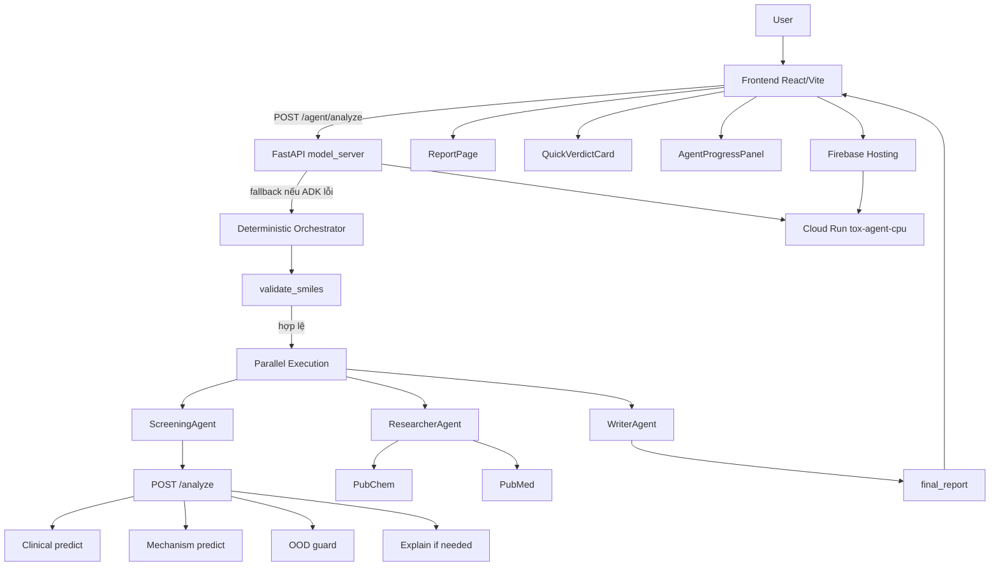

# ToxAgent - Tổng Quan Workflow Hệ Thống

Tài liệu này tổng hợp luồng hoạt động hiện tại của workspace `tox-agent`, dựa trên code, tài liệu kiến trúc, và cấu hình deploy. Mục tiêu là mô tả từ lúc người dùng nhập SMILES cho tới lúc hệ thống trả về báo cáo cuối cùng, đồng thời chỉ ra các thành phần chính đang tham gia trong từng bước.

## 1. Bức Tranh Tổng Thể

Hệ thống hiện tại có 2 lớp chạy song song:

- `Frontend` React/Vite để người dùng nhập SMILES, xem tiến trình agent, và đọc báo cáo.
- `Backend` FastAPI trong `model_server` để cung cấp inference, explainability, và endpoint agentic.

Ở lớp logic, hệ thống được chia thành:

- `Agent Layer` cho workflow nhiều bước: validation, screening, research, writer.
- `Inference Layer` cho dự đoán độc tính và giải thích cấu trúc.
- `Research Layer` cho PubChem và PubMed.
- `Deployment Layer` cho Cloud Run + Firebase Hosting.

Trạng thái workspace hiện tại là `tox21_only`, nên các luồng ClinTox cũ vẫn còn trong code nhưng bị guard ở một số entrypoint UI/CLI. Tuy nhiên, `model_server` và `Agent Layer` vẫn giữ phần Clinical/SMILESGNN để phục vụ workflow phân tích tổng hợp hiện tại.

## 2. Kiến Trúc Luồng Chính

## 3. Các Thành Phần Lớn

### `Frontend`

Frontend nằm trong `frontend/`, dùng React Router và `ReportContext` để giữ trạng thái báo cáo giữa các trang.

- `IndexPage` là điểm nhập chính.
- `ReportPage` hiển thị báo cáo đầy đủ.
- `AgentProgressPanel` hiển thị tiến trình theo `agent_events`.
- `QuickVerdictCard` hiển thị kết quả tóm tắt sau khi phân tích xong.
- `ReportHeader`, `ReportSidebar`, và các section report đọc dữ liệu từ `final_report`.

### `model_server`

Đây là FastAPI backend chính. Nó load model lúc khởi động, giữ lock inference để tránh gọi đồng thời lên cùng một model object, rồi cung cấp các endpoint:

- `GET /health`
- `POST /predict`
- `POST /predict/batch`
- `POST /explain`
- `POST /analyze`
- `POST /agent/analyze`

### `Agent Layer`

Thư mục `agents/` chứa orchestration theo ADK-compatible structure.

- `InputValidator` kiểm tra SMILES.
- `ScreeningAgent` gọi model inference để tạo clinical/mechanism/explanation payload.
- `ResearcherAgent` kéo dữ liệu PubChem và PubMed.
- `WriterAgent` tổng hợp thành `final_report`.
- `orchestrator_agent.py` có cả flow deterministic và ADK tool-calling flow.

### `backend`

Đây là lớp inference và hỗ trợ khoa học:

- `inference.py` lo clinical prediction, mechanism prediction, batch prediction, và aggregation verdict.
- `gnn_explainer.py` lo atom/bond attribution.
- `ood_guard.py` lo đánh giá out-of-distribution theo thành phần nguyên tố.
- `graph_data.py`, `graph_models*.py`, `smiles_tokenizer.py`, `train.py` là các mảnh ML nền.

### `tools`

Là các hàm mà agent có thể gọi trực tiếp:

- `validate_smiles()`
- `analyze_molecule()`
- `analyze_molecules_batch()`
- `get_compound_info_pubchem()`
- `search_toxicity_literature()`
- `get_pubchem_bioassay_data()`

### `scripts`, `notebooks`, `models`, `data`

- `scripts/` chứa train, predict, explain, smoke test.
- `notebooks/` chứa exploratory, training, inference, explainability notebooks.
- `models/` chứa checkpoint đã train.
- `data/` và `results/` chứa dataset đã xử lý và output đánh giá.

## 4. Luồng Người Dùng Chính

### 4.1 Từ `IndexPage` đến `agent/analyze`

Người dùng nhập SMILES ở `frontend/src/app/pages/index-page.tsx`. Khi bấm phân tích:

1. Frontend lấy `language`, `clinicalThreshold`, `mechanismThreshold` từ `ReportContext`.
2. Gọi `agentAnalyze()` trong `frontend/src/lib/api.ts`.
3. Payload gửi lên gồm:
   - `smiles`
   - `include_agent_events: true`
   - `language`
   - `clinical_threshold`
   - `mechanism_threshold`
   - `max_literature_results`
4. Kết quả trả về được lưu vào `ReportContext`.
5. `AgentProgressPanel` hiển thị timeline tiến trình.
6. `QuickVerdictCard` hiển thị kết quả nhanh.
7. Người dùng bấm sang `ReportPage` để xem báo cáo đầy đủ.

### 4.2 `ReportPage`

`ReportPage` đọc toàn bộ `final_report` từ context và render:

- `ReportHeader`
- `ReportSidebar`
- `MetricsDashboardSection`
- `ClinicalToxicitySection`
- `MechanismProfilingSection`
- `StructuralExplanationSection`
- `LiteratureContextSection`
- `AIRecommendationsSection`

Nếu chưa có báo cáo, trang này sẽ hiện thông báo yêu cầu quay lại trang chính và chạy phân tích trước.

## 5. Luồng `POST /agent/analyze`

Đây là endpoint chính cho workflow agentic.

### 5.1 Bước 1 - Validation

`agent_analyze()` trong `model_server/main.py` nhận request và kiểm tra SMILES không rỗng.

Sau đó:

- Nếu ADK runtime sẵn sàng, hệ thống tạo session và chạy agent runtime.
- Nếu ADK thiếu hoặc lỗi runtime, hệ thống rơi về `run_orchestrator_flow()`.

### 5.2 Bước 2 - `InputValidator`

`run_input_validation()` dùng `validate_smiles()` để:

- parse SMILES bằng RDKit
- canonicalize SMILES
- trả `VALID` hoặc `INVALID`

Nếu SMILES không hợp lệ, flow dừng sớm và trả báo cáo lỗi tối thiểu.

### 5.3 Bước 3 - Chạy song song `ScreeningAgent` và `ResearcherAgent`

Nếu SMILES hợp lệ, orchestrator dùng `ThreadPoolExecutor` để chạy song song:

- `run_screening()`
- `run_research()`

Đây là điểm quan trọng: screening và research không chờ nhau tuần tự, nên pipeline nhanh hơn và đúng với kiến trúc song song đã định.

### 5.4 Bước 4 - `ScreeningAgent`

`run_screening()` làm việc theo thứ tự:

1. `validate_smiles()` lại một lần nữa để đảm bảo input sạch.
2. `analyze_molecule()` gọi vào `model_server /analyze`.
3. Nhận về:
   - `clinical`
   - `mechanism`
   - `explanation`
   - `ood_assessment`
   - `final_verdict`
   - `inference_context`
4. Gom lại thành `screening_result`.

### 5.5 Bước 5 - `ResearcherAgent`

`run_research()` làm 3 việc chính:

1. `get_compound_info_pubchem(smiles)` để lấy CID, tên ưu tiên, công thức, khối lượng, synonym.
2. `search_toxicity_literature(preferred_name)` để tìm literature liên quan.
3. Nếu có CID, `get_pubchem_bioassay_data(cid)` để lấy bằng chứng assay.

Kết quả gộp thành `research_result`.

### 5.6 Bước 6 - `WriterAgent`

`build_final_report()` tổng hợp:

- `clinical_toxicity`
- `mechanism_toxicity`
- `structural_explanation`
- `literature_context`
- `ood_assessment`
- `inference_context`
- `failure_registry`
- `recommendations`

Nó cũng tạo:

- `risk_level`
- `executive_summary`
- `recommendation_source`
- `recommendation_source_detail`

Nếu có LLM sẵn và bật bằng env, WriterAgent có thể sinh khuyến nghị bằng `google.genai`; nếu không thì dùng bộ khuyến nghị deterministic.

## 6. Luồng `POST /analyze`

Đây là endpoint inference hợp nhất, không đi qua agent runtime mà đi thẳng vào model logic.

### 6.1 Clinical branch

`predict_clinical_toxicity()` trong `backend/inference.py` dựa trên `SMILESGNN/XSmiles`:

- validate và featurize SMILES
- chạy `predict_batch()` với checkpoint clinical
- trả `label`, `is_toxic`, `confidence`, `p_toxic`, `threshold_used`

### 6.2 Mechanism branch

`predict_toxicity_mechanism()` dùng model `Tox21 GATv2`:

- load per-task thresholds nếu có
- tính `task_scores` cho toàn bộ 12 tasks
- xác định `active_tasks`
- tính `highest_risk_task`
- đếm `assay_hits`

### 6.3 OOD branch

`check_ood_risk()` đánh giá xem phân tử có nằm ngoài phân phối training không:

- nguyên tố lạ → `MEDIUM`
- nguyên tố organometallic/higher risk → `HIGH`
- chỉ có element phổ biến → `LOW`

### 6.4 Explanation branch

Nếu cần giải thích, hệ thống chạy `GNNExplainer` theo 2 hướng:

1. Ưu tiên `clinical` explanation từ SMILESGNN graph pathway.
2. Nếu clinical explanation lỗi, fallback sang `target_task` của Tox21.

Kết quả gồm:

- `top_atoms`
- `top_bonds`
- `heatmap_base64`
- `molecule_png_base64`
- `explainer_note`

### 6.5 Verdict aggregation

`aggregate_toxicity_verdict()` gom clinical + mechanism thành một nhãn cấp cao:

- `CONFIRMED_TOXIC`
- `MECHANISTIC_ALERT`
- `CLINICAL_CONCERN`
- `LIKELY_SAFE`

### 6.6 Output contract

Response của `/analyze` chứa:

- `clinical`
- `mechanism`
- `explanation`
- `ood_assessment`
- `reliability_warning`
- `inference_context`
- `final_verdict`

## 7. Dữ Liệu Trong `final_report`

`WriterAgent` tạo `final_report` để UI đọc trực tiếp. Các section chính hiện có:

- `clinical_toxicity`
- `mechanism_toxicity`
- `structural_explanation`
- `literature_context`
- `ood_assessment`
- `inference_context`
- `reliability_warning`
- `recommendation_source`
- `recommendation_source_detail`
- `failure_registry`
- `recommendations`

Tóm lại, `final_report` là lớp hợp nhất cho UI. `agent_events` chỉ phục vụ tiến trình và debug trace.

## 8. Cấu Hình Deploy Và Runtime

### 8.1 Cloud Run

Backend được đóng gói bằng `model_server/Dockerfile` và deploy lên Cloud Run service `tox-agent-cpu` ở region `asia-southeast1`.

Điểm đáng lưu ý:

- image được build qua Cloud Build
- container chạy FastAPI server
- concurrency thấp và timeout dài để phù hợp inference/explanation

### 8.2 Firebase Hosting

`firebase.json` serve frontend build từ `frontend/dist` và rewrite:

- `/health`
- `/predict`
- `/predict/**`
- `/explain`
- `/analyze`
- `/agent/**`

về Cloud Run service `tox-agent-cpu`.

Điều này có nghĩa là người dùng có thể gọi API qua cùng domain với frontend mà không cần tự cấu hình proxy riêng.

### 8.3 Local dev

Frontend đọc `VITE_API_BASE_URL` từ env. Nếu không có, hoặc lỡ bundle production vẫn giữ localhost, code có một safety net để dùng relative path nhằm khớp Firebase rewrites.

`model_server` thì load `.env` và `.env.local` ở root nếu có.

## 9. Entry Points Phụ Và Legacy

### `app.py`

Đây là Streamlit app cũ cho giao diện trực tiếp với SMILESGNN.

- Có chế độ Batch Screening và Deep Dive.
- Hiện tại bị chặn khi workspace ở `tox21_only`.
- Nó vẫn hữu ích như reference cho workflow explainability, nhưng không phải đường chạy chính của sản phẩm hiện tại.

### `scripts/test_agent_layer_flow.py`

Đây là smoke test cho agent layer end-to-end.

Nó gọi `run_orchestrator_flow()` và kiểm tra các state key quan trọng như:

- `validation_status`
- `screening_result`
- `research_result`
- `final_report`

## 10. Luồng Xử Lý Lỗi Và Fallback

Hệ thống có vài lớp fallback rõ ràng:

- SMILES rỗng hoặc parse lỗi → trả lỗi validation ngay.
- ADK runtime lỗi → fallback sang deterministic orchestrator.
- Research tool lỗi một phần → vẫn cố tạo report hợp lệ.
- Explanation timeout → trả lỗi structured thay vì treo request.
- OOD cao → gắn `reliability_warning` để UI cảnh báo.

## 11. Tóm Tắt Một Câu

Người dùng nhập SMILES ở `Frontend`, request đi vào `POST /agent/analyze`, hệ thống chạy `Agent Layer` để validate, `ScreeningAgent` để suy luận độc tính, `ResearcherAgent` để kéo bằng chứng, `WriterAgent` để tổng hợp thành `final_report`, rồi `ReportPage` render toàn bộ kết quả; các endpoint `POST /analyze`, `POST /predict`, `POST /explain` là lớp inference hỗ trợ cho flow này và cũng được rewrite qua `Firebase Hosting` tới `Cloud Run`.
