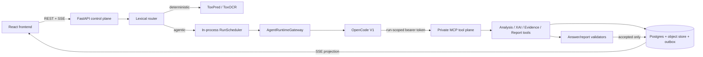
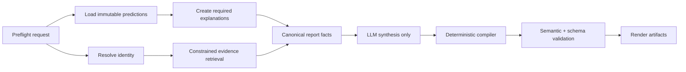

# Audit toàn bộ agentic flow ToxAgent

**Ngày kiểm tra:** 2026-09-13  
**Phạm vi:** frontend, control plane, OpenCode runtime, MCP tool plane, predictor/XAI, evidence retrieval, report builder, persistence/SSE, test và tài liệu vận hành.  
**Môi trường live:** stack đầy đủ tại `http://127.0.0.1:8088`, OpenCode `1.17.11`, model `openai/gpt-5.6-luna`.

## Kết luận điều hành

ToxAgent không có một nền móng tệ. Ngược lại, phần **correctness và durability** được làm khá nghiêm túc: scientific facts thuộc về predictor/control plane, model bị khóa sau MCP, final answer chỉ được lưu sau validation, run có lease/fencing, event có outbox, idempotency và cancellation đều hoạt động thật. Bộ regression sạch cũng đạt **1.019 backend test pass** và **155 frontend test pass**.

Trải nghiệm vẫn “cực tệ” vì bốn vấn đề nằm phía trên nền móng đó:

1. **Runtime profile của report không thực sự được dùng.** Control plane ghi budget 64 steps nhưng adapter luôn gọi agent chung `toxagent`; OpenCode thực tế chỉ thấy profile 32 steps. Audit trail và runtime truth không khớp nhau.
2. **Model đang gánh quá nhiều workflow và serialization.** Một report tối thiểu đã nạp 18.149 input token ở bước đầu, kết thúc ở 28.408 token, mất 155,5 giây, gọi tool thừa, tự tạo ID và phải dùng validator như một bộ lập kế hoạch phản ứng.
3. **Các guard kiểm tra hình thức tốt nhưng chưa kiểm tra nhất quán khoa học xuyên section.** Report live đã được chấp nhận dù executive summary phủ định chính dữ liệu explanation nằm trong cùng artifact.
4. **Telemetry và retrieval làm sai tín hiệu vận hành.** Usage snapshot bị lưu lặp khoảng ba lần; evidence search ghi bền vững năm tài liệu không liên quan đến ethanol dù câu trả lời cuối cùng không trích tài liệu nào.

Đánh giá tổng quát: **domain architecture tốt, agent responsibility quá lớn, runtime adapter có lỗi cấu hình nghiêm trọng, và quality gates đang ưu tiên schema-level correctness hơn semantic consistency.** Không cần thay toàn bộ framework ngay. Hướng đúng là giữ OpenCode như execution shell, nhưng chuyển workflow khoa học/report về một state machine do application kiểm soát; model chỉ làm phần chọn lọc và tổng hợp ngôn ngữ.

## Kiến trúc hiện tại

Ranh giới ownership nhìn chung đúng:

- ToxPred sở hữu model output và provenance.
- Control plane sở hữu session, run, facts, evidence, validation, report artifact và event.
- OpenCode không phải system of record; nó chỉ điều phối tool trong một runtime session tạm thời.
- Model text delta chưa grounded không được ghi vào transcript. Đây là lựa chọn an toàn, dù làm UX ít “streaming”.

## Kiểm thử live và số đo

Tất cả run dưới đây nằm trong session audit `ses_cc304429ec9d49cb8f51a8e05bba89ac`.

| Luồng | Run | Kết quả | Thời gian quan sát | Điểm đáng chú ý |
|---|---|---:|---:|---|
| Phân tích `CCO` | `run_49a1ccbf7aef4da5944b2bd44dd7a915` | completed | ~176 ms | Lane deterministic; tạo analysis và observation đúng, không bind runtime |
| Q&A hERG | `run_331bad07a622489e9daf1bdd2d7aa262` | completed | ~54,1 s | 2 reads; lần submit đầu bị reject, lần hai pass |
| Evidence research | `run_cb684ec92387459da1286333dc0aa597` | completed | ~49,7 s | 3 searches, nhiều reads, 5 record không liên quan được lưu, 0 citation dùng |
| Attribution Q&A | `run_71ee1dfae0bc41c0bcc73e088d54114c` | completed | ~46,6 s | Tool attribution chỉ ~163 ms; orchestration chiếm gần toàn bộ thời gian |
| Report hERG tối thiểu | `run_fc0295afca8a43d2a1cee6fcc60ed0d8` | completed | ~155,5 s | 28.408 token, tool ordering sai, một conflict, report vẫn hoàn tất |
| Cancel Q&A | `run_42fa5e5e9a0d4d9f9f8eb4565af15281` | cancelled | terminal sau ~10,4 s từ lúc start | `worker_cancelled`, `runtime_cancel_supported=true`, `potentially_billed=true` |

Các hợp đồng tích cực đã được xác minh live:

- Gửi lại `client_message_id=audit-qa-001` trả lại đúng message/run cũ và có `duplicate_of_message_id`; không tạo model turn mới.
- Cancellation không nói dối: run chuyển `cancelled`, đồng thời vẫn đánh dấu `potentially_billed=true` vì provider đã nhận turn.
- `/health/ready` trả `ready=true`, runtime OpenCode healthy; hERG/Tox21 và explainer ready, ClinTox được báo unavailable thay vì làm toàn stack giả vờ down.
- Frontend `http://127.0.0.1:8088` trả HTTP 200.

## Phát hiện ưu tiên P0

### P0-1 — Report runtime profile là cấu hình chết

Report profile khai báo agent `toxagent-report` và `maxSteps: 64` tại [profile.json](../../backend/control/src/toxagent/agent_profiles/report_build/profile.json). Gateway cũng ghi `max_steps_report=64` vào `RuntimeSessionSpec`.

Nhưng adapter OpenCode V1:

- chủ động không gửi `spec.max_steps` vì API `prompt_async` không nhận trường này;
- luôn gửi `agent: self._settings.agent_name`, mặc định là `toxagent`;
- profile chung `toxagent` chỉ có `maxSteps: 32` tại [toxagent.json](../../backend/control/src/toxagent/agent_profiles/opencode/toxagent.json).

Đoạn lỗi nằm tại [opencode_v1.py](../../backend/control/src/toxagent/harness/adapters/opencode_v1.py): adapter bỏ qua budget intent-specific ở dòng 253–257 và chọn agent chung ở dòng 264. Tài liệu OpenCode hiện tại còn đánh dấu `maxSteps` là legacy/deprecated và yêu cầu dùng `steps`; khi đạt limit, agent bị ép kết thúc bằng text.[^1]

**Tác động:** report có thể dừng ở 32 bước trước khi gọi submit, trong khi run manifest tuyên bố budget 64. Đây vừa là lỗi runtime, vừa là lỗi auditability.

**Sửa đề xuất:** profile registry phải trả cả `runtime_agent_name` và effective step cap; adapter chọn `toxagent-report` cho `BUILD_REPORT`; migrate config sang `steps`; thêm integration test đọc request thực gửi cho OpenCode và assert agent/cap, không chỉ assert object nội bộ.

### P0-2 — Validator cho qua mâu thuẫn khoa học trong report

Artifact live `rpt_d595fee878984745b916c1c396ddbcde` có các mâu thuẫn sau:

- Executive summary nói explanation “reports no mapped positive or negative contributors and no unmapped mass”.
- Chính `explanations[0].extracted_highlights` của cùng report có **3 negative contributors** và `unmapped_importance=0.3583836537608235`.
- Section “Explanation and visuals” lại mô tả đúng ba contributor và non-zero unmapped mass.
- Limitation `evidence_scope_limited` nói literature search đã phủ một provider và không đọc full text, trong khi build đặt `include_external_evidence=false`, references rỗng và section evidence nói không có search nào được thực hiện.

Report vẫn được phát hành với trạng thái `completed_with_gaps`; hai gap chỉ nói identity provider lỗi và không có external evidence, không hề nêu mâu thuẫn.

**Tác động:** đây là lỗi scientific communication nghiêm trọng hơn một lỗi schema. Người đọc chỉ xem executive summary sẽ nhận kết luận trái với dữ liệu nguồn.

**Sửa đề xuất:** tạo semantic consistency validator chạy trên representation đã normalize, không regex trên prose:

- mọi câu về contributor/unmapped phải được compiler sinh từ một `ExplanationSummary` duy nhất;
- limitation phải có predicate áp dụng (`search_performed`, `score_is_uncalibrated`, `has_explanation`, ...);
- cấm model tự viết lại fact ở nhiều section; section chỉ tham chiếu fact ID và compiler render;
- thêm golden test chứa chính artifact này.

## Phát hiện ưu tiên P1

### P1-1 — Usage telemetry bị nhân bản và không thể cộng an toàn

Q&A run có 21 usage events. Cùng cumulative snapshot xuất hiện lặp ba lần, xen kẽ các step event 0 token. Ví dụ snapshot `input=3826/output=101/reasoning=24` xuất hiện ba lần; các snapshot sau cũng tương tự.

Nguyên nhân nằm tại [opencode_v1.py](../../backend/control/src/toxagent/harness/adapters/opencode_v1.py): cả `message.part.updated` với `step-finish` (dòng 450–455) lẫn `message.updated` (456–463) đều được normalize thành `USAGE_REPORTED`. Gateway lưu mọi event tại [gateway.py](../../backend/control/src/toxagent/harness/gateway.py) mà không có source event ID, revision, semantic `delta|cumulative` hay dedupe key.

**Tác động:** tổng token/cost theo phép cộng sẽ sai lớn; event/outbox phình; dashboard và budget policy không đáng tin.

**Sửa đề xuất:** lưu raw provider telemetry riêng; normalized usage phải có `(runtime_session_id, message_id, step_id, revision, source_event_type)` unique; đánh dấu cumulative; product total lấy snapshot mới nhất hoặc delta sau normalization.

### P1-2 — Evidence retrieval lưu bền vững kết quả không liên quan

Câu hỏi yêu cầu tối đa hai paper về **ethanol và hERG**. Agent trả lời trung thực rằng không tìm thấy bằng chứng trực tiếp, nhưng trước đó đã persist năm evidence record “accepted” về alpha-asaronol/asthma, cannabinoids, breast-cancer compound, remdesivir và brain-heart review.

“Accepted” hiện chỉ có nghĩa provider payload hợp lệ về cấu trúc, không có nghĩa relevant/citable. Search candidate và curated evidence đang dùng chung một trạng thái bền vững.

**Tác động:** evidence inventory bị ô nhiễm, search sau dễ tái dùng nguồn sai, tăng token/cost và tạo cảm giác agent đi lang thang.

**Sửa đề xuất:**

1. Resolve compound identity/synonym trước bằng code.
2. Search candidate chỉ là ephemeral/TTL state.
3. Rank bằng exact compound entity + endpoint/assay entity; đặt relevance threshold.
4. Chỉ promote sang `citable` sau detail fetch, relevance check và model selection.
5. Budget search/read phải suy ra từ yêu cầu người dùng; “tối đa 2 paper” không được đọc bảy record.

### P1-3 — Report là một model turn khổng lồ và workflow bị đảo thứ tự

Profile report được compose từ 15 file, khoảng 41.005 ký tự / 5.966 từ, chưa tính tool schema và analysis content. Với report chỉ có một endpoint hERG:

- input bước đầu đã là 18.149 token;
- cumulative cuối run là 28.408 token;
- model gọi `get_report_context`, `get_analysis_bundle`, rồi `get_analysis_slice` nhiều lần;
- `resolve_compound_record` lỗi transport decompression;
- model đọc explanation package trước khi tạo package cần thiết;
- lưu draft trước khi precondition hoàn tất nên nhận 6 violations;
- sau đó mới tạo explanation/figure;
- patch lần đầu conflict, lần hai mới pass.

Các tool riêng lẻ hầu hết chỉ mất 17–78 ms; hai provider operation mất khoảng 1–1,5 s. 155,5 giây chủ yếu là thời gian model/orchestration.

**Sửa đề xuất:** thay single-turn report agent bằng workflow state machine bền vững:

Identity, analysis, explanation và evidence readiness là server workflow; model không được tự quyết thứ tự. Model chỉ nhận canonical facts đủ dùng cho section cần viết. OpenAI cũng khuyến nghị không bắt model điền dữ liệu ứng dụng đã biết, gộp các function luôn đi tuần tự, giữ số tool ban đầu nhỏ, và lưu ý tool definitions được tính vào input token.[^2]

### P1-4 — Model bị bắt tự tạo database identity; example trong tool prompt đã đầu độc output

Tool `submit_grounded_answer` yêu cầu model tạo `claim_id` unique trên toàn deployment và đưa một ID cụ thể làm ví dụ tại [answer.py](../../backend/control/src/toxagent/tools/definitions/answer.py). Trong live test, model copy đúng ID ví dụ đó, gây `claim_id_not_unique` ở lần submit đầu.

**Tác động:** lãng phí một correction turn, tăng latency và biến trách nhiệm persistence thành bài toán sinh text cho model.

**Sửa đề xuất:** model gửi local references (`claim_1`) hoặc không gửi ID; server cấp ULID/UUID sau validation và rewrite links. Không đặt một giá trị hợp lệ cụ thể trong description. Đây cũng đúng với nguyên tắc “đừng bắt model điền argument mà application đã biết”.[^2]

### P1-5 — First-pass acceptance thấp; regex hiểu sai phủ định

Lần submit Q&A đầu bị reject bởi ba lỗi: `claim_id_not_unique`, `unclaimed_numeric_value` với `0,109`, và `safety_verdict_out_of_scope`. Câu trả lời đang cảnh báo **không** được hiểu score như nguy cơ lâm sàng, nhưng safety detector vẫn đánh dấu wording liên quan “nguy cơ lâm sàng”.

Validator đã ngăn output sai đi vào transcript — đó là điểm mạnh. Tuy nhiên nó đang trở thành feedback-driven planner: model thử một object lớn, nhận violations, rồi viết lại. Mỗi false positive có thể gần như nhân đôi thời gian/cost.

**Sửa đề xuất:** parse/validate claims trên structured facts; compiler chèn số; safety check phân biệt assertion với negation/limitation; đo `first_pass_acceptance_rate` theo profile và violation code.

### P1-6 — Attribution dành 35,84% importance cho special tokens

Live hERG attribution cho `CCO` có `[SEP]` 24,079% và `[CLS]` 11,759% relative importance, tổng khoảng **35,84%**. Ba atom nhận phần còn lại. UI/agent có nói special token không phải thành phần hóa học, nhưng giá trị atom-level bị pha loãng đáng kể.

**Tác động:** hình dễ bị đọc như “toàn bộ lời giải hóa học”, trong khi hơn một phần ba attribution không map vào atom.

**Sửa đề xuất:** luôn hiển thị unmapped mass cạnh hình; normalize atom share theo cả `absolute_total` và `mapped_only`; đặt confidence/coverage badge; không gọi output là mechanistic explanation.

### P1-7 — Scheduler bền vững nhưng vẫn chạy trong process web và không có global backpressure

[RunScheduler](../../backend/control/src/toxagent/application/run_scheduler.py) dùng `asyncio.create_task` trong process FastAPI. Lease 30 giây, fencing epoch, adoption và cancel polling được thiết kế tốt. Tuy vậy:

- chỉ giới hạn một run trên mỗi session;
- không thấy global hoặc per-principal cap cho session-based agent runs;
- report deadline mặc định một giờ;
- shutdown hủy task local rồi chờ tối đa 10 giây; replica khác chỉ adopt sau khi lease hết hạn;
- scale web replica đồng thời scale agent worker một cách gián tiếp.

FastAPI khuyến nghị workload background nặng, không cần chia sẻ memory với web process, nên dùng worker/job queue có thể chạy nhiều process/server.[^3]

**Tác động:** burst qua nhiều session có thể tạo số lượng model turn không giới hạn trong mỗi replica; deploy/restart gây pause/adoption và có nguy cơ provider đã nhận turn bị tính phí hai lần.

**Sửa đề xuất:** giữ bảng `run_jobs` và fencing, nhưng tách worker deployment; thêm global/per-tenant concurrency lease trong DB; admission trả 429/retry-after hoặc queued position; dùng idempotency key phía provider nếu runtime hỗ trợ.

### P1-8 — UX chờ lâu nhưng không có progress khoa học hữu ích

Gateway cố ý không persist/expose `MESSAGE_DELTA` trước final submit tại [gateway.py](../../backend/control/src/toxagent/harness/gateway.py), tránh ungrounded number sống sót trong transcript. Đây là quyết định đúng về safety.

Hệ quả là người dùng chờ 47–155 giây với activity tương đối chung chung. Cảm giác “không agentic” thực ra là thiếu progress được server chứng thực, không nhất thiết cần stream token thô.

**Sửa đề xuất:** phát event stage do server tạo: `loading_analysis`, `resolving_identity`, `creating_explanation 1/1`, `searching_evidence`, `validating_draft`, `rendering 1/2`; có elapsed time, retry count và budget remaining. Có thể hiển thị draft rõ nhãn “chưa kiểm chứng” nhưng không persist vào transcript.

### P1-9 — Router lexical và intent truth bị chia đôi frontend/backend

Router backend dùng `any(term in text for term in terms)` tại [router.py](../../backend/control/src/toxagent/application/router.py), nên dễ dính substring và khó phân biệt ngữ cảnh/phủ định. Frontend lại có SMILES heuristic riêng. Khi có active analysis, phần lớn câu hỏi tự do chuyển sang report Q&A; khi không có analysis, nhiều câu rơi vào clarification.

**Sửa đề xuất:** backend là nguồn intent truth duy nhất. Dùng grammar/rule có boundary cho lệnh chắc chắn; phần mơ hồ trả structured clarification hoặc một intent classifier nhỏ có eval set. Frontend chỉ gửi explicit user choice/hint, không tự quyết semantics.

### P1-10 — Runtime session ngắn hạn làm mất lợi ích multi-turn và prompt caching

Mỗi product run tạo rồi xóa một OpenCode session/project/MCP binding mới. Control plane có durable transcript nhưng runtime không kế thừa native session; system prompt còn chứa state động và tool surface khác nhau theo intent.

OpenAI prompt caching yêu cầu rendered prefix khớp; tool name/description/schema/order là một phần prefix. Họ khuyến nghị đặt phần ổn định trước và append history thay vì rewrite.[^4]

**Tác động:** intra-turn caching có hoạt động — report live ghi nhận cache reads lớn ở bước sau — nhưng cross-turn reuse có khả năng thấp; Q&A đơn giản vẫn khởi động với khoảng 3,8–4,4k input token.

**Sửa đề xuất:** đo cache hit theo profile; tách static instruction prefix khỏi dynamic state; giữ tool schemas/order ổn định và giới hạn tool qua allow-list thay vì thay definition; cân nhắc runtime session reuse có TTL nếu vẫn bảo toàn capability isolation.

## Phát hiện ưu tiên P2 / engineering hygiene

### P2-1 — Eval documentation đã sai hiện trạng

[evals/README.md](../../backend/control/evals/README.md) nói remote driver chưa được viết và `--runtime opencode` sẽ từ chối. Nhưng [runner.py](../../backend/control/evals/runner.py) đã có `RemoteHTTPDriver` và hỗ trợ `opencode|dsh`.

**Tác động:** người vận hành không chạy được đúng quality gate dù code đã có.

### P2-2 — Canonical backend test không portable như comment tuyên bố

[test_predictor_contract.py](../../backend/control/tests/contract/test_predictor_contract.py) locate snapshot qua package nhưng sau đó vẫn dùng `SNAPSHOT_PATH.parents[5]`. Khi source được mount ở path nông `/audit`, collection lỗi `IndexError`, dù comment nói chạy được trong checkout, wheel và image.

**Sửa đề xuất:** chỉ chạy phần regenerate khi tìm được repository marker; package-level snapshot assertion không được phụ thuộc depth.

### P2-3 — Dev/test environment không tái lập từ workspace hay production image

- `.venv` hiện tại không có `pytest`/`httpx`.
- Production control image bỏ `tests`, `evals` và dev dependencies theo `.dockerignore`.
- Sau khi mount bản sao, `python -m evals.runner --runtime scripted` vẫn lỗi vì thiếu `aiosqlite`.

Việc production image gọn là hợp lý; thiếu một image/lock target riêng cho CI/dev mới là khoảng trống. Nên có `docker build --target test` hoặc `compose --profile test` chạy được test/eval từ fresh clone.

### P2-4 — Test output có noise dễ che lỗi thật

Frontend 155 test đều pass nhưng jsdom liên tục in `HTMLCanvasElement.prototype.getContext not implemented` từ smiles drawer. Backend clean suite có 25 warning, gồm HMAC test key ngắn hơn khuyến nghị 32 byte và MCP client API deprecation.

**Sửa đề xuất:** mock canvas tập trung trong test setup; nâng fixture secret; migrate sang `streamable_http_client`; fail CI trên unexpected stderr/warning sau khi lập allow-list hẹp.

### P2-5 — Compound resolver lỗi transport làm report mất identity cơ bản

Report `CCO` không resolve được preferred name/properties vì provider trả decompression error. Report xử lý failure trung thực bằng gap, nhưng một lỗi transport đã khiến substance profile nghèo dù canonical SMILES vẫn có.

**Sửa đề xuất:** kiểm tra `Content-Encoding`/http client decompression ở PubChem adapter; retry bounded; cache successful identity; có deterministic local fallback cho canonical SMILES/MolWt nếu RDKit metadata được policy cho phép, nhưng không tự gắn tên khi provider chưa xác minh.

## Những phần đang làm tốt và nên giữ

1. **Deterministic lane thật sự nhanh và tách model:** phân tích CCO hoàn tất ~176 ms, không có runtime binding.
2. **Server-authoritative facts:** model chỉ đọc observation/evidence qua tool; output chỉ persist sau validator.
3. **Grounding boundary đúng:** unvalidated message deltas chỉ giữ trong memory để diagnostic.
4. **Durable execution:** run envelope, lease, renewal, fencing và adoption xử lý multi-replica tốt hơn một background task thuần memory.
5. **Honest cancellation/billing:** live contract trả đúng `worker_cancelled` và `potentially_billed=true`.
6. **Idempotency:** replay cùng client ID không gọi lại model.
7. **Security posture tốt:** OpenCode agent deny-all rồi chỉ allow `toxagent_*`; capability bearer token là run-scoped và được cài ở runtime layer, không lộ trong model prompt.
8. **Outbox + SSE:** event sequence và reconciliation có test; deterministic run phát đúng queued → started → artifact events → completed.
9. **Graceful capability degradation:** ClinTox unavailable được báo theo capability, không làm toàn control plane unready.
10. **Regression breadth lớn:** clean writable copy đạt 1.019 pass, 14 skip, 5 deselected; frontend đạt 155/155.

## Kiến trúc mục tiêu đề xuất

Không nên tối đa hóa “độ agentic”. Với phần mềm khoa học, mục tiêu là **bounded agency trên một deterministic substrate**.

### 1. Command router có typed intent

API normalize input thành `Analyze`, `AskAnalysis`, `ResearchEvidence`, `Explain`, `BuildReport`. Rule chắc chắn chạy trước; classifier chỉ xử lý ambiguous cases; mọi quyết định route có reason và eval case.

### 2. Scientific workflow engine do server sở hữu

Mỗi intent có graph/stage cố định và persisted checkpoint. Model không quyết định precondition hay ID. Retry nằm ở stage cụ thể, không replay toàn turn.

### 3. Canonical fact graph

Predictions, explanations, compound identity và evidence đều normalize thành typed fact có provenance. Model trả synthesis gắn fact refs; compiler sinh số, label, limitation, claim ID, citation và cross-section text.

### 4. LLM chỉ làm ba việc

- chọn tập fact liên quan với câu hỏi;
- diễn giải/so sánh trong giới hạn schema nhỏ;
- tổng hợp evidence đã được retrieval layer lọc.

Không giao cho model: database identity, exact numeric rendering, workflow order, report object hoàn chỉnh, mandatory limitation selection hay artifact path.

### 5. Independent workers và quota

Web process chỉ admission/SSE/query. Worker claim `run_jobs` bằng lease/fencing hiện có. Có quota global, tenant, provider và profile; report worker pool tách khỏi interactive Q&A.

### 6. Observability theo product semantics

Metrics tối thiểu: queue time, model time, tool time, validation time, render time, first-pass acceptance, correction reason, unique/cumulative tokens, cache hit, relevant evidence precision, stage retry và cancel settlement.

## Kế hoạch sửa theo thứ tự

### Trong 48 giờ

1. Sửa agent/profile selection và effective `steps`; test request thật gửi OpenCode.
2. Thêm cross-section consistency checks cho explanation/evidence limitation; đưa artifact live vào regression fixture.
3. Bỏ model-generated global claim IDs; server cấp ID.
4. Dedupe usage events và sửa API tổng token.
5. Fix PubChem decompression/retry.

### Trong 2 tuần

1. Tách report thành persisted stages; precompute explanations trước synthesis.
2. Thêm evidence candidate/relevance/promote lifecycle.
3. Phát server-authored progress events và UI stage timeline.
4. Thêm global/per-principal concurrency và provider budget.
5. Thu gọn static report prompt/tool schema; đo cache hit.
6. Sửa eval README, portable contract test, test Docker target và warning noise.

### Trong 30–45 ngày

1. Tách agent workers khỏi FastAPI deployment.
2. Chạy full live eval suite định kỳ trên pinned model/profile, lưu manifest và cost.
3. Thêm fault injection: runtime mất giữa tool call, OpenCode restart, lease takeover, outbox lag, evidence provider timeout, cancel cross-replica.
4. So sánh hai phương án bằng eval/cost thay vì cảm giác: OpenCode shell đã sửa vs orchestration trực tiếp bằng provider API. Chỉ thay framework nếu dữ liệu cho thấy lớp OpenCode vẫn gây phần lớn latency/failure.

## Tiêu chí chấp nhận đề xuất

| Chỉ số | Baseline live | Mục tiêu ban đầu |
|---|---:|---:|
| Q&A end-to-end | 46,6–54,1 s | p50 ≤ 15 s, p95 ≤ 30 s |
| Minimal report | 155,5 s | p50 ≤ 60 s, p95 ≤ 120 s |
| Q&A first-pass validation | test mẫu 0% | ≥ 95% trên eval set |
| Duplicate normalized usage | có, thường ~3 bản/snapshot | 0 |
| Report semantic contradictions | 2 trong artifact mẫu | 0 hard-gate violations |
| Irrelevant durable evidence | 5/5 record trong test | precision ≥ 0,9 trước promote |
| Minimal report input tokens | 28.408 cumulative | ≤ 8.000 |
| Minimal report tool errors/conflicts | ≥ 3 lần lỗi/reject | 0 ở happy path |
| Deterministic analysis | ~176 ms | không regression quá 20% |

## Test đã chạy

- Live health/readiness và frontend HTTP smoke.
- Live deterministic analysis, Q&A, evidence research, attribution, report build, idempotent replay và cancellation.
- Backend test trên **writable clean copy** trong image dependencies: `1019 passed, 14 skipped, 5 deselected`, 185,59 s.
- Frontend Vitest: `26 files`, `155 passed`, 7,16 s.
- Một lần test read-only mount cho nhiều failure giả do test/generator cần ghi file; kết quả đó không được tính là product regression. Nó giúp lộ portability và hermeticity gaps nêu trên.
- Scripted eval 3 trials đã thử nhưng không khởi động trong production image do thiếu `aiosqlite`; đây là finding P2-3, không phải eval failure.

## Giới hạn của audit

- Không restart/kill OpenCode, Postgres hay replica đang phục vụ; do đó recovery được kiểm tra bằng code/tests, chưa fault-inject trực tiếp lên stack người dùng.
- Không chạy toàn bộ 45 live LLM eval task vì sẽ tạo nhiều model calls/cost; thay vào đó chạy representative end-to-end flows và full deterministic regression.
- Không đánh giá độ đúng sinh học của model hERG; audit kiểm tra pipeline, provenance, attribution semantics và cách diễn đạt.
- Workspace ban đầu có nhiều thay đổi chưa commit của người dùng; audit không sửa các file đó và test backend được chạy trên một bản sao sạch/writable để tránh lẫn trạng thái.

## Sources

[^1]: OpenCode, [Agents — Max steps and deprecated `maxSteps`](https://opencode.ai/docs/agents/).
[^2]: OpenAI, [Function calling — offload known arguments, combine sequential tools, keep the tool set small, strict schemas and token cost](https://developers.openai.com/api/docs/guides/function-calling).
[^3]: FastAPI, [Background Tasks — caveat for heavy multi-process/server work](https://fastapi.tiangolo.com/tutorial/background-tasks/); lifecycle setup itself follows the recommended [Lifespan Events](https://fastapi.tiangolo.com/advanced/events/) pattern.
[^4]: OpenAI, [Prompt caching — exact prefix reuse, tool schema stability and append-only history](https://developers.openai.com/api/docs/guides/prompt-caching).

