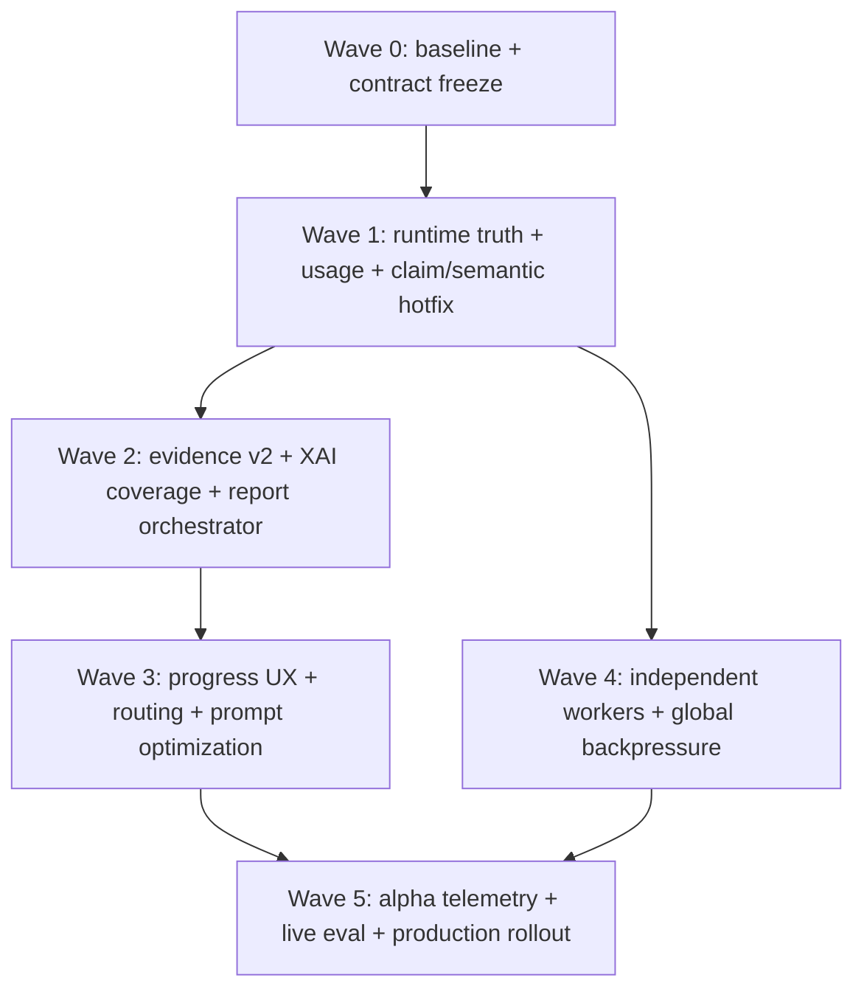
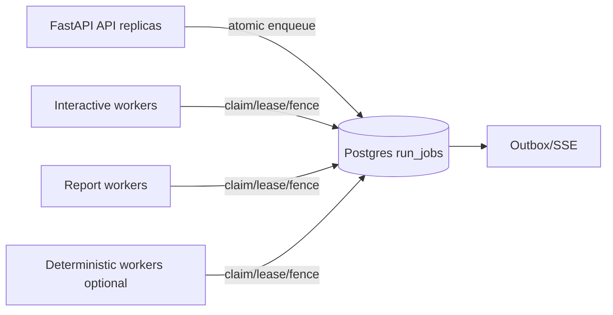

# Kế hoạch triển khai cải thiện toàn bộ agentic flow ToxAgent

**Ngày lập:** 2026-09-13  
**Nguồn chính:** `docs/audit/AGENTIC_FLOW_AUDIT_2026-09-13_VI.md`  
**Phạm vi:** toàn bộ P0/P1/P2 của audit: runtime profile, grounding/validation, usage telemetry, evidence retrieval, report orchestration, XAI semantics, scheduler/worker, routing, prompt/cache, UX progress, compound provider và developer/eval hygiene.

## 1. Kết luận và chiến lược triển khai

Không thực hiện một lần rewrite toàn hệ thống. Nền deterministic, persistence, outbox/SSE, lease/fencing, capability token và immutable scientific observations đang hoạt động tốt; plan này giữ chúng làm substrate.

Thay đổi trung tâm là:

> **OpenCode vẫn là execution shell, nhưng không còn sở hữu scientific workflow. Control plane sở hữu thứ tự công việc, facts, IDs, validation, retry và compilation; model chỉ chọn, diễn giải và tổng hợp trên một contract nhỏ.**

Plan chia thành 6 release wave, 19 PR độc lập và 13 workstream. Tổng effort ước lượng cho phạm vi audit là **100–150 person-days**:

- đội khuyến nghị: 2 backend, 1 frontend, 0,5 platform/QA và SME theo checkpoint;
- thời gian lịch: khoảng **9–12 tuần**, cộng ít nhất một tuần internal alpha trước production;
- một kỹ sư full-stack làm tuần tự: khoảng **20–30 tuần**.

Các con số là estimate để lập capacity, không phải deadline cam kết. Mỗi PR chỉ được merge khi exit gate tương ứng có bằng chứng tự động.

## 2. Quan hệ với các plan đang có

Plan này là **master execution plan cho các finding ngày 13/09**, không thay thế các contract khoa học rộng hơn.

| Tài liệu | Cách sử dụng |
|---|---|
| `AGENTIC_FLOW_AUDIT_2026-09-13_VI.md` | Nguồn finding và baseline đo được; mọi work item phải truy ngược về đây |
| `REPORT_P1_P2_IMPLEMENTATION_PLAN_VI.md` | Contract report v3, report governance và UI nâng cao; triển khai sau correctness gates của WS04/WS05 |
| `REMAINING_IMPLEMENTATION_PLAN_VI.md` | Backlog sản phẩm rộng hơn; K07/K08/K11/K13 được hấp thụ vào worker, UX, evidence và eval trong plan này |
| `SYSTEM_ISSUES_VI.md` | Lịch sử issue đã xử lý; không reopen nếu không có regression mới |
| `new_plan.md` | Product/UX intent; không phải nguồn runtime/scientific truth |

Nếu tài liệu mâu thuẫn, thứ tự thẩm quyền là:

1. Scientific safety invariant và dữ liệu predictor đã persist.
2. Contract/API đang chạy và backward compatibility.
3. Plan này về sequencing và exit gates.
4. Plan chuyên đề về feature bổ sung.
5. Mockup hoặc mô tả UX cũ.

## 3. Mục tiêu, non-goals và nguyên tắc

### 3.1 Mục tiêu

1. Runtime manifest phản ánh đúng agent/profile/step cap thực tế.
2. Không report/answer nào được phát hành nếu tự mâu thuẫn với canonical facts.
3. Usage/cost có thể tổng hợp đúng và dedupe được.
4. Chỉ evidence có relevance decision rõ mới trở thành citable/durable inventory.
5. Report happy path có workflow deterministic, không dùng validator làm planner.
6. Người dùng thấy progress có ý nghĩa mà không phải stream ungrounded prose.
7. Có global/per-tenant backpressure và worker lifecycle độc lập web API.
8. Routing có một nguồn truth ở backend và có eval corpus.
9. Dev/test/eval chạy được từ fresh clone bằng một documented target.
10. SLO được khóa bằng telemetry alpha, không bằng con số tưởng tượng.

### 3.2 Non-goals

- Không thay OpenCode ngay bằng framework khác.
- Không nới grounding/safety để đổi lấy token streaming.
- Không tạo verdict tổng hợp `safe/unsafe` hoặc whole-compound risk score.
- Không đổi model weights, threshold hay benchmark hERG/Tox21 trong epic này.
- Không gọi attribution là cơ chế hóa học.
- Không mutate report/answer/evidence artifact lịch sử.
- Không gộp history/diff/retention của report P2 vào critical path sửa latency/correctness.

### 3.3 Quy tắc kỹ thuật

- Expand/contract schema; reader mới đọc được dữ liệu cũ.
- Server cấp identity và render canonical number/classification.
- Retry theo stage và idempotency key, không replay toàn workflow nếu đã có checkpoint.
- Mọi fallback phải hiện trong artifact/event; không silent fallback agent/model/provider.
- Feature flag chỉ dùng cho rollout, phải có ngày xóa và owner.
- Metrics không mang SMILES, prose, URL, owner/session/run ID ở label.
- Mỗi optimization phải chứng minh không làm giảm grounding/fidelity trên eval.

## 4. Dependency graph và release waves



| Wave | Tuần mục tiêu | Exit outcome |
|---|---:|---|
| 0 | 1 | Baseline/golden fixtures, ADR và feature flags được khóa |
| 1 | 1–2 | Hai P0 đóng; usage không duplicate; first-pass answer tốt hơn |
| 2 | 3–6 | Evidence không còn pollute; report v2 workflow chạy shadow/canary |
| 3 | 5–8 | UX có progress thật; router một nguồn truth; prompt/token giảm |
| 4 | 6–9 | Web/worker tách; quota và graceful drain chạy multi-replica |
| 5 | 9–12+ | Alpha, live eval, fault drills, SLO và rollout production |

Không được bắt đầu feature report P1/P2 mới nếu Wave 1 chưa pass. Có thể làm worker và report song song sau khi contract baseline được khóa.

## 5. Ma trận truy vết finding → workstream

| Finding audit | Workstream xử lý | Release gate |
|---|---|---|
| P0-1 report profile chết | WS01 Runtime truth | G1 |
| P0-2 report semantic contradiction | WS03 + WS05 | G1 và G3 |
| P1-1 usage duplicate | WS02 | G1 |
| P1-2 evidence pollution | WS04 | G2 |
| P1-3 report turn khổng lồ/sai thứ tự | WS05 | G3 |
| P1-4 model tự sinh DB ID | WS03 | G1 |
| P1-5 validator false reject | WS03 | G1/G5 |
| P1-6 XAI special-token mass | WS06 | G2 |
| P1-7 web-owned scheduler/no global cap | WS08 | G4 |
| P1-8 thiếu meaningful progress | WS09 | G3 |
| P1-9 lexical/split router | WS07 | G3 |
| P1-10 session/prompt cache kém | WS10 | G3/G5 |
| P2-1 eval docs drift | WS11 | G1 |
| P2-2 contract test không portable | WS11 | G1 |
| P2-3 dev/test target thiếu | WS11 | G1 |
| P2-4 test noise | WS11 | G1 |
| P2-5 compound decompression | WS04 | G1 |

## 6. Workstream chi tiết

## WS00 — Baseline, ADR và rollout controls

**Ưu tiên:** P0 prerequisite  
**Owner:** Tech lead + QA  
**Effort:** 4–6 person-days  
**Phụ thuộc:** không

### Implementation

1. Chụp baseline versioned từ live audit:
   - representative run fixtures cho analysis, Q&A, evidence, attribution và report;
   - report contradiction `rpt_d595...` thành sanitized golden fixture;
   - OpenCode raw SSE fixture chứa duplicate usage;
   - evidence fixture ethanol/hERG chứa năm false matches;
   - latency/tool/token summary không chứa credential.
2. Viết ADR cho target boundary:
   - OpenCode là runtime shell;
   - server-owned scientific workflow;
   - canonical fact graph và deterministic compiler;
   - separate web/worker topology.
3. Định nghĩa flags có owner và removal condition:
   - runtime profile selector v2;
   - normalized usage v2;
   - answer draft v2;
   - evidence pipeline v2;
   - report orchestrator v2;
   - router v2;
   - external worker mode.
4. Chốt metric dictionary, không khóa alert threshold trước alpha.
5. Lưu trạng thái worktree hiện tại trước khi code; mỗi PR chỉ chạm file thuộc scope, không gom các thay đổi chưa commit của người dùng.

### Deliverables

- `docs/adr/*agentic-workflow-boundary*.md`.
- `backend/control/tests/fixtures/audit_2026_09_13/*`.
- Một baseline manifest JSON có model/profile/tool-schema hash.
- Một rollout matrix ghi default flag theo local/staging/production.

### Exit criteria

- Mỗi P0/P1 có fixture hoặc test case tái hiện.
- Baseline test chạy từ clean copy và hash ổn định.
- Không có raw prompt, secret hay full external payload trong fixture commit.

## WS01 — Runtime profile và effective-step truth

**Ưu tiên:** P0  
**Owner:** Runtime/backend  
**Effort:** 4–6 person-days  
**Phụ thuộc:** WS00

### Quyết định quan trọng

OpenCode đang pin `1.17.11`; không đổi riêng `maxSteps` thành `steps` theo docs mới nếu binary pin chưa hỗ trợ. Triển khai hai nhịp:

1. **Hotfix trên V1 pin:** cài cả `toxagent` và `toxagent-report` bằng field V1 đã contract-test, adapter chọn đúng named agent.
2. **Upgrade có kiểm soát:** pin phiên bản OpenCode mới, recapture OpenAPI/SSE contract, đổi sang `steps`, chạy canary rồi mới xóa compatibility.

### Implementation

1. Thêm `RuntimeProfileSpec`/registry gồm:
   - capability profile;
   - `runtime_agent_name`;
   - requested/effective step cap;
   - instruction/tool schema hashes;
   - supported runtime/version range.
2. Thêm `runtime_agent_name` vào `RuntimeSessionSpec`; không đọc agent mặc định trong `send()`.
3. OpenCode health phải kiểm tra mọi profile enabled; report capability unavailable nếu thiếu `toxagent-report`, không fallback sang `toxagent`.
4. Runtime binding lưu cả requested và effective agent/step cap.
5. Deploy project config có hai agents; deny-all/allow `toxagent_*` giống nhau, khác prompt/profile và cap.
6. Test contract request body `prompt_async` assert đúng `agent` theo intent.
7. Tạo upgrade spike riêng cho current OpenCode `steps`; không gộp runtime upgrade với report workflow PR.

### File/module dự kiến

- `harness/provider.py`
- `harness/gateway.py`
- `harness/adapters/opencode_v1.py`
- `agent_profiles/opencode/*`
- `agent_profiles/report_build/profile.json`
- `config.py`, readiness projection và runtime binding mapping/schema
- `tests/contract/test_opencode_v1_adapter.py`
- `tests/unit/test_opencode_profile.py`

### Tests bắt buộc

- QA intent gửi `agent=toxagent`, report gửi `agent=toxagent-report`.
- Missing report agent làm riêng `build_report` unavailable.
- Runtime manifest bằng effective config live.
- V1 32/64 cap test; upgrade contract test `steps` trước cutover.
- Deny-all permissions không regression.

### Rollout/rollback

- Canary report profile selector trên internal sessions.
- Nếu rollback, disable `build_report` thay vì silent chạy agent chung.
- Không rollback schema columns; old readers bỏ qua field mới.

### Done

- Không còn run nào có requested/effective agent hoặc cap khác nhau mà không có explicit warning.
- Golden report có thể dùng quá 32 nhưng không quá 64 tool steps trên V1 hotfix.

## WS02 — Usage telemetry normalization

**Ưu tiên:** P1 nhưng làm trong Wave 1 vì mọi SLO/cost phụ thuộc nó  
**Owner:** Runtime/backend + platform  
**Effort:** 4–6 person-days  
**Phụ thuộc:** WS00

### Contract đích

`RuntimeUsageEvent` bổ sung:

- `source_event_id` hoặc stable derived hash;
- `source_event_type`;
- `provider_message_id`, `provider_step_id`, `revision` nếu có;
- `semantics: cumulative | delta | unknown`;
- `is_normalized` và raw payload hash;
- unique key provider-specific.

API tách:

- `usage.events`: audit events normalized;
- `usage.summary`: authoritative aggregate có `aggregation_method` và `complete|partial|unknown`.

### Implementation

1. Capture raw V1 variants `step-finish` và `message.updated`.
2. Viết stateful normalizer theo runtime session/message/step.
3. Với OpenCode V1, ưu tiên một canonical cumulative snapshot cho mỗi assistant message revision; bỏ zero-only lifecycle event nếu không mang thông tin mới.
4. DB unique index là lớp dedupe cuối; in-memory dedupe không đủ cho recovery.
5. Old rows gắn `semantics=unknown`, không backfill bằng suy đoán.
6. Summary calculator không bao giờ cộng hai cumulative snapshot.
7. Event/outbox chỉ emit khi một normalized usage fact mới được insert.

### Migration

- Alembic additive columns nullable.
- Backfill `is_normalized=false`, `semantics=unknown` cho lịch sử.
- Tạo partial unique index chỉ cho rows có source identity.
- Sau dual-read window, API mặc định trả summary v2; raw legacy vẫn xem được ở developer surface.

### Tests

- Duplicate cùng event 1/2/3 lần cho cùng output summary.
- Out-of-order revisions chọn revision mới nhất.
- Delta-only provider cộng delta; cumulative provider lấy latest.
- Recovery/reconnect không tăng totals.
- Property test totals không giảm với cumulative revision hợp lệ.
- Live fixture audit từ Q&A/report.

### Done

- Duplicate normalized usage bằng 0.
- Q&A/report live totals khớp provider message state.
- Dashboard không dùng phép sum raw events.

## WS03 — Answer draft v2, server IDs và semantic validation

**Ưu tiên:** P0/P1  
**Owner:** Scientific backend  
**Effort:** 8–12 person-days  
**Phụ thuộc:** WS00; tích hợp WS02 metrics

### Contract đích

Model không sinh deployment-global ID. `GroundedAnswerDraftV2` dùng local reference trong một candidate:

```json
{
  "answer_markdown": "...",
  "claims": [
    {
      "local_ref": "claim_1",
      "kind": "numeric",
      "observation_id": "obs_...",
      "field_path": "predictions.herg.probability_blocker",
      "transform": "round:3"
    }
  ]
}
```

Server resolve source value, render value, cấp `claim_id`, rewrite local refs và compile phần số/classification. Model không gửi `source_value` nếu server đọc được từ observation.

### Implementation

1. Tạo wire schema v2 và adapter v1→internal để reader/test cũ còn chạy.
2. Tách `ClaimResolver` khỏi prose validator:
   - field path ownership;
   - transform allowlist;
   - rendered value deterministic theo locale;
   - server-generated IDs.
3. Giảm tool description, xóa concrete valid claim ID example.
4. Safety validator phân loại:
   - prohibited positive assertion;
   - explicit limitation/negation;
   - quoted external content;
   - recommendation có điều kiện.
5. Thêm negation test tiếng Việt/Anh; không chỉ thêm từng regex ngoại lệ.
6. Cross-field consistency: text/rendered/source value phải xuất phát từ cùng resolved fact.
7. Chạy semantic validator mới ở shadow mode một tuần hoặc trên full eval trước khi hard reject prose class mới.
8. Metrics theo violation code và candidate generation.

### File/module dự kiến

- `domain/answer.py`, `domain/ids.py`
- `validation/wire.py`, `numeric.py`, `coverage.py`, `prohibited_claims.py`
- `application/submit_answer.py`
- `tools/definitions/answer.py`
- answer/report projection TypeScript nếu wire output đổi

### Tests

- Model gửi cùng `local_ref` ở hai run vẫn tạo hai global IDs hợp lệ.
- Concrete example poisoning fixture không còn tồn tại.
- Vietnamese “không phải nguy cơ lâm sàng” không bị safety false reject.
- Positive “an toàn cho người” vẫn hard reject.
- Numeric locale comma/percent/rounding compiler golden.
- Correction attempt và fallback giữ behavior cũ.

### Done

- First-pass acceptance ≥95% trên QA eval; 100% numeric fidelity.
- Model không thể chọn source value hay global ID.
- Không giảm safety hard-gate pass rate.

## WS04 — Compound resolver và evidence pipeline v2

**Ưu tiên:** P1; compound transport hotfix ở Wave 1  
**Owner:** Research backend + scientific QA  
**Effort:** 12–18 person-days  
**Phụ thuộc:** WS00; report integration phụ thuộc WS05 contract

### 4A. Compound provider resiliency

1. Tái hiện PubChem decompression error bằng captured response headers/body metadata.
2. Sửa `Content-Encoding` handling ở adapter; không manual-decompress body httpx đã decode.
3. Bounded retry cho connect/read/5xx, không retry malformed semantic payload.
4. Cache identity theo canonical SMILES/InChIKey + provider/version/TTL.
5. Circuit breaker status phải xuất hiện trong gap/progress.
6. Local RDKit fallback chỉ cung cấp deterministic structure-derived properties được policy cho phép; không tự gắn preferred name/synonym.

### 4B. Evidence lifecycle mới

Tách ba khái niệm:

- **candidate:** search metadata tạm, chưa phải evidence inventory;
- **accepted record:** payload/host/schema hợp lệ;
- **citable assessment:** relevant với analysis + endpoint/task + proposition cụ thể.

Schema đề xuất:

- `evidence_searches`: query plan, compound identity, target, provider, requested limit, TTL.
- `evidence_candidates`: compact metadata, dedupe key, rank features, expires_at.
- `evidence_assessments`: record/analysis/target, `direct|contextual|irrelevant|uncertain`, score bands, reason codes, policy version, assessor.
- `evidence_records` chỉ tạo/promote sau detail read và acceptance; historical records giữ nguyên.

### Retrieval flow

1. Server tạo query plan từ resolved compound names/synonyms/identifier và target ontology.
2. Provider search trả candidate, không emit `evidence.created` cho mọi hit.
3. Deterministic rank/filter: exact compound/identifier, endpoint/assay, organism/context, source quality.
4. Model hoặc service đọc tối đa budget candidates trên threshold.
5. Relevance decision có structured reason; chỉ `direct|contextual` được promote/cite.
6. User limit trở thành hard budget: số candidate read/citable không vượt policy derived từ request.
7. `no relevant evidence` là outcome hợp lệ; không hạ threshold để lấp chỗ trống.

### Backward compatibility

- Report/answer lịch sử tiếp tục resolve evidence ID cũ.
- Old `accepted` không tự động thành citable cho run mới; phải có assessment mới.
- Không xóa năm false-match record audit; đánh dấu assessment `irrelevant` để chứng minh migration.

### Tests

- Ethanol + hERG fixture: năm audit false matches không được promote.
- Direct exact compound/endpoint paper được promote và cite.
- Same compound/different endpoint là contextual hoặc irrelevant theo rule.
- Prompt injection text vẫn chỉ là untrusted data.
- Provider timeout/decompression/circuit-open tạo typed gap.
- Limit 2 không thể tạo hơn 2 reads/promotions nếu policy đặt 2.
- Cross-session ACL/dedupe/TTL cleanup.

### Done

- Durable promoted-evidence precision ≥0,9 trên curated relevance set.
- Search hit không còn đồng nghĩa `accepted/citable` trong UI/tool wording.
- Happy path không có unrelated `evidence.created` events.

## WS05 — Server-owned report workflow và canonical fact graph

**Ưu tiên:** P0/P1, workstream lớn nhất  
**Owner:** Report backend + scientific backend  
**Effort:** 20–30 person-days  
**Phụ thuộc:** WS01, WS03; tích hợp WS04/WS06

### Kiến trúc

Tái sử dụng `ReportBuild`, `BuildStage`, stage transitions, object store và artifact compiler đang có. Điểm thay đổi: `BUILD_REPORT` không đi thẳng vào generic `AgentRuntimeGateway` để model tự gọi toàn bộ workflow.

Tạo `ReportOrchestrator`:

```text
queued
  -> preparing_analysis
  -> assembling_substance
  -> assembling_predictions
  -> generating_explanations (optional)
  -> researching_evidence (optional)
  -> synthesizing              [LLM boundary]
  -> validating
  -> rendering
  -> completed[_with_gaps]
```

Mỗi stage có input/output/checkpoint/idempotency/timeout riêng. `REPORT_STAGE_CHANGED` chỉ emit khi công việc tương ứng thực sự bắt đầu/kết thúc; không walk qua nhiều stage cùng timestamp trước runtime dispatch như hiện tại.

### 5A. Canonical fact graph

1. `ReportFactBundle` được server assemble từ:
   - immutable analysis observation;
   - deterministic endpoint assessments;
   - compound identity/gap;
   - explanation summary + coverage;
   - promoted evidence + relevance assessment;
   - request/policy/provenance.
2. Mỗi fact có `fact_id`, source class, observation/evidence ref và typed value.
3. Numeric, classification, applicability, explanation counts/unmapped mass và mandatory limitations do compiler sở hữu.
4. Model chỉ viết synthesis fields có basis fact refs; không gửi lại raw facts.
5. Dùng `toxagent-report-v3` từ plan report P1/P2 làm schema bump duy nhất, tránh v2.1 rồi v3 ngay sau đó.

### 5B. Stage handlers

1. `PrepareAnalysisStage`: resolve exact snapshot/request target.
2. `AssembleSubstanceStage`: compound resolver + explicit gap.
3. `AssemblePredictionsStage`: canonical fact projector.
4. `GenerateExplanationsStage`: ensure all required packages trước synthesis; bounded parallelism, checkpoint từng target.
5. `ResearchEvidenceStage`: gọi evidence v2 với server query/budget; có thể skip thật.
6. `SynthesizeStage`: một narrow runtime profile chỉ có `submit_report_synthesis`; không expose tools workflow đã hoàn tất.
7. `ValidateStage`: schema, basis, semantic cross-section và limitation predicates.
8. `RenderStage`: deterministic v3 compiler/renderers.

### 5C. Semantic consistency

Compiler tạo hoặc khóa các đoạn lặp facts:

- executive endpoint result;
- explanation contributor/unmapped summary;
- evidence search scope;
- applicability limitation;
- references/gaps.

Validator thêm invariants:

- contributor counts và unmapped status giống ở mọi section;
- `include_external_evidence=false` không được dùng limitation “search đã phủ provider”;
- no-search, zero-result, provider-failed và insufficient là bốn trạng thái khác nhau;
- mọi conclusion/recommendation basis refs resolve;
- mọi selected endpoint xuất hiện đúng một lần hoặc có gap.

### 5D. Retry, recovery và cancellation

- Stage checkpoint lưu `schema_version`, attempt, started/completed timestamps, output refs/hash.
- Recovery chạy stage chưa hoàn tất; không recompute explanation/evidence đã checkpoint.
- Conflict dùng optimistic version nhưng orchestrator reload/merge deterministic; model không tự xử lý DB conflict.
- Cancel check trước/sau external call và giữa stage; provider call accepted vẫn đánh `potentially_billed`.
- Deadline theo stage và tổng build; default một giờ giữ tạm cho compatibility nhưng target deadline giảm sau alpha.

### File/module dự kiến

- mới: `application/report_orchestrator.py`, `application/report_stages/*`
- `domain/report.py`, `report/compiler.py`, `report/renderers.py`
- `application/submit_report_draft.py` chuyển thành synthesis submit/compatibility path
- `harness/gateway.py` bỏ report workflow ownership
- `tools/definitions/report.py` thu nhỏ surface
- `validation/report_validator.py`, `validation/report_wire.py`
- report repositories/schema/migrations nếu checkpoint JSON hiện tại không đủ

### Test pyramid

- Unit từng stage + transition/property tests.
- Contract `ReportFactBundle`/synthesis/artifact v3.
- Golden contradiction artifact phải hard fail hoặc compiler sửa deterministically.
- Integration recovery tại từng boundary.
- E2E no-evidence, provider-failure, partial explanation, cancel, version conflict.
- Renderer parity Markdown/HTML/PDF/UI.
- Live minimal hERG benchmark.

### Rollout

1. Shadow assemble fact bundle bên cạnh old report, không gọi model lần hai.
2. So sánh bundle với old artifact trên fixtures.
3. Internal flag chạy orchestrator v2.
4. 10% canary build mới; existing in-flight build đi old path đến terminal.
5. 50% rồi 100% nếu G3 pass.
6. Giữ old reader v1/v2; xóa old writer sau hai release và zero fallback 14 ngày.

### Done

- Audit contradiction fixture không thể phát hành.
- Minimal report không có tool failure/conflict ở happy path.
- Initial input ≤8k token và p50 ≤60 s trong alpha target.
- Stage events phản ánh công việc thật.
- Recovery không lặp provider/scientific artifact đã checkpoint.

## WS06 — XAI coverage semantics

**Ưu tiên:** P1  
**Owner:** Scientific ML + backend/frontend  
**Effort:** 4–6 person-days  
**Phụ thuộc:** WS00; tích hợp WS05

### Implementation

1. Từ attribution payload, derive:
   - `mapped_importance_fraction`;
   - `special_token_importance_fraction`;
   - `unmapped_importance`;
   - atom ranking theo absolute total;
   - optional `mapped_only_relative_importance` cho presentation.
2. Không xóa/renormalize special tokens khỏi provenance.
3. Explanation contract gắn `coverage_status: high|limited|low` theo policy version; threshold do SME khóa.
4. UI figure/legend luôn hiển thị mapped/unmapped/special-token coverage.
5. Report compiler dùng exact same summary object; model không tự đếm contributor.
6. Wording bắt buộc: attribution là model sensitivity, không phải causal mechanism.

### Tests/Done

- CCO fixture hiển thị special-token fraction ~35,84% và ba negative atom contributors.
- Sum accounting trong tolerance; zero/partial/misaligned cases.
- Accessibility: coverage không chỉ truyền bằng màu.
- Không có section nào gọi special token là atom/chemical feature.

## WS07 — Backend-authoritative intent routing

**Ưu tiên:** P1  
**Owner:** Backend + frontend/product  
**Effort:** 6–9 person-days  
**Phụ thuộc:** WS00; có thể song song WS05

### Implementation

1. Tạo `IntentDecision` contract: intent, confidence band, reason codes, required context, clarification options, router version.
2. Thay substring rules bằng token/phrase boundary và explicit precedence.
3. Backend xử lý molecule extraction/validation; frontend heuristic chỉ là UX hint, không là truth.
4. `intent_hint` explicit từ button/action được tôn trọng sau capability/policy validation.
5. Ambiguous free text trả clarification structured; không gọi LLM classifier trong request path ở phiên đầu.
6. Xây corpus Việt/Anh gồm negation, mixed molecule+question, out-of-scope và active/no-active-analysis.
7. Nếu rule router vẫn thiếu, thử classifier ở shadow mode; chỉ cutover khi confusion matrix tốt hơn mà latency/cost chấp nhận được.
8. Ghi router version/reason vào run configuration snapshot.

### Tests/Done

- Không substring false positive trên adversarial corpus.
- Frontend/backend không thể chọn hai intent khác nhau cho cùng explicit action.
- 100% golden intents đúng; ambiguous cases phải clarify, không đoán.
- Router p95 <20 ms nếu rule-only.

## WS08 — Independent workers và global backpressure

**Ưu tiên:** P1 production scale  
**Owner:** Backend platform/DevOps  
**Effort:** 12–18 person-days  
**Phụ thuộc:** WS00/WS01; có thể song song report sau interfaces ổn định

### Target topology



### Implementation

1. Tách composition root dùng chung khỏi FastAPI lifespan.
2. Thêm worker entrypoint và queue class `interactive|report|deterministic` vào envelope/job.
3. API transaction chỉ create message/run/job; không `create_task` khi external-worker flag bật.
4. Worker claim có lease/fencing hiện tại; polling bounded trước, `LISTEN/NOTIFY` có thể thêm sau mà vẫn giữ polling fallback.
5. Global/per-tenant/provider/profile concurrency slots lưu ở DB hoặc atomic advisory/lease table, không process-local semaphore.
6. Admission/queue projection trả queue class, position estimate và `retry_after` khi hard quota.
7. Graceful shutdown:
   - stop claiming;
   - tiếp tục renew lease cho active work trong grace window;
   - cancel/mark recovery theo policy nếu grace hết;
   - không hủy tất cả ngay khi web replica shutdown.
8. Recovery của non-resumable OpenCode binding:
   - mark usage/billing unknown;
   - bounded one recovery generation;
   - reuse committed tool outputs/checkpoints;
   - unique answer/report commit ngăn double product result.
9. Separate autoscaling policy cho interactive/report workers.

### Schema/migration

- Add `queue_name`, `priority`, `available_at`, optional `last_error_code` vào `run_jobs`.
- Add slot/lease table nếu dùng DB semaphore.
- Old jobs default queue theo intent khi reader load.
- Expand first; deploy dual-mode readers; switch producer; drain old web workers; contract sau.

### Tests

- 2 API + 2 worker race chỉ một owner.
- 100 sessions không vượt global/provider cap.
- Report queue không starve Q&A queue.
- Kill -9 sau enqueue/runtime accept/tool commit/final commit.
- Cancel qua replica khác terminal đúng.
- Rolling deploy không double provider turn ngoài documented recovery case.
- Load/soak và DB connection budget.

### Done

- Web replica restart không trực tiếp cancel agent run.
- Global and tenant caps enforce trên nhiều worker.
- Queue time/tool time/model time tách riêng trong telemetry.

## WS09 — Meaningful progress UX

**Ưu tiên:** P1 user experience  
**Owner:** Frontend + backend presentation  
**Effort:** 8–12 person-days  
**Phụ thuộc:** WS05 stage truth; một phần activity Q&A có thể làm sớm

### Backend event contract

`activity.progress`/`report.stage_changed` payload chuẩn:

- semantic stage code;
- localized presentation key, không phải prose do model viết;
- current/total khi biết;
- elapsed milliseconds;
- attempt/retry;
- budget remaining band;
- blocking provider/capability status;
- developer details ref riêng.

### Frontend implementation

1. Một compact presence trong transcript; không tạo RunBlock cho mọi tool.
2. Timeline mở rộng cho report: stage completed/current/pending, gap/retry.
3. Semantic labels theo intent/tool target; aggregate repeated reads.
4. Cancel button phản ánh `requested`, `worker_cancelled`, relayed và potentially billed.
5. SSE reconnect/gap reconcile giữ stage monotonic và dedupe event ID.
6. Screen reader live region throttled; reduced motion; mobile/long-label states.
7. Không stream raw model delta vào authoritative transcript.

### Tests/Done

- Browser tests queued→stage→validate→render→complete, reconnect/out-of-order/duplicate.
- Provider retry và completed-with-gaps nhìn thấy được.
- Không có số khoa học unvalidated trong presence.
- Internal usability test: người dùng xác định được hệ thống đang làm gì và có bị kẹt không.

## WS10 — Prompt, tool surface và cache optimization

**Ưu tiên:** P1 performance/cost  
**Owner:** Runtime/backend  
**Effort:** 5–8 person-days  
**Phụ thuộc:** WS01/WS03; report optimization phụ thuộc WS05

### Implementation

1. Tách prompt thành:
   - static versioned policy prefix;
   - stable tool schemas/order;
   - dynamic run facts ở suffix;
   - recent history append-only.
2. Đo token theo component: system profile, tool schema, history, facts, outputs.
3. Thu gọn answer/report tool descriptions sau khi server nhận ownership IDs/rendering/workflow.
4. Report profile bỏ các skill hướng dẫn công việc orchestrator đã làm; synthesis profile chỉ còn source hierarchy, wording và small schema.
5. Giữ definitions/order ổn định giữa turns khi runtime hỗ trợ allowed tools; không thay schema vô cớ.
6. Đo provider cache read/write và cache-hit ratio theo profile hash.
7. Runtime session reuse chỉ là experiment sau khi có metrics:
   - TTL ngắn;
   - same owner/session/profile/tool schema;
   - capability token vẫn rotate theo run;
   - abort/close/revoke test;
   - không cutover nếu isolation không chứng minh được.
8. So sánh OpenCode shell với direct provider adapter bằng paired eval sau Wave 4; framework migration chỉ mở nếu data cho thấy lợi ích đáng kể.

### Done

- QA initial input target ≤2,5k token ở representative fixture.
- Minimal report cumulative input target ≤8k sau WS05.
- Tool/schema hash ổn định với cùng profile version.
- Grounding và hard gates không regression.

## WS11 — Dev/test/eval reproducibility và docs

**Ưu tiên:** P2 nhưng cần đóng sớm  
**Owner:** QA/platform  
**Effort:** 5–8 person-days  
**Phụ thuộc:** WS00

### Implementation

1. Sửa `evals/README.md` theo `RemoteHTTPDriver` hiện có.
2. Sửa predictor contract test không phụ thuộc `parents[5]`; monorepo regeneration skip có reason nếu repo source không tồn tại.
3. Thêm Docker multi-stage `test` hoặc compose test profile gồm pytest, aiosqlite, eval dependencies và source tests.
4. Một command fresh clone chạy:
   - backend unit/contract/integration non-live;
   - frontend test/typecheck/build;
   - scripted eval trials 3.
5. Mock canvas ở frontend test setup; unexpected `console.error` fail test.
6. Nâng JWT fixture secret; migrate MCP deprecated client.
7. CI artifact lưu junit, warning summary, eval manifest và bundle size.
8. Không đưa dev dependencies/tests vào production runtime image.

### Done

- Fresh clone documented command pass mà không dùng workstation `.venv` có sẵn.
- Scripted eval 3 trials chạy trong test image.
- Zero unexpected warning/stderr; known warnings có allow-list và expiry.

## WS12 — Observability, eval và scientific review

**Ưu tiên:** production gate  
**Owner:** Platform + QA + SME  
**Effort:** 8–12 person-days, chưa tính tuần alpha  
**Phụ thuộc:** WS02 và tất cả workstream cần rollout

### Metrics

- run queue/end-to-end/model/tool/validation/render duration;
- run outcome/failure/recovery/cancel settlement;
- first-pass acceptance và violation code;
- unique input/output/reasoning/cache tokens và usage completeness;
- tool calls/errors/retries theo low-cardinality tool/profile;
- report stage duration/gaps/semantic validation failures;
- evidence candidates/read/promoted/rejected và relevance outcome;
- XAI coverage bands;
- worker leases/fencing/adoption/slot utilization;
- SSE reconnect/gap reconciliation.

### Eval suites

1. Deterministic CI suite mỗi PR.
2. Scripted agent/evidence/report fixtures mỗi PR.
3. Live smoke 5–10 representative tasks khi runtime/profile thay đổi.
4. Full live eval nightly/weekly theo budget, pinned model/profile hashes.
5. Scientific SME set cho semantic contradiction, recommendation scope và evidence relevance.
6. Fault drills trước production: OpenCode restart, provider timeout, DB failover, worker kill, lease takeover, object store failure, cancel cross-replica.

### Dashboard/alerts

- Dashboard interactive vs report tách riêng.
- Alert threshold chỉ khóa sau ≥7 ngày internal alpha.
- Log có trace/run refs dưới access control; metric labels không có high-cardinality ID.
- Mỗi alert link runbook và rollback flag.

### Done

- G5 acceptance report có baseline/after delta và raw manifest hashes.
- SME sign-off semantic fixtures.
- Không production rollout nếu usage summary còn unknown quá ngưỡng được chấp nhận.

## 7. Trình tự 19 PR

| PR | Nội dung | Effort | Phụ thuộc | Merge gate |
|---|---|---:|---|---|
| PR-00 | Baseline fixtures, ADR, metric/flag catalog | 4–6d | — | Fixtures tái hiện findings |
| PR-01 | V1 runtime profile selector + effective manifest | 3–4d | PR-00 | Report chọn đúng named agent |
| PR-02 | Usage schema + OpenCode dedupe/summary v2 | 4–6d | PR-00 | Duplicate totals = 0 |
| PR-03 | Answer draft v2 + server-generated IDs | 4–6d | PR-00 | Example poisoning removed |
| PR-04 | Semantic safety/negation + answer compiler | 4–6d | PR-03 | First-pass/hard gates pass |
| PR-05 | PubChem decompression/retry/cache | 2–4d | PR-00 | CCO identity live/gap typed |
| PR-06 | Evidence candidate/assessment migrations/domain | 4–6d | PR-00 | Old artifact reader pass |
| PR-07 | Evidence v2 tools/ranker/budget/promotion | 6–9d | PR-05/06 | Ethanol false matches blocked |
| PR-08 | XAI coverage contract/compiler/UI | 4–6d | PR-00 | 35,84% fixture rendered correctly |
| PR-09 | ReportOrchestrator skeleton + true stage events | 5–7d | PR-01/03 | Stage recovery unit pass |
| PR-10 | Deterministic report stage handlers/fact bundle | 6–9d | PR-05/07/08/09 | Facts/checkpoints complete |
| PR-11 | Narrow synthesis schema + v3 compiler/semantic validator | 7–10d | PR-04/10 | Contradiction fixture blocked |
| PR-12 | Report renderers/UI compatibility + progress timeline | 6–9d | PR-11 | v1/v2/v3 + browser pass |
| PR-13 | Backend intent decision/router v2 + frontend cleanup | 6–9d | PR-00 | Routing corpus pass |
| PR-14 | Worker composition root/entrypoint + queue classes | 6–9d | PR-01/09 | API/worker two-process E2E |
| PR-15 | Global quotas, graceful drain, recovery drills | 6–9d | PR-14 | Multi-replica/load gates |
| PR-16 | Prompt/tool/schema optimization + cache instrumentation | 5–8d | PR-04/11 | Token targets measured |
| PR-17 | Test image, scripted eval, docs/warning cleanup | 5–8d | PR-00 | Fresh clone gate |
| PR-18 | Metrics/dashboard/live eval/alpha rollout | 8–12d | tất cả | G5 production decision |

`d` là person-day. PR-02, PR-05, PR-08, PR-13 và PR-17 có thể làm song song. PR-09→11 là critical path khoa học; PR-14→15 là critical path production topology.

## 8. Team allocation đề xuất

| Lane | Trách nhiệm chính | PR |
|---|---|---|
| Backend Runtime A | OpenCode, usage, prompts/cache | 01, 02, 16 |
| Backend Scientific B | answer validator, evidence, XAI | 03, 04, 06, 07, 08 |
| Backend Report/Platform A+B | orchestrator, workers | 09, 10, 11, 14, 15 |
| Frontend | progress, report compatibility, router UX | 08, 12, 13 |
| QA/Platform | fixtures, test image, live eval, dashboards | 00, 17, 18 |
| SME toxicology | relevance corpus, wording/semantic gates | checkpoint PR-04, 07, 11, 18 |

Nếu chỉ có hai kỹ sư, ưu tiên một lane runtime/platform và một lane scientific/report; frontend progress bắt đầu sau PR-09.

## 9. Database và compatibility plan

### Migration sequence

1. **M1 usage:** nullable source identity/semantics + partial unique index.
2. **M2 evidence:** search/candidate/assessment tables và TTL indexes.
3. **M3 report:** typed checkpoint version hoặc stage-attempt table nếu `stage_state` JSON không đủ query/locking.
4. **M4 jobs:** queue/priority/available_at và global slot leases.
5. **M5 artifact v3:** không nhất thiết thêm relational column nếu JSON artifact đã versioned; repository/index chỉ thêm khi query cần.

### Compatibility rules

- API readers nhận report v1/v2/v3; writer mới chỉ bật sau canary.
- Usage legacy hiển thị `aggregation_method=unknown`, không tự tính tổng.
- Evidence lịch sử không bị xóa/đổi hash; run mới cần relevance assessment.
- Old jobs thiếu queue được derive từ intent.
- In-flight old report hoàn tất bằng old path; không migrate giữa workflow.
- Frontend deploy trước hoặc đồng thời backend khi thêm union/event type; unknown event vẫn ignored safely.

### Migration tests

- Empty DB → head.
- Current production-like snapshot → head.
- Old binary read trong expand window.
- New binary read old artifacts/jobs/usage.
- Migration lock và rollback binary rehearsal; schema migration forward-only.

## 10. Test strategy tổng thể

| Layer | Bắt buộc |
|---|---|
| Unit | routing, usage normalization, fact projection, relevance, limitation predicates, XAI coverage, stage transitions |
| Contract | OpenCode request/SSE, MCP tool schemas, report synthesis v3, API TypeScript/Pydantic parity |
| Integration | Postgres uniqueness/leases, evidence lifecycle, report checkpoints, outbox/SSE, old artifact readers |
| E2E scripted | happy/failure/recovery/cancel cho QA, evidence, report |
| E2E live | representative pinned-model tasks, no full suite mỗi PR |
| Browser | progress/reconnect/report v1-v3/accessibility/cancel |
| Load | global quota, queue fairness, DB pool, SSE fan-out |
| Fault | kill worker/runtime/provider/DB/object store ở từng commit boundary |
| Scientific | numeric fidelity, no safety verdict, evidence relevance, cross-section consistency, attribution wording |

### Golden cases tối thiểu

1. CCO hERG low score, no evidence, explanation with high special-token mass.
2. Toxic signal + direct supporting literature.
3. Prediction/evidence contradiction.
4. Same compound but wrong endpoint evidence.
5. Provider unavailable vs search zero result vs search disabled.
6. Vietnamese negated clinical-risk limitation.
7. Multiple Tox21 tasks with partial explanation.
8. Runtime reaches step cap before submit.
9. Cancel before/after provider acceptance.
10. Worker death after tool commit and before final commit.

## 11. Release gates

### G0 — Baseline reproducible

- Clean test target pass: backend, frontend, scripted eval.
- Audit fixtures committed và sanitized.
- No unexpected warning/stderr.

### G1 — Correctness hotfix complete

- Correct runtime agent/effective cap.
- Report contradiction golden bị chặn.
- Usage dedupe exact.
- Server-generated claim IDs.
- PubChem failure typed/retried.
- Backend ≥1.019 pass và frontend ≥155 pass, không regression test count vô lý.

### G2 — Scientific retrieval/XAI quality

- Evidence precision ≥0,9 trên curated set.
- User budget enforced.
- XAI coverage/unmapped/special-token visible và consistent.
- SME sign-off relevance and wording fixtures.

### G3 — Report/UX performance

- Minimal report no happy-path tool error/conflict.
- 0 semantic contradiction hard gate.
- p50 report ≤60 s, p95 ≤120 s trong alpha hardware/model.
- cumulative input ≤8k target hoặc có accepted exception kèm breakdown.
- true stage events và reconnect browser tests pass.

### G4 — Production execution topology

- Independent worker multi-replica tests pass.
- Global/tenant/provider quotas work under load.
- Rolling deploy/cancel/recovery drills không double commit.
- Restore/migration and DB pool checks pass.

### G5 — Production acceptance

- ≥7 ngày internal alpha telemetry.
- Q&A p50 ≤15 s, p95 ≤30 s target hoặc product-approved measured revision.
- First-pass QA validation ≥95%.
- Usage completeness/duplicate/evidence/report consistency goals pass.
- Full live eval pass rate, cost và hashes được lưu.
- Rollback rehearsal và runbooks sign-off.

## 12. KPI và dashboard contract

| KPI | Baseline | Gate target |
|---|---:|---:|
| Deterministic analysis | ~176 ms | không chậm >20% |
| Q&A end-to-end | 46,6–54,1 s | p50 ≤15 s; p95 ≤30 s |
| Minimal report | 155,5 s | p50 ≤60 s; p95 ≤120 s |
| Minimal report cumulative input | 28.408 | ≤8.000 |
| First-pass QA acceptance | 0% ở sample audit | ≥95% eval |
| Duplicate normalized usage | thường ~3 copies/snapshot | 0 |
| Semantic contradiction | 2 trong report mẫu | 0 |
| Promoted evidence precision | 0/5 ở sample audit | ≥0,9 |
| Happy-path report tool failures | ≥3 | 0 |
| Queue/global concurrency | chưa đo/chưa cap | 100% enforce |
| Cancel settlement | terminal ~10,4 s từ start mẫu | p95 ≤5 s từ cancel request sau worker split |

Latency target phải gắn model/runtime/hardware/profile hash. Nếu model provider variance làm target không ổn định, báo distribution và queue/model/tool breakdown thay vì sửa số để pass.

## 13. Rollout và rollback runbook

### Rollout order

1. Deploy additive migrations.
2. Deploy readers/normalizers hiểu old+new nhưng writer flags off.
3. Enable shadow metrics/fact/evidence assessment.
4. Enable internal accounts.
5. Canary 10% new runs theo deterministic cohort key.
6. So sánh quality/cost/latency và inspect all hard-gate failures.
7. Tăng 50%, rồi 100%.
8. Giữ compatibility ít nhất hai release/14 ngày zero fallback.
9. Xóa flag/old writer bằng PR riêng.

### Rollback principles

- Rollback bằng flag/binary, không downgrade schema.
- Runtime profile lỗi: disable capability thay vì fallback agent khác.
- Report orchestrator: only new builds đổi path; in-flight build giữ owner/version.
- Worker rollback: stop new claims, drain, chuyển producer mode sau khi không còn lease active.
- Evidence v2 rollback không làm candidate thành citable tự động.
- Usage v2 rollback giữ rows mới; API có thể trở lại raw view nhưng không cộng sai.

### Stop-the-line conditions

- Numeric/classification fidelity regression.
- Cross-session data/capability leak.
- Duplicate final answer/report hoặc provider replay không bounded.
- Semantic contradiction hard gate.
- Usage totals giảm/nhảy do out-of-order event.
- Evidence wrong-compound/wrong-endpoint được cite.
- Cancellation trả terminal nhưng worker còn commit sau đó.

## 14. Risk register

| Risk | Mức | Mitigation |
|---|---|---|
| OpenCode V1/new docs khác contract | High | Hotfix V1 riêng; upgrade pin/contract/canary riêng |
| Report v3 scope creep | High | Correctness fields trước; history/diff/retention ngoài critical path |
| Validator mới false reject | High | Shadow mode, violation telemetry, curated bilingual eval |
| Worker takeover gây double billing | High | Fencing, recovery generation cap, reuse checkpoint, potentially-billed |
| Evidence ranker loại nguồn hữu ích | Medium | `uncertain` bucket, SME corpus, no silent threshold lowering |
| Prompt optimization làm mất instruction | Medium | Paired hard-gate eval và prompt hash/version |
| Migration với dirty workspace | High | Baseline snapshot, scoped PR, không gom user changes |
| KPI quá phụ thuộc provider latency | Medium | Breakdown + percentiles + pinned manifest |
| Quá nhiều feature flags | Medium | Owner/removal gate và maximum two-release lifetime |
| Runtime session reuse phá isolation | High | Experiment-only, strict identity key, không cutover nếu chưa chứng minh |

## 15. Definition of Done toàn chương trình

Chương trình chỉ hoàn tất khi:

1. Mọi finding P0/P1/P2 trong audit có PR, test và bằng chứng release gate hoặc explicit product deferral.
2. Runtime manifest khớp effective agent/profile/cap live.
3. Report contradiction fixture không thể được phát hành.
4. Usage summary đúng dưới duplicate/out-of-order/recovery.
5. Evidence candidate không pollute durable citable inventory.
6. Report workflow chạy stage-by-stage do server kiểm soát, recovery không làm lại completed stage.
7. Model không sinh global ID, exact scientific value hay mandatory limitation selection.
8. XAI coverage bao gồm special-token/unmapped mass ở API, report và UI.
9. Web API và agent worker tách, global quotas và graceful drain đã drill.
10. Router backend là truth và bilingual corpus pass.
11. Người dùng thấy meaningful progress nhưng transcript vẫn chỉ nhận validated output.
12. Fresh-clone test/eval target pass, không warning noise không kiểm soát.
13. Internal alpha ≥7 ngày, KPI/SME/fault/migration/rollback gates đều sign-off.
14. Old paths/flags có removal issue và deadline; không để compatibility trở thành kiến trúc vĩnh viễn.

## 16. Việc cần bắt đầu ngay

Thứ tự thực thi ngày đầu:

1. Khóa worktree/baseline và tạo audit fixtures (PR-00).
2. Mở song song PR-01 runtime profile, PR-02 usage dedupe, PR-03 server IDs và PR-05 PubChem transport.
3. SME review hai fixture: report contradiction và ethanol/hERG relevance.
4. Khi PR-03 merge, làm PR-04 semantic validator.
5. Khi PR-01/03 ổn định, bắt đầu ReportOrchestrator PR-09; không chờ toàn bộ evidence v2 mới dựng skeleton.
6. Chỉ sau G1 mới cho feature report v3/P1 khác chen vào critical path.
