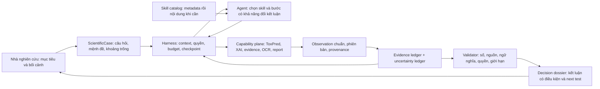

# Tái định hình ToxAgent: từ giao diện gọi mô hình thành cộng sự điều tra khoa học

> **Ngày:** 25/09/2026 · **Đọc workspace tại commit:** `ad66022`  
> **Loại tài liệu:** đề xuất nghiên cứu và thiết kế; chưa phải kết quả benchmark mới hay cam kết hiệu năng.  
> **Thực thi:** backlog và trạng thái tại [`backlog/SCIENTIFIC_INVESTIGATION_BACKLOG.md`](backlog/SCIENTIFIC_INVESTIGATION_BACKLOG.md).  
> **Bốn câu hỏi:** Agent phải có năng lực gì vượt predictor? Kiến trúc nào tạo ra năng lực đó? Có thể mở rộng bằng skills/harness tới đâu thay vì viết workflow riêng? Đánh giá bằng chuẩn nghiên cứu nào?

## 1. Luận điểm và quyết định đề xuất

**Định nghĩa lại sản phẩm:** ToxAgent là một *scientific investigation copilot* cho nghiên cứu độc tính và hoạt tính phân tử. Một lượt làm việc của nó không chỉ trả lời “mô hình dự đoán bao nhiêu”, mà phải xác định câu hỏi nghiên cứu, chọn phép kiểm tra cần thiết, đối chiếu dự đoán với chứng cứ độc lập, làm rõ điểm mâu thuẫn, nêu điều chưa biết và đề xuất thí nghiệm có khả năng thay đổi quyết định. Người nghiên cứu giữ quyền kết luận cuối cùng.

**Định nghĩa lại “predictive + explainable”:**

- **Predictive** có hai tầng. Tầng số học là dự đoán từng endpoint của ToxPred, có model ID, threshold, phiên bản và phạm vi áp dụng. Tầng quyết định là dự báo có điều kiện về *điều gì cần kiểm chứng tiếp và kết quả nào sẽ làm thay đổi nhận định*. Agent không được biến suy luận ngôn ngữ thành một xác suất độc tính mới khi không có mô hình/hiệu chuẩn tương ứng.
- **Explainable** có ba đối tượng khác nhau: (1) vì sao mô hình cho ra điểm số theo phương pháp attribution; (2) chứng cứ thực nghiệm/tài liệu nào ủng hộ hoặc phản bác một nhận định khoa học; (3) vì sao agent chọn hành động và dừng ở kết luận hiện tại. Heatmap của mô hình chỉ trả lời đối tượng (1), và ngay cả đối tượng đó cũng phải qua kiểm định fidelity. Không trộn ba tầng vào một đoạn văn “cơ chế gây độc”.
- **Agentic** được đo bằng khả năng đổi hướng điều tra khi thông tin mới xuất hiện, biết hỏi lại, biết tìm chứng cứ phản biện, biết dừng và biết nói điều gì sẽ làm mình đổi ý. Số tool call, số vai trò agent hoặc độ dài report không phải thước đo năng lực này.

**Khuyến nghị kiến trúc:** giữ một runtime điều tra có quyền chọn hành động trong tập capability đóng; bổ sung một `ScientificCase`/“hồ sơ điều tra” bền vững làm đối tượng sản phẩm trung tâm. Xây **harness mỏng, ổn định** để quản lý quyền, trạng thái, context và kiểm chứng; đưa phương pháp nghiên cứu thay đổi thường xuyên vào **skills được chọn/nạp theo nhu cầu**, thay vì mã hóa từng đường điều tra thành workflow. Server giữ dữ liệu chuẩn; model chọn giả thuyết, skill và bước kế tiếp. Report là một cách xuất hồ sơ.

**Khuyến nghị đánh giá:** bắt đầu bằng benchmark ngoài phù hợp năng lực: AstaBench/LitQA2 và BioASQ cho nghiên cứu tài liệu; SciFact cho xác minh claim; TDC/MoleculeNet/MoleculeACE cho predictor; bài toán XAI phân tử công bố để kiểm tra explainer. Chạy **giao thức gốc** khi muốn so sánh với cộng đồng. Mọi phiên bản chuyển giao sang ToxAgent phải mang nhãn “adapted/domain transfer” và không được báo như điểm leaderboard gốc. TAB-Suite tiếp tục làm regression sản phẩm, không đóng vai benchmark độc lập duy nhất.

## 2. Chẩn đoán workspace: khoảng cách giữa code và năng lực nghiên cứu

Tôi đọc đường chạy hiện tại, thay vì suy từ tên thư mục hoặc các plan cũ:

| Bằng chứng trong workspace | Ý nghĩa đối với ba vấn đề |
|---|---|
| [`harness/gateway.py`](../../backend/control/src/toxagent/harness/gateway/) giao reasoning loop cho OpenCode/DSH; control plane sở hữu session, tool, observation, validated answer. | Nền tảng tool-use có thật; không cần viết lại toàn bộ runtime. Nhưng đối tượng mà agent đang tối ưu vẫn là **một câu trả lời được accept**, chưa phải một cuộc điều tra khoa học có thể tiếp nối. |
| [`domain/decision_state.py`](../../backend/control/src/toxagent/domain/decision_state.py) đã lưu goal, proposition, refs, coverage và stop reason; [`record_decision_plan`](../../backend/control/src/toxagent/tools/definitions/decision_plan.py) cho model đề xuất plan nhưng flag mặc định tắt. | Đây là mầm của hồ sơ điều tra, không phải khoảng trắng hoàn toàn. Tuy nhiên coverage hiện được tính từ quan hệ do **chính đáp án được accept** ghi ra; nó chứng minh có ref, chưa chứng minh claim đúng, nguồn đủ, hoặc phản chứng đã được tìm. |
| [`harness/context.py`](../../backend/control/src/toxagent/harness/context.py) hướng dẫn model khi nào tìm evidence, cách giới hạn claim và submit answer. | Phần “chiến lược” hiện nằm nhiều trong prompt. Cần biến mục tiêu, câu hỏi mở, chứng cứ, mức bất định và lý do dừng thành sản phẩm hiển thị và chấm được. |
| [`agent/kernel.py`](../../backend/control/src/toxagent/superseded/kernel.py) tự ghi `SUPERSEDED`, không nằm trên live path. | Không hồi sinh một kernel thứ hai vì tên nghe “agentic” hơn. Tận dụng mô hình case/plan hữu ích, đưa vào đường chạy thực, tránh hai nguồn sự thật. |
| [`flags.py`](../../backend/control/src/toxagent/platform/flags.py) để `decision_state_plan_tool`, `evidence_pipeline_v2`, `report_orchestrator_v2` mặc định tắt. | Một capability đã có code không đồng nghĩa người dùng mặc định nhận được nó. Thiết kế mới cần chốt theo *effective product* và có paired evaluation trước khi bật. |
| [`evals/runner.py`](../../backend/control/evals/runner.py) và báo cáo [TAB-Suite live 17/09](../results/tab-suite-live-2026-09-17.md): 63 task hiện có, nhiều task live bị skip, semantic/SME chưa chấm, baseline pass^3 = 22/31 trong tập cùng được grade; có `infra_error` và lỗi safety. | Điểm hiện tại nói nhiều về contract, reliability và một ít hành vi agent. Nó chưa chứng minh năng lực tổng hợp khoa học hay tính đúng của citation. Không lấy tỷ lệ pass đó làm “chất lượng khoa học” của ToxAgent. |
| [`semantic.py`](../../backend/control/evals/graders/semantic.py) có rubric và giao diện judge, nhưng chỉ gate sau khi hiệu chỉnh bằng SME. | Kết cấu đã có; nút thắt thật là bộ nhãn chuyên gia và kiểm tra claim–evidence, không phải thêm tên rubric. |

### Sửa một nhận thức rất quan trọng về GNN

Theo [manifest model đang serve](../../backend/predictor/registry/models/herg-tox21-chemberta-v1.yaml), hERG và Tox21 hiện dựa trên **ChemBERTa**. API giải thích dùng gradient theo token rồi chiếu sang nguyên tử/bond trong [`toxpred/application/explain.py`](../../backend/predictor/src/toxpred/application/explain.py). [SMILESGNN ClinTox](../../backend/predictor/registry/models/clintox-smilesgnn-v1.yaml) đang **bị chặn** vì thiếu tokenizer có định danh được kiểm chứng. GNN/GNNExplainer trong research legacy không được mặc nhiên gọi là capability production. Tài liệu [BM1](../results/bm1-explainer-benchmark-analysis.md) mô tả một thời điểm và đường code cũ; cần đọc như lịch sử nghiên cứu.

Điểm khó hơn: [XAI benchmark hiện có](../../backend/predictor/evals/xai/README.md) ghi nhận gradient × input trên panel 42 phân tử không thắng rõ đối chứng xóa nguyên tử ngẫu nhiên (hERG 15/34, Tox21 NR-AR 14/35). Phép xóa cũng có hạn chế do tạo phân tử ngoài phân phối, nên kết quả **không kết luận explainer vô dụng**. Nó đủ để cấm diễn giải heatmap thành bằng chứng cơ chế. Đề xuất agent phải công bố mức tin cậy của từng lớp giải thích.

## 2.1 Ba hướng sản phẩm đã cân nhắc

| Hướng | Lợi ích | Giới hạn | Quyết định |
|---|---|---|---|
| **A. Chatbot biết gọi nhiều tool hơn** | Giao nhanh trên hạ tầng hiện tại; phù hợp hỏi đáp số liệu và tìm một nguồn. | Kết quả vẫn là một câu trả lời, khó tiếp tục ca nghiên cứu, khó biết agent thực sự đã loại trừ giả thuyết nào. | Giữ như chế độ tác vụ ngắn, không dùng làm tầm nhìn sản phẩm. |
| **B. Copilot điều tra theo hồ sơ ca** | Nối prediction, attribution, chứng cứ và quyết định vào một vòng lặp có thể kiểm tra; hỗ trợ nhà nghiên cứu bổ sung dữ liệu qua nhiều lượt. | Cần case state, UI và SME eval; nguy cơ phức tạp nếu làm quá rộng ngay. | **Chọn làm kiến trúc đích**, triển khai theo các lát L1–L2. |
| **C. Nhà khoa học tự trị thiết kế/đặt thí nghiệm** | Có thể tiến tới tối ưu hóa vòng học thực nghiệm ở L3–L4. | Chưa có uncertainty được hiệu chuẩn, outcome thí nghiệm, quyền hành động và benchmark prospective để biện minh. | Giữ là hướng nghiên cứu sau khi B chứng minh giá trị; không mô tả là năng lực hiện có. |

Một lưu ý khoa học xuyên suốt: trạng thái `applicability` hiện tại dựa trên quy tắc nguyên tố, **không phải** bộ phát hiện ngoài phân phối được học từ train data. Agent phải nói đúng phép kiểm tra đã chạy; không diễn dịch `ok` thành “trong miền huấn luyện” hoặc “đáng tin cậy/an toàn”. Xem [kiến trúc ToxPred](../explanation/predictor-architecture.md) và [model card](../reference/model-card.md).

## 3. Trải nghiệm đích: một “ca điều tra”, không chỉ một chat turn

### 3.1 Đơn vị công việc

Một `ScientificCase` nên chứa:

1. **Câu hỏi quyết định:** ví dụ “Có nên ưu tiên hợp chất A cho bước xác minh hERG tiếp theo trong chương trình R&D này?”; tách mục tiêu nghiên cứu khỏi quyết định an toàn/lâm sàng.
2. **Đối tượng và bối cảnh:** cấu trúc đã chuẩn hóa, endpoint, loài/assay/nồng độ nếu có, phiên bản predictor, người yêu cầu, dữ liệu nào được phép truy cập.
3. **Các mệnh đề cạnh tranh:** tín hiệu mô hình, giả thuyết cơ chế, giả thuyết do khác biệt assay/exposure, khả năng dữ liệu chưa đủ. Mỗi mệnh đề có điều kiện phản bác.
4. **Sổ cái chứng cứ:** kết quả mô hình, attribution, dữ liệu thí nghiệm, paper và nguồn regulatory được phân loại riêng; mỗi claim gắn source span/field, phạm vi áp dụng, thời điểm, trạng thái `supports / contradicts / contextual / insufficient`.
5. **Sổ cái bất định:** thiếu endpoint, sai số/hiệu chuẩn mô hình, miền áp dụng, OCR mơ hồ, tài liệu xung đột, độ phù hợp giữa assay và câu hỏi. `unknown` là dữ liệu, không phải lỗi văn phong.
6. **Các hành động đã thử và vì sao:** mục đích tìm kiếm, lựa chọn tool, kết quả, chi phí, quyết định tiếp tục/đổi hướng/dừng.
7. **Kết luận có điều kiện:** posture R&D, điều có thể nói, điều chưa thể nói, thí nghiệm hay dữ liệu có khả năng đổi kết luận, và người cần phê duyệt bước ngoài hệ thống.

Report, chat answer, bảng so sánh và UI “investigation board” đều là các view của cùng hồ sơ. Điều này biến memory từ tóm tắt đoạn chat thành một trạng thái nghiên cứu có provenance.

### 3.2 Một ca minh họa (không dùng số liệu giả làm kết quả)

Người dùng hỏi: “Tín hiệu hERG của A có đáng lo trước khi chọn thí nghiệm tiếp theo không?”

| Predictor/giải thích đơn lẻ | ToxAgent ở trạng thái đích |
|---|---|
| Trả xác suất hERG, threshold, attribution. | Xác định score chỉ phản ánh endpoint hERG; kiểm tra model ID, assay và giới hạn applicability. |
| Có thể tô sáng một phần cấu trúc. | Nêu rõ vùng tô sáng là tín hiệu attribution của mô hình, chưa phải cơ chế hay xác nhận thực nghiệm. |
| Không xử lý câu hỏi quyết định. | Hỏi thêm exposure/assay khi thiếu; tìm nghiên cứu liên quan; tách dữ liệu trực tiếp trên A với analogue và cơ chế suy đoán. |
| Không có điều kiện đổi ý. | Trình bày hai khả năng có thể phân biệt bằng thí nghiệm, đề xuất phép đo có giá trị nhất cho quyết định, và dừng nếu chứng cứ hiện tại không đủ. |

Năng lực “mạnh hơn” ở đây là **chọn và kiểm tra thông tin để hỗ trợ quyết định**, không phải phát minh ra nhãn độc tính tổng hợp.

### 3.3 Bậc năng lực, theo thứ tự có thể chứng minh

| Bậc | Năng lực sản phẩm | Điều kiện trước khi nói “đã có” |
|---|---|---|
| L0 | Dự đoán và provenance theo endpoint. | Model được admit; đánh giá đúng dataset/split; lỗi và endpoint unavailable trung thực. |
| L1 | Diễn giải có nguồn, phân biệt model score với bằng chứng thực nghiệm. | Claim–source đúng, citation hỗ trợ đúng claim, giới hạn XAI rõ. |
| L2 | Điều tra thích ứng: hỏi làm rõ, tìm phản chứng, xử lý mâu thuẫn, dừng hợp lý. | Trạng thái case bền vững, replay được; benchmark multi-turn và evidence verification đạt. |
| L3 | So sánh nhiều ứng viên và ưu tiên phép thử tiếp theo theo tác động lên quyết định. | Benchmark retrospective/prospective cho ranking và giá trị thông tin; baseline “predictor-only” bị vượt một cách có ý nghĩa. |
| L4 | Học từ kết quả thí nghiệm mới của người dùng, cập nhật hồ sơ và hiệu chuẩn. | Có data governance, versioning, đánh giá temporal; tuyệt đối không ngầm thay đổi predictor đã phát hành. |

L1–L2 là hướng product gần hạn. L3–L4 là giả thuyết nghiên cứu cần chứng cứ, chưa phải lời hứa hiện tại.

## 4. Kiến trúc đề xuất: tự chủ ở câu hỏi khoa học, chặt ở dữ liệu



### 4.1 Vòng điều tra nên được định nghĩa bằng nghĩa khoa học

`Frame question → inspect known facts → propose competing explanations → choose next information → compare support and counterevidence → update uncertainty → decide whether to ask, investigate, answer or stop`.

Đây là ứng dụng của vòng “reason + act + observe” trong [ReAct](https://arxiv.org/abs/2210.03629) và ý tưởng agent dùng các công cụ chuyên môn như [ChemCrow](https://www.nature.com/articles/s42256-024-00832-8). **Suy luận thiết kế của tài liệu này:** với ToxAgent, vòng đó phải để lại hồ sơ kiểm tra được và có chốt khoa học ở đầu ra; các paper trên không chứng minh sẵn tính đúng của ToxAgent.

Model có thể đề xuất hành động tiếp theo, nhưng server kiểm tra capability, dữ liệu được phép đọc, budget, identity và schema. Model có thể đổi kế hoạch sau phản chứng; server không ép một pipeline tìm kiếm cứng cho mọi câu hỏi. Với yêu cầu thuần tra cứu số hoặc OCR, đường deterministic hiện tại vẫn nhanh và dễ kiểm định hơn.

### 4.2 Chọn hành động theo “giá trị cho quyết định”

Một agent nghiên cứu phải giải thích tại sao nó gọi tool. Ở giai đoạn đầu, dùng thứ tự ưu tiên có thể kiểm tra: **khả năng trả lời câu hỏi quyết định > mức bất định còn lại > khả năng nguồn mới phân biệt các giả thuyết > chi phí/độ trễ > rủi ro diễn giải**. Ví dụ, nếu câu hỏi chỉ hỏi score đã có, đọc observation thay vì search; nếu hai nghiên cứu bất đồng do assay khác nhau, tìm đúng metadata assay trước khi đọc thêm abstract tương tự.

Không gắn nhãn “expected information gain” định lượng cho heuristic này. Nghiên cứu về [active learning cho dự đoán phân tử](https://proceedings.mlr.press/v198/zhou22b.html) cho thấy uncertainty và diversity có ích khi chọn mẫu, nhưng muốn có *value of information* thực sự phải định nghĩa outcome, mô hình bất định, giá thí nghiệm và policy chọn mẫu rồi kiểm định trên dữ liệu retrospective/prospective. Đó là nghiên cứu L3, không phải một field mới trong JSON.

### 4.3 Ba tầng giải thích phải độc lập

| Tầng | Đầu ra đúng | Kiểm định bắt buộc |
|---|---|---|
| **Model attribution** | “Theo phương pháp X, các token/atom này ảnh hưởng score của endpoint Y theo hướng Z.” | Đúng model/head; sanity check theo [Adebayo et al.](https://proceedings.neurips.cc/paper/8160-sanity-checks-for-saliency-maps.pdf), ổn định theo cách viết SMILES, fidelity và đối chứng; với GNN có thể tham chiếu [GraphFramEx](https://proceedings.mlr.press/v198/amara22a/amara22a.pdf) và [benchmark XAI phân tử](https://pmc.ncbi.nlm.nih.gov/articles/PMC9782255/), nhưng không tự nhận điểm leaderboard khi dataset/phương pháp khác. |
| **Scientific explanation** | Claim về assay/cơ chế, nguồn thực nghiệm, nguồn phản bác, điều kiện áp dụng. | Claim–evidence verification; SME review; phân biệt quan sát thực nghiệm, tương quan, giả thuyết và nhân quả. |
| **Agent decision explanation** | Vì sao hỏi thêm/tìm nguồn này/dừng; mệnh đề nào đã được giải quyết; bằng chứng nào làm đổi posture. | Replay trace và case state; thay một nguồn bằng phản chứng xem agent có sửa kết luận; chấm lý do dừng độc lập với độ dài văn bản. |

Đặc biệt, không để `agent_synthesis` làm nguồn tự chứng minh cho chính mình. Mỗi câu kết luận phải truy ngược được đến observation/evidence hoặc được đánh dấu rõ là giả thuyết chưa kiểm chứng.

### 4.4 Gắn vào code hiện tại theo lát cắt nhỏ

1. **Nâng `DecisionSupportStateV1` thành case state dùng được qua nhiều turn.** Giữ `run_id` để audit từng lượt; thêm `case_id`, claim ledger, uncertainty ledger, competing hypotheses và versioned updates. Không ghi đè observation cũ. Tách “coverage theo ref” khỏi “coverage theo chất lượng bằng chứng”.
2. **Đóng gói phương pháp `critique` thành skill được chọn khi cần:** tìm claim thiếu nguồn, source không trực tiếp, mâu thuẫn chưa biểu diễn, OOD/assay mismatch và điều kiện làm đổi kết luận. Validator vẫn chặn lỗi cấu trúc ở mọi câu trả lời; không buộc mọi case đi qua một stage critique cố định. Đo skill bằng ablation trước khi giữ lâu dài.
3. **Đổi output chính thành `DecisionDossier` có cấu trúc:** câu hỏi, predictor facts, evidence for/against, explanation levels, missing information, next test, stop reason. Renderer xuất chat/report. Không buộc mọi turn phải là report dài.
4. **Đưa case lên UI:** hiển thị câu hỏi mở, nguồn thuận/nghịch, điểm chưa biết và “điều gì sẽ làm thay đổi nhận định”. Người dùng có thể sửa bối cảnh và cung cấp kết quả assay; agent cập nhật case, giữ lịch sử. Đây là thay đổi product làm cảm giác “agentic” hữu hình hơn việc thêm tên agent.
5. **Chỉ thêm agent chuyên vai khi có thắng lợi thực nghiệm.** Một reviewer độc lập có thể hữu ích cho claim support, nhưng là một model call/role được đo riêng, không phải lý do mặc định dựng swarm. Mỗi vai mới phải thắng baseline trên cùng case, cùng budget và không làm tăng lỗi khoa học.

### 4.5 Trả lời thẳng: có thể scale bằng skills/harness không?

**Có, và đây nên là hướng mặc định để mở rộng *phương pháp làm việc* của ToxAgent.** Nhưng hiện workspace chưa vận hành theo kiểu đó. Một skill là tri thức/thủ tục giúp agent biết *khi nào* dùng capability và *cách* đọc kết quả; nó không tự tạo ra một endpoint dự đoán, quyền truy cập dữ liệu hoặc thuật toán chưa tồn tại. Hướng đích là **viết code ít lần để xây các primitive khoa học và harness dùng chung, sau đó thêm/sửa phần lớn năng lực điều tra bằng skill được phiên bản hóa**.

Cách phân biệt này sát với [Anthropic: workflows vs agents](https://www.anthropic.com/engineering/building-effective-agents): workflow đi theo đường code định trước; agent tự điều phối quá trình và tool trong giới hạn. [Agent Skills](https://www.anthropic.com/engineering/equipping-agents-for-the-real-world-with-agent-skills) dùng tên/mô tả để khám phá, chỉ nạp hướng dẫn và tài liệu tham chiếu khi cần. [MCP](https://modelcontextprotocol.io/specification/2025-06-18/server/tools) đưa ra tool model có thể tự chọn. **Suy luận cho ToxAgent:** chính tổ hợp *skill chọn động + capability có thật + case memory + validator* mới tạo ra mở rộng agentic; thêm nhiều file `SKILL.md` vào prompt tĩnh không đạt điều đó.

### 4.6 Hiện trạng thực tế của skills trong repo

| Thành phần | Hiện đang làm gì | Khoảng cách tới “skill chọn động” |
|---|---|---|
| [5 skill report](../../backend/control/src/toxagent/agent_profiles/report_build/profile.json) | Các `SKILL.md` diễn giải cách lắp report, XAI, evidence và preflight. | [`compose_report_profile()`](../../backend/control/src/toxagent/harness/report_profile.py) đọc **tất cả** skill và mọi reference, ghép thành một prompt ở đầu report run. Model không chọn skill; thêm skill làm prompt dài hơn cho mọi ca. |
| [OpenCode profile](../../backend/control/src/toxagent/agent_profiles/opencode/toxagent.json) | `skill`, `read`, `task`, shell và raw web đều bị deny; chỉ `toxagent_*` MCP được allow. | Runtime không gọi native `skill()` và không đọc reference theo nhu cầu. Quyền đóng hiện bảo vệ bề mặt thực thi; không nên mở shell/filesystem chỉ để nạp skill. |
| [Decision support](../../backend/control/src/toxagent/harness/context.py) | Prompt chung dạy model khi nào đọc observation, tìm evidence, dừng; [`ToolRegistry`](../../backend/control/src/toxagent/tools/registry.py) cho phép model tự chọn thứ tự tool trong profile. | Agent đã có một phần tự chủ ở tool choice, nhưng kiến thức chiến lược còn dồn vào prompt; chưa có thư viện skill mà model tự khám phá/kết hợp. |
| [Report orchestrator v2](../../backend/control/src/toxagent/application/report/orchestrator.py) | Server chạy các stage theo thứ tự định sẵn, model chỉ tổng hợp. | Phù hợp để tạo artifact report lặp lại và khôi phục được. Nó **không** nên trở thành khuôn bắt buộc cho một cuộc điều tra mở, nơi agent cần tự quyết đọc nguồn nào và khi nào hỏi lại. |
| [Runtime profile và manifest](../../backend/control/src/toxagent/harness/runtime_profiles.py) | Pin agent name, step cap, tool surface; prompt/report files có hash. | Có nền tảng audit tốt để mở skill động, nhưng chưa ghi *skill nào được giới thiệu, skill nào được nạp, phiên bản nào, và ảnh hưởng tới quyết định nào*. |

[OpenCode V1 hiện có tài liệu native skills](https://opencode.ai/docs/skills): skill hiện diện qua mô tả và model gọi `skill()` để nạp nội dung. Repo đang ghim profile kiểu V1 (`permission`, `maxSteps`). Trang [OpenCode V2](https://opencode.ai/v2/docs/skills) dùng giao diện cấu hình khác; đây là **phương án cần kiểm tra theo đúng runtime triển khai**, không phải lý do sửa config theo tài liệu mới rồi mặc định là tương thích. Cũng cần nhớ: nếu vẫn deny `read`, một skill native có reference riêng có thể không đọc được lớp tài liệu thứ ba. Thiết kế production bên dưới không phụ thuộc vào việc mở quyền file cho model.

### 4.7 Stack đề xuất: mỗi lớp làm đúng một việc

| Lớp | Vai trò | Cần code khi nào? |
|---|---|---|
| **Scientific primitives / MCP tools** | Dự đoán endpoint, đọc observation, lấy evidence, phân tích assay, ghi case, submit dossier. Tool trả dữ liệu chuẩn và provenance, có schema/quyền rõ. | Khi cần nguồn dữ liệu, thuật toán, phép tính, side effect hoặc kiểu artifact mới. |
| **Harness mỏng** | Giao mục tiêu, công bố tool và skill khả dụng, duy trì case/checkpoint, giới hạn budget, thực thi tool, ghi trace, kiểm tra kết quả và cho model tiếp tục/dừng. | Xây một lần rồi tiến hóa có kiểm soát. Không chứa đồ thị quyết định kiểu “nếu hERG cao thì search, sau đó gọi XAI”. |
| **Skill library** | Phương pháp đánh giá evidence, xử lý nguồn mâu thuẫn, đọc XAI, đặt câu hỏi làm rõ, so sánh ứng viên, chọn phép kiểm tra tiếp theo; ví dụ và tài liệu tham chiếu. | Phần lớn thay bằng Markdown/metadata đã review, khi primitive cần thiết đã có. |
| **ScientificCase** | Câu hỏi, mệnh đề, nguồn thuận/nghịch, bất định, trạng thái và lịch sử; agent có thể quay lại sau nhiều turn. | Cần code cho contract/persistence ban đầu; nội dung điều tra phát triển bằng skill và tương tác. |

Đây là kiến trúc **hybrid**: control plane vẫn làm phần cần tính xác định như auth, provenance, số học, recovery, final validation; model tự chọn đường nghiên cứu. [Hướng dẫn context engineering của Anthropic](https://www.anthropic.com/engineering/effective-context-engineering-for-ai-agents) nhấn mạnh context ít nhưng đúng và nạp thông tin đúng lúc; điều này liên quan trực tiếp đến report profile hiện ghép trước toàn bộ skills/reference và audit prompt quá lớn trong [`prompt_budget.py`](../../backend/control/src/toxagent/harness/prompt_budget.py).

### 4.8 Thiết kế skill để dạy phán đoán, không giấu workflow trong Markdown

Một skill tốt mô tả **tình huống kích hoạt, câu hỏi phải kiểm tra, dấu hiệu nên đổi hướng, cách dùng những tool đã có, tiêu chuẩn dừng và dạng chứng cứ cần để lại**. Nó không ra lệnh luôn gọi `tool A → tool B → tool C` hoặc giả định mọi ca đều cần report. Ví dụ skill `assess-conflicting-evidence` có thể hướng dẫn: phân biệt compound trực tiếp với analogue; so endpoint, organism, assay, dose; tìm lý do bất đồng; nêu nguồn nào chưa thể so; hỏi lại nếu thiếu exposure. Với ca hai paper thật sự đối nghịch, agent có thể đọc cả hai. Với ca khác assay, agent có thể dừng để hỏi bối cảnh. Cùng một skill, nhiều đường hành động.

Gói đề xuất:

```text
scientific-skills/
  assess-conflicting-evidence/
    SKILL.md             # name + description chuẩn Agent Skills; hướng dẫn ngắn
    skill.manifest.json  # version, owner, allowed profiles, required capabilities,
                         # output contract, risk tier, eval set, content hash
    references/          # assay ontology, bảng chất lượng nguồn; nạp khi cần
```

`name`/`description` thuộc [định dạng Agent Skills](https://agentskills.io/specification) để model nhận ra khi cần nạp. `skill.manifest.json` là **đề xuất riêng cho ToxAgent**, không phải trường chuẩn của `SKILL.md`; nó phục vụ kiểm tra capability, quyền, version và eval. Skill **không thể tự cấp quyền tool** qua metadata. Nếu tool cần thiết vắng mặt, harness không quảng bá skill đó hoặc skill chỉ được dùng ở chế độ giải thích giới hạn, tùy manifest đã duyệt.

Đơn vị phát hành là `(skill_id, version, content_hash, required_capabilities, evaluator_version)`. Skill không được sửa âm thầm trong run đang chạy. Mọi run ghi cả **candidate skills được thấy** và **skills thật sự được nạp**; đó là điều kiện để giải thích lỗi chọn sai skill và so sánh A/B. Skill do model tự rút kinh nghiệm có thể lưu như **bản nháp để chuyên gia duyệt**, không tự kích hoạt production.

### 4.9 Cách nạp động mà vẫn giữ bề mặt quyền đóng

**Thử nghiệm nhanh:** kiểm tra OpenCode V1 native `skill()` trên một profile cô lập, chỉ cho phép danh sách skill đã duyệt; đo khả năng khám phá/nạp và chi phí context. Cách này cần kiểm tra chính xác behavior của binary, đường tìm kiếm skill và quyền đọc references. Không bật toàn bộ skill từ HOME hoặc thư mục người dùng, không mở `read`/shell rộng.

**Đích production khuyến nghị:** control plane cung cấp 2–3 MCP primitive như `list_scientific_skills`, `read_scientific_skill`, `read_skill_reference`. Chúng trả **chỉ metadata lúc khám phá**, nội dung đã pin khi agent chọn, và reference đúng phần cần đọc. Run-scoped capability token giới hạn skill theo profile/case; server kiểm tra hash, owner, phiên bản và dependency. OpenCode/DSH chỉ thấy tool trong `toxagent_*`, nên cách này ít phụ thuộc khả năng đọc file của runtime. Skill text là nội dung hướng dẫn được duyệt nhưng đi qua tool output; policy hệ thống và validator vẫn có ưu tiên cao hơn, và content bên ngoài (paper/abstract) vẫn phải được gắn nhãn không tin cậy. Không dùng skill để vượt quyền hay sửa model fact.

Vòng harness tổng quát:

```text
Goal + case refs + invariants
  → liệt kê capability/skill metadata hợp lệ cho run
  → model quyết định: hỏi thêm | nạp skill | gọi tool | cập nhật case | nộp kết quả
  → server kiểm tra quyền, chạy tool, ghi observation và checkpoint
  → trả delta context có refs, budget và câu hỏi còn mở
  → lặp trong giới hạn; cuối cùng submit typed dossier hoặc dừng có lý do
```

Đây là **một loop dùng chung**, không phải code workflow riêng cho hERG, Tox21, XAI, evidence hay report. Report orchestrator có thể còn như *compiler* tạo tài liệu từ dossier đã điều tra; nó không quyết định thay agent mệnh đề nào cần nghiên cứu. MCP phân biệt tool, resource và prompt theo vai trò; nếu runtime hiện chỉ hỗ trợ tools ổn định, các `read_*` MCP tool ở trên là đường tương thích trước khi cân nhắc MCP resources ([MCP specification](https://modelcontextprotocol.io/specification/2025-06-18/server/tools)).

### 4.10 Ranh giới thật của “không cần code”

| Muốn mở rộng | Skill/config đủ? | Vì sao |
|---|---|---|
| Dạy agent nhận biết xung đột assay, chọn nguồn mạnh hơn, hỏi thêm exposure hoặc giải thích giới hạn attribution. | **Thường có**, sau khi tool đọc dữ liệu và case contract đã tồn tại. | Đây là chiến lược suy luận và cách diễn đạt; phải kiểm tra bằng eval. |
| Thêm một phương pháp tổng hợp nhiều nguồn, mẫu review mới hoặc lời giải thích theo đối tượng đọc. | **Có thể**, nếu output contract đủ biểu đạt và validator chấp nhận. | Skill có thể đổi quy trình làm việc trong action space sẵn có. |
| Thêm truy cập ChEMBL/assay database, mô hình GNN mới, phép tính uncertainty, OCR mới, hoặc read/write kết quả lab. | **Không.** | Cần adapter/model artifact/permission/provenance và kiểm chứng định lượng. Markdown không tạo dữ liệu hay năng lực tính toán. |
| Thêm một kiểu artifact, quyết định tác động hệ thống, quyền user mới hoặc trạng thái sống qua nhiều phiên. | **Không chỉ bằng skill.** | Cần schema, persistence, auth, audit và UI/API tương ứng. |
| Tự nâng chất lượng predictor trên cùng checkpoint và cùng input. | **Không.** | Skill có thể chọn kiểm tra bổ sung hoặc phát hiện giới hạn; AUROC/hiệu chuẩn của predictor chỉ đổi khi thay model/data/protocol phù hợp. |

Cần đầu tư một lần vào **generic case update + typed dossier submission + skill catalog**. Hôm nay `PROFILES` và tool registration vẫn là Python [`registry.py`](../../backend/control/src/toxagent/tools/registry.py), nên ngay cả thêm quyền tool cũng đụng code. Sau khi có catalog/allowlist từ manifest được validator kiểm tra, phần *kết hợp các primitive có sẵn* mới tiến tới “thêm skill không sửa backend”. Khẳng định “chỉ viết SKILL.md là scale vô hạn” sẽ sai với chính repo này.

### 4.11 Thứ tự di chuyển có thể kiểm chứng

1. **Đo baseline skill hiện tại:** report profile ghép tĩnh, decision-support prompt chung, report v2 stage machine. Lưu token, first-pass, lỗi khoa học và trace.
2. **Tách skill khỏi prompt cố định:** chuyển 1–2 kỹ năng hẹp (`assess-conflicting-evidence`, `interpret-model-attribution`) sang catalog pin hash; agent nạp khi cần; giữ nguyên tool/schema/model/budget để đo tác động riêng của skill. Đừng chuyển cả năm report skill cùng lúc.
3. **Thêm case memory và general harness** sau khi phép đo chọn skill có tín hiệu; giữ run replay và typed final validation. Không sao chép `ScientificAgentKernel` đã superseded thành một runtime cạnh tranh.
4. **Giữ pipeline deterministic cho việc thực sự deterministic** như prediction, OCR preprocessing, render/export. Với điều tra mở, agent chọn nhánh. Nếu một bước cố định được chứng minh hữu ích, dùng nó như tool hoặc compiler; không biến mọi nhiệm vụ thành một đường stage cố định.

## 5. Đánh giá bằng benchmark đã công bố

### 5.1 Bản đồ benchmark, chọn theo thứ thật sự đo

| Nguồn sơ cấp | Phù hợp với ToxAgent | Cách dùng và giới hạn |
|---|---|---|
| [AstaBench](https://github.com/allenai/asta-bench), đặc biệt LitQA2-FullText và PaperFindingBench | Năng lực agent tìm paper, đọc full text, chọn nguồn; có môi trường/tool chuẩn và baseline. | **Ưu tiên external agent benchmark.** Chạy task, tool và scorer gốc qua adapter riêng. Không lấy ScholarQA-CS2 (câu hỏi CS) làm điểm “toxicology”. Nếu đổi tool/corpus/question để hợp ToxAgent, báo là transfer eval, không so leaderboard. |
| [BioASQ Task 14b](https://bioasq.org/participate/challenges) | Truy xuất bài báo/snippet, exact answer và ideal answer trong biomedical QA do chuyên gia tạo; cho phép tham gia từng subtask. | Dùng giao thức chính thức cho các subtask mà agent hỗ trợ. Câu hỏi tiếng Anh và không chuyên biệt độc tính; đo research/evidence, không đo quyết định R&D trên một phân tử. |
| [SciFact](https://aclanthology.org/2020.emnlp-main.609/) | Tìm abstract hỗ trợ/phản bác claim và chỉ ra rationale. | Phù hợp để hiệu chỉnh `evidence_relation`/claim support. Chạy retrieval + verification hoặc oracle abstract đúng định nghĩa, báo tách. Không coi accuracy SciFact là chất lượng report toàn hệ thống. |
| [ChemBench](https://chembench.lamalab.org/) | Kiến thức/lập luận hóa học, gồm câu hỏi liên quan toxicity và confidence. | Chỉ là **kiểm tra kiến thức** của model hoặc agent với tool policy khai báo rõ; không chứng minh tool use hay điều tra nhiều bước. Ưu tiên sau ba benchmark trên. |
| [TDC ADMET hERG](https://tdcommons.ai/benchmark/admet_group/overview/), [MoleculeNet Tox21/ClinTox](https://pmc.ncbi.nlm.nih.gov/articles/PMC5868307/) | Độ đúng của predictor theo endpoint và split chuẩn. | **Track predictor riêng.** Muốn so leaderboard phải tái huấn luyện/đánh giá cùng data, label, split, protocol và kiểm tra trùng lặp train/test. Không đưa AUROC predictor vào “điểm agent”. TDC hERG không đồng nhất hiển nhiên với nhãn hERG của checkpoint hiện tại. |
| [MoleculeACE](https://github.com/molML/MoleculeACE) | Hiệu năng trên activity cliff, sát nhánh bioactivity đã có. | Dùng bộ dữ liệu và `cliff RMSE` theo protocol gốc cho model bioactivity. Việc agent giải thích cliff hay chọn assay tiếp theo là **bài toán chuyển giao**, phải ghi nhãn khác. |
| [Benchmark XAI phân tử](https://pmc.ncbi.nlm.nih.gov/articles/PMC9782255/) và [GraphFramEx](https://proceedings.mlr.press/v198/amara22a/amara22a.pdf) | Đối chiếu attribution với rationale/fidelity, sufficiency/necessity. | Benchmark cho explainer; với ChemBERTa token attribution chỉ có thể mượn protocol hoặc chuyển giao sau khi kiểm tra tính tương thích. Không áp điểm GNNExplainer lên hệ serve ChemBERTa. |
| [τ-bench](https://arxiv.org/abs/2406.12045) và [AgentDojo](https://proceedings.neurips.cc/paper_files/paper/2024/file/97091a5177d8dc64b1da8bf3e1f6fb54-Paper-Datasets_and_Benchmarks_Track.pdf) | Multi-turn/stateful tool use và robustness khi tool trả dữ liệu không đáng tin. | Dùng *phương pháp* (state predicates, lặp nhiều trial, utility cùng attack success). Domain gốc là retail/airline hoặc app khác; chạy nguyên bản chỉ đo general agent adapter, không đo độc chất học. TAB-Suite hiện mới mượn pattern, chưa hề chạy các benchmark này. |

Chạy AstaBench nguyên bản đòi hỏi một research adapter trong sandbox với bộ tool/corpus chuẩn của benchmark; profile ToxAgent production hiện dùng capability đóng và chưa đáp ứng giao diện đó. Điểm AstaBench tương lai vì thế sẽ đo **profile nghiên cứu mới được khai báo rõ**, không thể gán ngược cho deployment hiện tại. BioASQ cũng cần adapter chuyển đầu ra ToxAgent sang exact/ideal answer và citation đúng định dạng chính thức.

**Điểm phân biệt quan trọng:** Không có một benchmark công khai nào đo trọn vẹn “ToxAgent tư vấn bước R&D tiếp theo cho đúng phân tử, đúng assay, đúng evidence, đúng giới hạn”. Điều đó **không cho phép** tự đặt một điểm tổng và gọi nó chuẩn ngành. Kết quả phải là một scorecard: external benchmark nguyên bản + transfer study ghi rõ chỗ thay đổi + internal regression/SME audit. [ScienceAgentBench](https://arxiv.org/abs/2410.05080) và [DiscoveryBench](https://arxiv.org/abs/2407.01725) là mẫu tốt cho cách lấy task từ công bố khoa học, chuyên gia kiểm tra và chấm nhiều mặt; chính benchmark của họ thiên về code/data analysis nên chỉ dùng nguyên bản nếu ToxAgent thực sự có capability đó.

### 5.2 Ba nhãn bắt buộc trên mọi kết quả

1. **`external-native`**: giữ nguyên tập task, split, corpus/tool policy và official scorer; báo version, subset, model, runtime, cost. Chỉ loại này mới đem so với kết quả công bố khi điều kiện còn tương đương.
2. **`published-data-transfer`**: dùng dữ liệu/annotation của paper nhưng chuyển thành câu hỏi ToxAgent, đổi tool hoặc đầu ra. Báo rõ phép biến đổi, license, phần bị loại, leakage và không so leaderboard. Đây là nghiên cứu miền, không phải tự bày bộ câu hỏi không nguồn.
3. **`product-regression`**: TAB-Suite, replay incident, fixture và security gates do repo sở hữu. Nó cần thiết cho release nhưng không phải chứng cứ độc lập về năng lực khoa học ngoài sản phẩm.

Mọi báo cáo ghi denominator: số task khám phá, chạy, pass, fail, skip, invalid, infra error. Không tính `skip` thành pass hoặc âm thầm bỏ task không tương thích. Với benchmark bên ngoài, giữ test set chưa chạm trong quá trình điều chỉnh prompt; dùng dev/validation để phát triển. Pin corpus, model artifact, prompt, tool schema, flags và version grader.

### 5.3 Ma trận phép đo theo câu hỏi sản phẩm

| Câu hỏi | Phép đo chính | Baseline/đối chứng |
|---|---|---|
| Predictor dự đoán đúng endpoint? | AUROC/AUPRC, calibration/Brier, OOD/temporal/scaffold theo protocol nguồn; interval theo compound/scaffold. | Baseline trong TDC/MoleculeNet; không trộn với agent. |
| Agent trích đúng chứng cứ? | Document recall@k, evidence rationale F1, claim support precision, citation completeness; số unsupported claim. | BioASQ/SciFact official baseline; cùng corpus/tool. |
| Agent xử lý phản chứng? | Tỷ lệ cập nhật đúng posture khi nguồn mới đảo/chỉnh scope; claim nào đổi và vì sao; SME blind review. | Predictor-only; answer một lượt; agent không có critique, trên cùng case. |
| Agent chọn bước tiếp theo có ích? | Tỷ lệ next test được SME đánh giá là có thể phân biệt giả thuyết; trên data retrospective, mức cải thiện quyết định khi lộ kết quả theo thời gian. | Chọn phép thử phổ biến nhất/giá thấp nhất/ngẫu nhiên; chỉ tuyên bố gain khi vượt baseline trên held-out case. |
| Agent có đáng tin khi lặp? | pass^k theo case, critical failure, abstention hữu ích, false reassurance, false refusal; latency và cost riêng. | Cùng model, ngân sách, dữ liệu; repeated trials. |
| XAI mô hình có đáng dùng? | Invariance, model/data randomization, fidelity với đối chứng hợp lệ, rationale agreement khi có ground truth, stability theo endpoint. | Random attribution và explainer đơn giản; kiểm soát perturbation ngoài phân phối. |

Không đặt trước các ngưỡng như “95%” nếu chưa có cỡ mẫu, mức rủi ro và khoảng tin cậy. So sánh phiên bản agent theo **cùng case và cùng điều kiện**; bootstrap theo case (không coi các trial của cùng case là mẫu độc lập), công bố interval và toàn bộ lỗi critical. Một hard gate cấu trúc có thể 0 tolerance; nhận định khoa học như “nguồn có thực sự ủng hộ câu này” cần SME gold/judge được hiệu chỉnh. Regex không đủ làm bằng chứng quyết định semantic.

### 5.4 Thiết kế nghiên cứu tối thiểu để chứng minh “agent hơn predictor”

Với các case từ nguồn công bố/corpus được cấp phép và được SME sàng lọc, khóa trước câu hỏi, dữ liệu được phép thấy và outcome chưa tiết lộ. Chạy bốn hệ trên cùng case: **(A)** predictor + template; **(B)** LLM với predictor snapshot; **(C)** agent hiện tại; **(D)** case-based investigator đề xuất. Chấm blind theo: phát hiện khoảng trống, độ đúng claim–evidence, xử lý mâu thuẫn, next test có khả năng đổi quyết định và lỗi overclaim. Đo thêm thời gian/chi phí. Đây là nghiên cứu chuyển giao, không phải điểm AstaBench/BioASQ.

Nếu D không cải thiện tính đúng hoặc quyết định so với C trong cùng budget, bỏ phần kiến trúc thêm vào. Nếu D chỉ viết report đẹp hơn mà không cải thiện chứng cứ hoặc hành động, mục tiêu “agentic” chưa đạt.

### 5.5 Đánh giá riêng giả thuyết “skills giúp scale capability”

[SkillsBench (2026)](https://arxiv.org/abs/2602.12670) kiểm tra cùng task với/không có curated skill và ghi nhận **lợi ích trung bình nhưng cũng có task bị giảm hiệu năng**; skill tự tạo không mang lại lợi ích trung bình trong thí nghiệm của họ. Đây là chứng cứ để *đo từng skill*, không phải dự đoán điểm ToxAgent. Dùng protocol paired/ablation của họ trên task khoa học từ AstaBench/BioASQ/SciFact và trên case ToxAgent được SME chọn; kết quả nội bộ vẫn mang nhãn `product-regression` hoặc `published-data-transfer` theo §5.2, trừ khi chạy đúng benchmark gốc.

So sánh hai câu hỏi riêng để tránh ngộ nhận: **(a) nạp đúng skill có ích không? (b) agent có tự chọn đúng skill khi chỉ thấy tên/mô tả không?** Với cùng model, tool, case, budget và snapshot evidence, chạy: `no skill` → `skill được nạp sẵn` (đo chất lượng nội dung) → `metadata + tự chọn/nạp` (đo routing/selection). Sau đó mới ablate case memory; không so một hệ mới có thêm tool với baseline cũ rồi quy toàn bộ gain cho skill.

Ghi kết quả theo skill và theo case: trigger precision/recall, skill cần mà bỏ sót, skill không cần nhưng nạp, số skill và token nạp, tool-path diversity, claim support, chất lượng xử lý phản chứng, stop reason, first-pass, lỗi safety, latency và chi phí. Ít nhất một nhóm case phải cho skill **không liên quan** để đo false trigger; một nhóm thiếu capability phải xác nhận agent không dùng skill như lời hứa tool ảo. Có thể so 1 skill ngắn với “all skills static” và với “dynamic loading” để xem lợi ích đến từ kiến thức hay do tránh context bloat. Reviewer chuyên gia chấm mù các chiều ngữ nghĩa; validator kiểm tra hard facts.

Một skill chỉ được promote khi gain trên nhiệm vụ nó định phục vụ đi kèm không tăng unsupported claim, overclaim XAI, false reassurance hoặc lỗi quyền ở task khác. Pin `(skill hash, runtime version, model, tool schema, case snapshot)` và thử nhiều lần để thấy độ biến thiên. Đây là quá trình **release skill như một thành phần sản phẩm**, không chỉ review câu chữ rồi merge Markdown.

## 6. Lộ trình và tiêu chí thoát từng giai đoạn

| Giai đoạn | Việc làm | Sản phẩm kiểm chứng được |
|---|---|---|
| **P0 — Chốt sự thật** | Tạo capability matrix từ manifest/flags; kiểm kê skill ghép tĩnh, prompt cost và đường chạy report/ADS; sửa tài liệu ChemBERTa vs GNN legacy và XAI; khóa baseline/infra. | Một nguồn mô tả deployment và skill surface; không còn claim năng lực bị block; có trace baseline sạch, denominator và `infra_error` riêng. |
| **P1 — Benchmark ngoài và skill pilot** | Tạo adapter chuẩn cho AstaBench/BioASQ/SciFact; chạy dev subset; tách predictor TDC/MoleculeNet. Đồng thời đưa 1–2 skill hẹp vào catalog nạp động trong profile cô lập, giữ tool surface cố định. | Ít nhất một phép đo `external-native`; A/B `no skill`, `static skill`, `dynamic skill` có manifest hash, trace chọn skill và chi phí. Không tuyên bố điểm nào trước khi chạy. |
| **P2 — Harness/case MVP** | Mở rộng decision state thành case qua nhiều turn; thêm generic case update, skill catalog/read, evidence/uncertainty ledger và typed `DecisionDossier`; UI hiển thị case. | Một người dùng có thể tiếp tục ca, agent tự chọn skill/tool cho hai đường điều tra khác nhau trên cùng mục tiêu, xem nguồn thuận/nghịch và replay mọi chuyển trạng thái. |
| **P3 — Thử nghiệm khoa học có đối chứng** | SMEs chọn case từ paper/dataset được trích nguồn, blind grade A–D; ablation skill selection/content, case memory, evidence và XAI; adversarial counterevidence và missing data. | Scorecard có interval, lỗi critical, cost và false-trigger; quyết định giữ/bỏ từng skill/harness feature dựa trên gain thực tế. |
| **P4 — Quyết định phát hành** | Bật từng flag sau paired eval và SME review; theo dõi lỗi thực tế; chỉ sau đó tính L3 active testing/portfolio. | Không tăng false reassurance/unsupported claim; có cải thiện đo được ở evidence/decision; zero lỗi cấu trúc nghiêm trọng trong gate đã đăng ký. |

P0 cần sửa cả cách nói về sản phẩm, không đợi xây xong P2: nếu heatmap chưa đủ chứng cứ fidelity, UI/report phải hiển thị đó là attribution của model và giới hạn của nó. P1 và P2 có thể nghiên cứu song song, nhưng kết luận cải tiến phải dựa trên phép đo đã pin trước.

## 7. Ba quyết định chiến lược cần chốt

1. **Định vị:** chọn “copilot điều tra hỗ trợ R&D” thay cho “agent tự quyết chất an toàn/không an toàn”. Định vị này cho phép năng lực mạnh mà vẫn đúng phạm vi của dữ liệu hERG/Tox21.
2. **Ưu tiên năng lực:** đầu tư vào harness chung, skill nạp động cho evidence verification/xử lý mâu thuẫn và multi-turn case memory. Đây là phần predictor không làm được và TAB-Suite đang yếu. Chỉ thêm tool/model bằng code khi cần primitive khoa học thật, thay vì viết workflow riêng cho mỗi câu hỏi.
3. **Chuẩn chứng minh:** dùng AstaBench/BioASQ/SciFact làm trục ngoài; TDC/MoleculeNet/XAI làm trục khoa học từng component; nghiên cứu case có SME làm trục giá trị quyết định. Không gộp các trục thành một “ToxAgent score”.

**Câu hỏi nghiên cứu còn mở:** Có thể ước lượng giá trị của một assay mới trước khi chạy nó, dựa trên uncertainty đã hiệu chuẩn và chi phí thực tế không? Agent có đổi quyết định đúng khi evidence trái chiều xuất hiện không? Giải thích atom-level có vượt đối chứng đơn giản trên đúng model/head/data hiện đang serve không? Ba câu hỏi này là những thí nghiệm tạo ra năng lực mới; chúng không được giải quyết bằng cách thêm workflow hoặc prompt.

## 8. Nguồn và giới hạn của bản đề xuất

Nguồn ngoài được dẫn trực tiếp tại bảng và các luận điểm liên quan. Ưu tiên paper/proceedings, trang benchmark của tác giả và hướng dẫn official. Bản này là **targeted review**, không phải systematic review; chưa tải/rà soát license của từng dataset, chưa chạy benchmark ngoài, chưa thu nhãn SME và chưa kiểm tra provider live trong phiên viết. Các số TAB-Suite/XAI là kết quả đã ghi trong workspace tại thời điểm đọc, không phải phép đo mới. Những ví dụ về `ScientificCase`, skill catalog nạp động, critique và value-of-information là **đề xuất thiết kế** của tài liệu, không phải capability đã hoàn thành. Tài liệu OpenCode V1/V2 có thể thay đổi theo runtime; trước khi triển khai phải xác nhận lại trên phiên bản binary được pin.
