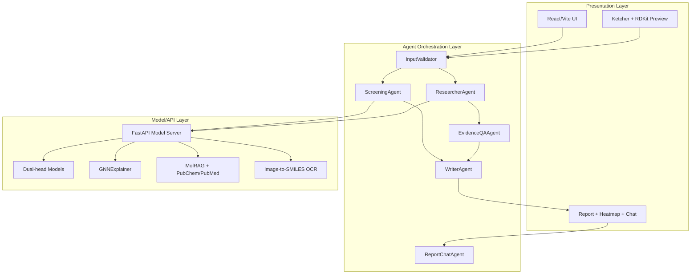
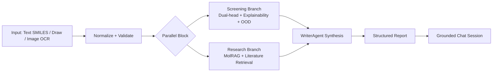
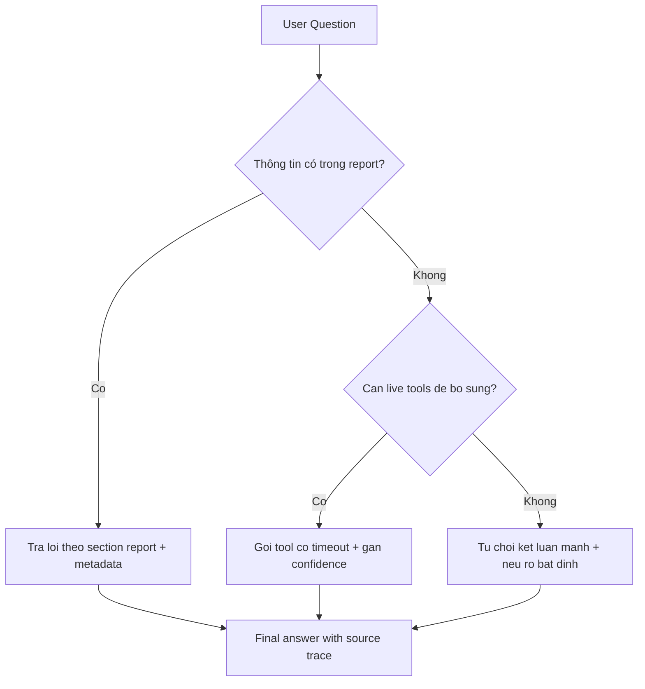

# ToxAgent: Nền Tảng AI Đa Tác Tử Có Khả Năng Giải Thích Và Truy Vết Bằng Chứng Cho Sàng Lọc Độc Tính Phân Tử Từ SMILES

**Nguyen et al.**  
ToxAgent Research Group  
Email: contact@tox-agent.web.app

## Abstract
Phát hiện sớm độc tính là nút thắt quan trọng trong phát triển thuốc, vì sai lệch ở giai đoạn tiền lâm sàng có thể tạo ra chi phí rất lớn về sau. Nhiều hệ thống hiện tại tối ưu dự đoán điểm số, nhưng chưa giải quyết trọn vẹn nhu cầu ra quyết định của đội R&D: cần giải thích cấu trúc, bằng chứng nghiên cứu kèm theo, và cơ chế kiểm định độ tin cậy đầu-cuối.

Bài báo trình bày ToxAgent, một nền tảng AI đa tác tử hỗ trợ quyết định độc tính từ SMILES với bốn năng lực cốt lõi: (i) dự đoán độc tính lâm sàng và cơ chế Tox21 theo kiến trúc dual-head; (ii) giải thích atom/bond bằng GNNExplainer; (iii) tăng cường bằng chứng qua MolRAG kết hợp PubChem/PubMed; và (iv) đối thoại hậu phân tích được neo theo report đã đóng băng dữ liệu. Hệ thống triển khai thực tế trên React + FastAPI + Cloud Run + Firebase Hosting, có deterministic fallback khi agent runtime không sẵn sàng. Trên benchmark nội bộ, mô hình tốt nhất đạt $joint\_auc\_beta3=0.8467$, trung bình 10 mô hình đạt 0.8179. Ở nhánh cơ chế, tox21_gatv2 đạt AUC trung bình 0.725 trên 12 nhiệm vụ Tox21. Khác với hướng tối đa hóa số endpoint, ToxAgent tập trung vào chiều sâu quyết định: orchestration có kiểm soát, explainability có cấu trúc, quality-gated evidence, và report-grounded chat.

## Index Terms
Molecular toxicity, multi-agent systems, explainable AI, Tox21, MolRAG, evidence-grounded reasoning, drug discovery informatics.

## I. Problem Context and Motivation

### A. Why This Problem Matters
Trong quy trình R&D dược, câu hỏi thực tế không chỉ là "phân tử có độc hay không" mà là:
1. Vì sao mô hình kết luận như vậy?
2. Vùng cấu trúc nào đang đóng góp rủi ro?
3. Bằng chứng thực nghiệm nào ủng hộ hoặc phủ định?
4. Mức bất định hiện tại có đủ để quyết định bước assay tiếp theo không?

Khoảng cách giữa dự đoán điểm số và quyết định có thể giải trình vẫn là điểm yếu của nhiều nền tảng độc tính hiện nay.

### B. Gap Analysis

| Nhu cầu thực tế của R&D | Hạn chế phổ biến của công cụ hiện có | Hướng xử lý trong ToxAgent |
|---|---|---|
| Kết luận phải truy vết được | Đầu ra thường thiên về score/label | Report theo schema + dẫn nguồn bằng chứng |
| Cần hiểu rủi ro ở mức cấu trúc | Explainability chưa tích hợp sâu vào workflow | Heatmap atom/bond từ GNNExplainer |
| Cần tổng hợp nhiều nguồn tri thức | Predictor, literature, analog tách rời | Pipeline đa tác tử + writer tổng hợp cuối |
| Cần vận hành ổn định trên cloud | Dễ lỗi runtime/stream khi tải cao | Deterministic fallback + taxonomy lỗi |

### C. Main Contributions

| Đóng góp | Mô tả ngắn | Giá trị thực tiễn |
|---|---|---|
| Kiến trúc multi-agent tuần tự-song song | InputValidator -> (Screening // Research) -> Writer | Giảm latency, giữ output ổn định |
| Pipeline quyết định thống nhất | Dual-head + explainability + MolRAG + quality gate | Tránh đứt gãy giữa mô hình và quyết định |
| Report-grounded chat | Chat neo theo report state đã freeze | Hỏi sâu nhưng không vượt dữ liệu |
| Benchmark + phân tích sản phẩm | Định lượng + so sánh breadth-vs-depth với ProTox-3 | Định vị rõ vai trò hệ thống |

## II. System Overview

### A. Three-Layer Architecture

**Figure 1. Kiến trúc 3 lớp của ToxAgent**

### B. End-to-End Flow

**Figure 2. Luồng xử lý từ đầu vào đến hậu phân tích**

### C. Reliability Profile for Production

| Thành phần độ tin cậy | Cơ chế | Mục tiêu |
|---|---|---|
| Runtime fallback | Chuyển deterministic path khi agent runtime lỗi | Luôn trả đầu ra hợp lệ |
| Health observability | Endpoint health cho model + OCR readiness | Giảm thời gian chẩn đoán lỗi |
| OOD guard | Cảnh báo ngoài miền dữ liệu theo profile nguyên tố | Tránh overconfidence |
| Error normalization | Chuẩn hóa mã lỗi OCR/network/runtime | Hỗ trợ vận hành và MTTR thấp |

## III. Method

### A. Problem Formulation
Cho đầu vào phân tử đã chuẩn hóa là $s$, hệ thống dự đoán hai nhánh:
1. **Clinical toxicity**: xác suất nhị phân $p_{tox}$.
2. **Mechanism toxicity**: vector xác suất Tox21 $\mathbf{m} \in [0,1]^{12}$.

Quy tắc gán nhãn lâm sàng:

$$
\hat{y}_{clinical}=\mathbb{I}(p_{tox} \ge \tau_c)
$$

Trong đó $\tau_c$ là ngưỡng lâm sàng theo cấu hình phiên. Nhánh cơ chế dùng ngưỡng toàn cục $\tau_m$ hoặc ngưỡng hiệu chỉnh theo từng tác vụ khi có calibration.

### B. Agentic Orchestration Design

| Giai đoạn | Tác tử chính | Vai trò |
|---|---|---|
| Step 1 (sequential) | InputValidator | Chuẩn hóa và chặn lỗi đầu vào |
| Step 2 (parallel) | ScreeningAgent | Dự đoán + explainability + OOD |
| Step 2 (parallel) | ResearcherAgent | Retrieval analog + literature context |
| Step 3 (sequential) | WriterAgent | Hợp nhất kết quả theo schema nhất quán |

Thiết kế này cân bằng hai mục tiêu: giảm độ trễ nhờ song song hóa và giảm sai khác output nhờ một writer tổng hợp duy nhất.

### C. Multi-Modal Ingestion

| Chế độ | Công cụ | Đầu ra chuẩn hóa |
|---|---|---|
| Type SMILES | Text input | Canonical SMILES |
| Draw Molecule | Ketcher | Canonical SMILES |
| Upload Image | MolScribe + RDKit | Canonical SMILES |
| Free-text extraction | Regex + parser | Candidate SMILES |

### D. Screening Stack and Explainability
Nhánh screening dùng các cấu hình dual-head (ChemBERTa, MolFormer, PubChem-BERT và ensemble). Hệ thống tách rõ ba lớp:
1. Predictor: quyết định chính.
2. Explainer: attribution atom/bond.
3. Report layer: diễn giải ngữ nghĩa cho người dùng.

Mục tiêu là tránh nhầm lẫn giữa score dự đoán và score giải thích.

### E. MolRAG Retrieval and Deterministic Reasoning
MolRAG gồm ba bước:
1. Truy xuất analog theo fingerprint similarity (Firestore hoặc CSV fallback).
2. Bổ sung ngữ cảnh kiến thức và literature hits theo tox class.
3. Suy luận deterministic để đưa ra confidence hỗ trợ.

Hàm confidence:

$$
C = \min(0.95,\;0.4 + 0.4s + 0.05n_a + 0.015n_k + 0.01n_l)
$$

Trong đó $s$ là top similarity, $n_a$ là số analog, $n_k$ là số knowledge hit, và $n_l$ là số literature hit.

### F. Evidence Quality Gating

| Bước xử lý | Mục đích |
|---|---|
| Dedup theo PMID/title | Loại trùng và giảm nhiễu |
| Relevance scoring | Ưu tiên bài liên quan độc tính và hợp chất |
| Confidence calibration (HIGH/MEDIUM/LOW) | Chuẩn hóa độ tin cậy |
| Quality flags | Cảnh báo no\_articles\_found, low\_relevance\_evidence |

### G. Report-Grounded Chat Policy

**Figure 3. Chính sách trả lời của report-grounded chat**

## IV. Experimental Setup

### A. Evaluation Sources
Nguồn đánh giá là các artifact đã version hóa trong kho mã:
1. Bảng xếp hạng dual-head.
2. Bảng metrics theo nhiệm vụ Tox21.
3. Cấu hình pipeline và schema output ở model server/agent layer.

### B. Metrics
1. $joint\_auc\_beta3$ cho ranking dual-head.
2. AUC-ROC và PR-AUC theo từng tác vụ Tox21.
3. Chỉ số vận hành định tính: fallback success, schema completeness, evidence traceability.

### C. Experiment Matrix

| Nhóm | Câu hỏi | Đầu ra chính |
|---|---|---|
| E1: Model Ranking | Mô hình nào tối ưu joint score? | Top-10 theo $joint\_auc\_beta3$ |
| E2: Mechanism Analysis | Tín hiệu theo từng nhiệm vụ Tox21 ra sao? | AUC/PR-AUC task-level |
| E3: Reliability | Hệ có duy trì output khi runtime dao động không? | Phân tích fallback + quality gate |
| E4: Product Comparison | Depth-first khác gì breadth-first? | So sánh hướng sản phẩm với ProTox-3 |

### D. AI-Checking Protocol

| Lớp kiểm tra | Nội dung |
|---|---|
| Model-level | Kiểm tra drift của ranking artifacts |
| Pipeline-level | Kiểm tra schema endpoint và khả năng recovery |
| Claim-level | Bắt buộc truy vết nguồn phát biểu trong report/chat |

### E. Runtime Configuration (for reproducibility)

| Thành phần | Thiết lập |
|---|---|
| Model server | Worker đơn, timeout model-call rõ ràng |
| OCR runtime | Ưu tiên preload để giảm cold-start latency |
| Research tools | Timeout riêng cho PubChem/PubMed |
| Agent runtime | Deterministic fallback đảm bảo output hợp lệ |

## V. Results

### A. Dual-Head Ranking

**Table I. Dual-head ranking theo $joint\_auc\_beta3$**

| Rank | Model | Type | joint_auc_beta3 |
|---:|---|---|---:|
| 1 | dualhead_ensemble6_simple | dual_head_ensemble_new | 0.8467 |
| 2 | dualhead_ensemble3_weighted | dual_head_ensemble_new | 0.8466 |
| 3 | dualhead_ensemble3_simple | dual_head_ensemble_new | 0.8455 |
| 4 | dualhead_ensemble5_simple | dual_head_ensemble_new | 0.8451 |
| 5 | pretrained_2head_herg_molformer_model | dual_head_checkpoint | 0.8270 |
| 6 | pretrained_2head_herg_chemberta_model | dual_head_checkpoint | 0.8178 |
| 7 | pretrained_2head_herg_pubchem_model | dual_head_checkpoint | 0.8133 |
| 8 | pretrained_2head_herg_pubchem_quick | dual_head_checkpoint | 0.7896 |
| 9 | pretrained_2head_herg_molformer_quick | dual_head_checkpoint | 0.7746 |
| 10 | pretrained_2head_herg_chemberta_quick | dual_head_checkpoint | 0.7725 |

**Tóm tắt nhanh:**
1. Mean $joint\_auc\_beta3$: 0.8179.
2. Range: 0.7725 -> 0.8467.
3. Chênh lệch best-vs-lowest: 0.0742.

Kết luận: nhóm ensemble cho độ ổn định tốt hơn, trong khi quick models phù hợp cấu hình ưu tiên độ trễ.

### B. Tox21 Task-Level Performance

**Table II. Top nhiệm vụ Tox21 theo AUC-ROC (tox21_gatv2)**

| Rank | Task | AUC-ROC | PR-AUC | Positive Rate |
|---:|---|---:|---:|---:|
| 1 | NR-AhR | 0.797 | 0.375 | 0.117 |
| 2 | NR-AR-LBD | 0.782 | 0.320 | 0.024 |
| 3 | SR-p53 | 0.779 | 0.254 | 0.092 |
| 4 | SR-MMP | 0.766 | 0.308 | 0.123 |

**Tổng quan toàn bộ 12 nhiệm vụ:**
1. Mean AUC-ROC: 0.725.
2. Mean PR-AUC: 0.247.

Quan sát: mất cân bằng lớp (positive rate thấp) làm PR-AUC nhạy với nhiễu, do đó calibration theo từng task là cần thiết.

### C. Key Findings at System Level
1. Deterministic fallback duy trì phản hồi hợp lệ khi agent runtime dao động.
2. EvidenceQA giảm nguy cơ trả lời quá tự tin khi literature yếu.
3. Payload explainability atom/bond giúp thảo luận cấu trúc cụ thể trong nhóm hóa dược.

## VI. Practical Analysis

### A. Case Study Summary

| Case | Tình huống | Cách ToxAgent xử lý | Kết quả quyết định |
|---|---|---|---|
| 1 | $p_{tox}$ cận ngưỡng + nhiều tín hiệu cơ chế yếu | Tách lớp clinical/mechanism/OOD và trả quality flags | Chuyển sang khuyến nghị assay xác nhận |
| 2 | Baseline mâu thuẫn với analog evidence | Chính sách evidence-only, không tự override baseline | Giữ an toàn quyết định, tăng ngữ cảnh thảo luận |
| 3 | Literature confidence thấp nhưng user hỏi kết luận mạnh | Hạ ngữ điệu khẳng định, nêu bất định bắt buộc | Tránh claim vượt bằng chứng |

### B. Operational Error Taxonomy

| Nhóm lỗi | Ví dụ |
|---|---|
| Input errors | Invalid SMILES, ảnh quá dung lượng, định dạng không hỗ trợ |
| Service availability | Model timeout, extraction service unavailable, API ngoài chậm |
| Runtime orchestration | Stream race, session chưa sẵn sàng, thiếu payload state |
| Evidence quality | no_articles_found, literature_missing, low_relevance_evidence |

### C. Trade-offs

| Quyết định thiết kế | Lợi ích | Đánh đổi |
|---|---|---|
| Evidence-only fusion | Tránh sửa nhãn quá tay khi retrieval yếu | Có thể bỏ lỡ corrective reasoning mạnh |
| Rich report schema | Tăng khả năng giải trình | Cần đồng bộ backend/frontend chặt |
| Dùng nhiều external tools | Bằng chứng phong phú hơn | Phụ thuộc mạng và biến thiên latency |

## VII. Comparative Analysis with ProTox-3

### A. Feature-Level Comparison

**Table III. ProTox-3 vs ToxAgent (breadth vs depth)**

| Criterion | ProTox-3 | ToxAgent |
|---|---|---|
| Core objective | Large endpoint coverage | Decision-centric multi-agent workflow |
| Number of model endpoints | High (published as 61 models) | Focused set with dual-head + mechanism |
| Structural explainability (atom/bond) | Not central in default flow | Integrated GNNExplainer payload |
| Evidence quality gate | Confidence in model report | Dedicated evidence QA + quality flags |
| Retrieval-grounded analog reasoning | Similar compound views | MolRAG retrieval + deterministic reasoning |
| Post-report interaction | Primarily static reports | Grounded report chat with tools |
| Runtime fallback strategy | Traditional web pipeline | ADK with deterministic fallback |
| Multi-modal input | Drawing + text | Text + drawing + image OCR + free-text extraction |

### B. Interpretation
ProTox-3 mạnh ở trục bao phủ endpoint (breadth). ToxAgent tập trung trục chiều sâu quyết định (depth): kết nối predictor, explainability, evidence quality và grounded interaction trong cùng một workflow. Hai hướng này có thể bổ trợ trong quy trình R&D thực tế.

## VIII. Threats to Validity

| Nhóm đe dọa | Rủi ro | Hướng giảm thiểu |
|---|---|---|
| Internal validity | Artifact có thể lệch trạng thái code mới nếu chưa cập nhật | Khóa phiên bản artifact + kiểm tra drift định kỳ |
| Construct validity | $joint\_auc\_beta3$ không phản ánh toàn bộ downstream utility | Bổ sung bộ metric quyết định theo workflow |
| External validity | Tổng quát ngoài miền tox21 còn hạn chế | External validation trên tập ngoài miền |
| Infrastructure validity | Một số nhánh chat còn phụ thuộc in-memory state | Bổ sung persistence cho scale-out đa instance |

## IX. Conclusion and Future Work
ToxAgent cho thấy cách tiếp cận multi-agent có thể thu hẹp khoảng cách giữa đầu ra dự đoán và quyết định R&D có thể giải trình. Trên benchmark hiện có, hệ thống đạt hiệu năng cạnh tranh ở mô hình dự đoán (best $joint\_auc\_beta3=0.8467$), đồng thời nâng chất lượng quyết định nhờ evidence gating, explainability có cấu trúc và report-grounded chat.

Các hướng tiếp theo:
1. Bật đầy đủ LLM reasoning cho MolRAG với kiểm soát hallucination nghiêm ngặt.
2. Hoàn thiện persistence + telemetry cho report-chat ở quy mô production.
3. Mở rộng external validation cho miền hợp chất và endpoint mới.
4. Chuẩn hóa uncertainty-aware reporting cho hội đồng khoa học và regulatory pre-screening.

## Acknowledgment
Nghiên cứu được xây dựng trên mã nguồn và tài nguyên của dự án ToxAgent, với benchmark nội bộ từ các artifact đã version hóa. Chúng tôi ghi nhận đóng góp của cộng đồng mã nguồn mở và các công trình nền tảng như RDKit, Tox21, ProTox và GNNExplainer.

## References
[1] P. Banerjee, E. Kemmler, M. Dunkel, and R. Preissner, “ProTox 3.0: a webserver for the prediction of toxicity of chemicals,” *Nucleic Acids Research (Web Server Issue)*, 2024.

[2] P. Banerjee, O. A. Eckert, A. K. Schrey, and R. Preissner, “ProTox-II: a webserver for the prediction of toxicity of chemicals,” *Nucleic Acids Research*, vol. 46, no. W1, pp. W257–W263, 2018.

[3] Z. Wu *et al*., “MoleculeNet: a benchmark for molecular machine learning,” *Chemical Science*, vol. 9, pp. 513–530, 2018.

[4] Z. Ying, D. Bourgeois, J. You, M. Zitnik, and J. Leskovec, “GNNExplainer: generating explanations for graph neural networks,” in *NeurIPS*, 2019.

[5] S. Brody, U. Alon, and E. Yahav, “How attentive are graph attention networks?” in *ICLR*, 2022.

[6] J. Ross, B. Belgodere, V. Chenthamarakshan, and I. Padhi, “Large-scale chemical language representations capture molecular structure and properties,” *Nature Machine Intelligence*, 2022.

[7] S. Chithrananda, G. Grand, and B. Ramsundar, “ChemBERTa: large-scale self-supervised pretraining for molecular property prediction,” arXiv:2010.09885, 2020.

[8] G. Landrum, “RDKit: Open-source cheminformatics software,” 2024. [Online]. Available: https://www.rdkit.org

[9] R. S. Judson *et al*., “In vitro screening of environmental chemicals for targeted testing prioritization: the Tox21 consortium,” *Environmental Health Perspectives*, 2015.

[10] E. Lounkine *et al*., “Large-scale prediction and testing of drug activity on side-effect targets,” *Nature*, vol. 486, pp. 361–367, 2012.

[11] ToxAgent Team, “ToxAgent README (v0.0.6 Beta),” Project documentation, 2026.

[12] ToxAgent Team, “dualhead_model_ranking.csv,” Benchmark artifact, 2026.

[13] ToxAgent Team, “tox21_task_metrics.csv,” Benchmark artifact, 2026.

[14] ToxAgent Team, “Agent pipeline analysis and runtime notes,” Internal technical report, 2026.

[15] ToxAgent Team, “Cloud Run and Firebase deployment configuration,” Deployment documentation, 2026.

[16] O. J. Wouters, M. McKee, and J. Luyten, “Estimated research and development investment needed to bring a new medicine to market,” *JAMA*, vol. 323, no. 9, pp. 844–853, 2020.

[17] Tox21 Consortium, “Toxicology testing in the 21st century,” U.S. EPA/NIH/FDA collaborative program.

[18] Y. LeCun, Y. Bengio, and G. Hinton, “Deep learning,” *Nature*, vol. 521, pp. 436–444, 2015.

[19] L. Breiman, “Random forests,” *Machine Learning*, vol. 45, pp. 5–32, 2001.

[20] J. Gilmer, S. S. Schoenholz, P. F. Riley, O. Vinyals, and G. E. Dahl, “Neural message passing for quantum chemistry,” in *ICML*, 2017.

[21] K. Yang, K. Swanson, W. Jin, C. Coley, P. Eiden, H. Gao, T. Guzman-Perez, T. Hopper, B. Kelley, M. Mathea, A. Palmer, V. Settels, T. Jaakkola, K. Jensen, and R. Barzilay, “Analyzing learned molecular representations for property prediction,” *Journal of Chemical Information and Modeling*, 2019.

[22] D. Rogers and M. Hahn, “Extended-connectivity fingerprints,” *Journal of Chemical Information and Modeling*, vol. 50, no. 5, pp. 742–754, 2010.

[23] ToxAgent Team, “Report chat persistence plan and system hardening notes,” Internal design specification, 2026.

[24] P. Banerjee and R. Preissner, “Toxic fragment and propensity based toxicity modeling,” referenced in ProTox methodology and FAQ resources.

[25] N. Minh Nguyen *et al*., “Advancing clinical toxicity prediction through multimodal fusion of SMILES and molecular graphs,” preprint manuscript, 2026.
