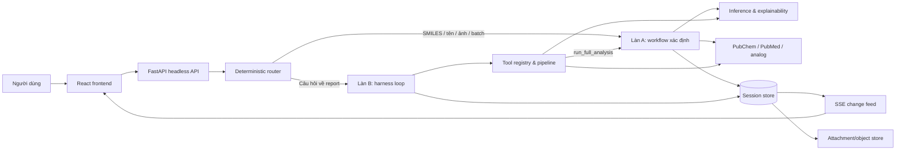

# ToxAgent Harness — Đặc tả thiết kế hệ thống

## 1. Trạng thái, mục tiêu và quyết định nền tảng

Đây là thiết kế mục tiêu cho harness ToxAgent, được biên soạn từ [HARNESS_ARCHITECTURE.md](HARNESS_ARCHITECTURE.md). Hệ thống hiện hữu chưa nhất thiết đã đạt thiết kế này; tài liệu dùng để triển khai theo từng giai đoạn có điều kiện thoát đo được.

Các quyết định nền tảng:

1. Giữ Làn A là pipeline phân tích xác định; không “agent-hoá” kết quả khoa học định lượng.
2. Router phân Làn A/B theo luật deterministic, không để LLM chọn đường xử lý.
3. Làn B dùng native function calling, tool registry và vòng lặp harness riêng; không dùng planner prompt + chuỗi `if/elif`.
4. Lưu state theo mô hình `session` / `message` / `part`; event là change feed có phiên bản, không là nguồn sự thật duy nhất.
5. Lấy bất biến audit, provenance và contract pipeline từ DSH; lấy cấu trúc dữ liệu, hook đơn giản và compaction bằng con trỏ từ OpenCode.
6. Không dùng plugin runtime, sandbox chạy mã, Code Mode, subagent, hoặc approval UI cho tool.

## 2. Bức tranh kiến trúc



Lõi backend vẫn là HTTP server headless. Frontend, CLI hoặc client sinh từ OpenAPI chỉ là consumer; chúng không sở hữu trạng thái hội thoại hay tạo một timeline song song.

## 3. Phân làn và vòng đời yêu cầu

### 3.1 Luật router

| Input đã chuẩn hóa | Làn | Hành động trước khi chạy |
| --- | --- | --- |
| SMILES hợp lệ, không có câu hỏi | A | Validate và canonicalize. |
| Ảnh cấu trúc | A | Trích xuất SMILES bằng MolScribe, sau đó validate. |
| Tên hợp chất phân giải được | A | `resolve_compound`, sau đó validate. |
| Batch nhiều phân tử hoặc benchmark | A | Không bao giờ chuyển B. |
| Câu hỏi khi có report mở | B | Dựng context từ session. |
| Mọi input còn lại | B | Hỏi/làm rõ hoặc dùng tool được cấp. |

`_looks_like_smiles` chỉ được nhận diện cú pháp SMILES; không được kiêm phân loại ý định hay từ chối tên hợp chất viết thường.

### 3.2 Làn A — phân tích xác định

Làn A bọc `run_orchestrator_flow` hiện có và là nguồn tạo report khoa học chuẩn. Trình tự logic:

1. Validate/canonicalize input.
2. Chạy screening và research theo các nhánh độc lập khi an toàn.
3. Inference trả clinical, mechanism, OOD, verdict và explanation theo điều kiện.
4. Research lấy compound info, literature, bioassay/analog khi được workflow yêu cầu.
5. Writer tổng hợp `final_report` bằng dữ liệu có cấu trúc và fallback xác định.
6. Adapter persistence ghi các bước/kết quả vào session store.

Làn A được phép gọi code inference trực tiếp trong process. Nếu `MODEL_SERVER_URL` trỏ về chính FastAPI process, không gọi ngược HTTP; dùng hàm in-process để tránh chiếm thread kép, timeout lồng và nguy cơ deadlock.

### 3.3 Làn B — harness loop

Mỗi turn có thứ tự:

1. Claim input, tạo `turn-start` và `step-start` part.
2. Assemble system/tool schema cố định, context biến động và surface của session; ghi `request-header` khi system, tool schema hoặc config thay đổi.
3. Gọi LLM qua provider adapter.
4. Lưu assistant text hoặc tool call part.
5. Với từng tool call, chạy pipeline tại mục 6.
6. Nếu model trả lời cuối, chạy validator provenance.
7. Retry tối đa một lần nếu strict provenance phát hiện vi phạm; nếu vẫn lỗi dùng fallback deterministic.
8. Tạo `step-finish` và `turn-end` với lý do `completed | aborted | error | max_steps`.

Giới hạn số step là cấu hình profile/agent (`steps`), không phải hằng số `max_tool_calls` nằm trong hàm. Một `deadline` chung của turn được truyền xuống toàn bộ provider call, retry và tool execution.

## 4. Phân lớp module và luật phụ thuộc

```text
harness/
  session/       persistence, transcript, surface, change feed
  prompt/        context assembly: static rồi volatile
  tools/         registry, contract, hooks, execution pipeline
  loop/          driver turn/step và stopping policy
  provenance/    observation metadata và validator số liệu
  llm/           provider definition + Gemini/local/fallback providers
  budget/        token meter và compaction policy
  router.py      phân Làn A/B deterministic

agents/          Làn A, writer/research/screening hiện hữu
tools/           body nghiệp vụ của các tool khoa học
model_server/    FastAPI transport, adapter để gọi harness/agents
frontend/        client API/SSE, không sở hữu trạng thái nguồn
```

**Luật cưỡng chế bằng CI:** `harness/` không import `agents/*` hoặc `model_server/*`. Các tầng bên ngoài có thể import harness. Làn A được đưa vào Làn B thông qua ToolDefinition `run_full_analysis`, không phải import ngược.

Mỗi capability có `Protocol`/definition, provider mặc định và consumer chỉ phụ thuộc definition. Các seam tối thiểu: LLM provider, token meter, compaction policy, session repository, attachment store, tool registry và clock/deadline. Chính sách compaction không được tự đoán token hay chi phí; nó nhận số đo từ token meter.

## 5. Mô hình dữ liệu bền vững

### 5.1 Các bảng/collection logic

| Thực thể | Trường tối thiểu | Mục đích |
| --- | --- | --- |
| `session` | `id`, `owner_id`, `status`, `created_at`, `updated_at`, token/cost tổng, cấu hình/profile | Đơn vị sở hữu, resume và truy vấn tổng hợp. |
| `message` | `id`, `session_id`, `role`, `content`, `time_created`, `time_updated` | Lịch sử user/assistant có thể đọc ở trạng thái hiện tại. |
| `part` | `id`, `message_id`, `seq`, `data`, `time_created`, `time_updated` | Part text, reasoning, tool, step-start/finish, compaction, validation. |
| `session_context_epoch` | `session_id`, `baseline`, `snapshot`, `baseline_seq`, `tail_start_id`, `auto`, `overflow` | Dựng surface sau compaction mà không sửa transcript. |
| `attachment` | `id`, `session_id`, `call_id`, `mime`, `url`, `filename`, checksum, retention | Quản lý blob ngoài context với quyền và vòng đời bền vững. |
| `permission` (tùy chọn GĐ3) | `scope`, `action`, `resource/pattern`, `effect` | Tắt bề mặt tool/skill theo profile; không dùng làm approval UI. |

`part.seq` liên tục trong một message/session projection, payload `data` phải JSON-serializable và được kiểm tra khi ghi. Dữ liệu đã accepted không được mutate ngầm; cập nhật trạng thái tool chỉ được ghi qua transition có kiểm soát và `time_updated`.

### 5.2 Kiểu part

- `text`: nội dung assistant hoặc user projection.
- `reasoning`: nếu chính sách provider cho phép lưu.
- `tool`: lời gọi tool và state machine của nó.
- `turn-start`, `turn-end`, `step-start`, `step-finish`: biên của turn/step; `step-finish` lưu token, cache token, cost và reason.
- `request-header`: system prompt đã render, tool schemas và config thực sự gửi model; chỉ ghi khi những giá trị này thay đổi.
- `compaction`: con trỏ nén context.
- `validation`: verdict provenance, gồm mode shadow/strict và danh sách vi phạm.

Tool part có hình dạng logic sau:

```json
{
  "type": "tool",
  "tool": "search_literature",
  "callID": "call_...",
  "state": {
    "status": "pending | running | completed | error",
    "input": {"query": "..."},
    "output": "Dữ liệu được chiếu cho model",
    "metadata": {"numeric_index": {}, "raw_ref": "..."},
    "title": "Tìm literature độc tính",
    "time": {"start": 0, "end": 0}
  },
  "attachments": [{"type": "file", "mime": "image/png", "url": "/...", "filename": "...png"}]
}
```

Tên change-feed event mang phiên bản, ví dụ `message.part.updated.1`. Khi payload thay đổi không tương thích, tăng hậu tố lên `.2` thay vì thay nghĩa im lặng.

### 5.3 Vòng đời observation và attachment

`output` là đúng phần model nhìn thấy; `metadata` chứa numeric index có kiểu, raw data/ref và thông tin riêng cho UI/audit. Attachment giữ PNG/heatmap hoặc object lớn. Không đưa base64 vào prompt.

Raw observation và attachment là evidence, không phải cache. Chúng phải được giữ tối thiểu bằng chính sách retention của session và chỉ được dọn theo quy trình xóa session/evidence đã phê duyệt. Không được để đường dẫn attachment sống ngắn hơn part trỏ đến nó.

## 6. Tool registry, contract và pipeline

### 6.1 Tool definition và kết quả

```python
@dataclass(frozen=True)
class ToolDefinition:
    name: str
    description: str
    parameters: dict                 # JSON Schema
    execute: Callable[[dict, ToolExec], ToolResult]
    timeout_s: float
    retries: int = 0
    concurrency_safe: bool = False
    observation: ObservationPolicy = ...

@dataclass(frozen=True)
class ToolResult:
    output: str                      # model-visible projection
    title: str | None = None
    metadata: dict = field(default_factory=dict)
    attachments: list[Attachment] = field(default_factory=list)
```

Description ngắn, schema rõ và tập tool cố định trong một session để giữ prefix ổn định. `ToolExec` mang `call_id`, session, deadline/abort signal, logger và context quyền hạn.

### 6.2 Pipeline thực thi

```text
tool part, state=pending (ghi trước)
  → pre-execute: parse một lần, freeze args, validate/canonicalize, dedupe, quota, deadline
  → execute: timeout, retry, circuit breaker
  → post-execute: observation policy, numeric index, attachment, projection
  → cập nhật cùng tool part sang trạng thái cuối: đóng băng output, no-transform
```

Pre/post hook dùng chữ ký đơn giản `(input, output) -> void` và chỉ có số hook nội bộ hạn chế. Không dựng waterfall plugin phức tạp. `validate_smiles` là pre-execute hook, không là tool gọi bởi model. Kiểm support của claim là validator post-execute, không là tool. Hậu xử lý tuyệt đối không sửa câu trả lời cuối của model.

Ví dụ projection policy tối thiểu:

| Tool | `output` cho context | `metadata`/attachment giữ riêng |
| --- | --- | --- |
| `predict_toxicity` | verdict, probability, top-3 mechanism + score | full task map, model metadata |
| `explain_prediction` | top-8 atom/bond | heatmap/molecule PNG, raw attribution |
| `search_literature` | PMID, title, năm, 240 ký tự abstract/bài | full abstract, raw response |
| `find_analogs` | top-5 SMILES, Tanimoto, toxicity label | toàn bộ kết quả/fingerprint |

## 7. Prompt, ngân sách và compaction

### 7.1 Context assembly

Request gửi model được dựng theo thứ tự ổn định:

```text
[static]   luật hệ thống · tool schema · report schema · skill profile
[volatile] input/report · observation hiện lượt · ngôn ngữ đầu ra · surface chat
```

System prompt phải lưu thành mảng/segment thay vì một chuỗi phẳng để tách tĩnh/biến động. Ngôn ngữ đầu ra ở volatile, không đưa vào prefix tĩnh. Mỗi request cần đủ `system`, tool schemas và config để audit/reconstruct phần model nhìn thấy.

### 7.2 Token và compaction

- Đếm token bằng API `count_tokens`/usage của provider, không dùng `len(text) // 4`.
- Theo dõi `input`, `output`, `reasoning`, `cache.read`, `cache.write`, `cost` trên `step-finish`; denormalize tổng lên `session`.
- Trước khi tóm tắt: chiếu theo field, gỡ observation cũ khỏi surface nhưng giữ store/ref.
- Khi vẫn vượt budget: ghi baseline summary và con trỏ `tail_start_id`. Surface = baseline + message từ tail; transcript = toàn bộ lịch sử gốc.
- Cache prefix là best-effort. Log chỉ số cache hai tuần trước khi quyết định đầu tư explicit caching.

## 8. Provenance số liệu và kiểm soát câu trả lời

### 8.1 Bất biến

Mọi con số ở output cuối phải truy được tới observation cụ thể của lượt hiện tại: trực tiếp trong `numeric_index`; trong projection; thuộc whitelist (PMID, năm, thứ tự); hoặc là phép biến đổi khai báo `round`, `unit_convert`, `percent`, `diff`, `ratio`.

### 8.2 Thuật toán

1. Post-execute tạo numeric index có cấu trúc, có `callID`/observation provenance.
2. Validator chuẩn hóa dấu `,`/`.` thập phân và trích token số từ output.
3. Số khớp giá trị `y` nếu `|x - y| ≤ 0.5 × 10^(-d)`, với `d` là số chữ số thập phân người dùng/model in ra.
4. Vi phạm: ghi validation part và retry một lần với các token vi phạm.
5. Retry thất bại trong strict mode: dùng fallback deterministic, không dùng string replacement để che kết quả sai.

Triển khai theo ba chế độ: `off` (chỉ khi cần khẩn cấp), `shadow` (mặc định giai đoạn đầu), `strict` (chỉ bật sau khi phân tích dữ liệu shadow).

## 9. API, streaming và quyền truy cập

### 9.1 API mục tiêu

Giữ tương thích với `POST /agent/analyze` cho phân tích. Khi hoàn thiện session harness, OpenAPI cần mô tả tối thiểu các khả năng logic sau (tên URL có thể được chốt trong API versioning):

| Khả năng | Contract cần có |
| --- | --- |
| Tạo/chạy phân tích | input đã định danh, config, `session_id`, trạng thái/kết quả report. |
| Gửi chat message | `session_id`, content, language/profile, reply cuối và step/tool parts. |
| Đọc session/transcript | session metadata, message/part đã phân quyền, pagination. |
| Subscribe SSE | thay đổi session/message/part có version, replay position. |
| Đọc attachment | `callID`/attachment id, kiểm quyền owner, MIME/download policy. |

SSE phải được phát từ change feed/state đã ghi. Client reconnect theo event/version và có thể tải lại session để tự hồi phục; không coi SSE là audit log.

### 9.2 Bảo mật và quyền

- Xác thực người dùng trước khi truy session, transcript hoặc attachment; chỉ owner/quyền dự án được đọc.
- Không persist API key, header nhạy cảm, secret hoặc reasoning không được phép lưu.
- Permission profile chỉ dùng allow/deny theo pattern để giới hạn tool/skill surface. Không có cơ chế cho model chạy code người dùng hay yêu cầu approval giữa lượt.
- Validate input schema trước execution; enforce quota, dedupe, timeout và circuit breaker trong pipeline thay vì prompt.

## 10. Khả năng chịu lỗi và quan sát vận hành

| Rủi ro | Thiết kế giảm thiểu |
| --- | --- |
| Timeout lồng và vượt Cloud Run | Một deadline xuyên suốt request/tool/retry; tool nhận abort signal. |
| Tool gọi HTTP về chính process | Adapter in-process khi URL tự trỏ. |
| SSE lệch audit trail | SSE dẫn xuất state/change feed bền vững. |
| LLM bịa số | Numeric validator, shadow → strict, fallback xác định. |
| JSON/raw/b64 làm tràn context | Observation policy, attachments ngoài context. |
| Blob bị dọn nhưng part còn trỏ | Retention attachment cùng session, kiểm reference integrity. |
| Sai cấu hình ngầm | Validate schema và fail fast tại startup/profile load. |

Metrics tối thiểu: số turn/step, tool success/error/latency theo tên tool, deadline timeout, validator violation/retry/fallback rate, token/cost/cache, compaction rate/reason và attachment integrity failures.

## 11. Lộ trình triển khai và điều kiện thoát

| Giai đoạn | Phạm vi | Điều kiện thoát |
| --- | --- | --- |
| 0 | Dọn coupling/legacy trước khi đổi kiến trúc | Không còn `LlmAgent` trong `agents/`; `main.py` dưới 4.000 dòng; benchmark đúng baseline đã chụp. |
| 1 | Chuẩn hóa 10 tool: schema, timeout/retry, MCP wrapper | Có thể gọi surface tool từ một client ngoài và hoàn thành phân tích aspirin. Chưa viết loop. |
| 1.5 | Session/message/part, observation/attachment store bao Làn A | Chạy `run_orchestrator_flow` tạo audit bền vững; tái dựng được phân tích từ state. |
| 2 | Harness loop, registry, context assembly, provenance shadow | Tool calling native hoạt động; có dữ liệu tỉ lệ vi phạm provenance thật. |
| 3 | Skill/profile markdown, tool-surface permission, compaction, report snapshot | Cấu hình loop khai báo được; context dài vẫn audit được; không bật tính năng không có số đo. |

Không bật `strict` ở GĐ2 cho đến khi đã thu thập và xem xét số liệu shadow mode. Không chuyển sang LangGraph hoặc pydantic-ai chỉ để có loop; thiết kế này sở hữu loop và state cần cho ToxAgent.

## 12. Chiến lược kiểm thử

- **Unit:** router, canonicalizer, tool schema, hook invariant, numeric parsing/dung sai VI/EN, compaction pointer, deadline propagation.
- **Contract:** mỗi tool có fixture input/output, projection policy, error mapping, attachment integrity.
- **Integration:** persistence `session/message/part`, permission tool surface, provider usage/token, SSE từ change feed.
- **E2E:** SMILES hợp lệ/lỗi, report chat, tool fail/timeout, attachment heatmap, compaction, restart/resume và audit truy xuất số liệu.
- **Regression:** chụp baseline trước GĐ0; so sánh kết quả Làn A tại mỗi thay đổi không được đổi thuật toán scientific.

## 13. Tài liệu liên quan

- [HARNESS_USE_CASES_VI.md](HARNESS_USE_CASES_VI.md)
- [HARNESS_USER_STORIES_VI.md](HARNESS_USER_STORIES_VI.md)
- [HARNESS_ARCHITECTURE.md](HARNESS_ARCHITECTURE.md)
