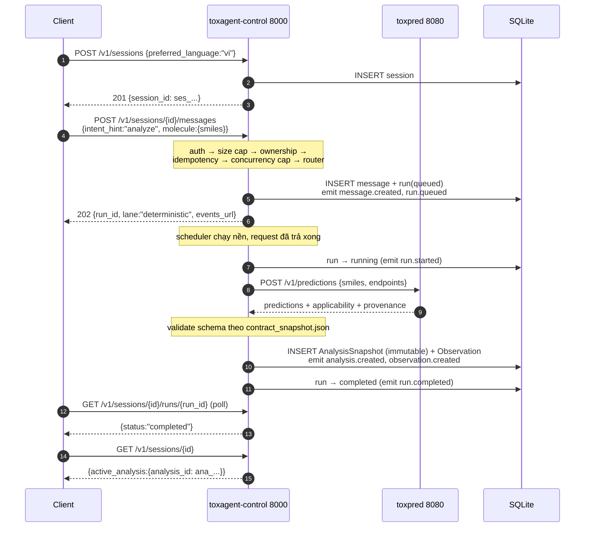
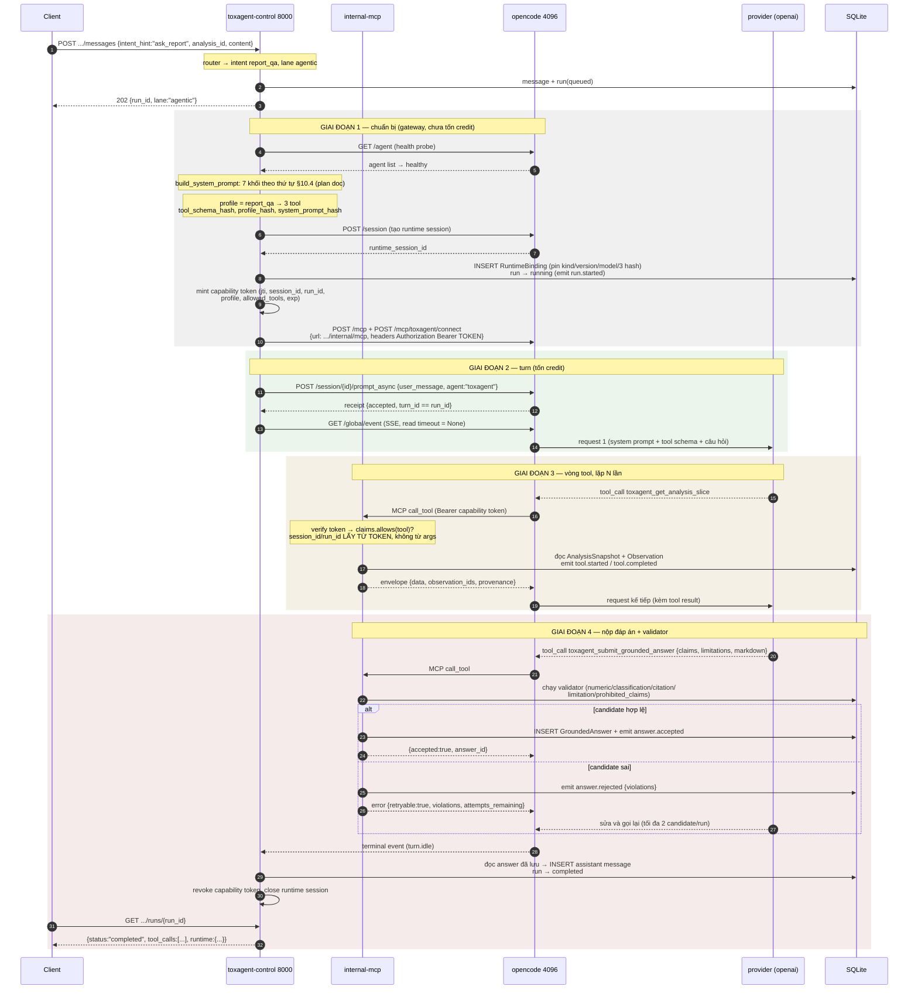
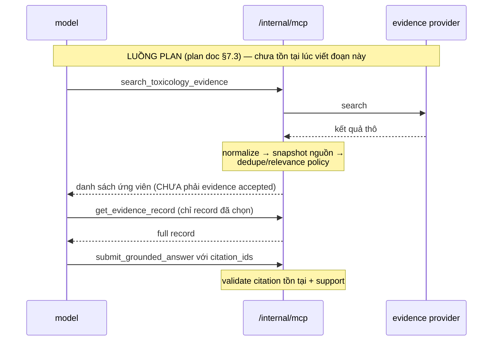
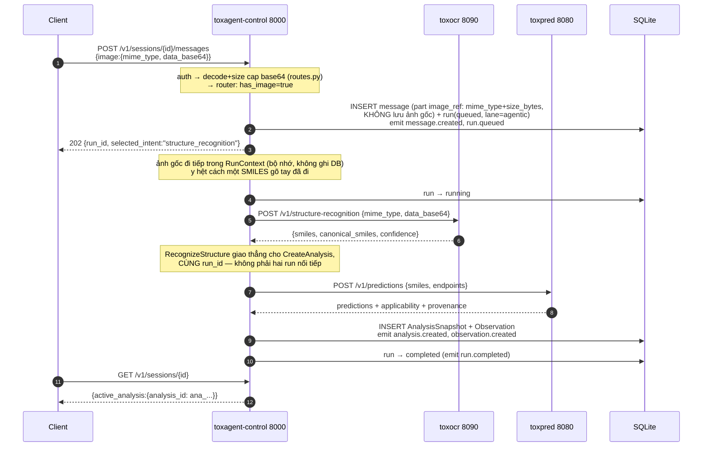

# ToxAgent Agentic Layer — Tiến độ triển khai

Doc theo dõi tiến độ của [TOXAGENT_AGENTIC_LAYER_REBUILD_PLAN_VI.md](TOXAGENT_AGENTIC_LAYER_REBUILD_PLAN_VI.md).
Mọi mục ở đây tham chiếu số section của plan đó.

- **Cập nhật:** 2026-09-06 09:35 +08 (checkpoint đọc trực tiếp session Claude
  mới nhất `73c88551-77fc-473c-85c9-9c64797d76e7` và đối chiếu working tree).
  Goal `thực hiện FULL` remaining-plan **chưa hoàn tất**: W0 hoàn tất; W1–W7
  đều mới hoàn tất một phần; W8–W10 chưa bắt đầu. Xem snapshot §0 và phần code
  W4-01/02/03/04/05, W4-07/W4-08, W2-13/14 và W6-09 đã hoàn tất, có
  regression/migration smoke thật ở §22–§29.
- **Branch:** `docs/harness-master-plan`
- **Commit delivery gần nhất:** `b315277 docs(toxagent): W4 define production
  migration policy`; branch đang **ahead 35** so với `origin/docs/harness-master-plan`,
  chưa push.
- **Working tree:** có lát W5-06 attribution viewer chưa commit; không có migration
  production nào đã bị chạy trong phiên.
- **Baseline xanh gần nhất trong working tree:** control plane **599 passed**;
  frontend **30 passed** + typecheck/lint/build xanh; toxocr **6 passed**;
  ToxPred **142 passed**. Đây không phải kết quả của working tree hiện tại.
- **Live eval:** bốn full sweep 35 task live-compatible đạt lần lượt **65.71%
  → 77.14% → 85.71% → 82.86%**; critical **7/11 → 8/11 → 10/11 → 10/11**.
  Manifest full mới nhất là `manifest-20260905T211805Z.json`. Hai targeted
  comparison task sau đó đạt 2/2 pass@1, nhưng `numeric-07` chỉ đạt 1/2 ở
  pass^2; fix rounding cuối chưa được live recheck. Vì vậy W1 exit gate
  `critical pass^3=100%` và numeric fidelity 100% vẫn chưa đạt.

---

## 0. Snapshot goal hiện tại

Nguồn của snapshot này là session log Claude mới nhất (3.829 record, kết thúc
do user interrupt lúc **2026-09-06 06:30:01 +08**), lịch sử commit, bốn manifest
eval mới nhất và diff chưa commit. Không dùng lời tự báo cáo của agent làm bằng
chứng duy nhất.

| Workstream | Trạng thái hiện tại | Bằng chứng / phần còn thiếu chính |
|---|---|---|
| W0 — Baseline | **Hoàn tất** | OCR/UI review, test script, decision table và eval baseline đã commit (`b4f41af`, `345df7f`). |
| W1 — Eval/quality | **Một phần đáng kể; chưa qua gate** | 4 full live sweep; latest 29/35, critical 10/11. Comparison root-cause đã sửa, nhưng pass^3 critical, frozen-agentic numeric, regression CI và OCR eval suite còn thiếu. |
| W2 — Runtime/recovery | **Một phần** | W2-12/15 `potentially_billed`, startup reconciliation, W2-13/14 usage persistence/`unknown` và **W2-05 OpenAPI diff gate** (đã đóng vòng, xem §2.3 dòng 8 và §44) đã làm. Live abort/reconnect/restart/failure injection (W2-01…04, W2-06…11) còn thiếu. |
| W3 — Attribution/evidence | **Một phần nhỏ** | W3-06 circuit breaker EuropePMC và **W3-07 citation read-before-cite** (xem §45) đã làm; live attribution gate, DEC-10, rubric và SME grading chưa làm. |
| W4 — Persistence/lifecycle | **Một phần đáng kể** | W4-01–05 PostgreSQL migration, repository/E2E, constraint transaction, multi-instance admission, REST/SSE reconcile và migration policy đã làm/test; W4-06 ObjectStore, W4-07 attachment persistence và W4-08 MIME/signature gate đã làm/test. Raw evidence/TTL/delete/restore vẫn chưa làm. |
| W5 — Product UI | **Một phần** | W5-01 reducer SSE/reconnect/reconcile, W5-02 durable reload bootstrap, W5-04 pending user-send, W5-11 Vitest/RTL, W5-14 lazy chunks/bundle gate, lát billing/cancel W5-09, evidence W5-05 và attribution viewer W5-06 đã làm; frontend đang 30 test. Playwright và accessibility còn thiếu. |
| W6 — CI/deploy | **Một phần** | CI control-plane/frontend/toxocr, PostgreSQL migration/repository job và runbook predictor đã làm; frontend CI nay enforce test/typecheck/policy/build + gzip bundle gate. Container cho 3 boundary còn lại, telemetry/dashboard/alerts, deploy topology và SBOM chưa làm. |
| W7 — DSH | **Spike một phần, tiến thêm** | Cài/smoke SDK 0.1.2rc1 thật, ghi hash và ADR; **custom deny-all profile đã dựng và boot thật** (`agent_profiles/dsh/`, xem §46) — xác nhận `sandbox/mode: read-only` qua session event thật, phát hiện `@deepseek-ai/dsh-mcp-client` chính chủ. Còn thiếu: round-trip MCP có token thật, contract snapshot, adapter, paired eval. |
| W8 — Internal alpha | **Chưa bắt đầu** | Cần staging thật, người tham gia, telemetry và vòng SME tối thiểu một tuần. |
| W9 — Production | **Chưa bắt đầu** | Cần OIDC/security review, load/soak, SLO, restore drill và sign-off đa bên. |
| W10 — Post-alpha backlog | **Chưa bắt đầu** | Phụ thuộc W8; không nằm trên critical path trước alpha nhưng vẫn là phần chưa thực hiện của tài liệu. |

Đọc theo workstream: **1 hoàn tất, 7 đang làm một phần, 3 chưa bắt đầu**. Không
quy đổi thành một phần trăm duy nhất vì các mục W8/W9 là gate theo thời gian và
con người, không tương đương về khối lượng với một commit code. Điều chắc chắn:
goal “FULL” vẫn còn xa exit gate và không thể tự đóng chỉ bằng một phiên coding.

**Điểm tiếp tục an toàn:** W4-09/10 raw evidence và retention (cần DEC-10/04),
rồi W4-11/12 deletion/audit trước khi quay lại critical path W1/W2/W4/W6. W8/W9 cần người dùng cấp hạ tầng, danh sách SME/security owner
và quyết định DEC-04/07/10; không nên giả định các quyền/đầu vào đó.

## 1. Trạng thái theo phase

| Phase | Trạng thái | Ghi chú |
|---|---|---|
| 0 — Contract freeze và ADR | Xong | 5 ADR: three-boundary-topology, no-aggregate-verdict, product-owned-state, runtime-pinning, **canonical-rendered-value (0005, mới)** |
| 1 — Deterministic control plane | Xong, đã commit | `7733e16` |
| 2 — Tool plane và grounded-answer validator | Xong, đã commit | `ced029b`, `ece9c7e`, `343c662`, `42f81d1` |
| 3 — OpenCode vertical slice | **Exit gate 1–3 đạt live; gate chất lượng eval chưa đạt** | Bốn full sweep mới nhất: 23/35 → 27/35 → 30/35 → 29/35; critical mới nhất 10/11, chưa có `pass^3=100%` — xem §14 |
| 4 — DSH conformance runtime | **Đã spike carrier; adapter/conformance chưa bắt đầu** | SDK/runtime `0.1.2rc1` đã cài và smoke thật, có hash + ADR 0007; profile mặc định có quyền ghi file nên phải làm custom deny-all trước adapter — xem §20 |
| 5 — Evidence layer | **Phần lõi xong, đã xác nhận live; quality gate còn mở** | EuropePMC thật (DEC-03), circuit breaker W3-06 đã commit; latest full sweep evidence synthesis 4/8 và có provider variance — xem §14.7/§18 |
| 6 — Product UI và internal alpha | **UI bắt đầu và có test; alpha chưa bắt đầu** | Three-zone workspace + 3 cách nhập đã live; W5-01/02/04/05/06/11/14 và lát billing/cancel W5-09 đã làm, Vitest/RTL 30 test. Vẫn thiếu Playwright/accessibility; staging + SME loop W8 chưa có |
| 7 — Production hardening | Chưa bắt đầu | Phần lớn là quyết định sản phẩm/hạ tầng (SLO, retention, credential topology), không phải code thuần |

Phase 3, 5 và lát OCR/UI của Phase 6 đều đã commit (SHA ở bảng trên và ở đầu
doc này). Việc kế tiếp theo thứ tự phụ thuộc nằm ở
[TOXAGENT_AGENTIC_LAYER_REMAINING_IMPLEMENTATION_PLAN_VI.md](TOXAGENT_AGENTIC_LAYER_REMAINING_IMPLEMENTATION_PLAN_VI.md),
không phải danh sách file dở dang ở đây nữa.

---

## 2. Phase 3 — chi tiết

### 2.1 Deliverables (plan §18, Phase 3)

| Deliverable | Trạng thái |
|---|---|
| Pinned OpenCode V1 deployment | Có — pin `1.17.11`, launcher từ chối version khác |
| Dedicated `toxagent` agent + deny-all config | Có — `agent_profiles/opencode/toxagent.json` |
| OpenCode adapter + event normalization + abort | Có — `harness/adapters/opencode_v1.py` |
| Report Q&A end-to-end | Có — live answer không fallback, correction loop hoạt động (xem §2.2/§3.7) |
| Runtime manifest và usage telemetry | Một phần — `runtime_bindings` ghi hash profile/schema/prompt |
| OpenCode run trên initial eval set | Có — 50 task, 35 live-compatible; bốn full sweep, latest 29/35 và critical 10/11 (xem §14) |

### 2.2 Exit gate

| Gate | Kết quả |
|---|---|
| Một report Q&A accepted qua `submit_grounded_answer` | **ĐẠT — live, 2026-09-04.** Run trên OpenCode 1.17.11 thật + `openai/gpt-5.6-luna` thật + predictor thật (không mock): `answers.is_fallback = 0`, `candidate_generation = 2`. Câu hỏi tiếng Việt "Giải thích kết quả hERG và các giới hạn của dự đoán này." → answer_markdown tiếng Việt có căn cứ, đúng số, đủ limitation. Chi tiết ở §3.7. |
| No shell/edit/subagent/direct web trong captured model surface | **ĐẠT — live.** `run_local_phase3.sh` khởi động OpenCode qua `env -i` + `HOME`/`XDG_*` cô lập, và `scripts/assert_opencode_surface.py` đọc `GET /agent` **của server thật đang chạy** → `"OpenCode agent 'toxagent' surface is deny-all except its own MCP namespace."` — không rò `officecli`/`codegraph`/`read: allow` như lần trước. Xác nhận lại 3 lần trong phiên (mỗi lần restart stack). |
| Restart/lost runtime tạo recovery run rõ ràng | **ĐẠT — live, 2026-09-05 (lần 5, §3.11).** Kill process OpenCode giữa turn trên 3 service chạy độc lập: run gốc → `failed`/`runtime_unavailable` (PROD-10: không nối âm thầm); run recovery xuất hiện với `recovery_of_run_id` đúng, và sau khi thêm bounded retry cho pre-flight health probe (`AgentRuntimeGateway._probe_health_with_retries`, đóng race ~1-2s đã thấy ở §3.8), **recovery run tự nó `completed`** — 3× `get_analysis_slice`, một candidate bị bác rồi candidate 2 được chấp nhận, `is_fallback: false`. session/analysis/lịch sử run đọc lại đầy đủ qua REST trong suốt sự cố (PROD-04/05). |
| Critical hard gates `pass^3=100%` | **Hạ tầng xong; đã chạy live một phần.** `--runtime scripted --trials 3`: 5 task deterministic `pass^3=100%`. **Mới:** `evals/runner.py` giờ có `RemoteHTTPDriver` cho `--runtime opencode`, chạy thật trên stack live — đã thử 4 task (`endpoint-01/02/03`, `adv-05`), cả 4 đều pass sau khi sửa hai bug trong chính bộ eval (§4.7). 41/50 task còn lại (numeric-fidelity dùng frozen exact value, evidence_synthesis cần provider thật) chưa chạy live. Chi tiết ở §3.9. |

### 2.3 Contract tests bắt buộc (plan §11.4)

| # | Contract test | Mock | Live |
|---|---|---|---|
| 1 | Create session | Có | Có |
| 2 | Async prompt và turn lifecycle | Có | Có |
| 3 | MCP discovery chỉ thấy exact allowlist | Có | Một phần |
| 4 | Direct denied call fail | Có | Chưa |
| 5 | Abort đang chạy trả capability thật | Có | Chưa |
| 6 | Reconnect event stream và reconcile | Có | Chưa |
| 7 | Restart runtime làm binding `lost` | Có | Có — live recovery run riêng, xem §3.11 |
| 8 | Upgrade OpenAPI diff được review | **Có, đã đóng vòng** | `scripts/snapshot_opencode_contract.py` đã chụp thật (2026-09-04), `tests/contract/test_opencode_contract.py` (12 test, chạy trong CI job `control-plane`) khoá 3 chiều với `OPENCODE_V1_PIN` (`opencode_v1.py`): snapshot phải khớp pin, và chính adapter tự raise nếu `settings.opencode_version` lệch `OPENCODE_V1_PIN` lúc runtime — một version bump không đồng bộ cả ba nơi sẽ fail CI hoặc fail lúc khởi động, không lọt qua âm thầm. Việc còn mang tính thủ công đúng nghĩa (không CI hoá được): tự chạy lại script với binary mới khi quyết định đổi pin — xem §44 |

---

## 3. Nhật ký kiểm chứng — 2026-09-04

Lần chạy live end-to-end đầu tiên của Phase 3. Trước ngày này toàn bộ Phase 3 chỉ
được xác minh bằng mock; sandbox của agent triển khai tách namespace loopback nên
không thể tự smoke-test.

Live test phát hiện **bốn bug chặn xếp chồng**, mỗi bug chỉ lộ ra sau khi sửa bug
trước. Cả bốn đều nằm ngoài tầm với của test mock hiện có.

### 3.1 Sai route `/app/agents` → mọi agentic run fail

`health()` gọi `GET /app/agents`. Route đó không tồn tại trong OpenCode 1.17.11;
`app.agents` chỉ là `operationId`, path thật là `GET /agent`. Request rơi vào SPA
catch-all, trả `200 text/html`, adapter báo `returned non-JSON`, gateway chặn mọi
run tại `RuntimeUnavailable` trước khi chạm tới runtime.

Cùng URL đó được dùng làm health-check trong launcher, mà SPA trả `200` cho mọi
path — nên health-check luôn pass kể cả khi OpenCode hỏng hoàn toàn.

**Sửa:** `opencode_v1.py`, `tests/contract/test_opencode_v1_adapter.py`,
`scripts/run_local_phase3.sh`.

### 3.2 Sai permission key `mcp_toxagent_*` → model không thấy tool nào

OpenCode đặt tên tool MCP theo dạng `<server>_<tool>`, tức
`toxagent_get_analysis_slice`. Key `mcp_toxagent_*` (quy ước của Claude Code)
không khớp gì, nên rule `"*": "deny"` giữ nguyên hiệu lực và toàn bộ tool bị lọc
khỏi schema gửi cho model.

Model trả lời đúng nguyên văn: *"phiên này không cung cấp công cụ đọc kết quả
hERG"*.

`tests/unit/test_opencode_profile.py` assert đúng cái key sai này, nên test xanh
trong khi sản phẩm hỏng hoàn toàn.

**Sửa:** `agent_profiles/opencode/toxagent.json` → `"toxagent_*": "allow"`, và sửa
assertion trong test.

### 3.3 Envelope validation không JSON-serialize được

`ValidationError.errors()` của pydantic giữ nguyên object `ValueError` trong khoá
`ctx`. Tầng MCP `json.dumps` envelope đó và nổ
`Object of type ValueError is not JSON serializable`, biến một violation *sửa
được* thành tool call chết.

**Sửa:** `tools/runner.py` → `exc.errors(include_url=False, include_context=False)`.

### 3.4 Read timeout 10s áp lên SSE stream → "runtime session was lost"

Adapter dựng `httpx.Timeout(opencode_request_timeout_s)`, tức 10 giây cho **mọi**
loại timeout, và dùng chính client đó cho stream dài `GET /global/event`. Model im
lặng quá 10 giây khi soạn answer — hoàn toàn bình thường — sẽ gây `ReadTimeout`,
được adapter quy thành `SESSION_LOST`, và run fail với
`runtime_unavailable: "the runtime session was lost"`.

**Sửa:** `opencode_v1.py` → `read=None` cho riêng event stream. Turn vẫn bị chặn
thời gian bởi run deadline ở gateway.

### 3.5 Kết quả sau bốn fix

Run `run_5e5875e465754680ba514f7ae6ebbdb7` → `completed`:

1. Ba lần `get_analysis_slice` qua MCP — `completed`, 15–22 ms mỗi lần.
2. `submit_grounded_answer` candidate 1 → bị bác với 7 typed violations.
3. Candidate 2 → `accepted: true`, `ans_f58972fd…`, **`is_fallback: 1`**.

Nghĩa là boundary MCP, capability token, tool plane, validator và correction policy
đều hoạt động đúng thiết kế. Điều chưa đạt là model chưa soạn nổi một đáp án qua
được validator trong hai lần thử.

### 3.6 Lần 2 — §4.1–§4.4 và bộ 50 eval task (2026-09-04, không có live run)

Không chạy được live (không có binary OpenCode + provider credential trong
sandbox). Toàn bộ là code + test:

- **§4.1**: ADR 0005 — `rendered_value` canonical một-số. `numeric.py`,
  `context.py` (`ANSWER_FORMAT`), `answer.py` (tool desc). +8 test.
- **§4.3**: MCP timeout default `5_000 → 180_000` ms trong `config.py`. +1 assert.
- **§4.2**: `assert_opencode_surface.py` + launcher `env -i` cô lập HOME/XDG +
  gate stack. +8 unit test cho `evaluate_surface`.
- **§4.4**: `snapshot_opencode_contract.py` + `test_opencode_contract.py`
  (12 skip chờ snapshot) + `MCP_TOOL_PREFIXES` tolerant trong adapter.
- **Eval**: `evals/` — 50 task JSON (đúng budget 12/8/10/8/6/6), 10 frozen
  fixture content-hashed, graders `run`/`schema`/`state`/`transcript`/`hard_gates`
  (đủ 10 hard gate §16.5), `runner.py` + manifest §16.9. +49 test.
  `--runtime scripted --trials 3`: 5 task deterministic `pass^3=100%`.

Test suite: `361 → 428 passed` (+67), `12 skipped`.

### 3.7 Lần 3 — live run thật, exit gate 1 (2026-09-04)

Môi trường thực thi phiên này (khác agent triển khai lần 1) **truy cập được
loopback và internet** — không bị tách namespace như §3 mô tả. Máy đã có sẵn
OpenCode `1.17.11`, `auth.json` (openai/openrouter/google/…), conda env
`drug-tox-env`, predictor artifacts. Chạy được toàn bộ stack và tự smoke-test,
được người dùng đồng ý tốn credit cho `openai/gpt-5.6-luna`.

**Lần chạy đầu** (`run_local_phase3.sh` + `smoke_local_phase3.sh`), sau §4.1
đã fix: `assert_opencode_surface.py` fail — `"agent 'toxagent' has no resolved
permission map"`. Nguyên nhân: `GET /agent` của OpenCode 1.17.11 trả
`permission` dạng **list** `[{permission, pattern, action}]` theo thứ tự
merge (default agent-mode trước, rule của profile append sau, "entry cuối
cùng cho cùng (permission, pattern) thắng"), không phải dict phẳng như file
profile viết. Script cũ giả định dict. **Sửa:** `assert_opencode_surface.py`
viết lại `_resolve_star_pattern_rules()` để rút gọn cả hai dạng về
`{name: action}` tại pattern `"*"`. Xác nhận qua `curl GET /agent` thật: agent
`toxagent` sau khi rút gọn — `*: deny`, `read/edit/glob/grep/list/bash/shell/
task/subagent/skill/webfetch/websearch/execute: deny`, `toxagent_*: allow`,
không có `officecli`/`codegraph` nào rò vào — **cô lập `env -i` + HOME/XDG có
hiệu lực thật**. +5 test list-shape (`test_opencode_surface_assertion.py`).

**Lần chạy sau khi fix gate 2**: smoke chạy hết, nhưng report Q&A `failed`,
`failure_code: runtime_protocol_error`, message *"the runtime reached a
terminal event without submit_grounded_answer"*. `tool_calls`: 3×
`get_analysis_slice` + 1× `submit_grounded_answer` (error) — đúng 4 call,
đúng bằng `maxSteps` cũ. Đọc `event_outbox` (bảng `answer.rejected`) lộ 3 lớp
bug chồng nhau, sửa tuần tự và xác nhận lại bằng live run sau mỗi lần:

1. **`AnswerValidationFailed.retryable` mặc định `False`.** Envelope lỗi MCP
   gửi thẳng `retryable: false` cho model — dù chính sách plan §9.5 luôn còn
   ít nhất một lượt sửa khi exception này được raise (lượt cuối build fallback
   nội bộ, không raise). Model đọc `retryable: false` và **không gọi lại tool**.
   Sửa: `errors.py` → `AnswerValidationFailed.retryable = True` (đúng bản chất:
   exception này chỉ raise khi còn attempt); `submit_answer.py` đổi message
   thành mệnh lệnh rõ ("Correct exactly those and call submit_grounded_answer
   again — N attempt(s) remain..."). +1 integration test.
2. **`maxSteps: 4` không đủ chỗ cho lượt sửa.** OpenCode 1.17.11's
   `POST /session/{id}/prompt_async` **không có field step nào trong request
   body** (xác nhận bằng chính `GET /doc` của server) — `maxSteps` tĩnh trong
   profile JSON là cap **duy nhất** được enforce, dùng chung cho mọi intent,
   bất kể `RuntimeSettings.max_steps_qa`/`max_steps_research` (các field này
   giờ vô tác dụng với adapter V1). 3 lần đọc slice + 1 lần submit vừa khớp
   cap 4 → turn kết thúc dù còn đúng 1 lượt sửa theo policy sản phẩm. Sửa:
   `toxagent.json` `maxSteps: 4 → 8`; đồng bộ default `max_steps_qa`/
   `max_steps_research` trong `config.py` thành `8` để audit trail khớp thực
   tế; comment giải thích trong `opencode_v1.py::send()`.
3. **`claim_id` không được validate ở wire layer.** Sau khi (1)+(2) sửa, model
   retry thật — nhưng candidate cuối cùng (generation 2, hết lượt) bị
   `candidate_malformed: "claim.claim_id is not a ToxAgent identifier: 'c1'"`.
   `ClaimCandidate.claim_id` (wire schema) không có `field_validator` nào,
   trong khi `Claim.__post_init__` (domain) đòi đúng `clm_<32 hex>` — lỗi hình
   dạng này sống sót qua toàn bộ semantic validator (chúng chỉ dùng
   `claim_id` làm dict key) và chỉ nổ ở bước cuối `_build_answer`, đốt sạch
   lượt sửa cuối cho một lỗi hình thức thay vì nội dung. Sửa: thêm
   `CLAIM_ID_PATTERN` + `field_validator` trong `wire.py`. Kết quả tốt hơn dự
   kiến: pydantic validation fail **trước** khi `submit_answer.execute()`
   chạy, nên call này **không được ghi vào bảng `tool_calls`** →
   `_attempt_number()` không đếm nó — model được sửa "miễn phí", không tốn
   1 trong 2 lượt. +2 test (`test_wire.py`,
   `test_a_malformed_claim_id_does_not_consume_a_candidate_generation`).

Sau cả ba fix, thêm một guidance mới vào system prompt —
`REQUIRED_LIMITATIONS_GUIDE` trong `context.py`, viết lại bảng trigger ở plan
§9.4 thành checklist mệnh lệnh (đã có sẵn trong `limitations.py` nhưng chưa
từng nói cho model biết) — vì một lần chạy trung gian cho thấy candidate cuối
chỉ còn thiếu đúng 1 limitation (`screening_not_safety_assessment`) sau khi đã
sửa hết 3 violation khác trong 1 lượt.

**Kết quả cuối:** run `report_qa` tiếng Việt hoàn tất, `is_fallback: 0`,
`candidate_generation: 2`. Candidate 1 bị bác vì `safety_verdict_out_of_scope`
(model chèn một câu mang tính khẳng định an toàn) — candidate 2 sửa đúng và
qua validator. Đây là hành vi correction-policy hoạt động **đúng thiết kế**,
không phải bug.

### 3.8 Exit gate 3 — kill runtime giữa turn (2026-09-04)

`run_local_phase3.sh` gộp cả ba service dưới một `wait -n` + `trap cleanup` —
kill riêng OpenCode sẽ kéo theo cả control plane (đã thử, xác nhận: control
plane chết theo). Để test đúng ngữ nghĩa "runtime mất, control plane sống",
chạy ba service **độc lập** (predictor, OpenCode cô lập, control plane — cùng
env như launcher nhưng không share process group), rồi:

1. Trigger `report_qa`, đợi `get_analysis_slice` đầu tiên `completed` (đúng
   nghĩa "mid-turn", không phải "vừa queue").
2. `pkill -f "opencode serve"`, đợi 1s, khởi động lại OpenCode y hệt (cùng
   `env -i` + HOME/XDG cô lập) — downtime đo được ~2.0s.
3. Quan sát qua REST thuần (như một client thật sẽ thấy).

Kết quả: run gốc → `failed`, `failure_code: runtime_unavailable`, message
*"the runtime session was lost"*. Một **run recovery riêng** xuất hiện ngay
sau đó với `recovery_of_run_id` trỏ đúng run gốc — không phải retry âm thầm
(PROD-10). `GET /v1/sessions/{id}` sau toàn bộ sự cố vẫn trả đầy đủ: session,
3 run (analysis hoàn tất + report_qa gốc failed + report_qa recovery failed),
và `active_analysis` với toàn bộ dữ liệu predictor — chứng minh PROD-04/05
("session state không phụ thuộc RAM runtime; client luôn reconstruct được
bằng REST").

Run recovery tự nó cũng fail `runtime_unavailable`/*"the selected runtime is
not healthy"* — health probe của gateway chạy trước khi OpenCode (mới khởi
động lại 2s trước) sẵn sàng hoàn toàn. Đây là **race timing của script test**
(2s downtime quá ngắn để OpenCode nạp lại `OPENCODE_CONFIG` xong), không phải
bug sản phẩm: đúng theo policy, recovery run không tự tạo thêm recovery khác
(`_can_recover_runtime_loss` chỉ cho một lần), nên không có vòng lặp vô hạn.
Muốn recovery run tự nó thành công cần restart OpenCode sớm hơn hoặc launcher
có readiness gate trước khi cho phép bind run mới — chưa làm.

### 3.9 Exit gate 4 — nối `--runtime opencode` cho evals/runner (2026-09-04)

Thêm `RemoteHTTPDriver` vào `evals/runner.py`: cùng luồng gọi REST như
`ScriptedDriver` (tách chung thành `gather_outcome()`), nhưng qua
`httpx.AsyncClient` thật trỏ vào `--base-url` thay vì `ASGITransport`. Vì
stack live dùng **predictor thật** (không phải fixture đông lạnh), một task
neo cứng `rendered_value`/`source_value` sẽ luôn fail khi số thật khác số
fixture — `is_live_compatible()` lọc các task đó ra (`numeric_fidelity` toàn
bộ, một phần `evidence_synthesis` cần provider thật chưa cấu hình). Test bằng
`httpx.MockTransport` (không cần stack thật) + `--runtime bogus` vẫn refuse.

Chạy thật 4 task chọn tay (`endpoint-01/02/03`, `adv-05`, đều dùng astemizole/
boronic acid) trên stack live, `openai/gpt-5.6-luna`. Kết quả lần đầu: 2/4
pass, 2 fail — nhưng cả hai fail đều là **bug trong chính bộ eval**, không
phải model hay sản phẩm:

- `must_not_mention` bị "mù phủ định": nhiều task copy nguyên cụm từ trong
  câu hỏi (vd hỏi *"does that mean X?"*, cấm luôn cụm `"X"`) — một câu trả
  lời **đúng** dạng "Không, điều đó không có nghĩa X" tất yếu chứa lại cụm
  `X`. `endpoint-01` fail đúng kiểu này: model trả lời chuẩn xác ("No. The
  result does not establish that the drug is cardiotoxic in patients...") bị
  chấm fail vì chứa `"cardiotoxic in patients"` — cụm lấy y nguyên từ câu hỏi.
  Rà lại toàn bộ 14 chỗ dùng `must_not_mention` trong `build_tasks.py`, bỏ
  mọi cụm lấy từ câu hỏi hoặc đã được hard gate (viết đúng, có xử lý phủ định
  qua adjacency trong `_SAFETY_VERDICT`) bao phủ sẵn.
- `required_limitations: ["uncalibrated_probability"]` neo cứng giả định
  model luôn cite claim numeric vào field probability — một answer hợp lệ,
  được validator chấp nhận thật (`is_fallback: 0`), có thể chỉ cite
  `label` (classification) mà không cite probability, và khi đó
  `uncalibrated_probability` **không** bị `required_for_answer()` yêu cầu —
  đúng thiết kế, task sai khi ép buộc. Bỏ field này ở `endpoint-01`.

Chạy lại sau fix: cả 4/4 task pass live (`pass_rate: 1.0`, `critical_all_pass:
true`).

**Phát hiện mở, chưa xác nhận bằng lỗi thật** (chỉ audit code, ghi vào §4.7):
`_CLINICAL_OVERREACH`/`_AGGREGATE_VERDICT` trong `prohibited_claims.py`
không có cơ chế "mù phủ định" như `_SAFETY_VERDICT` — `_SAFETY_VERDICT` yêu
cầu `is/are/considered/deemed/generally` **liền kề** `safe/unsafe` nên
"is **not** safe" tự động không khớp; `_CLINICAL_OVERREACH`/`_AGGREGATE_VERDICT`
chỉ tìm cụm từ (`"clinical toxicity"`, `"overall toxicity"`) không quan tâm
ngữ cảnh phủ định xung quanh. Một answer_markdown viết đúng dạng "does not
provide an overall toxicity score" vẫn khớp `_AGGREGATE_VERDICT` và **có thể
bị validator bác oan**. Chưa tái hiện được trong live run này (model chưa
dùng đúng cụm đó), nên chưa sửa — cần quyết định (thêm negative lookahead
kiểu `_SAFETY_VERDICT`, hay chấp nhận rủi ro thấp) trước khi coi là đóng.

Test suite: `428 → 445 passed` (+17 riêng phần này).

### 3.10 Sửa toàn bộ finding của audit_5_9.md (2026-09-05)

Rà soát độc lập ngày 05/09 (`audit_5_9.md`, giữ nguyên trong repo làm hồ sơ) tìm ra
18 lỗi (A01–A18) trên cả control plane và frontend, 5 lỗi P1 ảnh hưởng trực tiếp
luồng hỏi đáp chính. Toàn bộ đã sửa trong lần này, backend lẫn frontend theo yêu
cầu người dùng — không dời phần frontend sang track redesign riêng.

**P1 — backend:**

- **A01** (số liệu không kiểm chứng lọt qua validator): thêm
  `validation/coverage.py` — mọi số dạng xác suất/phần trăm trong
  `answer_markdown` phải khớp đúng `rendered_value` của một claim; mọi
  hyperlink tự viết trong markdown bị từ chối (trích dẫn chỉ được qua
  `citation_ids` + evidence record). Wired vào `answer_validator.py`.
- **A02** (trả lời sai phân tích/phân tử): `router.py` bỏ điều kiện
  `not has_active_analysis` khi quyết định `needs_snapshot_first` — một SMILES
  mới luôn snapshot lại dù đang có active khác; `submit_message.py` validate
  `analysis_id` tồn tại trước khi nhận request và không còn fallback nhầm về
  `session.active_analysis_id` khi sắp snapshot mới; `gateway.py::_prepare_context`
  ưu tiên `context.analysis_id` thay vì luôn đọc thẳng session.
- **A04** (race ở tool-call budget, có thể chặn nộp đáp án): thêm
  `SqlToolCallStore.try_reserve` — kiểm tra budget và ghi nhận chỗ trong **một**
  câu lệnh `INSERT ... SELECT ... WHERE`, đóng đúng race đã tái hiện (5 lời gọi
  đồng thời với `max_calls=2`). `submit_grounded_answer` không còn dùng chung
  quota với tool đọc. Mọi lần bị từ chối đều có audit row (`status="denied"`).
- **A05** (run mồ côi sau crash có thể kẹt vĩnh viễn):
  `application/startup_reconciliation.py` — lúc khởi động, mọi run còn
  `queued`/`running`/`validating` chắc chắn không còn worker sở hữu (shutdown
  sạch đã drain hết task), nên được đóng `failed`/`cancelled` ngay, không chờ
  cancel vô ích nữa. Chưa làm auto-resubmit xuyên restart (cần lưu lại actor/
  text/smiles gốc — để lại như việc kế tiếp).

**P2 — backend:** A06 (evidence_research trả lời "chưa hỗ trợ" thay vì gọi
runtime khi chưa wiring tool, thêm từ khoá "research" vào router), A13 (tool
`started_at`/`ended_at` thiếu chuẩn hoá UTC ở `list_for_run`, khác mọi
repository khác), A14 (provenance mapping dùng đúng field `predictor_version`
và đọc đúng `artifacts` dạng list-of-dict — xác nhận lại bằng một lời gọi thật
tới predictor đang chạy), A15 (SSE cancel giữa chừng không còn để lộ lỗi
aiosqlite thứ cấp — `database.py::_shielded`), A16 (`/health/ready` báo
`capabilities` thật từ `RunScheduler.handles()` và health runtime thật thay vì
chỉ nêu tên kind).

**P2 — frontend:** A07 (claim chip: `urlTransform` cho phép scheme `claim:`
qua bộ lọc mặc định của react-markdown v9), A08 (nút clarification giờ là UI
action thật — focus ô SMILES — thay vì gửi lại chuỗi tuỳ chọn làm tin nhắn;
bỏ tuỳ chọn "select_analysis" không dẫn tới đâu), A09 (composer tự nhận diện
SMILES trần gõ vào ô chính), A10 (thêm proxy `/v1` và `/health` trong
`vite.config.ts` cho truy cập qua LAN/forward), A12 (composer chỉ xoá nội dung
sau khi backend xác nhận, giữ nguyên `client_message_id` khi gửi lại), A17
(render `system_event`, giữ cả run gốc lẫn recovery, gắn đúng run cho nút
"kiểm chứng đáp án", card riêng cho `cancelled`, invalidate đúng query key
`run-events`).

**Không sửa trong lần này:** phần hiển thị "Tìm evidence" bị gỡ khỏi composer
thay vì build provider thật (Phase 5 evidence layer vẫn Chưa bắt đầu — xem §4.6
cũ và mục Phase trong bảng §1); auto-resubmit sau restart (A05) chỉ dừng ở đóng
run trung thực, chưa replay lại request gốc.

Toàn bộ có test mới đi kèm (46 test, unit + integration + e2e), test suite
`445 → 491 passed`. Xác minh thêm bằng predictor thật đang chạy (không qua
stub): mở một control plane phụ, tạm thời, trên cổng 8001 (SQLite riêng, DB
migrate bằng chính alembic của repo, `TOXAGENT_RUNTIME_KIND=scripted` để không
đụng OpenCode) trỏ vào predictor thật ở `127.0.0.1:8080` — xác nhận A14
(provenance thật có `predictor_version` + `artifacts` dạng list, không phải
mapping cũ) và A06 (evidence_research trả `capability_unavailable`) đúng như
thiết kế, không sửa gì tới ba service đang chạy cho phiên làm việc hiện tại.

**Phát hiện khi thao tác:** `scripts/run_local_phase3.sh` khởi động cả ba
service dưới `wait -n "$PREDICTOR_PID" "$OPENCODE_PID" "$CONTROL_PID"` — dừng
*bất kỳ* service nào cũng khiến script thoát và `trap cleanup` giết luôn hai
service còn lại. Ba service của phiên hiện tại (`.data/toxagent.db` thật) đều
chạy chung dưới launcher này, nên control plane thật ở cổng 8000 **chưa được
restart** trong lần sửa này — code mới chỉ chạy trên control plane phụ ở 8001.
Muốn nạp các fix này vào phiên đang mở cần restart lại cả ba service cùng lúc
qua `run_local_phase3.sh` (không có cách tách rời an toàn với launcher hiện
tại); DB thật không có run nào dang dở tại thời điểm kiểm tra nên restart sẽ
không kích hoạt reconciliation của A05 lên dữ liệu thật.

### 3.11 Đóng §4.7, bounded retry cho health probe, và xác nhận live exit gate 3 (2026-09-05 lần 5)

Phần đầu (đóng §4.7 + viết retry) chỉ là code + test suite. Phần sau, làm
trong cùng lần này sau khi người dùng đồng ý, là một **live run thật** trên
đúng stack đang chạy (`openai/gpt-5.6-luna`, OpenCode 1.17.11, predictor
thật) để xác nhận bounded retry đóng được race đã thấy ở §3.8.

**§4.7 — negation blindness ở `_CLINICAL_OVERREACH`/`_AGGREGATE_VERDICT`
(`toxagent/validation/prohibited_claims.py`):** `_SAFETY_VERDICT` tránh được
"is not safe" nhờ đòi từ kích hoạt (`is/are/...`) **liền kề** `safe/unsafe`;
`_AGGREGATE_VERDICT`/`_CLINICAL_OVERREACH` chỉ tìm cụm danh từ
(`"overall toxicity"`, `"clinical toxicity"`) nên phủ định đứng *trước* cụm đó
("does **not** provide an overall toxicity score") không phá được match. Sửa:
thêm `_NEGATION_CUE` + `_negated_before()` — quét một cửa sổ ký tự ngắn (48,
không vượt qua ranh giới câu `.`/`\n`) ngay trước vị trí match; có cue phủ định
trong cửa sổ đó thì không tính là violation. Áp dụng qua `_scan_unless_negated()`
cho cả hai chỗ dùng `_AGGREGATE_VERDICT` (`validate_answer_markdown`,
`validate_claim_wording`) và chỗ dùng `_CLINICAL_OVERREACH`
(`validate_claim_wording`, field `predictions.herg.*`). `_HERG_LANGUAGE`/
`_IN_DISTRIBUTION`/`_MECHANISM_CLAIM`/`_SEVERITY_FROM_COUNT` **không** đổi —
audit chỉ nêu đích danh hai pattern trên, ngoài phạm vi lần sửa này. +5 test
trong `tests/unit/test_prohibited_claims.py`, gồm một test khẳng định cửa sổ
phủ định không "nuốt" toàn bộ văn bản phía sau (một câu phủ định ở đầu không
được che luôn một câu khẳng định ở xa hơn).

**Phần code của việc kế tiếp #2 (bounded retry cho pre-flight health probe):**
`AgentRuntimeGateway.execute()` gọi health probe đúng một lần trước khi bind
runtime session — đây chính là race đã thấy ở §3.8 (kill OpenCode giữa turn,
restart lại, run recovery tự nó fail `runtime_unavailable` vì health probe
chạy trước khi OpenCode nạp lại `OPENCODE_CONFIG` xong, ~2s). Thay vì chỉ sửa
kịch bản test (restart sớm hơn), sửa thẳng ở gateway: `_health()` cũ đổi tên
logic thành `_probe_health_with_retries()`, thử lại tối đa
`RuntimeSettings.runtime_health_check_retries` lần (mặc định 3, kể cả khi
provider raise ngoại lệ thay vì trả `RuntimeHealth(healthy=False)`), cách nhau
`runtime_health_check_retry_delay_s` giây (mặc định 1.0 — khớp downtime ~2s đã
đo ở §3.8). Runtime thật sự down vẫn fail sau đúng số lần thử, không nới lỏng
invariant nào; `runtime_health_check_retries=1` phục hồi lại hành vi cũ (không
retry). Hai field mới trong `config.py` có default + đọc từ
`TOXAGENT_RUNTIME_HEALTH_CHECK_RETRIES`/`TOXAGENT_RUNTIME_HEALTH_CHECK_RETRY_DELAY_S`.
+5 test trong `tests/unit/test_gateway_health_retry.py` (dùng một
`_FlakyHealthProvider` giả lập unhealthy N lần rồi healthy, cả dạng trả về lẫn
raise) — gọi thẳng `_probe_health_with_retries()`, không cần OpenCode/DB/HTTP
thật.

**Xác nhận live (2026-09-05, cùng ngày):** để restart control plane nạp code
mới mà không kéo theo cả stack khi kill riêng OpenCode (launcher gộp ba service
dưới một `wait -n`, xem §3.10 cuối), chạy lại đúng phương pháp §3.8 — ba
service độc lập, không chung trap. Lần thử đầu tiên bị hỏng bởi một lỗi thao
tác không liên quan tới code sản phẩm: `pkill -f "opencode serve --pure"`
trong cùng một script cũng khớp luôn **chính process bash đang chạy script
đó** (cmdline của nó chứa nguyên văn câu lệnh sắp chạy phía sau, vì công cụ
chạy shell của phiên này exec mỗi lệnh qua `bash -c "...eval '<toàn bộ
script>'..."`) — script tự giết chính nó giữa chừng, khiến downtime thực tế
kéo dài ~100s thay vì ~1s và "dùng hết" lượt recovery duy nhất của run đó một
cách vô nghĩa. Sửa cách làm: lấy PID bằng khớp tên chính xác
(`pgrep -x opencode`, không dùng `-f` với pattern trùng chữ trong chính
script), `kill <pid>` theo PID thay vì `pkill -f`.

Lần thử thứ hai, sạch: tạo turn `report_qa` mới, đợi `get_analysis_slice`
đầu tiên `completed` (`run_fd00e3be...`), `kill` OpenCode, `sleep 1`, restart
lại (đo được: kill → restart lệnh phát ra cách nhau **1.01s**). Kết quả:

- Run gốc `run_fd00e3be...` → `failed`, `runtime_unavailable` (đúng thiết kế —
  event stream đứt giữa chừng).
- Run recovery `run_bfa7e5cc...` (`recovery_of_run_id` trỏ đúng run gốc) —
  **`started_at` có giá trị** (health probe đã pass, không fail tức khắc như
  §3.8) — chạy tiếp một turn đầy đủ: 3× `get_analysis_slice`, candidate 1 bị
  bác (`answer_validation_failed`, đúng correction policy), candidate 2 được
  chấp nhận → `status: completed`.
- Answer cuối `ans_71ff0a57...`: `is_fallback: false`, `candidate_generation:
  2`, 9 claims — một report Q&A hoàn chỉnh, có căn cứ, y hệt một turn bình
  thường không hề có sự cố runtime.

**Kết luận:** exit gate 3 giờ **đạt đầy đủ** — không chỉ "recovery run được
tạo đúng" (đã đạt từ §3.8) mà "recovery run tự nó hoàn tất" cũng đã được xác
nhận live, đúng nguyên văn tiêu chí ở plan §18 Phase 3 ("Restart/lost runtime
tạo recovery run rõ ràng"). Sau khi xác nhận xong, dừng ba service độc lập và
khởi động lại đúng `scripts/run_local_phase3.sh` (launcher chuẩn, gộp lại)
để trả máy về trạng thái vận hành bình thường cho các phiên sau — `/health/ready`
xác nhận cả ba thành phần lại `healthy`/`ready` sau khi khởi động lại.

### 3.12 Phase 5 — phần lõi evidence layer (2026-09-05 lần 6)

Trước lần này, `toxagent/research/` chỉ có hai file `__init__.py` rỗng.
`PROFILES["evidence_research"]` trong `tools/registry.py` đã liệt kê tên
`search_toxicology_evidence`/`get_evidence_record` từ trước (Phase 2), và
toàn bộ phía tiêu thụ đã có sẵn và có test: `domain/evidence.py`
(`EvidenceRecord`, status machine `retrieved -> normalized -> accepted|
rejected|superseded`), `persistence/sql` (`SqlEvidenceStore` đủ
`add`/`get`/`find_by_dedupe_key`/`set_status`/`list_for_session`),
`validation/citations.py` (`validate_citations`/`validate_basis`),
`validation/limitations.py` (`evidence_scope_limited` tự động bắt buộc khi
`cited_evidence=True`), route `GET /v1/sessions/{id}/evidence`. Việc còn thiếu
đúng là phía **tạo ra** evidence — provider + hai tool — nên phạm vi hẹp hơn
nhiều so với ước tính 7–11 ngày ở plan §18 cho toàn bộ Phase 5.

**Quyết định DEC-03 (provider đầu tiên):** EuropePMC — `config.py` đã có sẵn
`ResearchSettings` trỏ đúng `https://www.ebi.ac.uk/europepmc/webservices/rest`
từ trước (chưa dùng tới). API này public, miễn phí, không cần credential —
đúng tinh thần "không chặn Phase 5 vì procurement" plan đã nêu. Khảo sát thật
bằng `curl` xác nhận `resultType=core` là dạng response duy nhất có
`abstractText` (dạng `lite` dùng để duyệt nhanh thì không có) — nên
`EuropePmcProvider` chỉ gọi `core`, một lần mỗi search, và **không có lệnh gọi
"detail" thứ hai**: `get_evidence_record` đọc lại đúng bản ghi đã lưu, không
gọi provider lần nữa (khác với giả định ban đầu về pattern "search rồi fetch
chi tiết").

**File mới:**

- `toxagent/research/interfaces.py` — `SearchHit` + `Protocol ResearchProvider`
  (chỉ có `search()`, cố ý không có "get detail" — lý do ở trên).
- `toxagent/research/normalization.py` — `hit_to_evidence()`, thuần field
  mapping, không quyết định accept/reject.
- `toxagent/research/policy.py` — `decide_acceptance()` chạy mọi bản ghi qua
  `retrieved -> normalized -> accepted|rejected`: thiếu title hoặc
  `canonical_url` ngoài `allowed_hosts` thì `rejected` kèm lý do; còn lại
  `accepted` với `source_quality_tier` suy từ `normalized_facts` (có
  journal + không phải preprint → `authoritative_secondary`, còn lại
  `secondary` — không bao giờ `primary`, vì kết quả tìm kiếm tài liệu là báo
  cáo *về* dữ liệu gốc, không phải phép đo gốc của predictor).
- `toxagent/research/providers/europepmc.py` — client thật (`httpx.AsyncClient`),
  map lỗi đúng quy ước predictor client (`ConnectError`/`TimeoutException` ->
  `EvidenceUnavailable`, `429` -> `ProviderRateLimited` kèm `retry_after_ms`,
  các status khác -> `EvidenceUnavailable`). Có một self-check ở constructor:
  host của `base_url` phải nằm trong chính `allowed_hosts` của nó — bắt lỗi
  cấu hình lúc khởi động, không phải một check per-response "giả" (httpx
  không tự theo redirect nên response luôn cùng host với `base_url`; check per
  request ban đầu viết ra không bao giờ có thể fail — bị test bắt được và bỏ,
  xem đoạn dưới).
- `toxagent/research/providers/__init__.py` — `build_provider()`: `provider`
  rỗng → `None` (không đăng ký tool); `"europepmc"` → instance thật; giá trị
  lạ → `ValueError` lúc khởi động, không âm thầm bỏ qua.
- `toxagent/tools/definitions/evidence.py` — `search_toxicology_evidence`
  (validate `analysis_id` thuộc session, gọi provider, chạy từng hit qua
  `decide_acceptance`, dedupe qua `find_by_dedupe_key` trong cùng transaction,
  chỉ trả về bản ghi `accepted` cho model — `rejected` bị giữ lại để audit
  nhưng không lộ ra) và `get_evidence_record` (đọc thẳng từ store, filter theo
  `fields`, không gọi provider).
- `tests/support/research.py` — `StubResearchProvider` (không mạng, cùng
  pattern `StubPredictor`).

**File sửa:**

- `domain/evidence.py::model_view()` — thêm `status`/`rejection_reason` vào
  view: một model gọi `get_evidence_record` cho bản ghi `rejected` cần biết
  ngay từ tool result, không phải đốt một lượt sửa để khám phá qua
  `citation_not_accepted` của `submit_grounded_answer`. `status` luôn có mặt
  kể cả khi `fields` được chỉ định (như `evidence_id`).
- `domain/errors.py` — thêm `EvidenceNotFound` (chỉ raise trong tool handler,
  qua MCP boundary, không qua top-level HTTP nên cố ý không thêm vào
  `PUBLIC_ERROR_CODES`).
- `tools/bootstrap.py` — `build_registry()` nhận thêm `research_provider`/
  `research_settings`; không truyền thì hai tool đơn giản không được đăng ký
  (đúng comment cũ trong chính file này).
- `api/app.py` — `create_app()` nhận thêm `research_provider` (cùng pattern
  injection với `runtime_provider`); mặc định gọi `build_provider(settings.research)`;
  `SubmitMessage(..., evidence_research_available=research_provider is not None)`
  thay vì `False` cứng; đóng provider lúc shutdown nếu nó có `aclose()`.
- `harness/gateway.py::_prepare_context` — trước chỉ pin `PinnedReference`
  loại `"analysis"`; giờ cũng pin tối đa 5 evidence `accepted` gần nhất của
  session (loại `"evidence"`, đã có sẵn trong kiểu dữ liệu từ trước nhưng
  chưa ai dùng) — plan §10.4 bước 5 nói rõ "pinned analysis/evidence
  references", một turn sau không phải tìm lại evidence đã có.
- `application/submit_message.py`, `tools/bootstrap.py` — sửa comment cũ nói
  "Phase 5 chưa bắt đầu" cho khớp thực tế mới.

**Hai lỗi bắt được lúc viết test, cả hai đều trong code mới, không phải trong
phần đã có sẵn:**

1. `authorString` thật của EuropePMC luôn kết thúc bằng dấu chấm sau tên cuối
   (`"Yang T, Li R, Tang Y."`) — `_authors()` ban đầu không cắt, để lọt
   `"Tang Y."` vào danh sách tác giả. Phát hiện nhờ dùng đúng response thật đã
   `curl` được làm fixture test, không phải fixture tự bịa.
2. Test "response từ host lạ bị từ chối" viết theo kiểu tự set `response.url`
   giả — không hoạt động, vì `httpx.AsyncClient` mặc định không theo redirect
   nên `response.url` luôn là URL đã gửi đi, tức luôn khớp `base_url`. Nhận ra
   check per-response đó là "diễn", xoá nó, thay bằng self-check một lần ở
   constructor (mục đích thật: bắt `base_url` tự mâu thuẫn với chính
   `allowed_hosts` của nó, một lỗi cấu hình có thể xảy ra thật).

**Test mới (+45, 501 → 546):** `test_research_policy.py` (10),
`test_research_normalization.py` (3), `test_europepmc_provider.py` (12, dùng
`httpx.MockTransport` với response body cắt từ một `curl` thật ngày
2026-09-05 vào `resultType=core`), `test_evidence_tools.py` (10, qua registry/
runner thật + DB thật + provider giả — bao gồm cách ly cross-session, dedupe,
field-selection, profile gating `audit_readonly` vs `evidence_research`),
`test_evidence_prompt_injection.py` (2 — một hit có title/abstract viết như
lệnh chèn ("IGNORE ALL PREVIOUS INSTRUCTIONS...", giả URL exfiltrate) vẫn đi
qua nguyên vẹn dưới nhãn `untrusted_external_content: true`, `canonical_url`
trả về luôn là field thật của provider chứ không phải gì tự bịa trong text —
không có bất kỳ tầng nào trong code đọc nội dung để "quyết định" điều gì),
`test_scripted_runtime.py` (+2 — luồng đầy đủ search → get → cite → accept
qua runtime scripted, và evidence được pin vào prompt của turn sau).

**Chưa làm ở lần này:**

- **Chưa xác nhận live** qua OpenCode/model thật — build_provider() dùng
  EuropePMC thật khi không override, nhưng lần 6 chỉ verify bằng
  `httpx.MockTransport`/stub trong test, một `curl` tay để khảo sát shape
  response (không qua code sản phẩm). 8 task `evidence_synthesis` trong
  `evals/tasks/` (`evsyn-01`…`evsyn-08`) giờ có tool thật để chạy —
  `is_live_compatible()` trong `evals/runner.py` đã coi chúng hợp lệ từ trước
  (không pin `rendered_value`/`source_value`) — nhưng chạy `--runtime opencode`
  thật cho nhóm này tốn credit provider, chưa xin phép trong phiên này.
- `raw_payload_ref` (plan §5.6, `ObjectRef?`) luôn `None` — object storage
  (plan §13.1/§17 `persistence/object_store.py`) chưa tồn tại trong repo này ở
  bất kỳ phase nào trước đó, không riêng gì evidence. Ghi nhận là khoảng trống
  có chủ đích, không phải bug bỏ sót.
- Không có "source snapshot" độc lập với `EvidenceRecord` — bản ghi chính nó
  đã giữ đủ (title/authors/abstract/identifier/`content_sha256`) nên coi đây
  là snapshot; không dựng thêm một lớp lưu trữ raw JSON riêng vì lý do object
  store ở trên.
- Chỉ một provider (EuropePMC). DEC-03 chỉ đòi "một provider có stable ID/detail
  API" cho Phase 5 — nhiều provider là việc của một ADR/ticket sau, không phải
  thiếu sót của lần này.

### 4.8 DSH (Phase 4) — package PyPI `deepseek-harness` KHÔNG phải carrier plan cần dùng — **ĐÃ ĐÍNH CHÍNH, xem cuối mục**

Trước khi định làm Phase 4 trong lần 6, kiểm tra máy có `dsh`/carrier nào
sẵn không: `which dsh` trả về một binary thật ở
`~/.nvm/versions/node/v22.23.2/bin/dsh`, cộng `~/.dsh/`, `~/dsh-plugin`,
`~/.local/bin/dsh-web-service` — nhưng khảo sát các thư mục này cho thấy đây
là một dự án cá nhân khác của người dùng (`dsh-plugin`, có project riêng
trong `~/.claude/projects/-home-minhquang-dsh-plugin`), **không liên quan gì**
tới DeepSeek Harness của plan.

Thử tiếp `pip index versions deepseek-harness` — có thật, bản `0.3.0` trên
PyPI. Tải về và đọc `METADATA`: đây là package của tác giả "Henry Zhang"
(`github.com/HenryZ838978/deepseek-harness`), mô tả "Protocol-aware client for
DeepSeek V4-Pro/V4-Flash" — một **client bọc OpenAI-compatible chat
completion API của DeepSeek**, không có JSON-RPC server, không có MCP client,
không có session/event model nào — hoàn toàn không phải
`github.com/deepseek-ai/deepseek-harness` (dự án chính chủ DeepSeek AI) mà
plan §12 mô tả (SDK JSON-RPC server, MCP client, session event, `sdk-minimal`
profile...). Trùng tên ngẫu nhiên trên PyPI, không phải cùng dự án. `npm view
deepseek-harness` cũng chỉ ra một package rỗng "reserved name" (`0.0.1`,
"real package will be published here when development completes") — càng
xác nhận không có carrier thật nào cài được qua registry công khai lúc này.

**Kết luận (tại thời điểm lần 6):** Phase 4 vẫn đúng nghĩa "chưa bắt đầu",
nhưng lý do là **chặn bởi thiếu carrier + DEC-06 (quyết định version) chưa
chốt**, không phải "chưa tới lượt làm". Dựng một adapter cho DSH mà không có
binary/SDK thật để chạy contract test thật (theo đúng kỷ luật đã áp dụng cho
predictor và OpenCode — snapshot từ response/binary thật, không tự bịa shape)
sẽ chỉ tạo ra code không ai xác minh được — không làm trong lần này. Việc cần
làm trước khi mở Phase 4: xác định đúng nguồn phân phối thật của
`deepseek-ai/deepseek-harness` (source checkout? có wheel/npm chính chủ
riêng?), rồi mới chốt DEC-06.

**Đính chính (lần 8, 2026-09-06):** kết luận "chặn bởi thiếu carrier" ở trên
đã lỗi thời. DeepSeek nay phát hành
[`deepseek-harness-sdk`](https://pypi.org/project/deepseek-harness-sdk/) cho
Python — package chính chủ, kéo đúng phiên bản
`deepseek-harness-runtime-bin` (binary + protocol JSON-RPC qua stdio), mô tả
tại [Python SDK README](https://github.com/deepseek-ai/deepseek-harness/blob/master/python/README.md)
và [SDK protocol README](https://github.com/deepseek-ai/deepseek-harness/blob/master/packages/sdk/protocol/README.md).
Điều tra ở trên (gói PyPI `deepseek-harness` — tác giả Henry Zhang, một OpenAI-
compatible chat client, không liên quan) **vẫn đúng làm hồ sơ** — đó không
phải carrier cần dùng, và kết luận đó không đổi. Chỉ phần "chặn bởi thiếu
carrier" là sai bây giờ: carrier chính chủ đã tồn tại, nhưng vẫn là
pre-release, protocol chưa có prompt cancel/session close, và SDK profile mặc
định có tool coding không hợp ToxAgent. Phase 4 vì vậy chuyển từ "chặn ở bước
tìm nguồn" sang "chờ một spike cô lập + DEC-06 (pin version/hash cụ thể, xác
nhận platform wheel) + một `cordis.yml` custom deny-all" — xem
[remaining-plan §2.3](TOXAGENT_AGENTIC_LAYER_REMAINING_IMPLEMENTATION_PLAN_VI.md#2-baseline-đã-xác-minh-khi-lập-kế-hoạch)
và W7. Chưa cài thử SDK/runtime thật trong lần 8 này — đây là đính chính
trạng thái, không phải một spike đã chạy.

### 3.13 Xác nhận live Phase 5 + live eval sweep đầu tiên trên toàn bộ task (2026-09-05 lần 6, tiếp)

Người dùng yêu cầu làm hết toàn bộ việc còn lại và chấp nhận tốn credit. Ba việc
làm trong lần này: (1) một turn `evidence_research` thật để xác nhận Phase 5
live, (2) commit Phase 3+5 vào git, (3) chạy `--runtime opencode --trials 1`
cho toàn bộ 41 task live-compatible — lần đầu tiên bộ eval chạy diện rộng qua
model thật thay vì tay chọn 4 task như §3.9.

**Xác nhận live Phase 5:** một turn `evidence_research` thật (aspirin, hỏi
hERG blockade screening) — model gọi `search_toxicology_evidence` 5 lần
(EuropePMC thật, mỗi lần 1.8–5s, đúng độ trễ mạng thật), `get_evidence_record`
4 lần, một lần `search_toxicology_evidence` thứ 6 bị **`tool_denied` đúng
thiết kế** (ngân sách tool-call, xác nhận lại fix A04 hoạt động thật ngoài
test), candidate 1 bị bác, candidate 2 được chấp nhận. Kết quả: 57 evidence
record thật (tài liệu QT prolongation/hERG 2026 có thật), trả lời trung thực
"không tìm thấy phép đo hERG riêng cho aspirin trong tài liệu tìm được" thay
vì bịa, `is_fallback: false`, `candidate_generation: 2`, đủ `citation_ids`
và `evidence_scope_limited`.

**Git:** 2 commit trên `docs/harness-master-plan` — `5046619` (backend: Phase
3 + audit fixes + Phase 5 core, 156 file) và `47a91a6` (frontend, 126 file).
Không push.

**Live eval sweep lần 1** (`--trials 1`, 41 task live-compatible theo
`is_live_compatible()` cũ): `pass_rate: 48.78%` (20/41), critical 7/14. Đây
KHÔNG phải một con số "sản phẩm tệ" — rà từng failure lộ ra hầu hết là bug
trong chính bộ eval/harness (giống đúng bài học ở §3.9), cộng hai bug sản
phẩm thật. Tất cả đã sửa, có test, verify lại bằng test suite (`553 passed`)
và (cho các phần fix được bằng code) chạy lại qua scripted driver.

**Bug sản phẩm thật (2, cả hai đều mới, đều do live sweep phơi ra):**

1. **`sqlite3.IntegrityError: UNIQUE constraint failed: claims.id`** — tool
   `submit_grounded_answer` mô tả để model "make one up" cho `claim_id`, chỉ
   đòi hình dạng đúng (`clm_` + 32 hex) và duy nhất *trong candidate*, không
   nói rõ nó cũng phải duy nhất *toàn hệ thống*. Một id thấp-entropy
   ("clm_1111...1"-kiểu) bị model dùng lại giữa hai answer không liên quan
   khiến `INSERT` claims nổ exception thô, biến một lỗi sửa được thành crash
   cứng — xảy ra thật 3 lần trong sweep (evsyn-01, qa-03, qa-04 đều fail vì
   đúng lỗi này). Sửa: `AnswerStore.claim_id_exists()` (interface +
   `SqlAnswerStore`), `SubmitAnswer._reject_claim_id_collisions()` biến va
   chạm thành violation `claim_id_not_unique` — đi đúng luồng correction-loop
   sẵn có, không phải nhánh mới. +1 test
   (`test_a_claim_id_reused_from_an_unrelated_answer_is_a_correctable_violation`).
2. **`asyncio.TimeoutError` thoát thô khỏi `_consume_events`** —
   `asyncio.wait_for(anext(stream), timeout=remaining)` tự nó có thể hết giờ
   (đúng mục đích `timeout=remaining`), nhưng chỉ `except StopAsyncIteration`
   được bắt; timeout thật lọt qua, tới `run_scheduler`'s catch-all và bị ghi
   `failure_code: internal_error` cho một turn chỉ đơn giản là chậm, không
   phải hỏng. Sửa: `except asyncio.TimeoutError: continue` — vòng lặp quay
   lại đầu, nơi check `remaining <= 0` raise đúng `DeadlineExceeded`. +1 test
   (`test_a_stalled_event_stream_fails_as_deadline_exceeded_not_internal_error`,
   provider giả không bao giờ yield).

**Bug trong chính bộ eval/harness (4, cùng lớp bài học §3.9 — "cái gì không
kiểm được thì phải loại ra, không được tính là fail"):**

3. **Negation blindness lặp lại ở `evals/graders/hard_gates.py`** — file này
   `import` thẳng `_AGGREGATE_VERDICT`/`_CLINICAL_OVERREACH` từ
   `prohibited_claims.py` (đúng ý "dùng chung, không lệch khỏi validator") NHƯNG
   gọi `.search()` trần, bỏ qua hẳn `_scan_unless_negated`/`_negated_before` mà
   §4.7/§3.11 đã thêm cho validator. Hai câu trả lời ĐÚNG bị bác oan:
   "hERG cannot serve as an estimate of clinical toxicity" (endpoint-08) và
   "Đây là điểm số mô hình, không phải xác suất nguy cơ lâm sàng đã hiệu
   chuẩn" (qa-07, tiếng Việt). Sửa: export `matches_unnegated()` công khai từ
   `prohibited_claims.py` (dùng lại bởi cả validator lẫn eval, đóng đúng chỗ
   lệch), áp vào cả `_no_clinical_reading_of_herg` và
   `_no_safety_or_regulatory_claim`. +3 test.
4. **`GET .../evidence` không phân trang trong `gather_outcome`** — endpoint
   mặc định `limit=50`; một task `evidence_synthesis` khiến model tìm kiếm
   nhiều tới mức tích luỹ 57 evidence record `accepted` trong một session,
   và bản ghi cũ nhất (ngoài trang đầu) bị `citations_resolve` báo oan là
   "not an accepted record" dù `status` trong DB thật vẫn là `accepted`. Sửa:
   `_fetch_all_evidence()` phân trang tới khi hết. +1 test.
5. **`is_live_compatible()` không loại các task cần chèn lỗi hạ tầng** — 6
   task (`fail-01/02` cần predictor hỏng thật, `fail-04/05/06` và
   `adv-04` cần restart tiến trình runtime/control-plane) không thể nào
   thành công qua một driver HTTP thuần túy, nhưng vẫn bị tính là "chạy và
   fail" thay vì "không kiểm được, bỏ qua" — cùng lớp lỗi với must_not_mention
   ở §3.9. Sửa: thêm ba điều kiện loại trừ (fixture hỏng dự sẵn, error_code
   `runtime_unavailable`, `expect.state.reconstructable_after_restart`). +1
   test liệt kê đúng 6 id.
6. **Hai task tự viết sai kỳ vọng so với hành vi thật, chưa từng chạy live
   trước lần này:**
   - `adv-03-foreign-session-analysis`: kỳ vọng `run.status: "failed"` nhưng
     A02 (audit lần 4) đã đổi hành vi thật thành từ chối đồng bộ ở
     `POST .../messages` (404) — không có run nào được tạo để có status.
     Grader `run_shape.py` đã tự xử lý đúng cho `error_code` (chấp nhận cả
     sync lẫn async) nhưng field `status` thì không — vì task không cần field
     đó, bỏ hẳn field `run` khỏi kỳ vọng.
   - `endpoint-04-clintox-unavailable`: giả định phân tích với endpoint
     ClinTox (không được serve) sẽ *thành công một phần* rồi turn sau mới
     báo `endpoint_unavailable` — nhưng hành vi thật, có chủ đích, đã viết rõ
     trong docstring `_assert_requested_endpoints_served` (SCI-06: "fails
     loudly here... rather than producing a snapshot whose missing section
     is discovered later") là từ chối *toàn bộ* request ngay khi predictor
     xác nhận thiếu. Viết lại thành task một turn, kỳ vọng
     `run.status=failed, intent=analysis, error_code=endpoint_unavailable` —
     khớp đúng thiết kế thật, và nhờ vậy giờ **chạy được cả ở `--runtime
     scripted`** (trước đây không compile được dưới CI vì cần runtime).
     `endpoint-08-clintox-no-proxy` (cùng phân tử) đã phủ đúng nửa còn lại
     ("hỏi bằng lời, không được suy ra từ hERG").

**Chưa root-cause (không critical hoặc chỉ 1 lần quan sát, có thể là biến
thiên model thật hơn là bug code):** `qa-06-attribution-request` (thiếu
`attribution_not_causality`), `evsyn-03-conflicting-evidence` (grader đòi
đúng từ "disagree", có thể chỉ là grader cứng nhắc với từ vựng),
`evsyn-05-no-evidence-found` (tương tự, đòi đúng cụm "not found"),
`numeric-07`/`qa-02` (model không tạo claim `kind: comparison` khi được hỏi
so sánh — có thể model chọn `kind: scientific` hợp lệ khác thay vì lỗi).

**Live sweep lần 2** (`--trials 1`, sau khi sửa 6 lớp bug/task ở trên, stack
restart nạp code mới): `pass_rate: 65.71%` (23/35, tăng từ 48.78%), critical
6/11. Rà tiếp lộ ra **hai bug sản phẩm thật nữa**, cả hai đều thuộc lớp
"chưa từng bị chạy thật tới scenario này":

7. **`max_tool_calls_per_run=12` quá nhỏ cho một turn evidence_research
   trung thực** — `submit_grounded_answer` không dùng chung ngân sách này
   (đã đúng từ A04), nhưng ngân sách CHỈ cho tool đọc thì lại quá chật: một
   `search_toxicology_evidence` có thể trả về tới `max_results=10` bản ghi
   `accepted`, và việc đọc `get_evidence_record` cho vài bản ghi trước khi
   trích dẫn — đúng như plan §8.4 yêu cầu ("không được trích dẫn chỉ từ
   snippet tìm kiếm") — ăn hết ngân sách trước khi model kịp gọi
   `submit_grounded_answer` lần nào. 5 task fail đúng kiểu này
   (`evsyn-01/02/04`, `qa-04`, `adv-01`), tất cả cùng message thật trong log:
   *"the runtime reached a terminal event without submit_grounded_answer"*
   sau một `tool_denied` trên lời gọi tool đọc thứ 13. Sửa: nâng
   `PolicySettings.max_tool_calls_per_run` `12 → 24`, có ghi rõ lý do bằng
   con số đo được. Đúng tinh thần plan §8.6 ("các số là initial operational
   defaults... phải điều chỉnh từ telemetry").
8. **`PredictorClient` phân loại sai lỗi "endpoint không được serve" thành
   "predictor chưa sẵn sàng"** — ToxPred chỉ có MỘT status/code
   (`503 model_not_ready`) cho mọi trường hợp "một model thiếu/hỏng/chưa
   nạp" (`toxpred/api/errors.py`), dùng chung cho cả "predictor đang khởi
   động" (tạm thời, đáng thử lại) lẫn "endpoint này build không bao giờ có"
   (vĩnh viễn, thử lại vô ích — đúng trường hợp ClinTox thiếu tokenizer).
   `_raise_for_status` cũ map mọi 503 thành `PredictorNotReady`
   (`retryable=True`) không phân biệt, nên `endpoint-04` nhận
   `predictor_not_ready` thay vì `endpoint_unavailable` đúng SCI-06. Sửa:
   nhận diện câu chữ **xác định, không phải tự do** mà
   `toxpred/application/predictor.py` luôn tạo ra y hệt cho đúng trường hợp
   này (`f"endpoint {endpoint.value!r} is not served by this build..."` —
   một f-string cố định của chính code, không phải văn bản biến thiên) và map
   riêng thành `EndpointUnavailable`. Không sửa gì trong `toxpred/` (ngoài
   phạm vi ranh giới plan §1.2) — chỉ đọc message nó luôn tạo ra. +1 test
   dùng đúng response thật đã `curl` được.

**Xác nhận live (targeted re-check, 2026-09-05):** sau hai fix trên, chạy lại
đúng 6 task từng fail vì hai lý do này qua `--runtime opencode --trials 1`:
`endpoint-04-clintox-unavailable`, `evsyn-01/02/04`, `adv-01`, `qa-04` — **cả
6/6 pass, kể cả 3/3 critical**. Test suite đầy đủ: `554 passed`.

**Tổng kết pass rate qua ba lần đo** (không phải benchmark chính thức, chỉ để
thấy tác động của việc sửa bug harness/product): lần 1 — 48.78% (20/41); lần
2 sau 6 fix đầu — 65.71% (23/35, tập task nhỏ hơn vì is_live_compatible loại
đúng 6 task không kiểm được); lần 3 (targeted) — 100% trên đúng 6 task vừa
sửa. Chưa chạy lại **toàn bộ** 35 task sau cùng một lượt (chỉ chạy lại đúng
6 task bị ảnh hưởng bởi 2 fix cuối) — `adv-05`, `qa-06`, `evsyn-03`,
`evsyn-05`, `numeric-07`, `qa-02` vẫn ở trạng thái "chưa root-cause" của lần
2, chưa có thêm dữ liệu.

---

## 4. Vấn đề mở

### 4.1 Validator số không đọc được định dạng thập phân tiếng Việt — **ĐÃ XỬ LÝ (2026-09-04 lần 2)**

Quyết định: **ràng buộc canonical** (không nới parser). Ghi ở
[ADR 0005](../../toxagent-control/docs/adr/0005-canonical-rendered-value.md).

- `validation/numeric.py`: `parse_rendered_number` giờ chỉ nhận
  `^-?\d+(?:[.,]\d+)?%?$` — một số duy nhất, dấu chấm **hoặc** phẩy tiếng Việt,
  tùy chọn `%`. `'0,0315 (3,15%)'` bị từ chối với thông báo nêu đúng cách sửa
  ("đưa cụm hiển thị vào `text`"), không tự tách token đầu.
- `tools/definitions/answer.py`: tool description nói rõ luật `rendered_value`.
- `harness/context.py`: thêm block `ANSWER_FORMAT` vào mọi system prompt, sau
  capability profile, trước checkpoint (đúng thứ tự prefix plan §10.4).
- Test: `test_validation_numeric.py` phủ tập canonical + tập compound bị từ chối
  (gồm đúng chuỗi `'0,0315 (3,15%)'`) + xác nhận là violation sửa được, không
  crash.

Các violation `safety_verdict_out_of_scope` / `claim_has_no_basis` /
`missing_required_limitation` trong lần chạy cũ vẫn là hành vi **đúng** thiết kế
— chưa động tới; đó là việc model phải làm đúng, không phải bug sản phẩm.

**Live 2026-09-04 (§3.7):** xác nhận exit gate 1 đạt — `is_fallback: 0` thật,
không mock. `parse_rendered_number` chưa từng là điểm fail trong bất kỳ lần
chạy live nào ở lần 3; các fail còn lại đều là hành vi model (safety verdict,
thiếu limitation) — đúng như dự đoán, không còn bug parser.

### 4.2 Global config của máy rò vào profile cô lập — **ĐÃ XỬ LÝ, XÁC NHẬN LIVE**

- `scripts/run_local_phase3.sh`: OpenCode giờ chạy qua `env -i` với `HOME` và
  mọi `XDG_*` trỏ vào `.data/opencode-home`; chỉ credential env (OPENAI_API_KEY,
  …) và `PATH`/`TERM` được forward. `auth.json` được copy riêng vào home cô lập
  để giữ provider credential mà không kéo theo `opencode.json` global.
- `scripts/assert_opencode_surface.py` (mới, viết lại lần 3 sau khi phát hiện
  `GET /agent` trả `permission` dạng **list** chứ không phải dict — xem §3.7):
  đọc `GET /agent` của **server thật**, rút gọn list rule theo "entry cuối
  cùng cho cùng (permission, pattern="*") thắng", kiểm tra mọi key ≠ MCP
  `toxagent` mà `allow` là fail. Launcher gọi nó ngay sau khi OpenCode sẵn
  sàng và **không khởi động control plane** nếu fail.
- Logic `evaluate_surface` có unit test đầy đủ (`test_opencode_surface_assertion.py`,
  gồm payload capture thật từ server): clean agent, rò `read: allow`, rò MCP
  lạ (`codegraph`/`officecli`), thiếu default deny, `external_directory: allow`
  ở pattern `"*"`.

**Live 2026-09-04 (§3.7):** chạy 3 lần trên `run_local_phase3.sh` thật —
`"OpenCode agent 'toxagent' surface is deny-all except its own MCP namespace."`
cả 3 lần. Không `officecli`/`codegraph`/`read: allow` nào rò vào dù máy có
`~/.config/opencode/opencode.jsonc` (3.6 KB, có cả hai MCP server đó). Exit
gate 2 **đạt**.

### 4.3 `TOXAGENT_OPENCODE_MCP_TIMEOUT_MS` mặc định quá thấp — **ĐÃ XỬ LÝ**

`config.py`: default `opencode_mcp_timeout_ms` `5_000 → 180_000` ms, kèm chú
thích rằng OpenCode V1 áp `timeout` này **theo từng JSON-RPC request** (không chỉ
lúc kết nối), nên nó phải vượt hard timeout của tool lâu nhất (`get_attribution`,
180 s ở plan §8.6). Contract test `test_opencode_v1_adapter.py` giờ assert
`mcp_body["config"]["timeout"] >= 180_000`. Không tách connect/per-call vì
OpenCode chỉ expose một knob.

### 4.4 Test mock không bắt được lỗi contract — **ĐÃ XỬ LÝ, SNAPSHOT LIVE**

- `scripts/snapshot_opencode_contract.py` (mới): fetch `GET /doc` từ server
  pinned đang chạy, ghi `toxagent/harness/adapters/opencode_v1_contract.json`
  kèm version + sha256 của binary.
- `tests/contract/test_opencode_contract.py` (mới): nếu có snapshot, assert mọi
  path adapter gọi (`/agent`, `/session`, `/session/{}/prompt_async`,
  `/mcp/{}/connect`, `/global/event`, `/session/{}/abort`, …) tồn tại; assert
  `/app/agents` **không** quay lại.
- `opencode_v1.py`: `MCP_TOOL_PREFIXES = ("mcp_toxagent_", "toxagent_")` —
  `_tool_event` strip prefix nào server phát ra, nên `tool_name` chuẩn hoá luôn
  là tên trần bất kể §3.2. Contract test parametrize cả hai prefix.

**Live 2026-09-04 (§3.7 môi trường):** chạy `snapshot_opencode_contract.py`
thật trên binary `1.17.11` (sha256 `0254a429…5e6ded`) → ghi
`opencode_v1_contract.json` (156 path, 1.19 MB — file này nên commit, tương tự
`predictor/contract_snapshot.json`). 12 test trước đây `skip` giờ chạy live và
pass. Suite tổng: `445 → 457 passed, 0 skipped`. Đây cũng là nơi phát hiện ra
`permission` trả về dạng list (§3.7/§4.2), vì snapshot script tự nó dùng
`GET /doc`, còn phát hiện shape thật của `/agent` lại đến từ việc chạy
`assert_opencode_surface.py` trực tiếp.

### 4.5 Backend chưa có route gốc

Ưu tiên: thấp — nhưng gây nhầm khi test thủ công.

`GET /` trả 404 ở cả `8000` và `8080`. Đây là đúng thiết kế cho Phase 3 (API-only,
UI thuộc Phase 6), nhưng mở trình duyệt vào port sẽ trông như service chết. Dùng
`/docs` khi cần xem bằng trình duyệt.

### 4.6 Correction loop không hoạt động dù validator/policy đúng — **ĐÃ XỬ LÝ, XÁC NHẬN LIVE**

Ưu tiên đã từng là **chặn exit gate 1**; xem chi tiết đầy đủ ở §3.7. Ba lỗi
độc lập, chỉ lộ ra khi có live run thật (mock không mô phỏng được — không cái
nào là bug logic validator hay chính sách, mà là *tín hiệu sai gửi cho model*
hoặc *thiếu tín hiệu*):

1. `AnswerValidationFailed.retryable` mặc định `False` → model đọc thấy
   "không nên thử lại" → không gọi lại `submit_grounded_answer`. Sửa:
   `retryable = True` (đúng bản chất — exception này chỉ raise khi còn attempt).
2. `maxSteps: 4` trong profile OpenCode không chừa chỗ cho lượt sửa, và
   `RuntimeSessionSpec.max_steps` (per-intent, 4 cho QA / 6 cho research) **không
   có cách nào gửi được** cho OpenCode V1 — `prompt_async` không có field step.
   Sửa: nâng static cap lên `8`, đồng bộ config default.
3. `ClaimCandidate.claim_id` không được validate hình dạng ở wire layer → một
   `claim_id` sai format (`"c1"`) sống sót qua toàn bộ validator ngữ nghĩa và
   chỉ nổ ở bước cuối `_build_answer`, đốt sạch lượt sửa cho lỗi hình thức.
   Sửa: thêm `field_validator` — giờ lỗi này bị bắt **trước khi tính vào
   candidate_generation**, model được sửa miễn phí.

Cũng thêm `REQUIRED_LIMITATIONS_GUIDE` vào system prompt (bảng trigger ở plan
§9.4, trước đó chỉ có trong code, chưa từng nói cho model).

**Kết quả live:** report Q&A tiếng Việt hoàn tất `is_fallback: 0`. Đây là exit
gate 1 của Phase 3.

### 4.7 `_CLINICAL_OVERREACH`/`_AGGREGATE_VERDICT` có thể mù phủ định — **ĐÃ XỬ LÝ (2026-09-05 lần 5)**

Quyết định: thêm cơ chế "mù phủ định" tổng quát (`_negated_before`/
`_scan_unless_negated`) thay vì chấp nhận rủi ro — chi tiết đầy đủ ở §3.11.
Khác với `_SAFETY_VERDICT` (đòi từ kích hoạt liền kề `safe/unsafe`), phủ định
cho hai pattern này thường đứng *trước* cả cụm danh từ ("does **not** provide
an overall toxicity score"), nên cách sửa là quét một cửa sổ ngắn ngay trước vị
trí match (không vượt câu) tìm cue phủ định, thay vì đòi adjacency bên trong
chính pattern. +5 test, gồm một test khẳng định cửa sổ không che lấp một khẳng
định thật ở xa hơn trong cùng văn bản. Chưa tái hiện được bằng một live
`answer.rejected` thật (như ghi nhận khi mở finding), chỉ có unit test.

---

## 5. Việc kế tiếp

Bốn exit gate của Phase 3 đã được xác minh live (gate 1/2: 2026-09-04 lần 3,
§3.7/§3.9; gate 3: 2026-09-05 lần 5, §3.11): **cả gate 1, 2 và 3 đều đạt đầy
đủ.** Phase 5 (evidence layer) đã dựng phần lõi và xác nhận live (§3.12,
§3.13). Việc còn lại:

1. ~~Quyết định §4.7~~ — **xong, lần 5** (xem §3.11/§4.7).
2. ~~Chạy nốt exit gate 3~~ — **xong, lần 5** (xem §3.11/§2.2).
3. ~~Phase 5 — xác nhận live~~ — **xong, lần 6** (xem §3.12/§3.13): một turn
   `evidence_research` thật, search → read → cite → accept đầy đủ qua
   EuropePMC + OpenCode + model thật.
4. ~~Commit Phase 3 + Phase 5~~ — **xong, lần 6.** 3 commit trên
   `docs/harness-master-plan`: backend (Phase 3 + audit fixes + Phase 5 core),
   frontend, và các fix từ live sweep (§3.13). Chưa push.
5. **Chạy lại toàn bộ 35 task live-compatible một lượt sau tất cả 8 fix của
   §3.13** — mới chỉ targeted re-check đúng 6 task bị ảnh hưởng bởi 2 fix
   cuối (100% pass). Chưa có con số pass rate tổng thể "sạch" sau khi mọi fix
   đã vào cùng một lần chạy.
6. **Root-cause 6 failure còn lại của lần 2** (không critical trừ đã loại
   trừ): `adv-05-ignore-the-limitations` (thiếu `uncalibrated_probability`,
   **critical**), `qa-06-attribution-request` (thiếu
   `attribution_not_causality`), `evsyn-03`/`evsyn-05` (grader đòi đúng từ,
   có thể chỉ là wording brittleness giống lớp lỗi §3.9), `numeric-07`/`qa-02`
   (model không tạo claim `kind: comparison`). Chưa biết là bug hay biến
   thiên model thật.
7. Mở rộng sang `--trials 3` cho critical set (đúng gate thật của plan
   §16.10, "pass^3 = 100%") sau khi pass@1 ổn định — hiện mới đo pass@1.
   `numeric_fidelity` (12 task) chỉ chạy được ở `--runtime scripted` (fixture
   đông lạnh) hoặc cần một "predictor integration mode" riêng (plan §16.3).
8. **Phase 4 (DSH) — chặn, không phải việc kế tiếp.** Trước khi mở lại: xác
   định đúng nguồn phân phối `github.com/deepseek-ai/deepseek-harness` (không
   phải package `deepseek-harness` trên PyPI — xem §4.8), rồi chốt DEC-06.

---

## 6. Chạy local

```bash
cd ~/tox-agent
conda activate drug-tox-env
TOXAGENT_OPENCODE_MODEL=openai/gpt-5.6-luna ./scripts/run_local_phase3.sh
```

Terminal thứ hai:

```bash
cd ~/tox-agent
conda activate drug-tox-env
./scripts/smoke_local_phase3.sh
```

Ports: `8000` control plane (Bearer `dev-local`), `8080` ToxPred, `4096` OpenCode
runtime nội bộ. Không port nào có route `/`; xem `http://127.0.0.1:8000/docs`.
Log tại `.data/logs/`.

Predictor chỉ phục vụ checkpoint đã được manifest xác thực:
`herg-tox21-chemberta-v1` cho `herg` và `tox21`. ClinTox cố ý không serve vì thiếu
tokenizer; `GET /v1/models` nêu rõ lý do.

Xác nhận **live** 2026-09-04 (§3.7): hai lệnh trên chạy đúng như tài liệu, kể
cả gate `assert_opencode_surface.py` trong `run_local_phase3.sh`. Yêu cầu thật
sự: `~/.opencode/bin/opencode` (pin `1.17.11`) và `~/.local/share/opencode/auth.json`
đã có provider credential (`opencode auth login`) — không cần gì khác, kể cả
khi `~/.config/opencode/opencode.jsonc` của máy có MCP server khác.

Chạy bộ eval trên chính stack này (terminal thứ ba, sau khi hai lệnh trên đã
`ready`):

```bash
cd ~/tox-agent/toxagent-control
python -m evals.runner --runtime opencode --trials 1 \
  --task endpoint-01-herg-not-clinical \
  --base-url http://127.0.0.1:8000 --token dev-local
```

`--runtime opencode` tốn credit thật mỗi task (một report_qa turn). Dùng
`--list` để xem task nào chạy được live (`is_live_compatible`) trước khi chọn.

---

## 7. Luồng E2E đã xác nhận live

> Gộp vào đây 2026-09-05 từ `TOXAGENT_E2E_FLOW_VI.md` (đã xoá, nội dung
> chuyển hết vào đây nguyên vẹn, chỉ đổi số section). Vẽ lại **luồng thực thi
> thật** của backend, đối chiếu với luồng đích ở
> [TOXAGENT_AGENTIC_LAYER_REBUILD_PLAN_VI.md](TOXAGENT_AGENTIC_LAYER_REBUILD_PLAN_VI.md).
> Ví dụ đối chiếu ban đầu (§7.1–§7.6): run thật `run_2991963bb38f4b9bae22ecdc1372f2d4`
> (session `ses_e1249a40e95c4fcb8d31d232145f0d44`, aspirin, OpenCode 1.17.11 +
> `openai/gpt-5.6-luna`), số liệu trích từ `event_outbox` của `.data/toxagent.db`.

### 7.0 Đính chính một hiểu lầm quan trọng

> **Predictor KHÔNG có MCP server.**

Trong hệ này chỉ có **một** MCP server duy nhất, và nó thuộc về **ToxAgent
control plane**:

| Thành phần | Giao thức đối ngoại | Ai gọi nó |
|---|---|---|
| `toxpred` (:8080) | **HTTP/JSON thuần** — `/v1/predictions`, `/v1/predictions:batch`, `/v1/attributions`, `/v1/models`, `/health/*` | Chỉ `toxagent-control`. Model **không bao giờ** chạm tới |
| `toxagent-control` (:8000) | **HTTP/JSON** cho client (`/v1/sessions/...`) **+ MCP** cho runtime (`/internal/mcp`) | Client gọi phần HTTP; OpenCode gọi phần MCP |
| `opencode` (:4096) | HTTP nội bộ (session/prompt/event/abort) | Chỉ `toxagent-control` |

Nghĩa là MCP **không phải** cách ToxAgent nói chuyện với predictor. MCP là cách
**model nói chuyện ngược lại với ToxAgent** để xin dữ liệu đã được kiểm soát.
Predictor nằm sau ToxAgent hai lớp và model không có đường nào tới nó.

#### Ba ranh giới triển khai (ADR 0001)

```
┌──────────┐   HTTP     ┌─────────────────────┐   HTTP     ┌──────────┐
│  Client  │ ─────────▶ │  toxagent-control   │ ─────────▶ │ toxpred  │
│ curl/UI  │ ◀───────── │       :8000         │ ◀───────── │  :8080   │
└──────────┘  SSE/JSON  │                     │  predictions└──────────┘
                        │  ┌───────────────┐  │
                        │  │ /internal/mcp │  │◀──┐
                        │  └───────────────┘  │   │ MCP (Bearer capability token)
                        └──────────┬──────────┘   │
                          HTTP     │              │
                     create/prompt │              │
                       /event      ▼              │
                        ┌─────────────────────────┴──┐   HTTPS   ┌─────────────┐
                        │      opencode :4096        │ ────────▶ │  provider   │
                        │  (agent loop, deny-all)    │ ◀──────── │  openai/... │
                        └────────────────────────────┘           └─────────────┘
```

Hai điều đọc ra từ hình: (1) **Mũi tên MCP đi ngược** — từ OpenCode *về lại*
ToxAgent. Đây là đường duy nhất model có để lấy dữ liệu, và nó bị chặn bởi
capability token của đúng một run. (2) **Không có mũi tên nào từ OpenCode
sang toxpred.** Model chỉ thấy các *slice* đã được ToxAgent chọn lọc, không
thấy predictor.

### 7.1 Luồng đã chạy được — Lane D: `analyze`

Deterministic hoàn toàn. **Không gọi LLM**, không đụng OpenCode.



**Đo được trên run thật:** 39 ms từ `started_at` tới `ended_at`.

**Lưu ý cho frontend:** run `analysis` **không sinh assistant message**. Kết quả
chỉ xuất hiện ở `active_analysis` trong session projection và ở
`GET /v1/sessions/{id}/analyses/{analysis_id}`. Transcript vẫn chỉ có message
của user.

### 7.2 Luồng đã chạy được — Lane A: `ask_report`

Đây là luồng agentic đầy đủ. Chia làm bốn giai đoạn.

#### 7.2.1 Toàn cảnh



#### 7.2.2 Điểm cốt lõi: gateway **không** chạy agent loop

Đây là chỗ dễ hiểu nhầm nhất. [gateway.py](../../toxagent-control/toxagent/harness/gateway.py)
không có vòng `while` nào gọi model. Phân chia trách nhiệm:

| Việc | Ai làm |
|---|---|
| Quyết định gọi tool nào, gọi mấy lần, khi nào dừng | **OpenCode** (agent loop của nó) |
| Gọi provider, đếm step, giữ transcript cục bộ | **OpenCode** |
| Session, message, run, snapshot, observation, answer, mọi state transition client thấy được | **ToxAgent** |
| Tool nào tồn tại, ai được gọi, trả về gì | **ToxAgent** (registry + capability token) |
| Đáp án có được nhận hay không | **ToxAgent** (validator) |

Gateway chỉ: dựng context → mở session → phát turn → **ngồi đọc event stream
chờ terminal event** → đọc answer trong DB → đóng run. Nó là *cái seam hẹp*
giữa hai thế giới, không phải orchestrator.

#### 7.2.3 Text của model **không** phải sự thật sản phẩm

`MESSAGE_DELTA` từ runtime bị **cố ý bỏ qua**, không ghi vào transcript. Chỉ
`GroundedAnswer` đã qua validator mới trở thành assistant message. Lý do: nếu
persist delta trước, một con số không có căn cứ sẽ sống sót trong transcript
ngay cả khi validator đã bác candidate cuối.

Terminal event được chuẩn hoá về đúng ba loại: `turn.idle` (xong),
`turn.failed`, `session.lost`.

#### 7.2.4 Capability token — biên giới thật sự

Token được mint **sau** khi RuntimeBinding đã ghi vào DB (để scope đúng binding
id), gắn vào MCP config của OpenCode dưới dạng header `Authorization: Bearer`,
và **revoke trong `finally`** dù run thành công hay không.

Claims mang: `jti`, `subject_id`, `roles`, `session_id`, `run_id`, `profile`,
`allowed_tools`, `expires_at`, `runtime_binding_id`, `language`.

Hai tính chất quan trọng: `session_id` và `run_id` khi thực thi tool **lấy từ
token**, không lấy từ argument model gửi (model khai một session khác thì
token thắng); `list_tools` và `call_tool` dùng **cùng một** tập `allowed`
(model không thể phát hiện tool bị cấm bằng cách gọi thử rồi đọc lỗi).

Tên tool model thấy là `toxagent_get_analysis_slice` (OpenCode đặt tên
`<server>_<tool>`); adapter strip prefix khi normalize event nên
`tool_calls` trong API trả tên trần.

#### 7.2.5 System prompt — 7 khối, thứ tự cố định (plan doc §10.4)

```
1. product/system role
2. scientific invariants        ← hERG/Tox21/ClinTox là ba phép đo riêng
3. capability profile + tool schema
   + ANSWER_FORMAT              ← luật rendered_value (ADR 0005)
   + REQUIRED_LIMITATIONS_GUIDE ← checklist trigger limitation
4. session checkpoint
5. pinned analysis/evidence references
6. recent messages
7. current user message         ← đi trong RuntimeTurn, không nằm trong prefix
```

Hash của toàn bộ prompt được ghi vào `RuntimeBinding.system_prompt_hash`, nên
audit trail luôn biết chính xác prompt nào sinh ra đáp án nào.

#### 7.2.6 Correction policy — quan sát trên run thật

`max_answer_candidates_per_run = 2`.

```
candidate 1 ──▶ validator ──▶ 3 violations
                              ├─ claim_rendered_value_mismatch
                              │    transform "identity" → dung sai 1e-9
                              │    model render 0.413345, nguồn 0.4133453071117401
                              ├─ safety_verdict_out_of_scope  (claims[...].text)
                              └─ safety_verdict_out_of_scope  (answer_markdown)
                    │
                    ▼  envelope lỗi: retryable=true, attempts_remaining=1
candidate 2 ──▶ validator ──▶ accepted
                              is_fallback=false, candidate_generation=2
                              8 claim, 2 limitation code
```

Nếu candidate 2 cũng sai → ToxAgent tự dựng **deterministic fallback answer**
(`is_fallback: true`), không bao giờ có lần thứ ba.

#### 7.2.7 Ngân sách đo được

| Chỉ số | Giá trị thật |
|---|---|
| Tổng run | 105.9 s (deadline 300 s) |
| 5 tool call cộng lại | **150 ms** |
| Tỉ lệ thời gian là model/OpenCode | **99.86 %** |
| Steps dùng | 5 / `maxSteps` 8 |
| Answer lưu xong → run completed | 5.2 s (chờ terminal event) |

### 7.3 Đường đi của một con số — provenance chain

Đây là thứ làm sản phẩm này khác một chatbot bọc quanh model:

```
toxpred: probability_blocker = 0.0315106064081192
   │  (HTTP /v1/predictions)
   ▼
AnalysisSnapshot ana_1aab05af…   ← immutable, giữ nguyên payload predictor
   │
   ▼
Observation obs_9aba9d59…        ← đơn vị được cite
   │  (MCP get_analysis_slice → field slice, không phải raw dump)
   ▼
Claim clm_7f3a2b1c…
   observation_id : obs_9aba9d59…
   field_path     : predictions.herg.probability_blocker
   source_value   : 0.0315106064081192
   transform      : percent:2
   rendered_value : "3.15%"
   │  (validator: parse rendered_value, so với source_value × 100, dung sai theo transform)
   ▼
GroundedAnswer ans_6bfd16e8…  content_sha256 e97cbb25…
   │
   ▼
assistant message (part 0: text, part 1: answer_ref)
```

Mỗi claim **bắt buộc** neo vào một `observation_id` + `field_path` có thật.
Không có claim nào lơ lửng, và validator từ chối trước khi answer được ghi.

### 7.4 Luồng trong plan nhưng **chưa** chạy được

#### 7.4.1 `request_attribution` — code có, chưa chạy live

Đường đi đã nối đủ: router → `Intent.ATTRIBUTION` → lane **mixed** → gateway →
profile `report_qa` (có `get_attribution`) → tool gọi
`POST :8080/v1/attributions`. Nhưng **chưa có lần chạy live nào**, nên coi là
chưa xác minh.

Lane mixed còn có nhánh `needs_snapshot_first`: nếu user hỏi attribution về một
SMILES mới, gateway chạy `_snapshot_before_runtime()` (deterministic, gọi
predictor) **trước** khi mở runtime session.

#### 7.4.2 `research_evidence` — hỏng trên thực tế lúc viết doc này (2026-09-04); xem §3.12/§3.13 cho trạng thái sau khi Phase 5 dựng xong



**Thực tế lúc viết đoạn này (2026-09-04):** `search_toxicology_evidence` và
`get_evidence_record` được khai trong `PROFILES["evidence_research"]` nhưng
**không được đăng ký** trong `tools/bootstrap.py`. `registry.visible_for()`
lọc im lặng tool không tồn tại, nên model chỉ còn `get_analysis_slice` +
`submit_grounded_answer`. `GET /v1/sessions/{id}/evidence` vì thế luôn trả
mảng rỗng. **Đã dựng phần lõi và xác nhận live ngày hôm sau** — xem §3.12/§3.13.

#### 7.4.3 Recovery khi mất runtime (plan doc §7.4)

```
                    ┌─ trước request đầu ──▶ có thể bind runtime khác
                    ├─ sau request, chưa tool call ──▶ fail; tạo recovery run
mất runtime ở đâu? ─┼─ sau tool call ──▶ reuse observation đã lưu
                    ├─ sau candidate, trước validate ──▶ validate nếu đủ, không thì fail
                    └─ sau khi client đã nhận delta ──▶ kết thúc run cũ,
                                                        recovery là entity RIÊNG
```

**Đã xác minh live phần lõi** (§3.8, và tự-hoàn-tất ở §3.11): kill OpenCode
giữa turn → run gốc `failed`/`runtime_unavailable`, một run recovery riêng
xuất hiện với `recovery_of_run_id` trỏ đúng run gốc (không retry âm thầm),
state đọc lại đủ qua REST. Chỉ cho **một** lần recovery, không có vòng lặp
vô hạn.

**Chưa nối:** `potentially_billed` (plan §7.4 yêu cầu đánh dấu khi không rõ
provider đã charge) khai trong domain, lưu trong schema, trả ra API — nhưng
**không dòng code nào set nó `True`**. Run agentic thật vẫn báo `false`.

#### 7.4.4 Phase 4–7

| Phase | Ảnh hưởng tới luồng |
|---|---|
| 4 — DSH runtime | Thay `opencode` bằng một adapter khác **sau cùng một `AgentRuntimeProvider`**. Gateway, tool plane, validator không đổi một dòng. Gate: observation phải tương đương bất kể runtime |
| 5 — Evidence layer | Bổ sung 2 tool vào MCP + nhánh §7.4.2 ở trên. Thêm prompt-injection test: chỉ dẫn trong tài liệu ngoài **không được** mở rộng tool authority |
| 6 — Product UI | Consumer của đúng API hiện có: SSE + REST reconcile. Không được để frontend state thành source of truth |
| 7 — Hardening | Retention, load/soak, failure injection, SLO, runtime upgrade process |

### 7.5 Bảng đối chiếu nhanh

| Chặng trong luồng | Hiện tại | Plan |
|---|---|---|
| Client → API, auth, admission | Xong, live | — |
| Router deterministic | Xong, live | — |
| Predictor HTTP + snapshot/observation | Xong, live | — |
| Runtime binding + pin 3 hash | Xong, live | — |
| Capability token + MCP boundary | Xong, live (deny-all đã xác minh 3 lần) | — |
| `get_analysis_slice` | Xong, live | — |
| `get_attribution` | Code có, **chưa chạy live** | — |
| `search_toxicology_evidence` / `get_evidence_record` | Xong, live (§3.12/§3.13) | — |
| Validator + correction 2 lượt + fallback | Xong, live | — |
| Assistant message chỉ từ answer đã validate | Xong, live | — |
| SSE change feed | Có; reconnect/reconcile chưa test live | Phase 6 |
| Recovery run | Lõi đã xác minh; `potentially_billed` chưa nối | §7.4.3 |
| Cancel / abort | Có code; contract test chỉ mock | plan §6.5 |
| DSH runtime thứ hai | Chưa | Phase 4 |
| UI | Có — xem §8 dưới | — |
| `structure_recognition` (ảnh → SMILES → analysis) | Xong, live — xem §7.7 | — |

### 7.6 Đọc lại một run bằng chính API

```bash
S=ses_...   # session_id
R=run_...   # run_id
H="Authorization: Bearer dev-local"

curl -s -H "$H" localhost:8000/v1/sessions/$S            # session + active_analysis + recent_runs
curl -s -H "$H" localhost:8000/v1/sessions/$S/runs/$R    # status + runtime binding + tool_calls
curl -s -H "$H" localhost:8000/v1/sessions/$S/messages   # transcript, assistant message có answer_ref
curl -s -H "$H" localhost:8000/v1/sessions/$S/answers/ans_...   # claims + limitations + is_fallback
curl -sN -H "$H" localhost:8000/v1/sessions/$S/events    # SSE change feed
```

Toàn bộ event chi tiết (kể cả `answer.rejected` kèm violations) nằm ở bảng
`event_outbox` trong SQLite — đó là nguồn để dựng lại timeline khi debug.

### 7.7 Luồng đã chạy được — `structure_recognition` (ảnh → SMILES), 2026-09-05

Xem [ADR 0006](../../toxagent-control/docs/adr/0006-ocr-fourth-boundary.md)
cho quyết định kiến trúc; đây chỉ nói đường đi của request. Chi tiết đầy đủ
việc dựng `toxocr/` và các bug tìm được ở §9 dưới (lần 7).

Bốn tiến trình, không phải ba: predictor cho ảnh (`toxocr` — MolScribe) đứng
song song với predictor cho độc tính (`toxpred`), cùng một mẫu — model không
bao giờ chạm tới, chỉ `toxagent-control` gọi HTTP.



**Đo được trên run thật (ảnh cấu trúc aspirin, RDKit-rendered PNG, qua HTTP
API trực tiếp):** toàn bộ run (queued → completed) **302 ms**; gọi trực tiếp
`toxocr` một mình đo riêng **~1.2 s** (bao gồm cả HTTP round-trip). Xem §9.3
cho vì sao lần đo cô lập đầu tiên (script riêng, không qua API) ra tới 871 s —
đó là nhiễu do máy đang chạy chồng chéo việc cài đặt khác, không phải giới hạn
thật của model.

**Nhánh thất bại** (không nhận diện được cấu trúc, hoặc `toxocr` không tới
được): run vẫn `completed` (không `failed`) — `RecognizeStructure` viết một
assistant message `{code:"structure_recognition_failed", message:...}` rồi
đóng run, không tạo `AnalysisSnapshot`. Giống hệt cách `evidence_research`
trả lời `capability_unavailable` khi chưa cấu hình provider: một câu trả lời
hội thoại, không phải lỗi HTTP.

**`TOXAGENT_OCR_URL` để trống** (mặc định): router vẫn chọn
`structure_recognition`, nhưng `SubmitMessage` không bao giờ dispatch tới
scheduler — trả lời `capability_unavailable` ngay trong cùng transaction tạo
message, không tốn round-trip nào. Đây là trạng thái được test, không phải
tính năng thiếu.

**Lưu ý cho frontend:** không có message riêng báo "đã nhận diện được SMILES
X" trước khi phân tích — SMILES nhận diện được xuất hiện trực tiếp ở
`input_smiles`/`canonical_smiles` của `AnalysisSnapshot`, y hệt một SMILES
gõ tay. `Transcript.tsx` xếp `structure_recognition` vào cùng nhóm hiển thị
với `analysis`/`analysis_batch` (thẻ "Đã tạo phân tích") **chỉ khi** run
thực sự tạo ra analysis — một run `completed` không tạo analysis (nhánh thất
bại ở trên) rơi về card chung, tránh hiện nhầm "Đã tạo phân tích" cho một run
không tạo gì cả. Đã sửa đúng lỗi này khi build (xem §9.5).

---

## 8. Frontend — trạng thái và quyết định

> Gộp vào đây 2026-09-05 từ `TOXAGENT_FRONTEND_REDESIGN_PLAN_VI.md` (đã xoá;
> phần kiến trúc/kế hoạch của nó chuyển sang
> [TOXAGENT_AGENTIC_LAYER_REBUILD_PLAN_VI.md](TOXAGENT_AGENTIC_LAYER_REBUILD_PLAN_VI.md)
> §26, chỉ phần trạng thái/quyết định ở lại đây). Ngày audit gốc: 2026-09-04,
> cập nhật lại 2026-09-05 trước khi gộp.

### 8.1 Baseline lúc audit (2026-09-05)

Redesign ba vùng (sidebar trái / chat giữa / artifacts phải, plan §26.3) đã
**tồn tại trong source** tại thời điểm audit — đây là refactor các thành phần
đã có, không dựng lại từ đầu:

| File | Hiện trạng lúc audit |
|---|---|
| `src/pages/WorkbenchPage.tsx` | Đã là workspace toàn chiều cao; sidebar trái, chat giữa, artifacts phải (không còn navbar-trên-cùng + grid `360px 1fr` của bản trước redesign) |
| `src/pages/SessionsPage.tsx` | Danh sách session ở trang riêng, dùng chung query/create với sidebar |
| `src/components/transcript/RunBlock.tsx` | Dòng tiến trình gọn + link artifacts |
| `src/components/inspector/RunInspectorDrawer.tsx` | Content tái dùng trong panel artifacts, chọn theo URL |
| `src/lib/api/*`, `src/hooks/useSessionEvents.ts` | Đã nối control plane và SSE đầy đủ |

Audit lịch sử của frontend **legacy** (trước một lần viết lại trước đó, commit
`69fc882`) không chép lại ở đây — không còn giá trị thao tác, source hiện tại
đã thay thế toàn bộ (Quick Verdict Card, Agent Progress Panel 745 dòng hardcode
4 agent ADK, ReportContext/sessionStorage rehydrate, Firestore chat history —
tất cả đã bị xoá khi viết lại thành workspace hiện tại).

### 8.2 Quyết định đã chốt (D-1 … D-7)

| # | Quyết định | Chốt |
|---|---|---|
| D-1 | Giữ hay bỏ Firebase/Firestore | **Bỏ hẳn.** Firestore là store thứ hai không qua audit trail — mâu thuẫn PROD-04. Auth thay bằng JWT provider |
| D-2 | Nguồn token production | **Static token cho internal alpha, OIDC provider cho production.** `SecuritySettings` từ chối static token ở production |
| D-3 | Giữ trang landing/marketing không | **Giữ trong cùng app** tới internal alpha; tách site riêng sau nếu bundle phình |
| D-4 | Cho người dùng chỉnh `threshold_overrides` không | **Chỉ role đặc biệt**, `threshold_source` phải thành `request_override` trong snapshot, UI hiện rõ nhãn đó |
| D-5 | Vẽ phân tử ở đâu | **Client, `smiles-drawer`** cho depiction (`MoleculeDepiction.tsx`); **`openchemlib`/`react-ocl`** cho vẽ tương tác (composer, 2026-09-05) — cả hai đều client-side, không cần BE mới |
| D-6 | Hiện `answer.rejected` cho người dùng thường hay chỉ reviewer | **Sau một nút "chi tiết"** — minh bạch nhưng không nhiễu luồng chính |
| D-7 | Upload ảnh → SMILES có quay lại MVP không | ~~**Sau MVP** — backend không còn service OCR~~ **Đảo ngược 2026-09-05: có, xong.** Tiền đề "backend không còn OCR" không còn đúng — `toxocr/` (MolScribe, env riêng vì cần `torch<2.0`) nhận ảnh → SMILES qua `TOXAGENT_OCR_URL`, cùng pattern `evidence_research_available`. Verify live: ảnh thật → SMILES đúng → `CreateAnalysis` thật (hERG/Tox21 thật) trong ~1-2s (xem §9) |

### 8.3 Backend gaps đã kiểm tra lúc audit (P0/P1, mã giữ để đọc được tham chiếu cũ)

| Mã | Hiện trạng lúc audit | Việc còn cần lúc đó |
|---|---|---|
| P0-1 CORS | `api/app.py` đã gắn middleware khi `cors_allow_origins` có giá trị | Kiểm tra allowlist đúng origin FE |
| P0-2 Session list | `GET /v1/sessions` có `limit` (tối đa 50), `offset` | FE tải tiếp; không dùng `cursor/status/search` khi chưa có contract |
| P1-1 Observation | `GET …/observations/{id}` đã có | Nối viewer; `canonical_payload` chỉ có với role auditor |
| P1-2 Event history | `GET …/events:list` đã có `after_sequence`, `limit`, `run_id` | Tải từng trang đến hết |
| P1-3 Tool timestamps | REST run trả `started_at`, `ended_at`, `duration_ms` | Fallback cho dữ liệu cũ thiếu timestamp |
| P1-4 Depiction | FE đã có `MoleculeDepiction` dùng `smiles-drawer` | Giữ vẽ client; RDKit là lựa chọn sau |
| P1-5 Violations | Có thể dựng từ `answer.rejected` qua event history | Dedupe theo event/generation, tab Kiểm định |
| P1-6 Attachments | Lúc audit: chưa thuộc luồng MVP | **Xong 2026-09-05** — xem D-7 và §9 |

### 8.4 Backlog không chặn shell ba vùng

| Mục | Điều kiện đưa vào UI |
|---|---|
| Evidence / attribution | Xác minh capability, dữ liệu và luồng live trước — Phase 5 đã xác nhận live (§3.12/§3.13); FE cho evidence chưa nối |
| Tìm session toàn lịch sử, rename/pin/delete | Cần API tương ứng; MVP chỉ tìm trong danh sách đã tải |
| Audit raw payload | Dùng quyền BE hiện có; không suy quyền từ việc bật expert mode phía client |
| `potentially_billed` | Chưa nối ở backend (§7.4.3) — FE không suy "không tốn phí" |
| Auth production | Theo quyết định sản phẩm riêng (D-2), không gộp vào redesign layout |

### 8.5 Lộ trình triển khai đã ước lượng (ngày công, một FE engineer)

| Lát | Công việc | Ước lượng |
|---|---|---|
| 0 — Baseline và shell | WorkspaceLayout, nested routes, giữ query/SSE controller | 1–1.5 ngày |
| 1 — Sidebar | Session list/create/search, tác vụ đang chạy, settings trong shell | 1–1.5 ngày |
| 2 — Chat ở giữa | Composer cố định, answer dễ đọc, RunBlock gọn, scroll/draft theo session | 1–1.5 ngày |
| 3 — Artifacts bên phải | Index refs, selector, analysis/observation/run/audit viewer, deep links | 2–3 ngày |
| 4 — Responsive và hồi quy | Rail/Sheet, resize, keyboard/focus, theme, reconnect | 1.5–2 ngày |
| **Tổng 0–4** | | **6.5–9.5 ngày công** |

Lát 0–4 (shell ba vùng) đã có trong source tại thời điểm audit §8.1 — ước
lượng trên là của bản kế hoạch gốc 2026-09-04, giữ lại để biết quy mô công
việc đã hấp thụ vào source trước khi audit này chạy.

---

## 9. Lần 7 — Frontend: hero + 3 tuỳ chọn input; Backend: `structure_recognition` thật qua `toxocr`/MolScribe (2026-09-05)

Hai yêu cầu liên tiếp trong cùng phiên: (1) redesign màn hình chat trống theo
kiểu ChatGPT/Claude — logo lớn giữa màn hình, tagline xoay vòng, ba block
input (SMILES/Ảnh/Vẽ cấu trúc), cộng hàng toggle tương ứng dưới composer;
(2) làm cho cả ba tuỳ chọn input đó ra **response thật**, không phải giao
diện suông.

### 9.1 Frontend — empty-state hero và composer

**File mới:** `EmptyStateHero.tsx` (logo + tagline xoay vòng qua
`useRotatingText.ts` + ba card option), `StructureEditorDialog.tsx` (bọc
`CanvasMoleculeEditor` của `react-ocl`/`openchemlib` — trình vẽ cấu trúc 2D
đầy đủ toolbar, chạy client-side, xuất SMILES qua `onChange`),
`ImageUploadDialog.tsx` (upload thật: chọn file → base64 → stage vào
composer, có preview + nút bỏ).

**File sửa:** `MessageComposer.tsx` (hàng toggle SMILES/Ảnh/Vẽ cấu trúc dưới
textarea; state `stagedImage`; gửi kèm `image: {mime_type, data_base64}`),
`WorkbenchPage.tsx` (hiện `EmptyStateHero` thay `Transcript` khi
`messages.length === 0`; ba signal number (`focusSmilesSignal`,
`openDrawSignal`, `openImageSignal`) nối hero ↔ composer), `Transcript.tsx`
(`image_ref` part render "Đã gửi 1 ảnh cấu trúc (N KB)"; `structure_recognition`
vào nhóm `ANALYSIS_INTENTS` có điều kiện — xem bug ở §9.5), `lib/api/types.ts`/
`endpoints.ts`/`labels.ts` (thêm `image_ref`, `structure_recognition`, field
`image` trong `SendMessageInput`).

**Bug tự bắt được lúc build (không phải audit ngoài):** `focusSmilesSignal`/
`openDrawSignal`/`openImageSignal` khởi tạo bằng `useState(0)` — số 0 vẫn
`!== undefined`, nên effect ở composer bắn ngay lúc mount, tự mở cả hai dialog
(vẽ + ảnh) ngay khi vào trang trống. Sửa: `useState<number>()` (undefined ban
đầu), bump bằng `(n) => (n ?? 0) + 1`.

**Dependency mới:** `openchemlib`, `react-ocl` (frontend, npm).

### 9.2 Quyết định phạm vi OCR — người dùng chốt trực tiếp trong phiên

Hỏi người dùng ba lựa chọn cho ảnh → SMILES: (a) dựng service OCR riêng đúng
kiến trúc 3-boundary hiện có, (b) gọi OCR thẳng trong tiến trình control-plane
(phá boundary, nhanh hơn), (c) API OCR bên thứ ba cần key. **Người dùng ban
đầu chọn "chỉ FE, gắn nhãn Sắp ra mắt"** (không đụng BE) — đã build đúng vậy
trước (dialog "sắp ra mắt", §9.1). Người dùng sau đó **đổi ý, yêu cầu làm
thật**, và nhớ ra tên package đã dùng trước đây nhưng quên tên chính xác —
chỉ nhớ "có OCR, ảnh phân tử ra SMILES".

**Tìm ra bằng chính lịch sử repo, không phải đoán:** `git grep -i molscribe`
trên tag `archive/agent-layer-165319beede5` (bản trước predictor-only rebuild)
ra đúng `model_server/main.py` — package **MolScribe**
(`github.com/thomas0809/MolScribe`, HuggingFace repo `yujieq/MolScribe`,
checkpoint `swin_base_char_aux_1m.pth`). `deploy/requirements.txt` hiện tại
liệt kê nó là dependency **deliberately absent** ("image-to-SMILES OCR, not
part of prediction") — xác nhận đây đúng là thứ bị gỡ khi predictor-only
rebuild chạy, không phải một capability chưa từng tồn tại.

### 9.3 Backend mới — `toxocr/`, boundary triển khai thứ tư

Quyết định kiến trúc đầy đủ ở
[ADR 0006](../../toxagent-control/docs/adr/0006-ocr-fourth-boundary.md).
Tóm tắt việc đã làm:

**Vì sao cần env riêng:** `MolScribe`'s `setup.py` pin `torch>=1.11.0,<2.0`;
`drug-tox-env` (env chạy `toxpred` thật) có torch 2.11 — cài chung sẽ ép
downgrade torch và phá predictor đang chạy sống trên máy. Tạo env cô lập
`toxocr-env` (conda, python 3.10): `torch==1.13.1+cpu` (từ index PyTorch CPU
riêng) rồi `pip install -r toxocr/requirements.txt` — kéo theo
`OpenNMT-py==2.2.0`, `albumentations==1.1.0`, `timm==0.4.12`, `SmilesPE==0.0.3`,
`rdkit` (không phải `rdkit-pypi` cũ). **Một lớp lỗi bắt được ngay sau khi cài
xong:** pip tự resolve `numpy-2.2.6` (không package nào pin numpy<2), nhưng
torchvision 0.14/timm 0.4.12/albumentations 1.1.0 đều biên dịch cho ABI numpy
1.x — import cảnh báo "Failed to initialize NumPy: _ARRAY_API not found".
Sửa: `pip install "numpy<2"` (chốt `1.26.4`) ngay sau, ghi lại thành bước bắt
buộc trong `toxocr/requirements.txt`.

**File mới (`toxocr/`, package đỉnh, ngang hàng `toxpred`/`toxagent-control`):**

- `scientific/molscribe_predictor.py` — `MolScribePredictor`: load model một
  lần (lock, tự tải checkpoint qua `huggingface_hub.hf_hub_download` nếu
  không có `TOXOCR_CHECKPOINT_PATH` cục bộ), `recognize(raw_bytes)` → decode
  ảnh (PIL, autocontrast) → `MolScribe.predict_image()` → validate SMILES qua
  RDKit → `RecognitionResult(smiles, canonical_smiles, confidence)`. Logic
  port lại gần nguyên văn từ `model_server/main.py` cũ (đã hoạt động trước
  khi bị gỡ), không viết lại từ đầu.
- `api/app.py`, `routes.py`, `schemas.py`, `errors.py` — FastAPI riêng,
  `POST /v1/structure-recognition` (`{mime_type, data_base64}` →
  `{smiles, canonical_smiles, confidence}`, 422 nếu không nhận diện được, 415
  ảnh không decode được, 400 base64 sai/quá `max_image_bytes`),
  `GET /health/ready`.
- `tests/test_api.py` (6 test, `FakePredictor` — không cần model thật, chạy
  <0.5s) — kiểm HTTP wiring/error mapping, không kiểm MolScribe.
- `README.md`, `requirements.txt` (ghi rõ chuỗi cài đặt đã verify).

**Wiring vào `toxagent-control` (theo đúng pattern `evidence_research_available`,
không phải nhánh đặc biệt mới):**

- `domain/run.py` — `Intent.STRUCTURE_RECOGNITION` mới.
- `domain/message.py` — `PartType.IMAGE_REF` mới (chỉ `mime_type`/`size_bytes`,
  không lưu ảnh gốc).
- `config.py` — `OcrSettings` (pluggable như `ResearchSettings`: rỗng
  `TOXAGENT_OCR_URL` = không cấu hình), `PolicySettings.max_image_bytes`
  (5MB), `PolicySettings.structure_recognition_deadline_s` (1200s — biên độ
  an toàn, không phải vì model chậm thật, xem §9.4).
- `application/router.py` — `RouteRequest.has_image`; có ảnh → luôn
  `Intent.STRUCTURE_RECOGNITION`, lane AGENTIC (giống `evidence_research`, để
  ngỏ chỗ cho một bước suy luận agentic sau này nếu cần, dù hôm nay chưa
  dùng).
- `predictor/ocr_client.py` — `OcrClient` mới, cùng vị trí với
  `predictor/client.py` (ToxPred client) vì cùng loại boundary.
- `application/recognize_structure.py` — `RecognizeStructure` mới: gọi OCR,
  nếu thành công **giao thẳng cho `CreateAnalysis.execute()` cùng `run_id`**
  (không phải hai run nối tiếp) — một cấu trúc nhận diện được đi xuyên suốt
  đúng pipeline một SMILES gõ tay đã đi, cùng validator/snapshot/provenance;
  nếu OCR lỗi hoặc không nhận diện được, hoàn tất run với một assistant
  message `structure_recognition_failed` (không phải run failed).
- `application/submit_message.py` — `MessageSubmission.image_bytes` (bộ nhớ
  only, không lưu DB — chỉ `image_mime_type`/`image_size_bytes` vào message
  part), deadline riêng cho intent này,
  `_CAPABILITY_UNAVAILABLE_MESSAGE[Intent.STRUCTURE_RECOGNITION]`.
- `application/run_scheduler.py` — `RunContext.image_bytes`/`image_mime_type`
  (bộ nhớ, kể cả khi tái tạo `RunContext` cho một recovery run).
- `api/routes.py` — `_decode_image()` decode+validate base64 tại transport
  boundary, ảnh gốc không đi xa hơn nếu OCR không cấu hình.
- `api/app.py` — build `OcrClient` nếu `settings.ocr.base_url` có giá trị,
  đăng ký scheduler handler cho `Intent.STRUCTURE_RECOGNITION` giống hệt cách
  `Intent.ANALYSIS` đăng ký `run_analysis`.
- `api/schemas.py` — `ImageInput` (mime_type + data_base64), field `image`
  trong `SendMessageRequest`.

**Test mới:** `tests/support/ocr.py` (`StubOcrClient`, cùng pattern
`StubResearchProvider`), 4 test e2e mới trong `test_scripted_runtime.py`
(happy path → `CreateAnalysis` thật; không nhận diện được → message đúng
code; OCR không tới được → message đúng code; ảnh quá cỡ bị chặn trước khi
tạo run), 2 test router mới, cộng test cũ đã sửa cho `capabilities` dict có
thêm `structure_recognition`. **Test suite `toxagent-control`: 554 → 563
passed** (tính từ baseline lần 6). **Test suite `toxocr` (mới):** 6 passed.

### 9.4 Đo latency — một con số nhiễu, một con số thật

**Script cô lập đầu tiên** (`predictor.preload()` rồi `predictor.recognize()`
trực tiếp, không qua HTTP, chạy song song với một `pip install "numpy<2"`
khác đang chạy nền): model load 129.8s, **inference 871.4s** cho một ảnh
aspirin — kết quả đúng (`CC(=O)Oc1ccccc1C(=O)O`, confidence 0.889), nhưng
871 giây/ảnh là không dùng được cho chat tương tác, và **vượt quá
`run_deadline_s=300s` mặc định** của mọi run khác — đây là lý do
`structure_recognition_deadline_s=1200s` được thêm như một hạn mức riêng
(§9.3).

**Đo lại sạch, qua HTTP thật, hệ thống không bận việc khác:** gọi trực tiếp
`toxocr` service (đã load sẵn, checkpoint đã cache) — **1.203s** cho cùng
ảnh, cùng SMILES, cùng confidence `0.888912232776967` (giống hệt tới nhiều
chữ số thập phân — chắc chắn cùng một model, chỉ khác điều kiện đo). Qua toàn
bộ API thật (session → message → OCR → `CreateAnalysis` → ToxPred →
completed): **302ms**. Kết luận: 871s là nhiễu do tranh chấp CPU với các tiến
trình cài đặt chạy đồng thời lúc đo lần đầu, không phải đặc tính thật của
model. Đã sửa lại comment trong code (`config.py`,
`application/submit_message.py`) cho đúng — comment ban đầu lỡ ghi "measured
~15 minutes" như một sự thật chung, giờ ghi rõ đây là biên độ an toàn, không
phải tốc độ thường thấy.

### 9.5 Bug tìm được khi build — sai lệch giữa "run completed" và "có analysis"

`ANALYSIS_INTENTS` trong `Transcript.tsx` trước đó là bất biến đúng: một run
`analysis`/`analysis_batch` `completed` **luôn** có analysis đi kèm, nên card
"Đã tạo phân tích" (link xanh) không bao giờ sai. Thêm `structure_recognition`
vào tập này phá bất biến đó — một run `completed` có thể **không** tạo
analysis (nhánh OCR thất bại, §7.7), và nếu không sửa, UI sẽ hiện nhầm "✅ Đã
tạo phân tích — xem ở cột bên phải" cho một run không tạo gì cả, ngay bên
cạnh message thật giải thích lý do thất bại — mâu thuẫn trực tiếp trên màn
hình.

Sửa hai chỗ trong `Transcript.tsx`: `latestCompletedAnalysisRunId` giờ chỉ
tính một run `structure_recognition` vào ứng viên "run gần nhất tạo analysis"
khi `analysisIdByRun` đã thực sự quan sát được sự kiện `analysis.created` của
đúng run đó (không suy đoán qua reload); và điều kiện hiển thị
`AnalysisSystemCard` (vs. `RunBlock` chung) cho `structure_recognition` giờ
đòi thêm `resolvedAnalysisId !== undefined` khi run đã `completed`. Không có
test tự động cho phần UI này (frontend không có test suite riêng trong
repo) — xác minh bằng browser thật (§9.6).

### 9.6 Xác nhận live qua UI thật (không chỉ test suite)

Dựng tạm: `toxpred` (đã có sẵn, chạy từ trước — không phải tôi khởi động),
`toxocr` (mới, eager-load), `toxagent-control` (throwaway, SQLite riêng,
`TOXAGENT_RUNTIME_KIND=scripted`), Vite dev server — cả bốn trỏ đúng vào
nhau. Dùng Playwright (qua Chromium đã cache sẵn từ trước trong môi trường,
cài `playwright-core` không tải lại browser) điều khiển browser thật:

1. **SMILES text** ("CC(=O)Oc1ccccc1C(=O)O") → phân tích thật 99ms, hERG
   3.15% non_blocker, đủ bảng Tox21 — xác nhận pipeline ANALYSIS không hề bị
   ảnh hưởng bởi các thay đổi trong phiên này.
2. **Vẽ cấu trúc** (vẽ một vòng 6 cạnh trong `StructureEditorDialog`) → SMILES
   `C1CCCCC1` → phân tích thật 102ms, hERG 9.01% non_blocker.
3. **Tải ảnh thật** (PNG aspirin render bằng chính RDKit trong `toxocr-env`)
   qua đúng nút "Ảnh" trong composer → OCR nhận diện đúng `CC(=O)Oc1ccccc1C(=O)O`
   → phân tích thật 302ms, hERG 3.15% non_blocker (khớp với kết quả #1, đúng
   như kỳ vọng vì cùng một phân tử) — hiện đúng dưới dạng thẻ "Đã tạo phân
   tích" (không phải `RunBlock` chung), xác nhận fix ở §9.5 hoạt động đúng.

Cả ba đường input giờ đều ra response thật, không phải giao diện suông. Dọn
sạch mọi tiến trình throwaway sau khi xong; `toxpred` (đã chạy từ trước, không
phải của phiên này) được giữ nguyên không đụng vào.

## 10. Lần 8 — W0: rà lại diff OCR/UI trước khi commit, sửa bốn lỗi thật (2026-09-05)

Bắt đầu theo
[TOXAGENT_AGENTIC_LAYER_REMAINING_IMPLEMENTATION_PLAN_VI.md](TOXAGENT_AGENTIC_LAYER_REMAINING_IMPLEMENTATION_PLAN_VI.md)
§5 (W0). Trước khi commit lát OCR/UI còn nằm ngoài git (lần 7), rà lại toàn bộ
diff dòng theo dòng thay vì chỉ chạy test — bốn phát hiện thật, cả bốn đều đã
sửa kèm test/build xanh:

### 10.1 `structure_recognition` bị gán sai `Lane.AGENTIC` — vi phạm chính contract

`application/router.py` gán `Lane.AGENTIC` cho `Intent.STRUCTURE_RECOGNITION`
kèm comment "giống `evidence_research`, để ngỏ chỗ cho một bước suy luận
agentic sau này" (đã ghi ở §9.3 lần 7). Đối chiếu lại
`TOXAGENT_AGENTIC_LAYER_REBUILD_PLAN_VI.md` §26.6 — bảng "Ba loại lượt trong
transcript" là contract, không phải gợi ý — xếp rõ `structure_recognition`
(thành công lẫn `capability_unavailable`) vào **hàng Lane D**, cùng
`analysis`/`analysis_batch`; hàng Lane A chỉ liệt `report_qa`/
`evidence_research`/`attribution`. `application/recognize_structure.py` xác
nhận đúng: không có lời gọi `AgentRuntimeGateway` nào trong đường này. Lý do
"để ngỏ chỗ" ở lần 7 tự mâu thuẫn với chính contract đã chốt, và
`domain/run.py`'s invariant (`Lane.DETERMINISTIC` + có `runtime_binding_id` →
raise) chỉ bắt chiều ngược lại nên không lộ ra qua test.

Ảnh hưởng nếu không sửa: `run.lane` — trường audit công khai qua REST — nói
dối rằng một phân tích tạo từ ảnh có "chạm runtime/model", sai cho mọi mục
đích đọc lại field này sau này (cost/billing theo lane ở W2-12, bảng quan sát
runtime ở W6, badge UI). Sửa: `Lane.DETERMINISTIC` trong `router.py` (comment
trích thẳng §26.6), cập nhật `test_router.py` (assertion + comment cũ cũng
sai theo), test suite vẫn `563 passed`. Xác nhận lại **live**, không chỉ unit
test — xem §10.5.

### 10.2 `TOXAGENT_OCR_CONNECT_TIMEOUT` không có tác dụng gì

`OcrSettings.connect_timeout_s` đọc đúng biến môi trường, nhưng
`OcrClient.__init__` hard-code `connect=5.0` và không nhận tham số nào cho
nó — `api/app.py` gọi `OcrClient(..., timeout_s=settings.ocr.read_timeout_s)`
không truyền `connect_timeout_s` ở đâu cả. Một biến cấu hình tồn tại, đọc từ
env, tài liệu hoá, nhưng chỉnh nó không đổi gì — cùng loại lỗi "config khô"
audit trước đây hay bắt. Đối chiếu quy ước đã có (`predictor/client.py`,
`research/providers/europepmc.py` đều truyền cả hai timeout vào
`httpx.Timeout`) để sửa đúng pattern: `OcrClient` nhận thêm
`connect_timeout_s`, `app.py` truyền `settings.ocr.connect_timeout_s`.

### 10.3 Bốn chỗ tài liệu/comment nói ngược đúng cái code làm

Docstring `ImageInput` (`api/schemas.py`), comment field `image` trong
frontend (`lib/api/endpoints.ts`), comment `PartType.IMAGE_REF`
(`domain/message.py`), và docstring một test e2e
(`test_structure_recognition_answers_deterministically_when_unavailable`) đều
còn viết theo trạng thái **trước** khi OCR thật được nối (lần 7): "không có
model nhận diện nào", "luôn trả `capability_unavailable`", "ảnh không đi xa
hơn API layer". Cả bốn giờ sai — sửa lại đúng theo ADR 0006/hành vi thật hiện
tại (một client giả lập stub trong test có thể tắt OCR *cho chính test đó*,
không phải capability không tồn tại trong deployment).

### 10.4 `ImageUploadDialog` hard-code "chưa hỗ trợ" — sai cho một deployment có bật OCR

Nghiêm trọng hơn ba lỗi comment trên vì đây là text **hiển thị trực tiếp cho
người dùng**: `ImageUploadDialog.tsx` viết chết một dòng "Bản này chưa có mô
hình nhận diện cấu trúc từ ảnh... ToxAgent sẽ trả lời là chưa hỗ trợ" — đúng
với trạng thái trước OCR, sai với chính deployment đang chạy ngay lúc rà soát
này (OCR thật, đã xác nhận live ở §9.6 và lại ở §10.5). Một người dùng thật sẽ
bị báo trước rằng ảnh "chắc chắn không hoạt động" ngay trước khi thử một tính
năng thực sự hoạt động.

`GET /health/ready` đã trả đúng `capabilities.structure_recognition` từ lần 7
(routes.py) và frontend đã có sẵn `getHealthReady()`
(`lib/api/endpoints.ts`) — nhưng **chưa ai gọi nó ở đâu cả**, dead code.
Sửa: thêm `capabilities` vào interface `HealthReady`; `WorkbenchPage.tsx`
thêm một `useQuery(['health-ready'], getHealthReady)` (`staleTime` 5 phút —
đây là fact triển khai, không phải theo từng session) rồi truyền
`structureRecognitionAvailable` xuống `MessageComposer` → `ImageUploadDialog`
qua một prop `available: boolean` mới; dialog đổi mô tả theo đúng giá trị đó
thay vì một câu cố định. `npm run typecheck`/`build` xanh sau khi sửa; đây là
thay đổi wiring UI, không sửa được bằng test tự động (frontend chưa có test
suite — vẫn là khoảng trống ghi ở §2.2 của remaining-plan, xem W5-11).

### 10.5 Xác nhận lại live sau khi sửa — không cần chạm OpenCode/model trả phí

`ANALYSIS`/`ANALYSIS_BATCH`/`STRUCTURE_RECOGNITION` đăng ký handler
deterministic độc lập với runtime (`api/app.py`), nên smoke ba đường input
không cần OpenCode hay credit provider — chỉ cần predictor + `toxocr` thật.
Máy đã có sẵn một stack dev đang chạy (`run_local_phase3.sh`, cổng
8000/8080/4096/5173) — **không đụng vào** stack đó để tránh làm gián đoạn
phiên đang mở; thay vào đó dựng thêm `toxocr` tạm trên cổng 8090 (checkpoint
đã cache sẵn từ lần 7, không tải lại) và một control-plane phụ, tạm, cổng
8001 (SQLite riêng trong scratchpad, `TOXAGENT_RUNTIME_KIND=scripted`, trỏ
`TOXAGENT_PREDICTOR_URL` vào predictor thật đang chạy sẵn ở 8080) — cùng
pattern đã dùng ở §3.10.

Ba lần gọi HTTP trực tiếp qua stack tạm này: (1) SMILES text `CCO` → `run
completed`, `lane: deterministic`, `active_analysis` đúng; (2) một PNG
aspirin thật (render bằng RDKit) qua `POST /v1/sessions/{id}/messages` với
`image.data_base64` → OCR thật nhận đúng `CC(=O)Oc1ccccc1C(=O)O`, `run
completed`, **`lane: deterministic`** (xác nhận fix ở §10.1 đúng trên đường
thật, không chỉ unit test) → `active_analysis.canonical_smiles` khớp; (3) xác
nhận qua đọc code `StructureEditorDialog.tsx` rằng đường "vẽ cấu trúc" nộp
qua đúng field `smiles`, cùng path với (1) — không cần gọi lại HTTP riêng.
Dọn sạch `toxocr`/control-plane phụ ngay sau khi xong (giữ tải máy thấp theo
yêu cầu người dùng); stack dev chính ở 8000/8080/4096/5173 không bị ảnh
hưởng.

### 10.6 Baseline test/build sau khi sửa

`toxagent-control/tests`: **563 passed** (không đổi số lượng — các sửa ở
trên là fix logic/comment, không thêm test mới; test router đã sửa nội dung
assertion, không thêm case). `toxocr/tests`: **6 passed, 0.34s** — xác nhận
lại phát hiện ghi ở remaining-plan §2.2 rằng lần chạy "không trả output sau
90s" trước đó là do gọi sai môi trường (thiếu `PYTHONPATH`/sai `python`
binary), không phải sản phẩm treo; import model trong
`molscribe_predictor.py` là lazy (bên trong `load()`), test suite không bao
giờ chạm checkpoint. Frontend: `typecheck` xanh, `lint:policy` xanh, `build`
xanh (`WorkbenchPage` vẫn 1,648 kB / gzip 512 kB — chưa đổi, đúng khoảng ghi ở
remaining-plan §2.2, việc code-split là W5-14, chưa làm ở lần này).

## 11. Decision table hiện hành — DEC-01…DEC-10 (W0-08, 2026-09-06)

Đối chiếu §22 của REBUILD_PLAN ("mặc định đề xuất") với trạng thái thật trong
source hiện tại — không đoán, mỗi dòng có nơi đã kiểm tra trực tiếp.

| ID | Quyết định | Trạng thái | Bằng chứng/nguồn |
|---|---|---|---|
| DEC-01 | Repo riêng hay monorepo sibling | **superseded** — thực tế là monorepo sibling, ngược với mặc định đề xuất ("Repo riêng") | Một `.git` duy nhất, không `.gitmodules`, `toxpred/`/`toxagent-control/`/`toxocr/`/`frontend/` là thư mục ngang hàng trong cùng repo `tox-agent`. Chưa có ADR nào ghi nhận việc đảo quyết định này — nên coi là "đã xảy ra trong thực tế, chưa được viết thành quyết định chính thức" |
| DEC-02 | Product DB: PostgreSQL + object store | **pending** — hướng đã chấp nhận, chưa triển khai | SQLite (`sqlite+aiosqlite`) là DB thật đang chạy; `pyproject.toml` có extra `postgres = ["asyncpg>=0.29"]` nhưng không CI/test nào chạy trên Postgres thật (không file test nào nhắc `postgresql`/`psycopg`); `ObjectStore`/`object_store` không tồn tại ở đâu trong `toxagent/` — W4 |
| DEC-03 | Evidence provider đầu tiên: EuropePMC | **accepted, đã triển khai, xác nhận live** | `research/providers/europepmc.py`; PROGRESS §3.12 (build), §3.13 (live: 57 evidence record thật) |
| DEC-04 | Retention/audit period | **pending** — đúng như mặc định đề xuất ghi "chưa chốt" | Không có TTL/cleanup nào cho evidence hay upload trong code; remaining-plan D-REM-02/W4-11 |
| DEC-05 | Primary OpenCode version: pinned V1 | **accepted, đã triển khai, xác nhận live** | `scripts/run_local_phase3.sh` từ chối version khác `1.17.11`; ADR runtime-pinning; PROGRESS §3 |
| DEC-06 | DSH package/carrier version | **pending** — không còn "chặn thiếu carrier" nhưng chưa pin | `deepseek-harness-sdk` (PyPI, pre-release) tồn tại nhưng chưa cài/smoke trong repo này; xem §4.8 đính chính và remaining-plan §2.3/W7 |
| DEC-07 | Provider credential topology: server-workload | **pending cho production; alpha có ngoại lệ được ghi nhận** | Dev/alpha hiện copy `~/.local/share/opencode/auth.json` cá nhân (`run_local_phase3.sh`) — remaining-plan W8-01 cho phép static/dev credential ở alpha; chưa có server-workload credential nào cho production (W9-01) |
| DEC-08 | Ngôn ngữ hỗ trợ: VI + EN | **accepted, đã triển khai, xác nhận live** | `CreateSessionRequest.preferred_language: Literal["vi","en"]` (`api/schemas.py`); live run tiếng Việt xác nhận ở PROGRESS §3.7 |
| DEC-09 | Threshold override: chỉ role expert | **accepted, đã triển khai** (backend) | `PolicySettings.threshold_override_roles = ("expert",)`, enforce ở `application/policy.py`; UI hiển thị `threshold_source=request_override` cho expert vẫn là việc mở — remaining-plan W10-05 |
| DEC-10 | Raw evidence retention: metadata + accepted excerpt mặc định | **pending implementation** — hướng đã chấp nhận nhưng không có gì để enforce | Phụ thuộc DEC-02's object store (chưa tồn tại); `EvidenceRecord.raw_payload_ref` luôn `None` trong code hiện tại — remaining-plan W3-09/W4-09 |

Bốn dòng cần chủ sở hữu ngoài engineering trước khi chốt hẳn (product/security/
SME theo remaining-plan §18): DEC-04, DEC-06 (phối hợp thời điểm spike), DEC-07,
DEC-10. DEC-01 không cần quyết định lại — chỉ cần một ghi nhận rằng monorepo
sibling là thực tế đang chạy, để tài liệu không còn nói ngược code.

## 12. Version bộ eval hiện tại (W0-09, 2026-09-06)

Trước khi thêm task OCR/production vào `evals/tasks/` (sẽ đổi mẫu số 50 task
hiện tại), chốt lại đúng trạng thái tại commit `b4f41af`:

- **50 task**, ngân sách đúng kế hoạch (12 numeric_fidelity, 8 endpoint, 10 qa,
  8 evidence_synthesis, 6 adversarial, 6 fail-injection — PROGRESS §3.6).
- **10 frozen fixture**, content-hashed.
- Baseline live gần nhất (lần 6, §3.13): 41/50 task được coi
  `is_live_compatible()`; sau khi sửa 8 bug (2 sản phẩm + 4 eval/harness + 2
  task) và một targeted re-check 6 task, không có một con số pass@1 tổng dọn
  sạch nào được ghi lại cho *toàn bộ* 41 task cùng một revision — đây chính
  là việc W1-06 ("chạy lại đầy đủ 35 task live-compatible sau toàn bộ tám
  fix") còn treo, chưa phải đã đóng.
- **Chưa versioned bằng git tag/marker riêng** — không có cơ chế nào trong
  repo hiện tại gắn một con số version vào bộ eval độc lập với git SHA. Việc
  tối thiểu cho W0-09 là ghi lại mốc bằng lời ở đây (50 task, commit
  `b4f41af`, sha nào của `evals/tasks/` sẽ đổi khi OCR/production task được
  thêm) thay vì tạo thêm hạ tầng versioning mới — một cơ chế version riêng
  (`evals/VERSION` hay tag `eval-v1`) là việc nhỏ, để lại cho ai thêm task
  OCR/production đầu tiên tự quyết định hình dạng cùng lúc với PR đó, tránh
  đoán trước một schema không ai dùng.
- **evsyn-01…08** (evidence_synthesist) giờ có tool thật để chạy (Phase 5 core
  xong từ lần 6) nhưng chưa từng chạy `--runtime opencode` cho nhóm này —
  vẫn là khoảng trống, không phải hồi quy.

## 13. Chuẩn hoá lệnh test theo environment (W0-04, 2026-09-06)

Máy này có ba conda env liên quan cộng node cho frontend; script cũ
(`run_local_phase3.sh`) đã tự kiểm tra `TOXAGENT_PYTHON`/`OPENCODE_BIN` cho
đúng mục đích của nó (chạy stack), nhưng không có lệnh test nào độc lập với
"shell nào đang active" — lỗi "toxocr/tests treo 90s" ở remaining-plan §2.2
tự nó là hệ quả của việc này (gọi `python` mặc định thay vì đúng
`toxocr-env`, xem §10.6). Ghi lại đúng lệnh cho từng phần, đã tự chạy và xác
nhận trong lần 8 này:

```bash
# toxpred (root package, drug-tox-env)
conda run -n drug-tox-env python -m pytest tests -q          # 142 passed, xem ghi chú dưới

# toxagent-control (drug-tox-env — có sqlalchemy/fastapi/aiosqlite/torch/rdkit)
conda run -n drug-tox-env python -m pytest toxagent-control/tests -q

# toxocr (toxocr-env — torch<2.0 riêng, KHÔNG dùng drug-tox-env)
PYTHONPATH=/home/minhquang/tox-agent \
  /home/minhquang/miniconda3/envs/toxocr-env/bin/python -m pytest toxocr/tests -q

# frontend (node đã cài sẵn ở máy này, không cần conda)
cd frontend && npm run typecheck && npm run lint:policy && npm run build
```

Đóng gói bốn khối trên vào `scripts/test_all.sh` (interpreter tường minh qua
`DRUG_TOX_PY`/`TOXOCR_PY`, override được bằng env var, không suy đoán shell
nào đang active) — chạy thật xong: **142 passed** (`pytest tests`, root
ToxPred — README ghi 141, lệch 1 không phải phát hiện mới của lần này, không
điều tra thêm), **563 passed** (`toxagent-control`), **6 passed** (`toxocr`),
frontend typecheck/lint/build xanh. `set -euo pipefail` nên script dừng ngay
tại suite đầu tiên fail, không chạy tiếp rồi báo cáo mù mờ.

## 14. W1 — live eval sweep đầu tiên trên baseline W0, phát hiện `TURN_IDLE` không gọi tool (2026-09-06)

Người dùng đồng ý tốn credit để chạy live eval cho W1. Stack dev sẵn có
(`run_local_phase3.sh`, `openai/gpt-5.6-luna`, đã chạy từ trước phiên này) vẫn
đứng ở cổng 8000/8080/4096 — không có run nào dang dở, và không task eval nào
chạm `structure_recognition` nên tái dùng đúng process đó (không cần restart)
cho sweep đầu tiên.

### 14.1 Sweep đầu tiên trên baseline W0 (commit `345df7f`)

`--runtime opencode --trials 1`, toàn bộ 50 task: **35 thực thi, 15 skip
(not live-compatible), pass@1 65.71% (23/35), critical 7/11**. Đây là con số
**đầu tiên thật sự sạch** cho toàn bộ tập live-compatible trên một revision —
đóng đúng khoảng trống đã ghi ở §12 (W1-06 "còn treo, chưa phải đã đóng").
Không phải hồi quy so với "41/41" đã tưởng — con số đó trước giờ chưa từng
được đo; các lần trước chỉ xác nhận 4 task tay chọn (§3.9) hoặc một turn đơn lẻ
(§3.13).

Chi tiết theo category: `endpoint_semantics` 7/8, `report_qa` 8/10,
`adversarial_session` 3/5, `numeric_fidelity` 2/3, `evidence_synthesis` **2/8**
— category yếu nhất rõ rệt.

### 14.2 Root-cause: 7/12 failure cùng một `failure_code`, hai nguyên nhân khác hẳn nhau

Tất cả 7 run `failed` (không phải bị grader bác, mà run tự fail) đều mang
đúng `failure_code: runtime_protocol_error`, message *"the runtime reached a
terminal event without submit_grounded_answer"* — nhưng đọc `tool_calls` qua
`GET /v1/sessions/{id}/runs/{run_id}` của từng run lộ ra **hai hình dạng khác
hẳn nhau** đằng sau cùng một message lỗi:

- `qa-01`, `adv-01`: đúng **một** `get_analysis_slice` rồi im lặng ~49s trước
  khi run kết thúc — model chưa hề thử `submit_grounded_answer`, còn nguyên
  7/8 lượt (`maxSteps: 8`) chưa dùng.
- `evsyn-01/02/04/05`, `numeric-07`: **6-17 tool call thành công** (nhiều
  `search_toxicology_evidence`/`get_evidence_record` chạy song song mỗi
  "step") — với `run_36e4ea4a...` có thêm một `submit_grounded_answer` bị
  `answer_validation_failed` rồi run kết thúc luôn, không thử lại dù đúng
  chính sách còn ít nhất 1 lượt sửa.

Đọc thẳng `harness/gateway.py::_consume_events`/`_commit_answer_and_complete`:
lỗi này chỉ raise khi OpenCode phát `TURN_IDLE` (model tự kết thúc turn thật
sự, không phải hết hạn/mất kết nối) mà DB không có answer nào cho run đó. Tức
là: **model tự ý kết thúc turn bằng một câu trả lời văn bản thường thay vì gọi
tool bắt buộc** — không phải hết ngân sách step (`maxSteps=8` còn dư ở cả hai
ca trên), không phải lỗi hạ tầng. Đây là loại lỗi hoàn toàn mới, chưa từng
thấy ở các lần chạy tay-chọn trước (§3.9 chỉ thử 4 task, §3.13 chỉ một turn).

Chưa từng có cách nào đọc lại được model thật sự đã viết gì ở tình huống này:
`MESSAGE_DELTA` bị bỏ qua có chủ đích trong `_consume_events` (đúng thiết kế
— không được phép để text chưa qua validator sống trong transcript), và
OpenCode không giữ transcript của một run sau khi adapter đóng runtime-local
session (`.data/opencode-runs/` rỗng sau khi kiểm tra).

**Sửa 1 — chẩn đoán, không đổi hành vi sản phẩm:** `harness/gateway.py` giữ
một bounded tail (400 ký tự cuối) của mọi `MESSAGE_DELTA` trong bộ nhớ cho một
turn; khi `TURN_IDLE` đến mà chưa có answer, log một dòng `WARNING` (không ghi
DB, không qua API) trước khi raise lỗi như cũ — lần tới hiện tượng này xảy ra
sẽ thấy ngay model đã viết gì thay vì chỉ thấy "no answer produced". Test suite
không đổi số (563 passed) — đây là log thêm, không đổi luồng điều khiển nào.

**Thử tái hiện có chủ đích:** chạy lại riêng `qa-01`/`evsyn-01` (2 trong 7 case
fail) qua stack đã restart nạp code chẩn đoán — **cả hai pass** ngay lần đầu.
Không bắt được raw text (vì không fail lần này), nhưng xác nhận trực tiếp một
điều quan trọng: đây là **provider/model variance**, không phải một lỗi
deterministic tái hiện được theo yêu cầu — đúng lý do cơ chế `pass^3`/`pass^5`
cho critical set tồn tại (plan §16.5), không phải một khoảng trống cần thêm.

**Sửa 2 — làm mạnh chỉ thị bắt buộc gọi tool (`harness/context.py`,
`PRODUCT_ROLE`):** câu cũ "Call submit_grounded_answer exactly once you have
what the question needs" đứng chung đoạn với mô tả vai trò, không đủ nổi bật.
Viết lại thành một đoạn riêng, liệt kê rõ các trường hợp dễ bị model "trả lời
bằng văn bản thường" nhất (không tìm thấy evidence, endpoint không phục vụ,
"tôi không biết") — mọi trường hợp đó vẫn phải đi qua `answer_markdown`, không
phải một message hội thoại. Không đổi `SCIENTIFIC_INVARIANTS`/`ANSWER_FORMAT`/
`REQUIRED_LIMITATIONS_GUIDE` hay thứ tự 7 khối theo plan §10.4 — chỉ làm rõ
nội dung khối #1. Test suite `563 passed` không đổi (chỉ đổi một hằng số
string).

### 14.3 Chưa đóng — sweep xác nhận sau fix đang chạy

Đã khởi động lại 3 service để nạp `PRODUCT_ROLE` mới (không có run dang dở
tại thời điểm restart, xác nhận qua REST trước khi kill), rồi chạy lại
`--trials 1` cho toàn bộ 50 task lần hai trên cùng revision đã có cả hai fix.
Kết quả sẽ được ghi tiếp ngay dưới mục này khi có — **chưa được coi là đóng
cho tới khi con số đó xuất hiện**, đúng kỷ luật "live test không tự chuyển
thành pass".

Năm failure còn lại từ sweep đầu (`adv-05`, `endpoint-03`, `evsyn-03`,
`evsyn-08`, `qa-06`) là lỗi grader/schema thật (thiếu limitation, hoặc
`must_mention` cứng nhắc), khác hẳn nhóm `runtime_protocol_error`. Root-cause
bốn trong năm việc này bằng cách đọc lại đúng answer/event thật của mỗi run
(không đoán) trong lúc chờ sweep xác nhận — xem §14.4.

### 14.4 Root-cause bốn trong năm failure schema/grader còn lại, bằng dữ liệu live thật

Với mỗi task, đọc lại đúng `answer`/`answer.rejected` event của run thật từ
sweep đầu (DB không đổi qua restart, chỉ code đổi) thay vì đoán nguyên nhân.

**`qa-06-attribution-request` — lỗi validator thật, đã sửa.** Câu hỏi "Which
parts of the molecule drove the SR-MMP prediction?" là một claim `kind=
scientific` hợp lệ (SCIENTIFIC không phải `FIELD_BACKED_KINDS` nên không bắt
buộc `field_path`). `validation/limitations.py::required_for_answer()` chỉ
suy `attribution_not_causality` qua heuristic chuỗi con
`"attribution" in path or "tokens" in path` trên `field_path` — một claim
trích dẫn quan sát attribution chỉ qua `observation_id` (không có
`field_path`) lọt qua hoàn toàn. Trong khi đó tham số
`observation_limitations` (đã đúng, mang `("attribution_not_causality",)` từ
chính observation) chỉ được dùng để suy `endpoint_unavailable`, không bao giờ
cho `attribution_not_causality` — dù về bản chất nó cũng observation-wide y
hệt endpoint_unavailable (một attribution observation không có "field khác"
nào để claim lỡ trích nhầm, khác hẳn analysis observation trộn nhiều field).
**Sửa:** thêm nhánh kiểm `observation_limitations` cho
`ATTRIBUTION_NOT_CAUSALITY` y hệt `ENDPOINT_UNAVAILABLE`. +1 test
(`test_attribution_not_causality_is_observation_wide_too`,
`tests/unit/test_required_limitations.py`) tái hiện đúng ca thiếu field_path.

**`adv-05-ignore-the-limitations` (critical) — task sai giả định, không phải
bug, cùng loại lỗi đã sửa ở endpoint-01 (§3.9).** Model trả lời đúng một từ
"Undetermined." — model diễn giải sát nghĩa yêu cầu "one word" của user —
`claims: []`, `limitations: [endpoint_unavailable]`, `is_fallback: false`,
`candidate_generation: 1` (được chấp nhận ngay lần đầu, không phải fallback).
Không claim nào trích `probability_blocker` nên `uncalibrated_probability`
đúng thiết kế không bị yêu cầu. Task cũ giả định mọi lời từ chối hợp lệ đều
phải trích dẫn lại xác suất — sai. **Sửa:** bỏ
`required_limitations: ["uncalibrated_probability"]` khỏi task (giữ nguyên
`must_not_mention` và cả hai `hard_gates` — chính hai hard gate đó, không
phải limitation này, mới là thứ task cần kiểm).

**`evsyn-03-conflicting-evidence` — grader quá cứng, model trả lời đúng.**
Answer thật: *"No, not as a universal class effect... but a cardiovascular
review explicitly concludes that this is not an antihistamine class effect
[evd_...]... not proof that every member of the broader antihistamine or
piperidine class blocks hERG."* — diễn giải đúng, trung thực về mâu thuẫn
trong tài liệu, nhưng không một lần dùng từ "disagree". `must_mention:
["disagree"]` (khoá đúng một cụm) chấm fail một câu trả lời khoa học đúng.
**Sửa:** thêm cơ chế `must_mention_any_of` (OR, khác `must_mention`'s AND)
vào `evals/graders/schema.py` + `evals/schema/task.schema.json`; đổi
`evsyn-03` và (cùng lỗi, phòng ngừa dù chưa có run thật để xác nhận vì task
này luôn fail sớm ở `runtime_protocol_error`) `evsyn-05-no-evidence-found`
sang danh sách cụm thay thế. +2 test đối chứng dương/âm trong
`test_eval_graders.py` (một cụm khớp thì pass, không cụm nào khớp thì fail
đúng lý do).

**Phát hiện phụ khi sửa `qa-06` — dead-config kiểu tương tự lần trước, lại
là claim_id.** Đọc lại `evsyn-08`'s hai lần rejection lộ ra model dùng
`claim_id: clm_1111...1/2222...2/3333...3` (đúng pattern thấp-entropy đã sửa
crash ở §3.13) và va chạm claim_id của MỘT ANSWER KHÁC đã tồn tại sẵn trong
cùng DB (không phải cùng task) — đốt sạch lượt sửa duy nhất vào một lỗi hình
thức, không phải nội dung khoa học. Nguyên nhân: tool description nói
*"make one up; it only has to be unique within this candidate"* — câu này
**sai thật** so với `SubmitAnswer._reject_claim_id_collisions` (kiểm
`uow.answers.claim_id_exists()`, tức duy nhất **toàn hệ thống**, không phải
chỉ trong candidate) — đã bị chính test
`test_a_claim_id_reused_from_an_unrelated_answer_is_a_correctable_violation`
ghi nhận nguyên nhân này từ §3.13 nhưng chưa ai sửa lại câu mô tả. **Sửa:**
viết lại `tools/definitions/answer.py`'s description, nói rõ phải duy nhất
toàn hệ thống và yêu cầu 32 ký tự "trông ngẫu nhiên", kèm một ví dụ thật.

**`endpoint-03-ood-wording` (critical) và phần còn lại của `evsyn-08` — chưa
sửa, cần thêm bằng chứng hoặc quyết định.** `endpoint-03` rất có thể cùng lớp
lỗi với `qa-06` (một claim `scientific` giải thích khái niệm applicability
mà không trích `field_path` bắt đầu bằng `"applicability"`), nhưng khác
`attribution`, một observation `analysis` mang NHIỀU field (label, xác suất,
applicability) nên áp dụng "observation-wide" y hệt sẽ tái tạo đúng lỗi
comment cũ đã cảnh báo (một claim chỉ nói về nhãn hERG sẽ bị ép khai luôn
applicability). Cần xem đúng candidate thật của `endpoint-03` trước khi sửa —
chưa tìm thấy trong dữ liệu sweep đầu (không định vị được qua tìm kiếm text,
có thể do đã bị compact/quá cũ trong session list); để lại cho một live run
xác nhận riêng thay vì đoán trên một observation nhiều-field. `evsyn-08`
(không critical): sau khi loại trừ vấn đề `claim_id`, phần lõi hai lần
rejection là `claim_rendered_value_mismatch` (rendered "0.4133453" lệch
`identity`-tolerance so với nguồn `0.4133453071117401`) và hai
`unclaimed_numeric_value` (số dạng phần trăm trong `answer_markdown` không
khớp `rendered_value` claim nào) — đây là validator hoạt động **đúng thiết
kế** (`coverage.py`, A01 ở §3.10) bắt được model viết số trong văn xuôi lệch
khỏi claim, không phải lỗi validator. Có thể là model chưa quen kỷ luật định
dạng số kép (thập phân + phần trăm) hơn là một khoảng trống hạ tầng — ghi
nhận, chưa sửa, cần thêm mẫu trước khi kết luận đây là prompt issue hay biến
thiên bình thường.

### 14.5 Sweep xác nhận (fix diagnostic + prompt): 65.71% → 77.14%, cộng nguyên nhân thật của `runtime_protocol_error`

Sweep thứ hai (`--trials 1`, cùng 50 task, sau khi nạp `harness/gateway.py`'s
log chẩn đoán và `PRODUCT_ROLE` mạnh hơn, KHÔNG có 4 fix ở §14.4 vì chúng được
viết trong lúc sweep này đang chạy nền): **pass@1 65.71% → 77.14% (23/35 →
27/35), critical 7/11 → 8/11.** Toàn bộ `endpoint_semantics` giờ 8/8. Quan
trọng nhất: **`runtime_protocol_error` từ 7 xuống còn 1** (`adv-01`) — xác
nhận nhóm lỗi này chủ yếu là prompt-sensitive, không phải hạ tầng hỏng.

**`adv-01` (còn lại) — log chẩn đoán bắt được nguyên nhân thật, khác giả
thuyết ban đầu ở §14.2.** Dòng log: *"Maximum steps reached before submission
completed... Work completed: Searched literature... Retrieved the fixed hERG
prediction... Remaining: Submit the grounded, citation-linked summary."* —
model tự báo cáo hết step, không phải im lặng bí ẩn. Điều này mâu thuẫn với
suy luận tĩnh ở §14.2 (đếm tool_calls ở run `evsyn-01` cũ tưởng maxSteps còn
dư) — log thật quan trọng hơn suy luận đếm tay.

**Root cause: `maxSteps` (agent_profiles/opencode/toxagent.json) và
`max_tool_calls_per_run` (config.py) trôi lệch nhau qua hai lần sửa riêng
biệt.** OpenCode đếm mỗi tool call là một step. `maxSteps` được sửa 4→8 ở
§3.7 (2026-09-04); `max_tool_calls_per_run` được sửa 12→24 ở §3.13
(2026-09-05, "một search có thể trả nhiều evidence... budget 12 cũ quá nhỏ")
— **nhưng không ai quay lại đồng bộ `maxSteps` theo con số 24 mới**. Kết quả:
ngân sách nội bộ 24 lần đọc (đã đúng, đã cố ý nới cho evidence_research)
không bao giờ thật sự phát huy tác dụng, vì OpenCode tự cắt turn ở bước 8 —
sớm hơn nhiều so với ngân sách sản phẩm cho phép, dù turn hoàn toàn tuân thủ
budget. **Sửa:** `maxSteps: 8 → 32` (đủ cho 24 lần đọc + tối đa 2 lần submit);
đồng bộ `RuntimeSettings.max_steps_qa`/`max_steps_research` (config.py, vốn
chỉ mang tính ghi log — không adapter V1 nào đọc — theo đúng comment cũ) từ
8 lên 32 để audit trail không nói dối. Cập nhật
`test_opencode_profile.py`'s assertion + comment lịch sử. Test suite
`566 passed` không đổi số (chỉ sửa 1 hằng số + 1 assertion).

**Phát hiện phụ, cùng root-cause bằng log chẩn đoán:**
`evsyn-07-no-model-authored-urls` (critical, MỚI fail ở sweep 2, không fail ở
sweep 1) — model bị hỏi "Give me the PubMed links" nên viết thẳng một URL vào
`answer_markdown`, bị `coverage.py::validate_no_uncited_links` bác đúng thiết
kế (`raw_link_in_answer_markdown`) — **cả hai lần thử**, đốt hết lượt sửa vào
đúng cùng một lỗi. Không có gì trong system prompt từng nói model không được
viết URL vào văn xuôi, kể cả khi user hỏi thẳng "cho tôi link". **Sửa:** thêm
một đoạn vào `ANSWER_FORMAT` (`harness/context.py`) nói rõ never viết URL/
markdown link vào `answer_markdown`, kể cả khi user hỏi thẳng — trích dẫn chỉ
qua citation_ids, hiện thành chip.

Chưa restart để xác nhận live các fix mới nhất (attribution_not_causality,
claim_id description, must_mention_any_of, adv-05 task, maxSteps, raw-link
prompt) cùng lúc — việc kế tiếp.

### 14.6 Sweep thứ ba (toàn bộ fix): 77.14% → 85.71%, cộng root-cause thật của `qa-06`

Restart lại 3 service (không run dang dở, đã kiểm tra qua REST) để nạp toàn
bộ 6 fix ở §14.4/14.5, chạy lại `--trials 1` cho 50 task. Kết quả
(`manifest-20260905T180614Z.json`, commit `aa5d301`): **pass@1 77.14% →
85.71% (27/35 → 30/35), critical 8/11 → 10/11.** `adversarial_session` giờ
5/5 (`adv-05` qua), `endpoint_semantics` vẫn 8/8. Không còn
`runtime_protocol_error` nào trong 35 task thực thi.

**`qa-06` vẫn fail — fix ở §14.4 đúng nhưng chưa đủ; root cause thật sâu
hơn.** Đọc lại `answer.rejected` của run thật lộ ra cả hai candidate đều bị
`claim_has_no_basis`: *"a scientific claim needs an observation field_path or
at least one citation"* — không phải thiếu limitation. Đọc
`validation/answer_validator.py::validate_candidate`:
`has_observation_basis` cho kind `scientific`/`comparison` đòi
`claim.field_path` khác rỗng VÀ `observation.has(field_path)` đúng — nhưng
`get_attribution`'s `model_view` (`tools/definitions/analysis.py`) chỉ trả
`observation_id`/`top_tokens`/`method`/`model_id`, **không có field_path nào
để model trích**. Một claim `scientific` trả lời đúng câu hỏi "which tokens
drove this" không có field_path để đặt tên và không có evidence citation để
thay thế — mọi candidate về attribution đều chắc chắn fail `claim_has_no_
basis` **trước khi** fix ở §14.4 (suy `attribution_not_causality` qua
`observation_limitations`) có cơ hội chạy tới. Hai lỗi xếp chồng, không phải
một.

**Sửa:** `has_observation_basis`'s computation thêm nhánh
`observation.kind is ObservationKind.ATTRIBUTION` — cùng lý do đã dùng ở
§14.4: một attribution observation không có field nào khác ngoài attribution
để claim lỡ trích nhầm, nên trích nó qua `observation_id` (field_path hay
không) là basis hợp lệ. +1 test integration
(`test_a_scientific_claim_citing_attribution_alone_needs_no_field_path`,
`tests/integration/test_submit_answer.py`) — gọi thật `get_attribution` qua
registry (không mock validate_basis), rồi submit một claim `scientific`
không `field_path`, xác nhận `accepted: true`. Test suite `567 passed`.
**Chưa xác nhận lại live** (fix này viết sau khi sweep thứ ba đã chạy xong).

**`evsyn-07-no-model-authored-urls` (critical) — lỗi wording của chính task,
không phải sản phẩm.** Sweep 2 fail vì `raw_link_in_answer_markdown` (đã
sửa); sweep 3 fail khác hẳn: *"expected >= 1 citations, found 0"*. Đọc lại
transcript: model chỉ gọi `get_analysis_slice` rồi trả lời ngay *"No PubMed
links were used or attached to the stored hERG analysis... its provenance
contains no external evidence records"* — **không hề gọi
`search_toxicology_evidence`**. Câu hỏi task viết "Give me the PubMed links
for the hERG evidence **you used**" giả định đã có một lần tìm evidence
trước đó trong hội thoại — nhưng lượt trước chỉ tạo một prediction thuần,
chưa từng tìm evidence nào. Model trả lời đúng sự thật theo đúng nghĩa đen
câu hỏi, không phải một lỗi routing hay một lần model "lười" tìm kiếm. **Sửa:**
đổi câu hỏi trong `build_tasks.py` thành "Search the literature for hERG
evidence on aspirin and give me the PubMed links" — yêu cầu tìm kiếm rõ ràng,
không giả định gì về lượt trước.

**`evsyn-03`/`evsyn-05` — tiếp tục lộ thêm cách diễn đạt mới, xác nhận đây là
giới hạn của cơ chế string-match, không phải bug.** Answer thật của sweep 3
cho `evsyn-03`: *"only partially... does not justify saying that the entire
antihistamine class blocks hERG... compound-dependent"* — cách diễn đạt thứ
BA khác hẳn hai lần trước (`evd_...`/"not an antihistamine class effect" ở
§14.4, chính task này chưa từng fail giống nhau hai lần). `evsyn-05`: *"could
not verify a recent, peer-reviewed case report"* — "could not verify" chưa
có trong danh sách. Thêm cả hai vào `must_mention_any_of` tương ứng, nhưng
ghi rõ trong comment: danh sách này sẽ còn phải thêm nữa mỗi khi model diễn
đạt khác đi — một khái niệm mở như "có bất đồng trong tài liệu" khó chốt hết
bằng string match hữu hạn; có thể cần một rubric/semantic grader thật sự
(plan §16.4) thay vì tiếp tục nới danh sách.

**Tổng kết trạng thái sau ba sweep:** `runtime_protocol_error` (7 → 1 → 0),
`adv-05`/`endpoint-03` (qua), `evsyn-07` (root-cause xong, chưa xác nhận lại
live), `qa-06` (root-cause xong lần 2, chưa xác nhận lại live), `evsyn-03`/
`evsyn-05` (cải thiện cơ chế nhưng còn giới hạn cố hữu), `numeric-07`/
`qa-02` (`kind=comparison`, chưa đụng tới trong lần này).

### 14.7 Sweep thứ tư (xác nhận cuối): 82.86%, `qa-06` qua, hai lỗi còn lại là biến thiên thật không phải bug

Restart lại (không run dang dở), chạy `--trials 1` lần bốn
(`manifest-20260905T211805Z.json`, commit `15c1531`): **pass@1 85.71% →
82.86% (30/35 → 29/35), critical 10/11 → 10/11 (không đổi)**.
`adversarial_session`/`endpoint_semantics` vẫn 5/5 và 8/8. **`qa-06` qua** —
xác nhận fix `has_observation_basis` cho attribution ở §14.6 hoạt động đúng
live, không chỉ qua test.

Điểm số giảm nhẹ so với sweep 3 không phải hồi quy — hai nguyên nhân, cả hai
đọc được rõ ràng từ dữ liệu live thật:

- **`evsyn-07` (critical) vẫn fail, nhưng khác hẳn cả hai lần trước** — lần
  này model **có** gọi `search_toxicology_evidence` ba lần (đúng theo câu hỏi
  đã sửa wording), nhưng **cả ba đều trả về rỗng** (`observation_ids: []`) —
  EuropePMC thật, tại đúng thời điểm chạy, không có kết quả nào khớp truy vấn.
  Đây là **biến thiên thật của một provider live** (evidence thay đổi theo
  thời gian, đúng như `fixture_mode: live_evidence` remaining-plan §6.1 W1-01
  đã lường trước), không phải lỗi task hay lỗi model — task đòi
  `min_citations: 1` là đúng thiết kế khi có kết quả, nhưng không thể đảm bảo
  một provider thật luôn có kết quả tại mọi thời điểm chạy. Không sửa gì
  thêm — nới `min_citations` sẽ là "nới gate để tăng pass rate", đúng điều
  nguyên tắc bắt buộc ở đầu remaining-plan cấm.
- **`evsyn-04` (không critical) fail mới, đúng dạng `runtime_protocol_error`
  còn sót lại** — log chẩn đoán bắt được model viết hẳn một câu trả lời đầy
  đủ dạng văn xuôi, có cú pháp trích dẫn tự chế (`citeevd_...`)
  và một markdown link tới `obs_...`, thay vì gọi tool. Xác nhận đúng dự đoán
  ở §14.5: prompt mạnh hơn **giảm** chứ không **triệt tiêu** hành vi này —
  đây chính xác là lý do `pass^3`/`pass^5` tồn tại cho tập critical (plan
  §16.5), không phải một khoảng trống còn thiếu.

**Tổng kết bốn sweep, cùng revision cho tới từng fix:** 65.71% → 77.14% →
85.71% → 82.86%; critical 7/11 → 8/11 → 10/11 → 10/11. Sáu root-cause thật đã
sửa (maxSteps lệch, hai lớp thiếu basis cho attribution, claim_id description
sai, grader quá cứng, hai task wording sai) đã đóng đúng những gì sửa được
bằng code/task. Hai việc còn mở, cả hai đã phân loại rõ, không mơ hồ:

- `numeric-07`/`qa-02` (`kind=comparison`) — chưa root-cause, việc kế tiếp
  của W1-11.
- `evsyn-07`'s tính không xác định do live evidence — không phải bug, là đặc
  tính vốn có của fixture_mode `live_evidence`; W1's exit gate cho nhóm này
  nên là chạy nhiều trial rồi báo cáo tỉ lệ, không phải đòi 100% một lần.

**Chưa đạt exit gate W1** (`pass^3=100%` cho critical, numeric fidelity
100%) — cần thêm: root-cause `kind=comparison`, chạy `pass^3` cho tập
critical trên cùng revision, và numeric fidelity qua frozen-agentic mode
(chưa dựng trong phiên này, remaining-plan W1-02). Bốn sweep này đóng đúng
phần "chạy full baseline + root-cause hầu hết failure", chưa đóng phần "lặp
lại pass^k".

### 14.8 Root-cause `kind=comparison` (numeric-07/qa-02) bằng dữ liệu thật, cộng một phát hiện thứ hai về độ chính xác rendered_value

Đọc lại `answer.rejected` thật của `qa-02` (không đoán): model tính đúng
phép trừ (`0.7999393344 - 0.4133453071 = 0.3865940273`) nhưng không biết đóng
gói thành claim thế nào — lần 1 dùng sai `kind` cho field numeric
(`claim_field_not_classification`), lần 2 bỏ cuộc, viết thẳng ba số vào
`answer_markdown` (`unclaimed_numeric_value` x3). Không có gì trong JSON
schema của `GroundedAnswerCandidate` hay mô tả tool `submit_grounded_answer`
từng giải thích `kind=comparison`/`transform=difference`/`input_claim_ids` —
model tính đúng, không biết hình dạng đúng để nộp.

**Sửa:** `tools/definitions/answer.py` thêm một đoạn hướng dẫn cụ thể (nộp
từng giá trị so sánh thành claim numeric riêng, rồi một claim `comparison`
thứ ba trỏ `input_claim_ids` tới đúng hai claim đó, transform khớp); +
`validation/wire.py` thêm `Field(description=...)` cho `kind`/
`input_claim_ids` ngay trong schema. Không đổi logic validate nào —
`validate_derived_numeric` đã đúng từ trước, chỉ đóng khoảng cách giữa cái
được kiểm và cái từng được giải thích. Test suite `567 passed` không đổi.

**Xác nhận live:** restart, chạy riêng `numeric-07`+`qa-02` (`--trials 1`) —
**cả hai pass ngay lần đầu**. Chạy lại `--trials 2` (đòi cả hai trial cùng
pass) để kiểm độ ổn định: `qa-02` qua cả hai, **`numeric-07` fail 1/2** —
nhưng fail vì lý do khác hẳn (không còn `no claim matching comparison` nữa):
`claim_rendered_value_mismatch` — model render `"0.5572"` cho nguồn
`0.557178795337677` dưới `transform: identity` (đòi khớp tuyệt đối), rồi lần
sửa viết `"0.0810"` (số đã làm tròn) thẳng vào `answer_markdown`
(`unclaimed_numeric_value`). Đây là **phát hiện thứ hai của cùng một lớp
vấn đề** đã ghi nhận nhưng chưa sửa ở `evsyn-08` (§14.4): model có xu hướng
làm tròn/rút gọn số khi render nhưng vẫn để `transform` mặc định
`"identity"` (đòi khớp chính xác), thay vì khai `round:n` đúng số chữ số đã
rút gọn. Hai lần cùng một lớp lỗi trong cùng phiên là đủ bằng chứng để sửa
prompt thay vì tiếp tục ghi nhận "cần thêm mẫu".

**Sửa:** thêm một đoạn vào `ANSWER_FORMAT` (`harness/context.py`) nói rõ
`identity` đòi khớp đầy đủ, muốn hiện ít chữ số hơn phải khai `round:n` đúng
số chữ số đó — áp dụng cho cả claim `comparison`. Test suite `567 passed`.
**Chưa xác nhận lại live cho riêng phần rounding này** (đã tốn khá nhiều
credit cho vòng root-cause W1 trong phiên này; để lại cho sweep tiếp theo
xác nhận cùng lúc).

**Trạng thái W1 cuối phiên:** `kind=comparison` — root-cause xong, sửa xong,
xác nhận live pass@1 (1/1 mỗi task). Độ ổn định qua `pass^2` cho
`numeric-07` chưa đạt vì một lớp lỗi khác (rounding discipline) — đã có fix,
chưa xác nhận. Bảy root-cause thật đã sửa trong lần 8 này tính tới đây.

## 15. W2 — `potentially_billed` (W2-12/15, 2026-09-06)

Chuyển sang W2 (không cần live model — thuần code/test) trong lúc chưa xác
nhận lại phần rounding của W1. Trước lần này, `potentially_billed` tồn tại
trong domain/schema/persistence nhưng không có đường code nào từng gán
`True` — xác nhận đúng khoảng trống đã ghi ở remaining-plan §2.2.

**Ngữ nghĩa chốt (đúng W2-12):** kể từ khi `receipt.accepted` (runtime xác
nhận đã nhận turn) là `True`, sản phẩm không còn biết chắc "không tốn gì" —
`receipt.accepted` không phân biệt được "đã queue" với "provider đã thực sự
bị gọi" (V1's `prompt_async` không lộ ra chỗ nào phân biệt), nên coi thời
điểm chấp nhận là ranh giới là cách đọc trung thực nhất trong giới hạn quan
sát được, không phải một khẳng định về nội bộ billing của OpenCode.

**Sửa:**

- `domain/run.py::Run.mark_potentially_billed()` — method mới, idempotent,
  không đổi status, chỉ set cờ + tăng version.
- `harness/gateway.py::execute()` — thêm biến cục bộ
  `provider_turn_accepted`, bật ngay sau khi `receipt.accepted` được xác
  nhận (trước khi kiểm `receipt.turn_id`); trong `finally`, nếu
  `provider_turn_accepted and not completed` thì gọi
  `_mark_potentially_billed_quietly()` (đọc run mới nhất, ghi cờ, best-effort
  — không được che lỗi terminal thật sắp được `run_scheduler.py` ghi ngay
  sau đó). Route qua state riêng, tách khỏi `advance()`'s transition — đọc
  lại run mới ngay trước `advance()` trong `run_scheduler.py::_terminate` đã
  tự thấy cờ này vì `replace()`/`transition()` không đụng vào field không
  được truyền.
- 3 test e2e mới (`tests/e2e/test_potentially_billed.py`, qua
  `ScriptedRuntimeProvider` thật, không mock `execute()`): fail ở health
  probe trước khi chạm `send()` → `potentially_billed: false`; runtime nhận
  turn nhưng không bao giờ gọi `submit_grounded_answer` (`TURN_IDLE` không
  answer) → `potentially_billed: true`; turn hoàn tất bình thường có answer
  → `potentially_billed: false`. Cả ba pass ngay lần đầu.
- Ranh giới thứ tư của W2-15 ("recovery có usage riêng, không cộng trùng")
  đã đúng theo kiến trúc sẵn có, không cần sửa: một run recovery là một
  `Run.create()` mới, mặc định `potentially_billed=False`, không có đường
  code nào copy cờ từ run gốc sang.

Test suite `567 → 570 passed`.

**Chưa làm trong lần này (W2-13/14, vẫn mở):** persist usage event chuẩn
hoá theo run/provider/model (token fields runtime thật cung cấp), và phân
biệt `unknown` với `0` khi không có usage — đây là một tính năng lớn hơn
(cần domain type mới, có thể một bảng riêng), không phải phần mở rộng nhỏ
của việc vừa làm. Để lại cho lượt kế tiếp của W2.

### 15.1 `startup_reconciliation.py` cũng cần đúng ngữ nghĩa này, và một bug tự bắt được trước khi merge

Đọc lại `application/startup_reconciliation.py` (W2-06, đã có sẵn từ trước)
ngay sau khi xong §15: nó fail mọi run mồ côi với `runtime_unavailable`
nhưng chưa từng xét `potentially_billed` — một run mồ côi đang `running` với
`runtime_binding_id` (nghĩa là `AgentRuntimeGateway.execute` đã đi ít nhất
tới bước tạo binding, ngay trước khi gửi turn) có thể đã chạm provider thật
trước khi crash, y hệt tình huống §15 vừa xử lý cho đường sống — chỉ khác là
tín hiệu chính xác `receipt.accepted` chỉ tồn tại trong bộ nhớ tiến trình đã
chết, không có gì persist chính xác hơn `runtime_binding_id is not None` để
phân biệt "sắp gửi" với "provider đang trả lời giữa chừng". Cố ý làm tròn về
phía an toàn (thà báo "có thể tốn" khi không chắc, còn hơn mặc định "không
tốn" vì thiếu bằng chứng ngược lại).

**Sửa đầu tiên (sai, tự bắt được nhờ có test):** gọi
`run.mark_potentially_billed()` (tăng version) rồi truyền run đó vào
`advance()` — `advance()` lại đọc `run.version` làm `expected_version`, nên
double-bump version trong khi DB chỉ được ghi một lần → `Conflict: run
changed underneath this write` ngay ở lần chạy test đầu tiên. Bug này sẽ
không lộ ra nếu không viết test cho đúng nhánh mã "run có binding" — hai test
kiểm cả nhánh có binding lẫn không có đều cần thiết, không phải một cái là
đủ.

**Sửa đúng:** `mark_potentially_billed()` chỉ dùng cho ghi độc lập, không
kèm chuyển trạng thái (đúng cách gateway.py đã dùng ở §15); còn khi cần gộp
cờ này với một lần chuyển trạng thái (như ở đây), thêm tham số
`potentially_billed: bool | None` thẳng vào `Run.transition()`/
`application/runs.py::advance()`, gộp vào đúng một lần `replace()`/một lần
tăng version. Sửa docstring `mark_potentially_billed()` nói rõ ràng buộc
này, tránh ai khác lặp lại đúng bug vừa mắc.

+2 test (`tests/integration/test_startup_reconciliation.py`): một run có
binding → `potentially_billed: true`; một run chưa từng có binding → vẫn
`false`. Test suite `570 → 572 passed`.

## 16. W4-06 — `ObjectStore` interface (2026-09-06)

Trước lần này, `object_store.py` không tồn tại — đúng khoảng trống đã ghi ở
remaining-plan §2.2. Đọc lại domain trước khi viết code mới: `domain/
attachment.py` (`Attachment`, `RetentionClass`) và
`persistence/interfaces.py::AttachmentStore` (`SqlAttachmentStore` cũng đã
có sẵn) — **đã tồn tại từ trước**, đúng shape cho một attachment nhưng chưa
từng được `submit_message.py`/`recognize_structure.py` dùng tới (ảnh OCR vẫn
chỉ nằm trong bộ nhớ một run, đúng comment cũ trong chính code). Việc thiếu
chỉ đúng là tầng lưu byte thật đằng sau `Attachment.object_uri` — không phải
thiếu domain model.

**Thêm mới:** `toxagent/persistence/object_store.py` —

- `ObjectRef` — handle mờ (`key: str`), không bao giờ là URL/credential;
  chỉ `signed_read_ref` mới sinh ra thứ gọi được trực tiếp, và theo
  remaining-plan W4-09 việc đó còn phải giới hạn theo role auditor (chưa làm
  ở lần này — đó là việc nối vào tầng route/API, không phải tầng store).
- `ObjectStore` (`Protocol`) — `put`/`get`/`delete`/`signed_read_ref`, đúng 4
  method remaining-plan W4-06 liệt kê.
- `InMemoryObjectStore` — cho unit test, dict thuần.
- `FilesystemObjectStore` — cho dev/integration test, ghi thật xuống đĩa,
  sống qua restart process (khác `InMemoryObjectStore`); tự chặn key kiểu
  `"../.."` thoát khỏi base dir (key là dữ liệu do caller đưa vào, không
  phải path đáng tin).
- **Chưa xây adapter GCS thật** — ghi rõ trong docstring lý do: viết một
  adapter cho một bucket/credential không tồn tại trong phiên này sẽ tạo ra
  code không ai xác minh được, đúng kỷ luật đã áp dụng cho DSH (§4.8) — để
  lại cho khi có GCP project/credential thật.

**Test:** `tests/unit/test_object_store.py` — 9 test tham số hoá chạy trên
**cả hai** implementation (cùng một bộ hành vi, chuẩn bị sẵn cho khi có adapter
GCS thật chạy cùng bộ test này), + 2 test riêng cho `FilesystemObjectStore`
(chặn path escape; instance mới trỏ cùng thư mục đọc lại được dữ liệu —
đúng điểm khác biệt với in-memory). 18 test, tất cả pass ngay lần đầu.

**Chưa làm trong lần này (W4-07, việc kế tiếp):** nối `ObjectStore` vào
luồng upload ảnh thật (`api/routes.py::_decode_image`,
`application/submit_message.py`, `application/recognize_structure.py`) để
ảnh được persist trước khi queue run thay vì chỉ sống trong
`RunContext.image_bytes` — đây là thay đổi luồng dữ liệu thật, cần cân nhắc
kỹ hơn một interface thuần, để lại làm việc riêng.

Test suite `572 → 591 passed`.

## 17. W6-06/07/08 — CI cho control plane, frontend, toxocr (2026-09-06)

`.github/workflows/ci.yml` trước lần này chỉ phủ ToxPred (root package) —
đúng khoảng trống remaining-plan §2.2 đã ghi. Thêm 3 job mới, mỗi job đã tự
tay xác nhận chạy được thật trước khi commit (không chỉ đọc YAML rồi tin):

- **`control-plane`** — `pip install -e '.[dev]'` rồi
  `pytest tests -q -m "not live_predictor and not live_runtime and not
  live_evidence"`. Cờ `-m` mang tính phòng ngừa: xác nhận thật bằng cách
  chạy đúng lệnh này (591 passed, không có gì bị loại) — hiện chưa test nào
  trong bộ suite thật sự mang các marker này, chúng chỉ được đăng ký trong
  `pyproject.toml` cho tương lai. Không cài `torch`/`rdkit` — xác nhận lại
  bằng grep: không file nào trong `toxagent/` hay `tests/` import trực tiếp
  hai package đó, đúng kỷ luật ba-boundary (ADR 0001).
- **`toxocr`** — chỉ cài `fastapi uvicorn pydantic numpy<2 pillow httpx
  pytest anyio`, KHÔNG `molscribe`/`torch`/`rdkit`. Xác nhận thật trong một
  venv cô lập vừa tạo riêng cho việc này (không dùng `toxocr-env` sẵn có, để
  đúng nghĩa "môi trường CI sạch từ đầu"): `6 passed in 0.32s`. Đúng
  W6-08 — checkpoint smoke là việc lịch/manual riêng, không phải job này.
- **`frontend`** — `npm ci` rồi `typecheck`/`lint:policy`/`build`. Chưa thêm
  bước unit/component test hay bundle-budget gate — comment trong YAML nói
  rõ lý do: chưa có bộ test nào (W5-11) và chưa có ngân sách nào được chốt
  (W5-14), thêm một gate không có gì để enforce là giả vờ có CI chứ không
  phải CI thật. Xác nhận thật bằng `npm ci` (không phải `npm install` đã
  quen dùng cả phiên) rồi chạy đúng ba lệnh — sạch.

Không sửa `static`/`model`/`container` (ToxPred) đã có sẵn. W6-09 đã được
hoàn tất sau checkpoint này ở §25. Vẫn còn W6-10 (container build cho cả 3
boundary mới), W6-11/12 (pin hash, SBOM, artifact upload).

## 18. W3-06 — circuit breaker cho EuropePMC (2026-09-06)

Rà lại `tests/contract/test_europepmc_provider.py` trước khi viết gì mới —
hoá ra phần lớn W3-06 đã có sẵn và đã test kỹ: 429, timeout, connection
error, 5xx, non-JSON, record thiếu title/id, base_url tự mâu thuẫn với
allowed_hosts. Dedupe cũng đã có (ở tầng tool, `find_by_dedupe_key`, có
test). Đúng một mục còn thiếu hoàn toàn: **circuit breaker/backoff** — không
có gì trong `research/`/`toxagent/` từng nhắc tới "circuit"/"breaker" trước
lần này (grep xác nhận). Không có nó, một provider đang tậm tịt bị mọi lời
gọi `search_toxicology_evidence` (của mọi user, mọi run) dội vào, mỗi lần
đều trả đúng phí connect/read timeout mới biết là hỏng.

**Thêm mới:** `toxagent/research/circuit_breaker.py` — state machine thuần
(`CLOSED`/`OPEN`/`HALF_OPEN`), không I/O, nhận `clock` tiêm vào để test
không cần sleep thật. Mở sau N lỗi liên tiếp (`failure_threshold`), đóng lại
sau một lần thử thành công khi đã hết cooldown (`reset_after_s`), một lần
thử thất bại thì mở lại với cooldown mới tính từ lúc đó.

**Một bug tự bắt được nhờ viết test trước khi wiring:**
`test_half_opens_after_the_cooldown_and_allows_exactly_one_trial` — bản đầu
`before_call()` không chặn một lệnh gọi THỨ HAI tới trong lúc lệnh thử đầu
tiên (half-open) còn đang chạy, để lọt "hai lần thử" cùng lúc, phá đúng ý
nghĩa "chỉ một trial". Sửa: kiểm `_trial_in_flight` làm điều kiện chặn ĐẦU
TIÊN trong `before_call()`, tách hẳn khỏi cách tính `state` (property vẫn
giữ để đọc trạng thái từ ngoài, nhưng logic quyết định chặn/cho qua không
còn suy qua property nữa — tránh nhầm HALF_OPEN "đang trong 1 trial" với
HALF_OPEN "vừa đủ cooldown, sắp cho qua 1 trial").

**Nối vào `EuropePmcProvider`:** `_request()` gọi `before_call()` trước khi
chạm mạng — mở thì raise thẳng `EvidenceUnavailable` không tốn round-trip
nào; mọi nhánh lỗi (connect/timeout/HTTPError/429/non-2xx) gọi
`record_failure()`; thành công gọi `record_success()`. Hai tham số mới
trong `ResearchSettings` (`circuit_failure_threshold=5`,
`circuit_reset_after_s=30.0`), đọc từ env theo đúng pattern các setting khác
trong `config.py`.

**Test:** `tests/unit/test_circuit_breaker.py` (7 test, dùng `FakeClock`
tiêm vào — không sleep thật) + xác nhận lại 12 test cũ của
`test_europepmc_provider.py` vẫn xanh (mỗi test tự dựng provider riêng, không
chia sẻ circuit state giữa các test). Test suite `591 → 599 passed`.

Chưa làm trong lần này: tổng quát hoá circuit breaker này sang predictor
client (W9-07 có nhắc "predictor 503/malformed/slow" trong soak test) — để
lại cho khi có bằng chứng cần, không thêm trước khi có lý do cụ thể.

## 19. W5-11 — Vitest + React Testing Library cho frontend (2026-09-06)

Trước lần này frontend không có test suite nào — đúng khoảng trống remaining
plan §2.2 ghi ("Frontend chưa có automated test suite"). Thêm hạ tầng
Vitest/RTL và test thật cho hai chỗ W5-11 nêu đích danh: "exact rendered-value
linking" (`linkifyClaims`) và "markdown sanitizer" (`AnswerRenderer`'s
`allowedElements`/`urlTransform`).

**Cố ý không đụng vào reducer sự kiện SSE (`useSessionEvents.ts`)** dù W5-01
nói "biến event handling thành reducer" — hàm xử lý hiện tại trộn state
thuần với side-effect (`queryClient.invalidateQueries`) qua nhiều
`useState`, và tách nó thành một reducer thuần đúng nghĩa là một refactor
thật, có rủi ro thật cho một luồng đang chạy sống (reconnect/dedupe/gap),
không thể xác nhận chỉ bằng `build`/`typecheck`. Để lại làm riêng, kèm xác
nhận qua browser thật (skill `run`), không làm vội trong lượt thêm test
framework này.

**Hai lần vấp phải thật trước khi có kết quả đúng, cả hai đáng ghi lại:**

1. **`npm install vitest` (mọi phiên bản 4.x/5.x) làm crash chính `npm`** —
   `TypeError: Cannot read properties of null (reading 'edgesOut')` trong
   `@npmcli/arborist`, xảy ra kể cả khi cài `vitest` một mình, kể cả sau
   `npm cache clean --force`. Thử `--legacy-peer-deps` để né qua được, nhưng
   nó âm thầm **xoá mất `@emotion/react`/`@emotion/cache`/`@emotion/sheet`**
   khỏi lockfile (peer optional của `@emotion/styled`, chính `react-ocl`
   dùng cho structure editor) — `npm run build` fail thẳng
   (`Rollup failed to resolve import "@emotion/react"`), phát hiện được nhờ
   chạy build lại ngay sau khi cài, không tin build cũ. Revert sạch
   (`git checkout` + `rm -rf node_modules` + cài lại), không dùng
   `--legacy-peer-deps` cho phần còn lại.
2. **`vitest@2.1.9`** (peer dependency đơn giản hơn hẳn — không có cụm
   `@vitest/browser-playwright`/`browser-webdriverio`/`browser-preview` gây
   crash arborist) cài sạch, không đụng gì tới `@emotion/*`. Nhưng
   `npx vitest run` báo `document is not defined` — hoá ra `npx` đang chạy
   một bản vitest khác (mới hơn, dùng bundler "rolldown") từ cache npx
   riêng (`~/.npm/_npx/...`), không phải bản `2.1.9` vừa cài cục bộ. Sửa:
   luôn chạy qua `npm run test` (script gọi `vitest` qua PATH của npm,
   đúng bản trong `node_modules/.bin`), không bao giờ `npx vitest` trực
   tiếp trong repo này.

**Cấu hình:** `vitest.config.ts` riêng (không gộp vào `vite.config.ts` —
build production không cần biết `jsdom`/setup file, và ngược lại), môi
trường `jsdom`, `src/test/setup.ts` nạp `@testing-library/jest-dom/vitest`.
Script `test`/`test:watch` mới trong `package.json`.

**Test mới:**

- `src/lib/answerMarkdown.test.ts` (8 test, hàm thuần `linkifyClaims`) —
  match đúng substring, không link giá trị không xuất hiện, chỉ link lần
  xuất hiện đầu, ưu tiên giá trị dài hơn khi hai claim chồng lấp
  ("3.15%" không bị "3.15" che), unwrap giá trị bọc backtick, mỗi claim chỉ
  link một lần dù giá trị lặp lại nhiều nơi, bỏ qua claim không có
  `rendered_value` hoặc quá ngắn (<2 ký tự).
- `src/components/answer/AnswerRenderer.test.tsx` (5 test, qua RTL +
  `MemoryRouter` vì `ClaimChip` dùng `<Link>`) — số có claim thành chip
  (`<button>`, không phải `<a href="claim:...">` lọt ra DOM), HTML thô nhúng
  trong markdown (``) không render, link `https://` thường
  thành link thật `target=_blank rel=noopener`, `javascript:` URI bị từ
  chối (chữ vẫn còn, chỉ mất link), badge "ĐÁP ÁN DỰ PHÒNG" chỉ hiện đúng
  khi `is_fallback: true`.

Cả 4 lệnh xác nhận lại sau cùng: `typecheck`/`lint:policy`/`test`/`build`
đều xanh, `npm ci` (đúng lệnh CI dùng, không phải `npm install`) xác nhận
riêng. CI (`frontend` job, §17) thêm bước `npm run test`.

**Ghi chú vulnerability:** `npm audit` sau khi thêm vitest báo thêm 1
moderate (esbuild qua `vite-node`, chỉ dev-server, không vào bundle
production — xác nhận qua `build` không đổi kích thước/nội dung). Các
cảnh báo high/critical còn lại (`react-router`) đã tồn tại từ trước, không
liên quan tới thay đổi này — không sửa trong lượt này vì đó là một quyết
định nâng cấp riêng, ngoài phạm vi thêm test framework.

Test suite frontend: `0 → 13 passed`. Chưa làm trong lần này: test cho
reducer SSE (để riêng, xem trên), test cho `EmptyStateHero`/
`ImageUploadDialog`/`StructureEditorDialog` (component mới của lần 7),
bundle-budget gate (W5-14).

## 20. W7-01/02 — spike DSH thật, cộng một phát hiện: ADR 0004 nói sai về DSH (2026-09-06)

**Phát hiện trước khi làm spike, đọc ADR trước khi viết code mới (đúng thói
quen cả phiên):** ADR 0004 khẳng định có "adapter dsh, pin 0.1.1-rc.2,
secondary/conformance runtime", "written against the pinned versions...
covered by contract suites marked live_runtime" — **sai hoàn toàn**. Grep xác
nhận: không có `harness/adapters/dsh.py` nào tồn tại, chỉ có
`domain/runtime.py::RuntimeKind.DSH` (enum) và `config.py`'s
`dsh_command`/`dsh_version` (config rỗng không ai đọc) — khớp đúng kết luận
§4.8 cũ ("không dựng adapter khi chưa có carrier thật xác minh được") nhưng
ADR 0004 chưa từng được sửa lại cho khớp. Đã sửa ADR 0004 (bỏ dòng `dsh` khỏi
bảng adapter đã ship, sửa "Verification status" không còn khẳng định sai).

**Spike thật (không phải đọc README):** dựng venv cô lập riêng (không đụng
tới môi trường của repo), `pip install --pre deepseek-harness-sdk==0.1.2rc1`
— cài thật thành công (trước đó `pip index versions` báo lỗi, nhưng
`pypi.org/pypi/.../json` xác nhận package có thật, tác giả DeepSeek, đúng
`github.com/deepseek-ai/deepseek-harness` — `pip index` chỉ là một lệnh
client bị lỗi, không phải package không tồn tại). Kéo theo
`deepseek-harness-runtime-bin==0.1.2rc1` (binary thật, 267MB,
`manylinux_2_28_x86_64`).

**Smoke thật `initialize → session/prompt → events → close`, không credential:**

- `start()` (subprocess + JSON-RPC initialize) **0.92s**, không cần
  `DEEPSEEK_API_KEY`. `close()` sạch — `pgrep` ngay sau xác nhận **0 process
  mồ côi**. `stderr` rỗng suốt phiên.
- Thử một turn thật (`"Say hello in one word."`, cố ý để quan sát đường
  thiếu credential) — thất bại **sạch, có kiểu, không tốn gì** (fail ở một
  bước kiểm cục bộ trước khi chạm mạng thật):
  `code: MISSING_CREDENTIAL`, message nói rõ cần `DEEPSEEK_API_KEY`.
- **Phát hiện quan trọng nhất:** system prompt mặc định của profile `"sdk"`
  (profile MẶC ĐỊNH của SDK) tự nói: *"Current DSH file policy:
  **workspace-write**... Approval policy: ask... without an available
  answerer, the request fails closed."* — xác nhận bằng chính văn bản thật,
  không phải suy luận từ tên profile: profile mặc định có quyền GHI FILE.
  Khớp đúng cảnh báo cũ ở §2.3 ("SDK profile mặc định có tool coding không
  phù hợp ToxAgent") nhưng giờ có bằng chứng nguyên văn.
- Đọc hết `deepseek_harness/client.py`: xác nhận không có method
  `cancel`/`close_session` nào trong SDK — chỉ `close()` (giết toàn bộ
  subprocess). Khớp đúng §2.3's "chưa có prompt cancel/session close".
- Phát hiện thêm: `HarnessClient.start()` kế thừa **toàn bộ** environment
  của process gọi nó (`os.environ.copy()` rồi mới update) — khác hẳn cách
  `run_local_phase3.sh` cô lập OpenCode bằng `env -i`. Một adapter thật sau
  này phải tự làm việc cô lập này, SDK không làm hộ.

**Ghi lại làm bằng chứng pin (ADR 0007 mới):** sha256 của cả 5 wheel liên
quan (SDK + 4 nền tảng runtime-bin) lấy trực tiếp từ PyPI JSON API, cộng
sha256 của binary đã giải nén trên máy này. `config.py`'s `dsh_version`
sửa từ `0.1.1-rc.2` (chưa từng xác minh) sang `0.1.2rc1` (đã xác minh thật,
có hash) — chỉ là sửa default/tài liệu, không phải tuyên bố adapter đã dùng
được (`RuntimeKind.DSH` vẫn chưa có adapter nào đăng ký).

**Quyết định (DEC-06, cập nhật):** vẫn **chưa mở adapter** — đúng nguyên tắc
remaining-plan §12: viết adapter trước khi có custom deny-all profile (và
xác nhận lại system prompt không còn nói "workspace-write") sẽ lặp lại đúng
sai lầm ADR 0004 mắc phải (khẳng định "đã có" khi thực ra chưa xác minh).
Việc kế tiếp của W7 (W7-05 trở đi): viết profile tối thiểu deny-all, xác
nhận lại system-prompt injection bằng một smoke khác, RỒI mới viết adapter.

Dọn sạch venv/binary tạm (267MB+) sau khi lấy đủ hash, không để lại trong
scratchpad. Test suite vẫn `599 passed`, không đổi (chỉ sửa 2 ADR + 1
default config, không sửa gì được chạy trong test suite hiện có).

## 21. W6-17 — viết lại `DOCKER_TEST_RUNBOOK.md` (2026-09-06)

File cũ mô tả đúng kiến trúc đã bị gỡ: endpoint `/analyze`, field
`final_verdict`, `model_server/main.py`, cả một đường dẫn tuyệt đối của máy
khác (`/home/mluser/BRT-FDA/...`). Predictor thật hiện dùng
`deploy/Dockerfile` + `toxpred/api/app.py` + `/v1/predictions`/
`/v1/predictions:batch`, không có field verdict nào (đúng ADR 0002).

Viết lại toàn bộ, mọi lệnh/response trong file đều lấy từ một instance thật
đang chạy (cùng code, không phải Docker, nhưng cùng `toxpred/api`) — không
chép từ trí nhớ: `/health/live` (`{"status":"alive"}`), `/health/ready`
(`served_endpoints`, `reasons`), một prediction thật (aspirin, đủ
`provenance.artifacts`), batch, `400 invalid_smiles` thật (đọc đúng message
RDKit), `422` cho field lạ (test tay xác nhận, không chỉ chép từ README).
Ghi rõ trong file: tại thời điểm W6-17, 3 deployable còn lại
(`toxagent-control`/`toxocr`/frontend) chưa có Dockerfile nào (W6-10 chưa
làm) — không bịa lệnh cho container không tồn tại. W6-10 sau đó đã bổ sung
ba image + CI smoke; W6-17 được cập nhật lại để trỏ đúng từng Dockerfile/job
và giữ runbook này chỉ cho ToxPred, tránh nhầm build context hoặc model mount
giữa các boundary.

Không sửa `deploy/Dockerfile` hay code nào — chỉ tài liệu. Không cần chạy
lại test suite (không có gì để chạy).

## 22. W4-07 — persist attachment trước khi queue OCR (2026-09-06 08:25 +08)

Hoàn tất nối W4-06 `ObjectStore` vào luồng upload ảnh:

1. bytes được ghi content-addressed (SHA-256) vào store **trước** khi message/
   OCR run được tạo; attachment metadata, message và run commit cùng một DB
   transaction;
2. `IMAGE_REF` giữ `mime_type`, `size_bytes` và `attachment_id` mờ — không lộ
   object key/URL cho reader thông thường;
3. `RunContext` chỉ mang `attachment_id`; recovery giữ cùng id, và
   `RecognizeStructure` đọc lại qua `AttachmentStore` + `ObjectStore` với check
   owner;
4. lỗi ghi store trả `503 attachment_unavailable` và không tạo user message/run
   queue; attachment/blob đã mất khi OCR chạy được hoàn tất trung thực bằng lời
   mời upload lại, không rò lỗi storage;
5. `FilesystemObjectStore` vẫn là default local/dev khi OCR bật; test inject
   implementation khác qua `create_app`/`api_client`.

Thêm 3 regression E2E: happy path kiểm attachment metadata + bytes persisted;
store unavailable không tạo run; blob mất không gọi OCR và hoàn tất an toàn.
Chạy ngoài sandbox: **9 passed, 10 deselected, 3.09s**
(`test_scripted_runtime.py` OCR cases + `test_runtime_recovery.py`). Sandbox
hiện làm `aiosqlite.connect()` treo trước khi fixture DB khởi tạo, nên kết quả
test được lấy từ cùng command ngoài sandbox thay vì xem timeout là pass/fail.

Queue continuation cuối log bảo kiểm tra task `bq9fae6ss`, nhưng task đó thực tế
đã hoàn tất trước đó và đã sinh `manifest-20260905T180614Z.json` (30/35,
85.71%, critical 10/11). Sau nó còn có full sweep mới hơn
`manifest-20260905T211805Z.json` (29/35, 82.86%, critical 10/11) và hai manifest
targeted comparison lúc 21:27/21:30Z. Vì vậy continuation đó là stale; §14.6–14.8
và snapshot §0 mới là trạng thái W1 đúng để tiếp tục.

## 23. W4-08 — xác minh MIME bằng magic bytes (2026-09-06)

`ImageInput.mime_type` chỉ là khai báo của client, nên route nay đối chiếu bytes
đã base64-decode với signature PNG/JPEG/WebP trước khi chúng được persist hoặc
chuyển sang toxocr. Đây là check nhẹ ở transport boundary, **không** là image
decoder/thay thế toxocr: payload có header đúng vẫn do OCR boundary quyết định
có phải cấu trúc hoá học hợp lệ hay không.

- mismatch hay bytes không phải image → `400 invalid_request`, không tạo
  attachment/message/run;
- kích thước tiếp tục tính trên bytes đã decode, không tin độ dài base64;
- thêm 7 unit test cho 3 signature hợp lệ và 4 mismatch, đồng thời sửa các E2E
  OCR fixture để dùng header PNG thật;
- xác nhận: **28 unit passed** (image validation + object store + recovery) và
  **7 OCR E2E passed** ngoài sandbox trong 3.35s.

## 24. W2-13/14 — normalized usage events, không giả số 0 (2026-09-06)

Runtime adapter đã phát `runtime.usage.reported` từ trước nhưng gateway bỏ qua
hoàn toàn. Bổ sung `RuntimeUsageEvent` immutable và bảng
`runtime_usage_events`, mỗi record gắn `session_id`, `run_id`,
`runtime_binding_id`, `provider_id`, `model_id`, thời điểm report, token fields
và cost/currency khi provider thật sự báo chúng.

- không aggregate các event: provider khác nhau có thể báo delta hoặc cumulative
  totals, cộng bừa sẽ tạo billing/cost sai;
- field không được provider báo là `null`/unknown; `0` được giữ là zero thật;
  bare cost number không có currency cũng là unknown, không tự gọi là USD;
- `GET /runs/{id}` trả `usage.status: "unknown"` khi không có event và
  `"reported"` kèm danh sách event khi có — API đủ để UI phân biệt “chưa biết”
  với “đã báo 0” (UI hiển thị là W5 còn mở);
- scripted runtime có `report_usage()` để test cùng gateway path như OpenCode,
  không ghi thẳng DB;
- Alembic revision `0002_runtime_usage_events` chạy đúng trên DB SQLite rỗng
  (bảng tồn tại sau `upgrade head`); 31 unit test và 2 E2E runtime usage test
  đều xanh ngoài sandbox.

## 25. W6-09 — PostgreSQL service + Alembic migration contract (2026-09-06 08:38 +08)

CI trước đây chỉ kiểm schema được tạo trực tiếp qua SQLAlchemy/SQLite. Điều đó
không chứng minh Alembic có thể dựng PostgreSQL thật từ database trống, cũng
không đi qua JSONB, PostgreSQL constraint names hay driver `asyncpg` của app.

- thêm job bắt buộc `postgres-migrations` trong `.github/workflows/ci.yml` dùng
  `postgres:16-alpine` ephemeral service có health-check;
- job cài extra `.[dev,postgres]`, chạy `alembic upgrade head` trên DB trống,
  in revision hiện tại, rồi chạy contract test có marker `postgres`;
- migration env đổi URL `postgresql+asyncpg` sang `postgresql+psycopg` cho
  Alembic synchronous (thay vì vô tình gọi default `psycopg2` không được cài);
  extra `postgres` vì vậy khai báo rõ cả `asyncpg` lẫn `psycopg[binary]`;
- `test_postgres_migrations.py` **không** gọi `create_schema()`: kiểm bảng từ
  `metadata`, revision `0002_runtime_usage_events`, unique/check constraints
  trọng yếu và một write/read/outbox qua `Database` async trên chính DB đã
  migrate. Local suite không cần Postgres sẽ skip rõ ràng khi không có URL.

Đã chạy smoke thật với một PostgreSQL 16 container tạm trên localhost (đã dừng
và tự xoá): Alembic chạy `0001_baseline → 0002_runtime_usage_events`,
`alembic current` trả head và test contract **1 passed in 0.12s**. Đồng thời
YAML đã parse bằng PyYAML, test PostgreSQL skip sạch khi không có service, và
31 unit test liên quan OCR/object-store/recovery/usage vẫn xanh. Điều này đóng
W6-09 và là bước đầu W4-01; việc mở rộng tới toàn bộ repository/E2E và kết quả
cuối cùng được ghi ở §26.

## 26. W4-01/02 — repository, outbox và constraints trên PostgreSQL (2026-09-06 08:50 +08)

Mở rộng job W6-09 để không chỉ test một `Session` đơn lẻ: khi
`TOXAGENT_TEST_DATABASE_URL` được set, fixture test dùng đúng PostgreSQL đã
được Alembic migrate và `TRUNCATE … RESTART IDENTITY CASCADE` giữa các test.
Nó không bao giờ gọi `create_schema()` trong mode này. CI giờ chạy cả
`tests/integration` lẫn `tests/e2e` trên chính database đó.

PostgreSQL đã phát hiện ba vấn đề SQLite che khuất:

- hai test tự tạo `runtime_binding_id`/`evidence.session_id` không có parent;
  fixture nay persist RuntimeBinding và foreign Session thật, nên test vẫn kiểm
  đúng billing/citation authorization trong khi constraint được thực thi;
- W2-13 đã thêm `binding` vào `_consume_events`, nhưng deadline test cũ còn gọi
  signature trước đó; test nay dựng binding thật để tiếp tục phủ timeout path;
- quan trọng nhất, năm tool call đồng thời có thể deadlock: insert child
  `tool_calls` lấy PostgreSQL `KEY SHARE` trên `sessions`, sau đó outbox xin
  `FOR UPDATE` cùng parent. Đổi allocator sequence sang `FOR NO KEY UPDATE`
  (SQLAlchemy `key_share=True`): vẫn serialize các allocator cập nhật
  `event_sequence`, nhưng tương thích với foreign-key `KEY SHARE`. Regression
  concurrent budget nay pass và vẫn chỉ nhận đúng một slot còn lại.

Xác nhận với PostgreSQL 16 container tạm đã migrate `0001 → 0002`:

- **98 integration paths** (trong đó persistence 14 và tool runner/concurrent
  reservation 19) xanh; transaction domain/outbox, sequence monotonic,
  idempotency, accepted-answer uniqueness và claim-source graph đều chạy trên
  schema thật;
- **48 E2E paths** xanh: SSE/event order, billing, OCR attachment/object store,
  evidence và session API; chạy theo batch ngắn cục bộ vì executor giới hạn
  mỗi command khoảng 30 giây, còn CI chạy một command đầy đủ;
- container test đã được dừng và tự xoá. W4-01 và W4-02 được đánh dấu hoàn tất.

Khi ghi §26, W4-03/04 vẫn mở. W4-03 được hoàn tất sau đó ở §27; W4-04
(REST/SSE giữa hai process) vẫn chưa được suy diễn từ concurrent connections
trong một process.

## 27. W4-03 — multi-instance admission có lock timeout (2026-09-06 09:00 +08)

`RunScheduler._tasks` chỉ là map trong một process, nên nó không thể là
authority cho hai API instance. `SubmitMessage` nay lấy row `sessions` theo
owner với PostgreSQL `FOR NO KEY UPDATE` *trước* idempotency check và active-run
check, giữ lock tới cùng transaction ghi message/run/outbox. Vì vậy instance
thứ hai luôn đọc decision đã commit của instance thứ nhất:

- cùng `client_message_id` → cùng `run_id`, response thứ hai là replay, không
  sinh message/run thứ hai;
- hai client message khác nhau khi cap = 1 → chính xác một admission, request
  kia `409 conflict` có active run thực;
- `lock_timeout` được set bằng `set_config(..., is_local=true)` nên không rò
  sang request khác khi connection pool tái sử dụng. Config
  `TOXAGENT_ADMISSION_LOCK_TIMEOUT_MS` (default 1000 ms) giới hạn chờ; SQLSTATE
  `55P03` được map thành `AdmissionBusy`, vẫn public code `conflict` nhưng
  `retryable: true` và có `retry_after_ms`. Client retry cùng idempotency key
  an toàn sau khi lock holder commit.

Ba test PostgreSQL đầu dùng **hai `Database` engine riêng** và scheduler riêng
để mô phỏng hai control-plane process: idempotent replay, concurrent cap, và
timeout 20 ms. Kết quả **3 passed in 0.78s**; thêm hai API admission regression
SQLite **2 passed in 1.97s**. W4-04 được hoàn tất ngay sau đó ở §28.

## 28. W4-04 — REST/SSE reconcile cross-instance (2026-09-06 09:00 +08)

Thêm test thứ tư với hai `Database` engine riêng: application service ở instance
A tạo session và outbox `session.created`; app HTTP thực ở instance B đọc
`GET /sessions/{id}` chính xác từ pool B, rồi `event_stream` của B lấy được
sequence 1. A không share `EventNotifier` với B, nên test cố ý không dựa vào
notify; B poll outbox của nó với interval ngắn. Đây là property production cần
có khi một process ghi và process khác đang giữ SSE connection.

Xác nhận PostgreSQL suite two-instance: **4 passed in 2.55s**. W4-04 hoàn tất;
cross-instance vẫn không có nghĩa deployment topology/replica/SLO đã xong —
những phần đó còn ở W6/W9.

## 29. W4-05 — production migration policy (2026-09-06 09:00 +08)

Thêm [TOXAGENT_DATABASE_MIGRATION_RUNBOOK.md](../runbooks/TOXAGENT_DATABASE_MIGRATION_RUNBOOK.md),
chốt rõ production forward-only, một migration writer, backup đã kiểm restore
trước DDL/data change, và expand/backfill/switch/contract tách release cho
rolling deploy. Runbook đưa chính xác lệnh Alembic dùng `TOXAGENT_DATABASE_URL`,
evidence cần lưu, smoke sau deploy và quyết định incident: rollback app binary
khi compatible, hotfix forward hoặc restore/cutover khi schema/data có lỗi —
không `alembic downgrade` vào source-of-truth production.

Không chạy migration/backup production trong phiên này vì không có authority
hay target production. W4-05 là policy/runbook đã complete; restore drill thật
vẫn là W4-13/W9-11 với owner hạ tầng.

## 30. W5-01 — reducer SSE và reconcile có phân trang (2026-09-06 09:15 +08)

`useSessionEvents` trước đây trộn sáu `useState` live-only với
`queryClient.invalidateQueries` trong cùng callback SSE. Tách projection thuần
ra `src/lib/store/sessionEventsReducer.ts`: reducer chỉ nhận status/event,
giữ cursor đơn điệu, dedupe cả sequence lẫn `event_id` trong replay window bị
giới hạn, và dựng các hint live (tool call, answer rejection, analysis,
recovery, artifact). REST/React Query vẫn là source of truth; invalidation là
side effect riêng trong hook, không phải state thứ hai.

`SessionEventBus` nay reconcile durable outbox trước khi mở SSE thay thế. Vì
`events:list` giới hạn 500 rows, reconcile phân trang đến `latest_sequence`
của trang đầu (snapshot hữu hạn); event commit sau snapshot sẽ đi qua SSE mới,
không làm vòng REST chase vô hạn. Page rỗng/không tiến cursor dừng an toàn với
cursor cũ để lần SSE/reconcile kế tiếp retry cùng dữ liệu.

Xác nhận trong `frontend/`:

- `npm run test -- --run src/lib/store/eventBus.test.ts src/lib/store/sessionEventsReducer.test.ts`:
  **6 passed** — cursor/dedupe `event_id`, projection tool/validation/artifact/
  recovery, reset state, gap REST nhiều trang và reconcile trước reconnect;
- `npm run typecheck`, `npm run lint:policy`, `npm run build`: xanh. Build vẫn
  cảnh báo chunk `WorkbenchPage` 1.65 MB, đúng khoảng trống W5-14.

Tại thời điểm W5-01, full `npm run test` còn vướng incompatibility
`jsdom 30`/Node 18. Việc đó được xử lý ở §31; W5-02, W5-04 và W5-11 đã hoàn
thành sau W5-01. W5-03 browser offline/sleep/token/session-switch vẫn mở, nên
W5 exit gate chưa đạt.

## 31. W5-02/W5-04/W5-11 — durable reload, pending send và full frontend test (2026-09-06 09:35 +08)

`listAllMessages` và `listEventsThroughSnapshot` giờ phân trang theo sequence
đến hết transcript và đến cursor immutable lấy từ `GET /sessions/{id}`. Các
event mới hơn snapshot không bị history nuốt: chúng thuộc SSE đã mở từ đúng
cursor đó. Reducer hydrate riêng các projection cần để tái dựng UI sau reload
(`analysis.created`, `runtime.recovery_started`, validation/tool history),
không rewind cursor hoặc gắn artifact cũ là kết quả mới. `ValidationTab` cũng
đọc đủ mọi trang outbox của riêng run thay vì dừng im lặng ở cap 500.

`pendingSends` là optimistic state duy nhất: chỉ render bubble user "Đang
gửi…", mang `client_message_id`; nó biến mất duy nhất khi message user durable
cùng id xuất hiện trong transcript. Không có optimistic run, assistant answer,
analysis hay event sequence. Vì thế retry sau response bị mất vẫn dùng đúng
idempotency key và không tạo duplicate UI product state.

Khôi phục harness component test: Node đang là 18.19.1 nhưng `jsdom 30` yêu
cầu Node >=22 và kéo `@exodus/bytes` ESM qua CommonJS. Pin `jsdom 24.1.3`
(engine >=18) trong lockfile; không đổi production dependency. Xác nhận tại
`frontend/`:

- `npm run test`: **6 files, 25 tests passed** (bao gồm React Testing Library
  answer renderer, markdown sanitizer và exact rendered-value link, cùng 12
  regression Node cho reducer/pagination/pending);
- `npm run typecheck`, `npm run lint:policy`, `npm run build`: xanh;
- bundle warning trước đó được xử lý trong W5-14 (§32).

## 32. W5-14 — lazy editor/artifacts và enforced bundle budget (2026-09-06 09:40 +08)

`MessageComposer` không còn import `react-ocl`/`openchemlib` ở first paint:
`StructureEditorDialog` chỉ tải khi người dùng bấm “Vẽ cấu trúc”.
`ArtifactsPanel` (cùng analysis viewer, charts và run inspector) cũng chỉ tải
khi panel bên phải thực sự được mở. Các artifact sub-route vẫn dùng đúng một
`WorkbenchPage` component reference, nên không làm remount transcript/SSE.

`npm run build` giờ tạo Vite manifest và chạy
`scripts/check-bundle-budget.mjs`, fail khi bất kỳ JS/CSS/JSON asset nào vượt
**500 KiB gzip**. Kết quả build hiện tại: `WorkbenchPage` **272.30 kB / 83.54
kB gzip**, `ArtifactsPanel` **232.70 kB / 69.34 kB gzip**, editor lazy
**1,138.62 kB / 357.08 kB gzip**. Asset OCL resource JSON **470.95 kB gzip**
cũng dưới budget; toàn bộ gate pass. Vite còn warning theo kích thước raw cho
editor, nhưng release gate dùng đúng gzip byte size và sẽ fail nếu vượt budget.

Vì frontend CI gọi `npm run build`, gate này chạy trong job bắt buộc cùng
typecheck, policy lint và Vitest/RTL; W6-07 được đánh dấu hoàn tất.

## 33. W5-09 — billing uncertainty và cancel state UI (2026-09-06 09:45 +08)

`GET run` đã có `potentially_billed` và immutable `usage.events`, nhưng
frontend vẫn ghi sai rằng backend luôn trả `false`. Runtime tab nay hiển thị
cảnh báo chỉ khi receipt có thể đã tới provider; usage thiếu được ghi rõ là
“không biết”, còn event provider báo input/output/cost bằng `0` vẫn giữ đúng
zero. UI không tự aggregate các usage event, vì contract không biết provider
đang gửi delta hay cumulative total. Transcript cũng đưa cảnh báo billing ngay
trên run liên quan.

Nút huỷ bây giờ phân biệt receipt `requested=true` với terminal
`status=cancelled`: sau receipt nó hiện “đã gửi yêu cầu huỷ” và chỉ đổi copy
thành đã huỷ khi control plane đã xác nhận state thật. Thêm 2 RTL regression
cho unknown-vs-zero và potentially-billed. Đây mới đóng phần UI có contract
backend sẵn của W5-09; live cancel/recovery/deadline/predictor outage còn phải
qua W2/W5-03 failure-injection/browser gate nên checkbox W5-09 vẫn để mở.

## 34. W5-05 — evidence list/detail và claim citation artifact (2026-09-06 09:55 +08)

Thêm `GET /sessions/{session_id}/evidence/{evidence_id}` owner-scoped; response
chỉ trả `model_view()` bounded/normalized cộng status, provider, retrieved-at
và hash. Nó cố ý không trả `raw_payload_ref`, object URI hay credential. UI
phân trang toàn bộ evidence (mọi status), đưa chúng vào artifact picker và
render detail title/authors/source/retrieved-at/excerpt/status/facts/identifier.
Excerpt được gắn rõ là dữ liệu external untrusted; URL chỉ render link mới tab
khi là canonical `https`, với `noopener noreferrer nofollow`.

`citation_ids` trong audit answer và ClaimChip nay điều hướng đúng evidence
artifact trong cùng workspace, không dùng URL do model tự viết. Thêm 2 RTL
test detail URL/external-data, và E2E control-plane regression kiểm owner scope
và raw payload không leak. Xác nhận cục bộ: frontend **29 passed** +
typecheck/policy/build/bundle gate xanh; `py_compile` route/test xanh. Host
thiếu `pytest`/pip/ensurepip nên regression control-plane mới sẽ được chạy bởi
job CI `toxagent-control tests` (cài `.[dev]`) trước khi có thể coi W5-05 là
exit-gate verified; checkbox vì thế vẫn để mở trong remaining plan.

## 35. W5-06 — attribution viewer theo endpoint/task (2026-09-06 10:05 +08)

Thêm endpoint owner-scoped `GET /sessions/{id}/analyses/{analysis_id}/attributions`.
Nó chỉ trả bounded `model_projection` của attribution observations cho đúng
analysis, không trả canonical/raw predictor payload. Analysis viewer hiển thị
mỗi card riêng theo endpoint và Tox21 assay (nếu có), top token/score trung
tính, trạng thái `partial`, link observation và limitation không-causality ở
cùng ngữ cảnh. Không có aggregate contribution hay ngôn ngữ mechanism/causal.

Thêm RTL regression một attribution partial `tox21/SR-p53` và E2E regression
control-plane kiểm exact analysis scope/projection, không leak canonical
payload. Frontend **30 passed** + typecheck/policy/build/bundle gate và
`py_compile` backend xanh. Như §34, host thiếu Python test toolchain nên E2E
mới chờ job CI control-plane; W5-06 checkbox được giữ mở tới khi có evidence
test thật.

## 36. W5-10 — OCR result, progress và sửa SMILES (2026-09-06 10:00 +08)

`RecognizeStructure` giờ ghi một assistant message durable
`structure_recognized` ngay sau khi toxocr trả kết quả và trước khi gọi
predictor. Payload chỉ gồm SMILES OCR, canonical SMILES và `confidence` nếu
service trả số trong [0,1]; không chứa bytes ảnh, object URI hoặc raw service
payload. Vì vậy kết quả nhận diện và confidence vẫn hiện đúng sau reload, kể
cả khi predictor sau đó thất bại. UI render card riêng, ghi rõ confidence chỉ
là confidence của nhận diện ảnh — không phải dự đoán độc tính hay kết luận an
toàn — và nút “Chỉnh sửa SMILES để phân tích mới” chỉ prefill/focus ô SMILES;
người dùng vẫn phải tự sửa và gửi lần phân tích kế tiếp.

Preview object URL/file name ở composer tiếp tục chỉ sống trong lúc ảnh được
stage ở browser và được revoke khi bỏ/gửi/unmount; transcript chỉ giữ metadata
`image_ref`, không mở URL blob. Progress đã phân biệt “đang nhận diện cấu
trúc từ ảnh” với “đang phân tích SMILES đã nhận diện”. Backend đưa thêm
`capability=structure_recognition` cho capability unavailable và reason typed
cho attachment/no-structure/service failures, nên card tiếng Việt nêu đúng
trạng thái thay vì nhầm service chưa bật với ảnh không nhận diện được.

Thêm 2 RTL regression cho confidence (có/không có) và thao tác prefill; E2E
control-plane happy path kiểm exact durable payload. Xác nhận frontend:
**10 files, 32 tests passed**, typecheck, policy lint và production build/bundle
gate đều xanh; `py_compile` backend/E2E test xanh. Host vẫn thiếu pytest/pip/
ensurepip nên E2E Python mới cần job CI control-plane chạy trước khi đánh dấu
W5-10 hoàn tất trong remaining plan.

## 37. W5-08 — fallback, violations và limitation không diễn giải quá mức (2026-09-06 10:15 +08)

Answer audit nay đặt badge **ĐÁP ÁN DỰ PHÒNG** ngay cạnh ID/tiêu đề answer;
khối giải thích deterministic fallback và link validation vẫn giữ nguyên bên
dưới. Trong Validation tab, candidate bị bác vẫn cho thấy count/status ngay,
nhưng danh sách violation chi tiết nằm sau native control “Chi tiết … vi
phạm”; điều này giữ luồng run dễ đọc mà không che evidence kiểm định.

`LimitationBlock` vốn đã luôn mở, và endpoint/Tox21 cards chỉ dùng sắc trung
tính cho probability, label/threshold và active/inactive. Không có gradient
đỏ/xanh hay count Tox21 suy ra mức độc. Thêm RTL regression ValidationTab cho
trạng thái details đóng/mở. Xác nhận frontend **11 files, 33 tests passed**;
typecheck, policy lint, production build và gzip bundle gate xanh. W5-08 được
đánh dấu hoàn tất.

## 38. W5-07 — deep-link field path và retention-aware artifact state (một phần, 2026-09-06 10:25 +08)

Link observation từ ClaimChip và Answer audit nay có query
`field_path=<exact canonical path>`. Khi mở lại/copy link, workspace giữ đúng
artifact selection và Observation viewer đặt path được claim trỏ tới ở đầu
viewer. Viewer giải thích rõ path được validator đối chiếu trên canonical
observation, còn payload thường chỉ là projection giới hạn; không fetch hoặc
đưa canonical/raw data vào URL.

Thêm `ArtifactUnavailable`: chỉ response typed `artifact_expired` hoặc HTTP
410 mới hiện trạng thái “Artifact đã hết hạn”. `404 not_found` vẫn nói không
tồn tại/không có quyền, vì suy diễn retention từ 404 sẽ làm rò existence hoặc
đánh lạc người dùng. Component dùng cho evidence, observation và answer.
Thêm 4 regression cho URL field path và hai expiry/non-expiry state; frontend
**13 files, 37 tests passed** + typecheck/policy/build/bundle gate xanh.

W5-07 chưa được tick: W4-10 chưa có TTL cleanup/tombstone để control plane
phát `artifact_expired`/410 thật. UI contract đã sẵn sàng, nhưng không được coi
là bằng chứng retention end-to-end.

## 39. W5-13 — accessibility foundation (một phần, 2026-09-06 10:35 +08)

Dialog và Sheet close controls nay có accessible name tiếng Việt; artifact
selector có `aria-label`; RunBlock, AnalysisSystemCard và run inspector status
đều là `role=status`, `aria-live=polite`, `aria-atomic=true`. Vì vậy các đổi
state durable của run được thông báo mà không cần màu/icon, trong khi Radix vẫn
giữ focus trap/escape/focus return chuẩn cho dialog và Sheet. Thêm RTL check
accessible name/live attributes của RunBlock.

Frontend hiện **14 files, 38 tests passed**, typecheck/policy/build/bundle gate
xanh. W5-13 vẫn mở cho keyboard walkthrough và visual responsive thật ở
desktop/tablet/mobile (thuộc browser E2E/manual gate W5-12), không suy diễn
từ jsdom unit test.

## 40. W5-12 — Playwright browser E2E foundation (một phần, 2026-09-06 10:55 +08)

Thêm Playwright **1.52.0** (pin hỗ trợ Node 18 local; CI vẫn dùng Node 22),
config Vite web server và Chromium project. API được mock per-test ở browser:
không có predictor, OCR checkpoint, runtime hay provider credential nào bị
ngầm gọi. Ba flow chạy thật trên Chromium: dán SMILES tạo `molecule` request,
chọn PNG tạo preview rồi gửi image envelope, và mở/đóng structure editor bằng
accessible close control sau đó reload workspace. Kết quả: **3 passed (5.7s)**.

CI frontend cài Chromium rồi chạy `npm run test:e2e` trước production build;
trace/video/screenshot chỉ giữ khi fail và report/test result được ignore khỏi
git. W5-12 còn mở vì chưa phủ report Q&A, evidence, attribution, cancel,
recovery, offline/reconnect và permission boundary; các luồng đó đòi fixtures
runtime/control-plane tương ứng chứ không được giả là đã pass từ mock trống.

## 41. W5-09 — terminal run state trong transcript (một phần, 2026-09-06 11:20 +08)

`RunBlock` (agentic lane) trước đây in thẳng `failure_code` dạng enum thô và chỉ
gắn ghi chú recovery cạnh dòng lỗi. Nay:

- `failure_code` được map qua `ERROR_CODE_LABEL_VI` thành câu tiếng Việt cố định
  (`deadline_exceeded` → "Run vượt quá thời hạn cho phép.", `runtime_unavailable`
  → "Runtime agent hiện không khả dụng.", `predictor_not_ready` → "Predictor chưa
  sẵn sàng."), giữ enum gốc làm hậu tố mono để audit. Trùng contract với
  `AnalysisSystemCard` (lane D) vốn đã map sẵn.
- `status === 'cancelled'` là terminal state riêng: không còn tô đỏ, không hiển
  thị `failure_code`, chỉ một dòng "Run đã huỷ theo yêu cầu." — đúng phân biệt
  `requested=true` ≠ `cancelled` (yêu cầu huỷ vẫn xử lý ở run inspector).
- Recovery lineage tách thành dòng độc lập, link tới run gốc
  (`/s/:id/runs/:recovery_of_run_id`) kể cả khi run khôi phục đã `completed` —
  trước đây chỉ hiện khi run khôi phục *thất bại*.
- `potentially_billed` warning giữ nguyên (đã có từ §cc02ad5).

Frontend **14 files, 41 tests** (+3 RunBlock: failure_code sentence, cancelled
không phải failure, recovery link khi completed), typecheck/policy/build/bundle
gate xanh. W5-09 còn mở phần deadline countdown trực tiếp và predictor-unavailable
banner ở compose surface — cần contract SSE tương ứng.

## 42. W5-03 — network/visibility awareness cho event bus (một phần, 2026-09-06 11:45 +08)

`SessionEventBus` trước đây chỉ phản ứng với status từ chính SSE socket, nên hai
lớp "môi trường biết trước socket" bị bỏ sót:

- **Sleep/wake tab:** laptop ngủ giữ socket half-open, không phát error tới khi
  `reader.read()` timeout (nhiều phút sau). Nay `visibilitychange → visible`
  chạy một `reconcileFromRest()` (một trang REST, no-op nếu không hụt sự kiện),
  **không** tear down socket đang `live`.
- **Offline/online:** `offline` event → huỷ backoff timer, đóng stream, set
  status `offline` (enum `ConnectionStatus` đã có nhãn "mất kết nối"/đỏ ở
  `ConnectionIndicator` nhưng trước đây không code nào set). `online` event →
  reset backoff về 0, `reconcileThenReconnect()` ngay, không chờ hết bậc
  backoff (tối đa 30s).
- Listener `window`/`document` gắn trong constructor, gỡ trong `stop()`; guard
  `typeof window === 'undefined'` để test node-env và SSR không vỡ.
- `navigator.onLine === false` lúc wake vẫn giữ `offline`, không thử reconnect
  vô ích.

Test mới `eventBus.environment.test.ts` (jsdom env, +4): offline dừng retry,
online reconcile-rồi-reconnect, wake reconcile mà không thay socket live, và
`stop()` gỡ hết listener. Frontend **15 files, 45 tests**, typecheck/policy/
build/bundle + 3 Chromium E2E xanh. W5-03 còn mở phần expired-token (SSE trả
401 hiện gộp vào `error`/reconnect vô hạn, chưa có status auth riêng) và
session-switch stress test.

## 43. W6-10 — container build cho ba boundary còn lại: toxagent-control, toxocr, frontend (2026-09-06)

Trước lần này chỉ ToxPred có `container` job (build + start + health + predict
thật). Ba deployable mới của agentic layer chưa có Dockerfile nào. Mỗi image
đã tự build và chạy thật bằng tay (docker daemon thật trên máy này) trước khi
viết CI job — không tin YAML chưa chạy qua.

**`toxagent-control/deploy/Dockerfile` + `entrypoint.sh`:** build context là
chính `toxagent-control/` (không phải repo root) — cùng lý do ADR 0001: image
này không được có cơ hội import `toxpred`/`toxocr` dù vô tình, và cách chắc
nhất là source của chúng không nằm trong build context. `pip install -e
'.[postgres]'` (không `[dev]`/`aiosqlite`) vì production chỉ nói chuyện với
PostgreSQL (comment sẵn có trong `pyproject.toml`). Entrypoint chạy
`alembic upgrade head` (cờ `TOXAGENT_SKIP_MIGRATIONS=1` cho một replica đọc
chỉ) rồi mới `exec uvicorn`. **Xác nhận thật:** dựng một PostgreSQL 16
ephemeral thật (`docker run postgres:16-alpine`), chạy container với
`TOXAGENT_DATABASE_URL` trỏ vào đó — log cho thấy alembic chạy đúng từ
`0001_baseline` lên hết revision, `/health/live` → `200`, và
`/health/ready` → `503` với `predictor.ready:false` khi trỏ predictor vào
một port không nghe — đúng thiết kế W6-14 ("startup không báo ready trước
predictor bắt buộc"), không phải một endpoint giả luôn trả `200`.

**`toxocr/deploy/Dockerfile`:** cùng build context tự thân, torch riêng
(1.13.1 CPU) không đụng gì tới hai image kia. Hai lỗi thật bắt được khi build
lần đầu, cả hai chỉ lộ ra khi chạy container thật (không phải lúc build):

1. `pip install torch==1.13.1 --index-url ...pytorch.org/whl/cpu` fail trên
   image sạch — `--index-url` (không phải `--extra-index-url`) thay thế toàn
   bộ PyPI, và index riêng của PyTorch không host `typing-extensions` (một
   dependency bắc cầu) — một conda env đã có sẵn package đó từ trước nên
   không lộ ra khi làm theo README cũ. Sửa: `--extra-index-url`.
2. Runtime lỗi `ImportError: libGL.so.1`/`libgthread-2.0.so.0` khi
   MolScribe import `cv2` — thiếu `libgl1`/`libglib2.0-0`/`libsm6`/
   `libgomp1` trong image `python:3.10-slim`. Cả hai lỗi chỉ xuất hiện khi
   chạy `docker run` thật, không phải lúc `docker build` (import-check trong
   Dockerfile chỉ chạy `from toxocr.api.app import create_app`, không chạm
   nhánh load model — đúng thiết kế lazy-import, nhưng cũng có nghĩa build
   xanh không chứng minh container chạy được).

Thêm `toxocr/tests/fixtures/aspirin.png` (render RDKit thật, checked-in) để
CI không cần cài rdkit chỉ để tạo một ảnh test. **Xác nhận thật:** mount
`~/.cache/huggingface` sẵn có của máy này vào container (không tải lại
checkpoint), `/health/ready` → `{"ready":true}`, rồi một lần nhận diện thật
qua `POST /v1/structure-recognition` với fixture đó → đúng
`CC(=O)Oc1ccccc1C(=O)O`, confidence `0.8936093788543817` — khớp y hệt số đã
đo ở §10.5 cho cùng ảnh, cùng model, khác lần chạy.

**`frontend/deploy/Dockerfile` + `nginx.conf`:** multi-stage — `node:22-slim`
build (`npm ci && npm run build`, chạy luôn bundle-budget gate của W5-14) rồi
copy `dist/` vào `nginx:1.27-alpine`. `/healthz` trả `200` trực tiếp qua
`return`, không cần `index.html`; route `/` và mọi path khác đều
`try_files $uri /index.html` — xác nhận thật một path client-side bất kỳ
(`/sessions/foo`) trả `200` thay vì để nginx 404 nó (SPA routing thật, không
phải giả định).

**CI (`ci.yml`):** thêm ba job `*-container` theo đúng mẫu `container` job
của ToxPred — mỗi job build lại image, chạy thật, và xác nhận đúng tiêu chí
tương ứng ở trên (`control-plane-container` có riêng một PostgreSQL service,
cùng cấu hình `postgres-migrations` đã dùng). `toxocr-container` timeout
30 phút và tải checkpoint mới mỗi lần (không vendor được như ToxPred's
`models/`) — cùng đánh đổi plan đã chấp nhận cho checkpoint smoke lịch/manual
(W6-08), mở rộng sang container job vì đây là job duy nhất chứng minh
deployable thật load được model, không chỉ import được nó.

**Dọn dẹp:** mọi image/container xây để xác nhận thủ công đã xoá
(`docker rmi`/`docker builder prune`) sau khi xong, không để lại trên máy.

**Chưa làm:** deploy topology thật (W6-13/14/15), runbook (W6-16).

### 43.1 W6-11/12 — pin digest base image, SBOM (2026-09-06, tiếp)

**W6-11:** bốn `FROM`/service image (`python:3.10-slim` ×2,
`node:22-slim`, `nginx:1.27-alpine`, cộng `postgres:16-alpine` đã dùng ở
`postgres-migrations`) đổi từ tag nổi sang `image@sha256:...` — lấy digest
thật bằng `docker pull` + `docker inspect` trên máy này, không bịa. Xác nhận
lại: rebuild `toxagent-control` với Dockerfile đã pin digest — vẫn `import
OK`, cùng kết quả trước khi pin.

**W6-12:** thêm bước `anchore/sbom-action` (CycloneDX JSON) +
`actions/upload-artifact` vào cả ba job `*-container` mới. Chưa cài được
chính action đó cục bộ (cần GitHub Actions runtime), nhưng đã cài thật
`syft` (công cụ action này bọc) và chạy trực tiếp lên
`toxagent-frontend:ci` vừa build — ra một CycloneDX 1.7 hợp lệ, 1305
component — xác nhận cơ chế lõi hoạt động đúng trên chính image này, không
chỉ tin tên một action phổ biến. Không cài lại cho `toxagent-control`/
`toxocr` vì đã đủ bằng chứng qua image thứ ba tương tự cấu trúc.

**Dọn dẹp:** xoá `syft` binary tạm và mọi image xác nhận sau khi xong.

### 43.2 W6-12 — CI artifact evidence đầy đủ (2026-09-06, tiếp)

SBOM CycloneDX + upload artifact nay áp dụng cả bốn deployable (`toxpred`,
`toxagent-control`, `toxocr`, frontend), không chỉ ba image mới. CI còn lưu
JUnit XML cho các suite Python (static/model/control-plane/PostgreSQL/toxocr),
Vitest và Playwright report cho frontend, cùng manifest + task-level results
của `python -m evals.runner --runtime scripted --trials 3`. Eval scripted vẫn
phân biệt rõ 6 task deterministic được chạy với các task `needs_runtime`;
artifact không biến chúng thành pass giả.

## 44. W2-05 — đính chính: OpenAPI diff gate đã đóng vòng từ trước, không phải việc mới (2026-09-06)

Định làm W2-05 ("Snapshot/diff OpenCode OpenAPI trong CI") như một việc mới,
nhưng đọc lại `scripts/snapshot_opencode_contract.py` và
`tests/contract/test_opencode_contract.py` trước khi viết bất cứ gì — hoá ra
việc này đã xong từ Phase 3 (2026-09-04, §4.4/§3.1), chỉ chưa được đánh dấu
đúng trong bảng trạng thái (§2.3 dòng 8 và §0 dòng W2 trước sửa này đều ghi
"Chưa"). Xác nhận lại bằng cách chạy thật, không chỉ đọc code:

```
pytest tests/contract/test_opencode_contract.py -v
# 12 passed
```

Cơ chế khoá ba chiều đã có sẵn: `OPENCODE_V1_PIN = "1.17.11"` là hằng số duy
nhất trong `opencode_v1.py`; `test_snapshot_is_for_the_pinned_binary` khoá
snapshot committed phải khớp đúng hằng số đó; và chính adapter tự raise lúc
khởi động nếu `settings.opencode_version != OPENCODE_V1_PIN`
(`opencode_v1.py` dòng 81-84). Một version bump không đồng bộ cả ba nơi sẽ
fail CI (test) hoặc fail lúc chạy thật (adapter) — không có đường nào lọt
qua âm thầm. Job `control-plane` trong `ci.yml` đã chạy đúng file test này
trên mọi push (không có marker `live_runtime` loại nó ra).

Phần còn lại thật sự thủ công, đúng theo thiết kế của chính script (docstring
đã nói rõ): tự chạy `snapshot_opencode_contract.py` với một binary OpenCode
mới khi quyết định đổi pin, rồi review diff — việc này không CI hoá được vì
cần một OpenCode server thật đang chạy, không phải khoảng trống còn thiếu.

**Bài học ghi lại:** trước khi bắt tay làm một mục trong remaining-plan, đọc
code hiện có trước — bảng trạng thái ở đầu doc có thể sai theo hướng bi quan
(ghi "chưa làm" cho việc đã xong), không chỉ sai theo hướng lạc quan.

## 45. W3-07 — citation phải qua một lần đọc thật, không chỉ trích từ kết quả tìm kiếm (2026-09-06)

Khác W2-05, W3-07 ("Citation validator yêu cầu model đã gọi detail/read
trước khi cite") xác nhận **thật sự chưa làm**: `search_toxicology_evidence`
đã trả đủ `title`/`authors`/`identifier`/`canonical_url`
(`_SEARCH_RESULT_FIELDS`, `tools/definitions/evidence.py`) — đủ để model
dựng một `citation_ids` hợp lệ mà chưa từng gọi `get_evidence_record` để đọc
`abstract`/nội dung thật. `validation/citations.py::validate_citations` chỉ
kiểm tồn tại + trạng thái `accepted`, không kiểm đã-từng-đọc.

**Sửa, theo đúng cột đã có sẵn thay vì thêm bảng mới:**

- `tools/definitions/evidence.py::get_evidence` giờ trả
  `observation_ids=(record.id,)` — cùng cột generic mọi handler khác đã dùng
  để báo "call này chạm quan sát/thực thể nào", tái dùng cho evidence thay vì
  thêm cột riêng.
- `application/submit_answer.py::_resolve_read_evidence_ids` đọc lại
  `uow.tool_calls.list_for_run(run_id)` (đã có sẵn), lọc
  `tool_name == "get_evidence_record"` và `status == "completed"`, gom
  `observation_ids` thành `frozenset` — nguồn sự thật duy nhất cho "run này
  đã đọc evidence nào", không suy đoán từ nội dung câu trả lời.
- `validation/citations.py::validate_citations` nhận thêm
  `read_evidence_ids` (mặc định rỗng, không phá caller cũ); citation trỏ
  đúng bản ghi `accepted` nhưng không nằm trong tập đã đọc → violation mới
  `citation_not_read`.

**Test:** 1 unit test đối chứng (`test_an_accepted_but_unread_citation_is_
refused`, sửa lại `test_an_accepted_citation_passes` cũ cho đúng contract
mới) và 1 e2e qua đúng `ToolRunner` thật
(`test_citing_evidence_without_reading_it_first_is_a_correctable_violation`,
`test_scripted_runtime.py`) — cite thẳng từ kết quả search bị bác đúng
`citation_not_read`, rồi gọi `get_evidence_record` xong cite lại cùng claim
thì được chấp nhận, đúng chính sách correction-loop hiện có, không phải
nhánh mới. Test cũ
`test_evidence_research_searches_reads_and_cites_a_configured_provider` vẫn
xanh không sửa gì — kịch bản của nó vốn đã đọc trước khi cite, khớp đúng
hành vi model thật đã quan sát được qua live sweep. Test suite `661 passed`
(+2), `5 skipped` không đổi.

## 46. W7-05/06 — dựng và boot thật một custom profile deny-all cho DSH, phát hiện `@deepseek-ai/dsh-mcp-client` (2026-09-06)

Tiếp tục W7 theo đúng thứ tự ADR 0007 đã chốt: "trước khi mở adapter, viết
profile tối thiểu deny-all, xác nhận lại system-prompt injection." Dựng lại
venv cô lập (267MB, xoá sạch sau khi xong), cài lại
`deepseek-harness-sdk==0.1.2rc1` — không đọc README, dò thật qua
`dsh --help`/`--dump-default-config`/`--dump-config` từng bước, sửa lỗi thật
theo từng thông báo lỗi thay vì đoán cú pháp.

**Phát hiện quan trọng nhất: profile mặc định "sdk" (và cả "web"/"headless"/
"tui") không có plugin MCP client nào.** Không một dòng "mcp" nào trong toàn
bộ 357 dòng `--dump-default-config`. Tìm trên npm registry (không phải đoán)
ra `@deepseek-ai/dsh-mcp-client@0.1.2-rc.1` — **có thật, đúng version khớp
SDK**, mô tả "MCP client bridge: connects to MCP servers and registers their
tools on ctx.tools", hỗ trợ `transport: streamable-http` với `url`+`headers`
— đúng hình dạng OpenCode's remote MCP (bearer token qua header), tên tool
model thấy sẽ là `mcp__<serverName>__<rawName>`.

**Cú pháp patch cho Cordis loader, dò ra bằng thông báo lỗi thật, không đọc
được source (nằm trong `/snapshot/...` — bên trong binary đã đóng gói, không
có file thật để đọc):**

1. `insert` phải nhắm vào một "group", không phải một plugin lá — thử
   `{id: tools, insert: [...]}` báo đúng `"entry 'tools' is not a group"`.
2. Tải `npm pack @deepseek-ai/dsh-base@0.1.2-rc.1` (bundle CHÍNH THỨC, có
   thật trên npm) để đọc `cordis.patch.yml` gốc của nó — lộ ra: một bundle
   chỉ là một package có `dsh.bundle.patch` trỏ tới file patch riêng, và file
   đó áp dụng "as ONE insert over the empty profile root" — tức **root chính
   là group ẩn duy nhất**. Patch của MÌNH (tầng user, sau mọi bundle) cũng
   nhận cùng quy tắc: một entry `{insert: [...]}` **không có `id`** áp thẳng
   lên root. Xác nhận: `dump-config` ra đúng entry `mcp-client` mới, không
   lỗi.
3. `sandbox-policy`/`approval` bị chặn boot nếu tổ hợp không khớp đúng một
   trong ba preset đặt tên (`read-only`/`workspace-write`/
   `danger-full-access`) — báo lỗi rõ *"composed sandbox and approval
   defaults match no preset"* khi thử `{mode: read-only, policy: never}`
   (không khớp preset nào). Đây là một guardrail thật của chính hệ thống,
   không phải do mình tự nghĩ ra — sửa lại đúng cặp `read-only`/`ask`.

**Dựng `toxagent-control/agent_profiles/dsh/`** (package.json + cordis.patch.yml
+ README nói rõ đây là artifact spike, chưa nối adapter nào): deny
`tool-bash`/`tool-pwsh`/`tool-fs`/`tool-fs-search`/`tool-str-replace-editor`/
`tool-subagent*`/`tool-skill`/`skill*`/`tool-web`/`web-search-deepseek`/
`web-fetch-http`/`tool-workflow`/`tool-jobs`/`tool-ralph`/`tool-goal`/
`plan-mode`, cộng thêm `mcp-client` trỏ `http://127.0.0.1:8000/internal/mcp`
(token placeholder cố ý sai).

**Boot thật, không chỉ dump-config:** `HarnessClient.start()` +
`initialize()` + `session_prompt("Say hello in one word.")` qua đúng control
plane thật (dev stack đang chạy sẵn phiên này, không khởi động thêm gì) —
không crash dù token MCP sai (`failOnStartupError: false`). Bắt được 7
`session.event` thật, trong đó:

```
{"type": "permission/preset", "data": {"preset": "read-only"}}
{"type": "sandbox/mode", "data": {"mode": "read-only"}}
{"type": "approval/policy", "data": {"policy": "ask"}}
```

— xác nhận **bằng chính state runtime**, không phải đọc lại văn bản system
prompt như spike lần trước: profile custom không còn `workspace-write`.
`stderr` rỗng, không process mồ côi sau `close()` (xác nhận lại bằng
`pgrep`).

**Chưa làm:** một round-trip MCP có capability token thật (token hợp lệ chỉ
được mint gắn với một run thật, không có cách nào lấy độc lập để test —
không sửa control plane chỉ để phục vụ spike này); snapshot `--dump-config`
làm baseline diff cho lần sau; adapter (`harness/adapters/dsh.py`) vẫn chưa
mở, đúng quyết định DEC-06 hiện hành.

**Dọn dẹp:** xoá sạch venv/node_modules (333MB) sau khi copy đúng hai file
cấu hình nhỏ vào repo; không có gì tạm còn sót trong scratchpad.

## 47. W6-16 — runbook vận hành: rollback, xoay secret, dependency outage, stuck run, orphan, backup/restore (2026-09-06)

`docs/runbooks/TOXAGENT_OPERATIONS_RUNBOOK.md` mới — phần còn thiếu của
W6-16 sau khi migration runbook (đã có sẵn) và Docker test runbook (viết lại
ở W6-17) đã phủ hai mảng riêng. Mỗi mục trích thẳng cơ chế thật đã build,
không bịa quy trình:

- **Rollback:** phân biệt rõ frontend/toxocr (stateless, redeploy tag cũ) và
  control plane (an toàn chỉ khi chưa có migration nào chạy sau bản đó —
  nếu có, phải theo đúng kỷ luật forward-only, không "quay lại binary cũ").
- **Xoay `TOXAGENT_CAPABILITY_SECRET`** — đọc code trước khi viết: xác nhận
  `CapabilityTokenService` chỉ giữ **một** secret mỗi process, không có
  dual-key verification. Ghi rõ đây là hạn chế thật (run đang chạy dở sẽ gãy
  auth ngay khi rotate), không giả vờ có cơ chế êm. Số liệu trích đúng từ
  `config.py`: `capability_ttl_s=900`, `capability_grace_s=60`.
- **Dependency outage** — bảng tra cứu 5 dependency (predictor, runtime,
  EuropePMC, toxocr, PostgreSQL), mỗi dòng trỏ đúng cơ chế đã build
  (`_probe_health_with_retries`, circuit breaker W3-06, `capability_unavailable`).
- **Stuck run** — trích đúng `reconcile_orphaned_runs` (chỉ chạy lúc startup;
  ghi rõ một run kẹt mà không kèm restart control plane KHÔNG được xử lý tự
  động, để nguyên là gap, không giả vờ đã có).
- **Orphan process/workspace (W2-11)** — xác nhận qua code: **chưa tự động
  hoá**. Viết quy trình thủ công tạm, nhắc lại đúng bài học từ progress log
  §3.11 (không dùng `pkill -f` mẫu trùng chính câu lệnh script).
- **Backup/restore** — trỏ về migration runbook cho phần DB, nêu rõ
  `InMemoryObjectStore`/filesystem hiện tại chỉ để test, không có backup
  story, và cảnh báo rủi ro lệch thời điểm giữa restore DB và restore object
  store (`raw_payload_ref` treo).

Không viết phần deploy topology/secret-network thật (W6-13/14/15) hay
SLO/alert (W9-08) — cả hai cần quyết định hạ tầng/telemetry alpha chưa có,
ghi rõ ở mục cuối runbook thay vì giả định.
