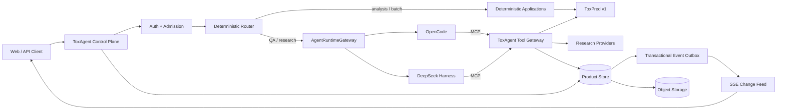

# ToxAgent Agentic Layer — Kế hoạch xây lại sau predictor-only

> **Trạng thái:** Proposed specification — cần product/engineering phê duyệt trước khi triển khai  
> **Ngày lập:** 2026-09-04  
> **Predictor baseline:** `562b988de9714106fd842bb503072cfe8cd2852a`  
> **Agent-era archive:** `archive/agent-layer-165319beede5`  
> **Phạm vi nguồn bên ngoài:** tài liệu sản phẩm, engineering và business từ OpenCode,
> DeepSeek, Anthropic và OpenAI; không sử dụng paper hoặc benchmark học thuật

Tài liệu này là kế hoạch canonical được đề xuất cho **agentic layer mới**. Nó được viết
sau khi workspace đã hoàn tất refactor predictor-only, vì vậy mọi giả định về code,
API, frontend, Firestore hoặc ADK của agent layer cũ chỉ còn giá trị lịch sử.

Tài liệu này thay thế các quyết định sau trong bộ spec ngày 2026-09-03:

- coi legacy `/analyze` là scientific-kernel boundary;
- migrate trực tiếp `/agent/*` và frontend cũ;
- đặt predictor và agent control plane trong cùng một runtime;
- coi capability mô tả ở `latest` OpenCode/DSH docs là capability mặc định của deployment.

Các pattern vẫn được kế thừa: typed tool plane, product-owned session, observation và
provenance, runtime gateway, một active agent, MCP ở boundary, shadow-before-enforce,
và eval tách scientific correctness khỏi answer quality.

---

## 1. Quyết định điều hành

### 1.1 Mục tiêu một câu

> **Xây ToxAgent thành một evidence-and-decision-support control plane: giữ nguyên sự
> thật định lượng từ ToxPred, bổ sung evidence có nguồn, trả lời follow-up có căn cứ,
> và đề xuất bước kiểm nghiệm tiếp theo qua một audit trail tái dựng được.**

### 1.2 Ranh giới sở hữu

| Thành phần | Sở hữu | Không sở hữu |
|---|---|---|
| **ToxPred** | Canonical SMILES, prediction, threshold/label, applicability, attribution, model provenance | Report, literature, hội thoại, aggregate verdict |
| **ToxAgent control plane** | Product API, auth, session, router, analysis snapshot, evidence, report, claims, validator, SSE, runtime binding | LLM agent loop, scientific model weights |
| **OpenCode/DSH** | Model–tool loop, provider request, runtime-local context và event | Product truth, user ownership, scientific policy, canonical audit |
| **Research providers** | Raw/normalized source records theo provider contract | Predictor output hoặc final product conclusion |
| **Frontend** | Rendering, interaction, client cache | Source of truth, report rehydration, enforcement |

### 1.3 Topology mặc định

Ba deployment boundary độc lập:

1. `toxpred`: predictor hiện tại, stateless, offline sau provisioning.
2. `toxagent-control`: product API, persistence, MCP tool gateway và validation.
3. `agent-runtime-host`: OpenCode hoặc DSH đã pin, không public ra internet.

Không thêm OpenCode, DSH, LLM, research hoặc session dependency vào package `toxpred`.
Agentic layer nên nằm ở repository/deployable project riêng. Nếu tạm dùng monorepo,
nó vẫn phải có `pyproject`, image, CI và dependency graph riêng, không được nằm trong
runtime/deploy context của predictor.

### 1.4 Runtime strategy

- **OpenCode V1 đã pin:** primary candidate cho app-facing vertical slice.
- **OpenCode V2:** evaluation track cho tới khi hết beta và server/plugin contract đủ ổn định.
- **DSH custom profile đã pin:** secondary/conformance runtime và batch eval worker.
- Một product session chỉ bind vào một runtime tại một thời điểm.
- Không ensemble hai runtime cho một answer mặc định.
- Không gọi runtime là nguồn budget; budget thuộc provider/model route và credential.

---

## 2. Baseline predictor và các invariant không được phá

### 2.1 Public contract hiện tại

| Method | Path | Ý nghĩa |
|---|---|---|
| `GET` | `/health/live` | Process liveness, không đại diện model readiness |
| `GET` | `/health/ready` | Required artifact đã load và verify |
| `GET` | `/v1/models` | Inventory capability và lý do unavailable |
| `POST` | `/v1/predictions` | Prediction cho một SMILES |
| `POST` | `/v1/predictions:batch` | Tối đa 256 input; giữ thứ tự, lỗi theo item |
| `POST` | `/v1/attributions` | Attribution cho đúng một endpoint/task |

Agentic layer chỉ consume contract versioned trên. Nó không import model implementation,
`backend/`, checkpoint class hoặc training code.

### 2.2 Invariant khoa học

| ID | Invariant | Enforcement ở agent layer |
|---|---|---|
| SCI-01 | hERG, Tox21 và ClinTox là measurement khác nhau | Schema/claim validator cấm đổi tên hoặc ánh xạ chéo |
| SCI-02 | Không có aggregate toxicity/severity score | Output schema không có field aggregate; policy validator từ chối |
| SCI-03 | Probability luôn đi cùng threshold, threshold source và model id | Analysis snapshot bắt buộc giữ nguyên các field |
| SCI-04 | hERG probability không phải calibrated clinical risk | Limitation bắt buộc khi answer diễn giải probability |
| SCI-05 | Tox21 assays độc lập, không dùng hit count như severity | Cấm claim suy ra mức độ nặng từ số assay active |
| SCI-06 | ClinTox unavailable phải fail rõ | Không fallback hoặc dùng hERG/Tox21 thay thế |
| SCI-07 | Applicability `element_rules_v1` không phải learned OOD | Không diễn giải `ok` là in-distribution hoặc safe |
| SCI-08 | Invalid SMILES không phải zero-risk prediction | Trả typed validation error, không tạo snapshot giả |
| SCI-09 | Attribution chỉ giải thích đúng endpoint/task | Cấm aggregate attribution hoặc đổi attribution thành causal proof |
| SCI-10 | Predictor provenance là bất biến | Copy lossless vào observation; không để LLM viết lại |

### 2.3 Invariant sản phẩm

| ID | Invariant |
|---|---|
| PROD-01 | Mọi final scientific/numeric claim phải trỏ tới observation/evidence tồn tại và thuộc session |
| PROD-02 | Raw runtime transcript không phải canonical report |
| PROD-03 | Model không tự commit answer; answer chỉ tồn tại sau deterministic validation |
| PROD-04 | Session state không phụ thuộc RAM của API hoặc runtime process |
| PROD-05 | Stream mất không làm mất state; client luôn reconstruct được bằng REST |
| PROD-06 | Tool bị deny vừa không xuất hiện với model, vừa không execute được qua transport |
| PROD-07 | Runtime/model/profile/tool schema version được pin theo run |
| PROD-08 | External content luôn là untrusted data, không phải instruction |
| PROD-09 | Không credential nào xuất hiện trong DB, transcript, event hoặc tool result |
| PROD-10 | Một recovery run không được nối text âm thầm vào run đã fail |

---

## 3. Product scope

### 3.1 Job-to-be-done

Khi một nhà nghiên cứu có SMILES hoặc một analysis snapshot, họ cần:

1. biết predictor đã đo gì và không đo gì;
2. hiểu đúng output theo từng endpoint;
3. tìm evidence liên quan mà không trộn source với model prediction;
4. xác định uncertainty và data gap;
5. chọn assay/verification step tiếp theo;
6. đưa report cho người khác review với toàn bộ provenance.

### 3.2 Personas

| Persona | Nhu cầu chính | Quyền mặc định |
|---|---|---|
| Research user | Analyze, hỏi report, tìm evidence | Tạo/read session của chính mình |
| Scientific reviewer | Audit claims, evidence và predictor provenance | Read-only session được share rõ ràng |
| Operator | Xem health, latency, cost, failure | Metadata/telemetry; không mặc định thấy nội dung khoa học |
| Administrator | Quản lý provider, retention, source allowlist | Config control; không bypass audit |

### 3.3 MVP use cases

| ID | Use case | Lane | LLM target |
|---|---|---|---:|
| UC-01 | Tạo analysis từ một SMILES | Deterministic | 0 |
| UC-02 | Tạo analysis batch | Deterministic | 0 |
| UC-03 | Hỏi về prediction/report hiện tại | Agentic | 1–2 model requests |
| UC-04 | Hỏi phân tử mới trong session | Mixed | Deterministic snapshot + 1–2 requests |
| UC-05 | Tìm và tổng hợp toxicology evidence | Agentic | 2–4 requests, hard step cap |
| UC-06 | Yêu cầu attribution cho endpoint/task | Mixed | Tool deterministic + synthesis |
| UC-07 | Resume/audit session sau restart | Deterministic state | 0 nếu chỉ đọc |
| UC-08 | Cancel/recover run | Control plane | 0 hoặc recovery turn rõ ràng |

### 3.4 Sau MVP

- Compound-name resolution qua provider có ambiguity handling.
- ~~Image-to-SMILES qua service riêng và explicit confirmation.~~ **Xong,
  2026-09-05** — `toxocr/` (MolScribe), boundary thứ tư theo đúng hình dạng đề
  xuất ở đây. Xem [ADR 0006](../../toxagent-control/docs/adr/0006-ocr-fourth-boundary.md)
  và PROGRESS §8/§9.
- Molecule comparison trên nhiều immutable snapshots.
- Similarity/read-across khi có provider và eval riêng.
- Export PDF/JSON signed artifact.
- Collaboration/share workflow với ACL và retention rõ.

### 3.5 Không thuộc phạm vi

- Kết luận `safe`, `unsafe`, regulatory-ready hoặc clinical recommendation.
- Tự động thực thi lab workflow hoặc thay đổi hệ thống bên ngoài.
- Multi-agent/subagent trong production MVP.
- Shell, code execution, file edit hoặc general web browsing từ runtime.
- Auto-learning memory, self-editing skill hoặc cross-user scientific memory.
- Đổi/retrain predictor trong cùng workstream.
- Aggregate risk score không có business policy versioned và review độc lập.

---

## 4. Kiến trúc đích



### 4.1 Dependency rules

```text
api -> application -> domain
application -> predictor_client, research interfaces, persistence interfaces
harness adapters -> runtime provider interface
tool gateway -> application services, không gọi runtime gateway
domain -> standard library / schema primitives, không provider SDK
toxpred -> không phụ thuộc bất kỳ package nào của toxagent-control
```

### 4.2 Execution lanes

#### Lane D — deterministic

Áp dụng khi intent đã rõ và outcome xác định:

- tạo prediction/attribution;
- batch;
- đọc session/report;
- validate/commit answer;
- format deterministic fallback;
- auth, quota, routing và policy.

Lane D không được gọi LLM. Runtime assertion và trace attribute phải chứng minh điều này.

#### Lane A — agentic

Áp dụng khi cần:

- giải thích theo câu hỏi tự do;
- tìm/sàng lọc unstructured evidence;
- so sánh evidence với prediction;
- tổng hợp limitation và next-test recommendation.

Lane A chỉ nhìn thấy capability profile nhỏ. Model không tự chọn lane.

### 4.3 Router rules

Router dùng request fields và deterministic parsers, không dùng LLM classifier ở MVP.

| Điều kiện | Quyết định |
|---|---|
| Có `molecule.smiles`, không có câu hỏi | `analysis` |
| Batch input | `analysis_batch` |
| Có `analysis_id` và câu hỏi | `report_qa` |
| Có từ khóa/request field research rõ ràng | `evidence_research` |
| Câu hỏi yêu cầu molecule mới và có SMILES | Tạo snapshot trước, sau đó `report_qa` |
| Input thiếu molecule/reference | `clarification_required`, chưa gọi runtime |
| Intent ngoài scope | `out_of_scope`, không gọi tool |

Nếu auto-routing không chắc chắn, trả clarification có cấu trúc. Không dùng model chỉ để
quyết định có nên gọi model.

---

## 5. Domain model và canonical schemas

### 5.1 Session

```text
Session
  id: UUID
  owner_id: SubjectId
  status: active | archived | deletion_pending | deleted
  title: string?
  preferred_language: vi | en
  active_analysis_id: UUID?
  context_epoch: integer >= 0
  created_at, updated_at
  version: integer
```

Invariant:

- `owner_id` không đổi.
- Archive không xóa audit; delete đi qua retention workflow.
- `active_analysis_id` chỉ trỏ tới analysis thuộc session.
- Mọi mutation dùng optimistic version hoặc transaction.

### 5.2 Message

```text
Message
  id: UUID
  session_id: UUID
  client_message_id: string?
  role: user | assistant | system_event
  sequence: integer
  content: typed parts
  created_at
```

`(session_id, client_message_id)` unique khi client cung cấp idempotency key.

### 5.3 Run

```text
Run
  id: UUID
  session_id: UUID
  trigger_message_id: UUID
  lane: deterministic | agentic | mixed
  intent: analysis | analysis_batch | report_qa | evidence_research | attribution
  status: queued | running | validating | completed | failed | cancelled
  runtime_binding_id: UUID?
  deadline_at: timestamp
  failure_code: string?
  created_at, started_at, ended_at
```

Allowed state transitions:

```text
queued -> running -> validating -> completed
queued -> cancelled
running -> cancelled
running -> failed
validating -> failed
```

Không chuyển `failed/cancelled/completed` trở lại `running`. Recovery tạo `Run` mới với
`recovery_of_run_id`.

### 5.4 AnalysisSnapshot

```text
AnalysisSnapshot
  id: UUID
  session_id: UUID
  run_id: UUID
  input_smiles: string
  canonical_smiles: string
  requested_endpoints: string[]
  predictor_response: lossless JSON
  predictor_base_url_id: string
  predictor_service_version: string?
  predictor_git_commit: string?
  artifact_hashes: string[]
  policy_snapshot: JSON
  created_at
  content_sha256: string
```

Snapshot immutable. `predictor_response` được lưu lossless sau schema validation. UI/model
đọc qua projection, không sửa payload canonical.

### 5.5 Observation

```text
Observation
  id: UUID
  session_id: UUID
  run_id: UUID
  producer: predictor | attribution | research | report_projection | validator
  kind: string
  schema_version: string
  canonical_payload_ref: JSON | ObjectRef
  model_projection: JSON
  provenance: JSON
  content_sha256: string
  created_at
```

Model projection phải:

- có giới hạn byte/token;
- giữ observation id và field paths;
- không chứa raw base64/binary;
- không bỏ limitation bắt buộc;
- có projection version.

### 5.6 EvidenceRecord

```text
EvidenceRecord
  id: UUID
  session_id: UUID
  provider: string
  provider_record_id: string
  source_type: article | database | regulatory | vendor_documentation | other
  title: string
  authors: string[]
  published_at: date?
  retrieved_at: timestamp
  canonical_url: string?
  identifier: {doi?, pmid?, cid?, other?}
  abstract_or_excerpt: string?
  normalized_facts: JSON
  source_quality_tier: primary | authoritative_secondary | secondary | unknown
  raw_payload_ref: ObjectRef?
  content_sha256: string
```

Evidence status:

```text
retrieved -> normalized -> accepted | rejected | superseded
```

`rejected` evidence không được dùng để support final claim nhưng vẫn có thể giữ trong
audit theo retention policy.

### 5.7 GroundedAnswer

```json
{
  "schema_version": "grounded-answer-v1",
  "answer_markdown": "...",
  "claims": [
    {
      "claim_id": "clm_...",
      "kind": "numeric",
      "text": "Predicted hERG blocker probability is 0.731.",
      "observation_id": "obs_...",
      "field_path": "predictions.herg.probability_blocker",
      "source_value": 0.73064,
      "rendered_value": "0.731",
      "transform": "round:3",
      "citation_ids": []
    }
  ],
  "limitations": [
    {
      "code": "uncalibrated_probability",
      "text": "This probability is not a calibrated clinical risk."
    }
  ],
  "recommended_next_steps": [
    {
      "text": "Confirm with an appropriate hERG assay.",
      "basis_claim_ids": ["clm_..."]
    }
  ]
}
```

Allowed `claim.kind`:

- `numeric`: exact field-backed number;
- `classification`: exact label/status from observation;
- `scientific`: source-backed interpretation;
- `comparison`: declared deterministic comparison between observations;
- `limitation`: model/source limitation;
- `recommendation`: proposed next step, never presented as fact.

### 5.8 RuntimeBinding

```text
RuntimeBinding
  id: UUID
  session_id: UUID
  runtime_kind: opencode | dsh
  runtime_version: string
  runtime_session_id: string
  provider_id: string
  model_id: string
  profile_hash: string
  tool_schema_hash: string
  system_prompt_hash: string
  capabilities: JSON
  status: active | lost | closed
  created_at, closed_at
```

Runtime session ID là correlation id, không phải authorization principal.

### 5.9 Attachment

```text
Attachment
  id: UUID
  owner_id: SubjectId
  session_id: UUID
  media_type: string
  object_uri: string
  sha256: string
  size_bytes: integer
  retention_class: transient | session | audit
  created_at, expires_at?
```

Model chỉ nhận attachment metadata hoặc signed reference phù hợp, không nhận base64 mặc định.

---

## 6. Product API specification

Service prefix đề xuất: `/v1`. Đây là API của `toxagent-control`, không phải path mới
trong ToxPred.

### 6.1 Tạo session

`POST /v1/sessions`

Request:

```json
{
  "preferred_language": "vi",
  "title": "Optional title",
  "client_session_id": "optional-idempotency-key"
}
```

Response `201`:

```json
{
  "session_id": "ses_...",
  "status": "active",
  "preferred_language": "vi",
  "created_at": "...",
  "version": 1
}
```

### 6.2 Gửi message/work request

`POST /v1/sessions/{session_id}/messages`

Request:

```json
{
  "client_message_id": "web-uuid",
  "content": [{"type": "text", "text": "Phân tích aspirin và giải thích hERG"}],
  "intent_hint": "auto",
  "molecule": {
    "smiles": "CC(=O)Oc1ccccc1C(=O)O"
  },
  "analysis_options": {
    "endpoints": ["herg", "tox21"],
    "threshold_overrides": null,
    "include_attribution": false
  }
}
```

`intent_hint`:

```text
auto | analyze | ask_report | research_evidence | request_attribution
```

Response `202`:

```json
{
  "message_id": "msg_...",
  "run_id": "run_...",
  "run_status": "queued",
  "selected_intent": "analysis",
  "events_url": "/v1/sessions/ses_.../events"
}
```

Threshold overrides chỉ cho role/policy được phép. Nếu dùng, source vẫn phải là
`request_override` trong snapshot và answer.

### 6.3 Đọc state

| Method | Path | Response |
|---|---|---|
| `GET` | `/v1/sessions/{id}` | Session projection + active run/analysis |
| `GET` | `/v1/sessions/{id}/messages` | Paginated canonical messages/parts |
| `GET` | `/v1/sessions/{id}/runs/{run_id}` | Run status, timings, error |
| `GET` | `/v1/sessions/{id}/analyses/{analysis_id}` | Analysis projection; raw payload tùy quyền |
| `GET` | `/v1/sessions/{id}/answers/{answer_id}` | Validated GroundedAnswer |
| `GET` | `/v1/sessions/{id}/evidence` | Paginated accepted evidence |
| `GET` | `/v1/attachments/{id}` | Signed redirect/stream sau ACL check |

### 6.4 Event stream

`GET /v1/sessions/{session_id}/events`

SSE event envelope:

```json
{
  "event_id": "evt_...",
  "session_id": "ses_...",
  "sequence": 42,
  "type": "tool.completed",
  "entity_type": "part",
  "entity_id": "prt_...",
  "entity_version": 3,
  "run_id": "run_...",
  "occurred_at": "...",
  "payload": {}
}
```

Event types MVP:

```text
session.created
message.created
run.queued
run.started
run.validating
run.completed
run.failed
run.cancelled
part.created
part.updated
tool.started
tool.completed
tool.failed
observation.created
analysis.created
evidence.created
answer.accepted
answer.rejected
runtime.recovery_started
```

Client reconnect bằng `Last-Event-ID` hoặc `after_sequence`. Stream chỉ phát event đã
commit vào outbox. Token deltas có thể là ephemeral optimization; canonical assistant
part được persist theo bounded chunk, không ghi một DB row cho mỗi token.

### 6.5 Cancel

`POST /v1/sessions/{session_id}/runs/{run_id}:cancel`

Response mô tả capability thật:

```json
{
  "run_id": "run_...",
  "requested": true,
  "runtime_cancel_supported": false,
  "action": "runtime_process_termination_requested"
}
```

Không trả `cancelled` cho tới khi run đã terminal và owned work đã quiescent hoặc worker
đã bị terminate.

### 6.6 Error envelope

```json
{
  "error": {
    "code": "invalid_smiles",
    "message": "...",
    "retryable": false,
    "run_id": "run_...",
    "details": {}
  }
}
```

MVP error codes:

```text
invalid_request
invalid_smiles
analysis_not_found
endpoint_unavailable
predictor_not_ready
runtime_unavailable
runtime_protocol_error
tool_denied
tool_timeout
provider_rate_limited
evidence_unavailable
answer_validation_failed
deadline_exceeded
conflict
```

---

## 7. Application workflows

### 7.1 Create analysis

```text
admit request
  -> auth/ownership
  -> validate envelope
  -> deterministic route
  -> call ToxPred /v1/predictions
  -> validate predictor response schema
  -> store immutable AnalysisSnapshot + Observation
  -> build deterministic display projection
  -> commit run
```

Không tự động chạy attribution. Không research nếu user chỉ yêu cầu analysis.

### 7.2 Report Q&A

```text
admit question
  -> resolve active analysis
  -> construct scoped context references
  -> runtime turn with report_qa profile
  -> model reads small analysis slices through tools
  -> model calls submit_grounded_answer
  -> deterministic validator
      -> accepted: commit answer
      -> rejected: typed violations returned once
  -> at most one correction attempt
  -> if still invalid: deterministic safe fallback
```

### 7.3 Evidence research

```text
question + analysis reference
  -> search provider through ToxAgent tool
  -> normalize and snapshot source records
  -> reject duplicates/invalid/untrusted records by policy
  -> retrieve details only for selected records
  -> synthesize claims with evidence ids
  -> validate citation existence/support metadata
  -> commit answer and evidence bundle
```

Source search result không tự động trở thành evidence accepted. Search snippets không đủ
support claim chi tiết nếu provider có full record/abstract endpoint.

### 7.4 Runtime failure recovery

| Điểm lỗi | Hành vi |
|---|---|
| Trước request đầu tiên | Có thể bind runtime khác và ghi selection reason |
| Sau request, chưa tool call | Fail run; tạo recovery run nếu policy cho phép |
| Sau tool call | Reuse stored observation; không gọi lại tool idempotent nếu không cần |
| Sau answer candidate, trước validation | Validate candidate nếu đầy đủ; nếu không thì fail |
| Sau client đã nhận text delta | Kết thúc run cũ; recovery run là entity riêng |
| Không biết provider đã charge | Đánh dấu `potentially_billed`; không retry vô hạn |

---

## 8. Tool plane và MCP specification

### 8.1 Nguyên tắc

- Internal typed registry là canonical.
- MCP là transport adapter cho OpenCode/DSH.
- Tool schema và execution policy dùng cùng một source of truth.
- Tool handler không trả error dưới dạng success prose.
- Mọi call có deadline và abort/cancellation signal khi transport hỗ trợ.
- Tool output canonical tách khỏi model projection và UI projection.

### 8.2 Tool result envelope

```json
{
  "schema_version": "tool-result-v1",
  "call_id": "call_...",
  "tool_name": "create_analysis_snapshot",
  "status": "completed",
  "observation_ids": ["obs_..."],
  "canonical": {},
  "model_view": {},
  "ui_view": {},
  "attachments": [],
  "provenance": {},
  "duration_ms": 123
}
```

Error:

```json
{
  "schema_version": "tool-result-v1",
  "call_id": "call_...",
  "tool_name": "search_toxicology_evidence",
  "status": "error",
  "error": {
    "code": "provider_rate_limited",
    "message": "Evidence provider rate limit exceeded.",
    "retryable": true,
    "retry_after_ms": 30000
  }
}
```

### 8.3 Capability profiles

| Profile | Tools visible |
|---|---|
| `analysis` | `create_analysis_snapshot`, `get_analysis_slice`, `submit_grounded_answer` |
| `report_qa` | `get_analysis_slice`, `get_attribution`, `submit_grounded_answer` |
| `evidence_research` | `get_analysis_slice`, `search_toxicology_evidence`, `get_evidence_record`, `submit_grounded_answer` |
| `audit_readonly` | `get_analysis_slice`, `get_evidence_record` |

`submit_grounded_answer` chỉ visible cho root product agent, không visible cho evaluator
hoặc read-only audit client.

### 8.4 Tool contracts

#### `create_analysis_snapshot`

Input:

```json
{
  "session_id": "ses_...",
  "smiles": "...",
  "endpoints": ["herg", "tox21"],
  "threshold_overrides": null
}
```

Output model view:

```json
{
  "analysis_id": "ana_...",
  "canonical_smiles": "...",
  "available_sections": ["herg", "tox21", "applicability", "provenance"],
  "required_limitations": ["uncalibrated_probability"]
}
```

Rules:

- Idempotency key: canonical SMILES + endpoints + resolved policy + predictor/artifact hash.
- Không gọi attribution/research.
- `endpoint_unavailable` được giữ nguyên; không fallback.
- Runtime không được cung cấp `owner_id`; server resolve từ capability token.

#### `get_analysis_slice`

Input:

```json
{
  "analysis_id": "ana_...",
  "section": "herg",
  "fields": ["probability_blocker", "label", "threshold", "threshold_source", "model_id"]
}
```

Rules:

- Chỉ allow declared field paths.
- Trả observation id cho từng slice.
- Limitation liên quan được tự động kèm theo, model không thể yêu cầu bỏ.

#### `get_attribution`

Input:

```json
{
  "analysis_id": "ana_...",
  "endpoint": "tox21",
  "task": "SR-p53"
}
```

Rules:

- `task` bắt buộc cho Tox21.
- Attribution result không được mô tả là causal mechanism.
- Timeout riêng vì cần backward pass.
- Cache theo canonical SMILES + endpoint/task + artifact hash + method version.

#### `search_toxicology_evidence`

Input:

```json
{
  "analysis_id": "ana_...",
  "query": "...",
  "source_types": ["article", "database"],
  "date_from": null,
  "limit": 10
}
```

Rules:

- Query, provider và source filters được log.
- Provider allowlist do server policy quyết định.
- Search result chỉ trả compact metadata; không dump full payload.
- External text được gắn `untrusted_external_content=true`.

#### `get_evidence_record`

Input:

```json
{
  "evidence_id": "evd_...",
  "fields": ["title", "identifier", "abstract_or_excerpt", "normalized_facts"]
}
```

Rules:

- Chỉ evidence thuộc session hoặc shared evidence scope được phép.
- Raw payload chỉ cho audit role, không model-facing mặc định.
- Citation dùng canonical URL/identifier từ record, không dùng URL do model tự tạo.

#### `submit_grounded_answer`

Input là `GroundedAnswer` candidate.

Behavior:

1. Validate schema.
2. Resolve mọi observation/evidence reference và ACL.
3. Validate numeric/classification claims.
4. Validate required limitations.
5. Validate recommendation wording và prohibited conclusions.
6. Nếu pass, commit immutable answer và trả `answer_id`.
7. Nếu fail, trả danh sách typed violations; chỉ cho một correction attempt mỗi run.

Tool không cho phép overwrite answer đã accepted.

### 8.5 MCP authentication

Runtime gọi MCP bằng short-lived run capability token:

```text
subject: runtime binding id
session_id: exact session
run_id: exact run
allowed_tools: exact capability profile
expires_at: <= run deadline + grace
nonce/jti: auditable
```

Token được gửi qua secret header/secure local transport, không xuất hiện trong model schema.
OpenCode/DSH runtime session id chỉ dùng correlation. Tool server tự resolve owner và
scope từ signed capability; không tin `session_id` do model truyền nếu nó mâu thuẫn token.

### 8.6 Tool timeout defaults

| Tool | Soft timeout | Hard timeout | Retry |
|---|---:|---:|---|
| `get_analysis_slice` | 2 s | 5 s | Không cần, local store |
| `create_analysis_snapshot` | 60 s | 120 s | Tối đa 1 nếu chưa có observation |
| `get_attribution` | 90 s | 180 s | Không automatic sau dispatch |
| `search_toxicology_evidence` | 20 s | 45 s | Tối đa 1 theo `Retry-After` và deadline |
| `get_evidence_record` | 10 s | 30 s | Tối đa 1 |
| `submit_grounded_answer` | 5 s | 10 s | Idempotent theo candidate hash |

Các số là initial operational defaults, phải chuyển thành config versioned và điều chỉnh
từ telemetry; không phải scientific semantics.

---

## 9. Provenance và answer validation

### 9.1 Numeric validation

Với mỗi numeric claim:

1. `observation_id` tồn tại và thuộc session.
2. `field_path` nằm trong schema/version của observation.
3. `source_value` bằng canonical numeric value.
4. `transform` thuộc allowlist:
   - `identity`;
   - `round:n`, `0 <= n <= 6`;
   - `percent:n`, nhân chính xác `100` rồi round;
   - deterministic difference/ratio có input claim ids khai báo.
5. `rendered_value` khớp transform, chấp nhận dấu phẩy thập phân cho tiếng Việt.

Tolerance cho `round:n`:

```text
abs(rendered_numeric - source_value) <= 0.5 * 10^(-n) + 1e-12
```

Không tự suy luận unit conversion. Không dùng regex/string replacement để sửa answer đã sai.

### 9.2 Classification validation

- `label`, `active`, `status`, `threshold_source`, `model_id` phải exact match.
- Alias chỉ dùng ở renderer; canonical claim lưu raw enum.
- Không được đổi `non_blocker` thành `safe`.
- Không được đổi `applicability.ok` thành `in_distribution`.

### 9.3 Scientific claim validation

Mỗi claim cần ít nhất một trong hai basis:

- predictor/analysis observation với field path;
- accepted evidence records với citation ids.

Validator deterministic chỉ xác nhận reference, status, field-level consistency và
prohibited patterns. Support semantics mở cần model grader/human audit trong eval; không
tuyên bố một heuristic là proof đầy đủ.

### 9.4 Required limitations

| Trigger | Limitation code bắt buộc |
|---|---|
| Diễn giải probability | `uncalibrated_probability` |
| `applicability.status=ok` được nhắc | `applicability_is_rule_based` |
| Attribution được nhắc | `attribution_not_causality` |
| Endpoint unavailable | `endpoint_unavailable` |
| External evidence thiếu/full text không có | `evidence_scope_limited` |
| Recommendation assay | `screening_not_safety_assessment` |

Renderer có thể gộp wording để tránh lặp, nhưng canonical limitation codes phải đủ.

### 9.5 Correction policy

```text
candidate #1
  -> valid: accept
  -> invalid: return exact violation codes + allowed correction fields
candidate #2
  -> valid: accept
  -> invalid: fail agent answer and emit deterministic fallback
```

Không reflection loop vô hạn. Không gọi evaluator agent trong production MVP.

---

## 10. AgentRuntimeGateway

### 10.1 Provider contract

```python
class AgentRuntimeProvider(Protocol):
    kind: Literal["opencode", "dsh"]

    async def health(self) -> RuntimeHealth: ...
    async def capabilities(self) -> RuntimeCapabilities: ...
    async def create_session(self, spec: RuntimeSessionSpec) -> RuntimeSession: ...
    async def send(self, session: RuntimeSession, turn: RuntimeTurn) -> RuntimeReceipt: ...
    async def events(self, session: RuntimeSession, after: str | None) -> AsyncIterator[RuntimeEvent]: ...
    async def cancel(self, session: RuntimeSession, run: RuntimeReceipt) -> CancelOutcome: ...
    async def close(self, session: RuntimeSession) -> CloseOutcome: ...
```

`RuntimeCapabilities`:

```json
{
  "streaming": true,
  "resume": true,
  "cancel_turn": false,
  "close_session": false,
  "mcp_streamable_http": true,
  "native_structured_output": false,
  "usage": ["input_tokens", "output_tokens"],
  "attachments": ["text"]
}
```

Không infer capability theo runtime name; adapter probe và lưu manifest thật.

### 10.2 Normalized runtime events

```text
runtime.session.created
runtime.turn.accepted
runtime.turn.started
runtime.message.delta
runtime.tool.requested
runtime.tool.completed
runtime.usage.reported
runtime.turn.idle
runtime.turn.failed
runtime.session.lost
```

Adapter phải giữ raw event reference để audit, nhưng product logic chỉ consume normalized
events. Unknown runtime event được lưu/log và không tự động map thành success.

### 10.3 Binding và recovery

- Runtime selector chạy khi tạo first agentic run của session.
- Binding pin `runtime/version/provider/model/profile/tool schema/system prompt`.
- Không đổi runtime giữa các step của một run.
- Nếu binding lost, tạo checkpoint từ product-owned observations/messages rồi tạo recovery run.
- Runtime-local transcript có thể mất; product state vẫn đủ để trả report và dựng prompt mới.

### 10.4 Context assembly

Thứ tự prefix ổn định:

1. product/system role;
2. scientific invariants;
3. capability profile và tool schema;
4. session checkpoint;
5. pinned analysis/evidence references;
6. recent messages;
7. current user message.

Projection trước compaction:

1. Dùng field slice thay raw observation.
2. Bỏ payload có thể lookup lại bằng id.
3. Giữ canonical SMILES, analysis id, predictor provenance, cited evidence và open intent.
4. Chỉ sau đó mới summarize conversation tail thành checkpoint.

Product store không xóa/rewrite transcript gốc khi compact runtime context.

---

## 11. OpenCode integration spec

### 11.1 Version policy

- Production candidate đầu tiên dùng exact V1 release/binary digest đã pin.
- Snapshot OpenAPI từ chính binary bằng smoke job.
- V2 chạy side-by-side trong eval; không dùng floating beta contract.
- Mọi upgrade phải chạy adapter contract suite và paired agent benchmark.

### 11.2 Dedicated agent

Tạo agent `toxagent` ở mode `primary`, step cap ban đầu 4 cho Q&A và 6 cho research.
Không dùng built-in `build`, `plan`, `general` hoặc `explore` làm product agent.

Policy theo nguyên tắc deny-all:

```text
deny shell/edit/read/glob/grep/list/subagent/skill/webfetch/websearch/execute
allow exact toxagent MCP actions
deny every other MCP namespace
```

Nếu chạy V2:

- dùng native V2 ordered `permissions` array;
- đặt ToxAgent MCP server `codemode: false`;
- deny `execute` để Code Mode dispatcher không available;
- disable built-in agents không cần thiết;
- không dựa vào default permissions vì default agents có quyền coding rộng.

### 11.3 Server exposure

- Bind loopback hoặc private network.
- ToxAgent gateway là client duy nhất.
- Không đưa provider OAuth/API credential vào request từ frontend.
- Không expose OpenCode share/session endpoints ra public product API.

### 11.4 Required contract tests

1. Create session.
2. Send async prompt và observe turn lifecycle.
3. MCP discovery chỉ thấy exact allowlist.
4. Direct denied call fail.
5. Abort đang chạy trả capability thật.
6. Reconnect event stream và reconcile messages.
7. Restart runtime làm binding `lost`, không làm mất product session.
8. Upgrade OpenAPI diff được review.

---

## 12. DeepSeek Harness integration spec

### 12.1 Profile policy

Không dùng `sdk-minimal` nguyên trạng vì profile đó có shell/editor,
`danger-full-access`, và không có context management/compaction/telemetry mặc định.

Tạo profile/bundle ToxAgent riêng với tối thiểu:

- exact model adapter;
- SDK JSON-RPC server;
- session events/persistence cần thiết cho runtime-local resume;
- MCP client;
- tool restriction;
- bounded retry/timeout;
- no shell/editor/filesystem/web/subagent/workflow plugins;
- no stdout logger làm hỏng JSON-RPC channel;
- isolated explicit `DSH_HOME`.

### 12.2 SDK limitations phải phản ánh trong adapter

- Không protocol-version negotiation đáng tin cậy.
- Không prompt-cancel/session-close method trên SDK wire.
- `session/prompt` receipt chỉ xác nhận enqueue, không phải final result.
- Phải theo dõi session events + status để sở hữu interval.
- Deadline cứng có thể cần terminate runtime process.
- Packaged runtime phải được smoke test với MCP; không giả định source checkout tương đương wheel.

### 12.3 DSH cancellation semantics

```text
gateway cancel requested
  -> adapter marks cancel unsupported
  -> stop accepting new turn work
  -> terminate owned worker process after grace
  -> wait/reap process
  -> mark runtime binding lost
  -> mark product run cancelled or failed with exact outcome
```

Không map client disconnect thành DSH cancellation thành công.

### 12.4 Required contract tests

1. Start exact packaged carrier.
2. Initialize exact provider/model/profile.
3. MCP initialize + tools/list + tools/call.
4. Missing MCP plugin làm startup fail loud.
5. Session events map đúng turn/tool/result.
6. Process termination không bỏ orphan.
7. JSONL/runtime-local corruption không phá product canonical state.
8. Profile dump/hash khớp manifest run.

---

## 13. Persistence và streaming

### 13.1 Storage recommendation

Cho greenfield production:

- PostgreSQL/Cloud SQL: session, messages, runs, parts, observations metadata, claims,
  answer, evidence metadata, runtime bindings và transactional outbox.
- Cloud Storage/object store: raw provider payload, image, heatmap, large JSON, export.
- Redis chỉ khi có measured need cho ephemeral locks/rate limits; không làm source of truth.

Lý do chọn relational store: transaction giữa state và event outbox, foreign-key provenance,
unique idempotency constraints, ordered sequence và audit query rõ hơn. Nếu tổ chức bắt buộc
Firestore, các interface không đổi nhưng phải chứng minh atomicity/idempotency tương đương.

### 13.2 Logical tables

```text
sessions
messages
message_parts
runs
runtime_bindings
analysis_snapshots
observations
evidence_records
answers
claims
claim_sources
attachments
event_outbox
```

Critical constraints:

- Claims FK tới answer và source observation/evidence.
- Source phải cùng session hoặc share scope hợp lệ.
- Analysis snapshot immutable bằng DB permission/trigger/application contract.
- Session sequence unique và monotonic.
- Accepted answer unique theo `(run_id, candidate_generation)`; chỉ một active final.
- Idempotency keys unique theo owner/session scope.

### 13.3 Outbox/SSE

Application mutation và outbox event commit trong cùng transaction. Dispatcher đọc outbox,
phát SSE và đánh dấu delivery metadata. SSE delivery là at-least-once; client dedupe bằng
event id/sequence.

### 13.4 Retention classes

| Class | Ví dụ | Default đề xuất |
|---|---|---|
| `transient` | Raw token delta, temporary provider payload | 24 giờ hoặc không persist |
| `session` | Messages, normalized evidence | Theo account policy |
| `audit` | Analysis, accepted answer, claim sources, hashes | Theo product/compliance policy |
| `credential` | Provider tokens | Không bao giờ vào product DB |

Retention cụ thể là product decision trước production, không hard-code trong handler.

---

## 14. Security và trust boundaries

### 14.1 Authentication/authorization

- Product user auth ở ToxAgent control plane.
- Runtime không xác thực thay user.
- MCP capability token ngắn hạn, scope theo session/run/tool.
- Mọi read/write query lọc owner/share scope tại server.
- 404/403 policy không leak sự tồn tại của foreign session.

### 14.2 Prompt injection từ evidence

Research content được lưu như untrusted data:

- không ghép vào system instruction;
- không cho source text định nghĩa tool/action;
- projection có delimiter/type metadata;
- direct URL fetching bởi model bị deny;
- citation URL lấy từ normalized provider record;
- mọi tool authority quyết định bằng server policy, không bằng source content.

### 14.3 Secrets

- Runtime/provider credentials chỉ tồn tại trong runtime host secret store.
- Research provider credentials chỉ ở control-plane secret manager.
- Redaction trước logs/traces/events.
- Không lưu complete Authorization headers.
- Tool error message không echo secret/config.

### 14.4 Network

- ToxPred chỉ nhận traffic từ control plane/approved clients.
- Runtime host chỉ gọi model provider và ToxAgent MCP endpoint cần thiết.
- ToxAgent MCP endpoint private hoặc mTLS/signed-token protected.
- OpenCode/DSH management ports không public.
- Research egress qua explicit provider adapters/allowlist.

### 14.5 Abuse/limits

- Max message size, batch size và attachment size.
- Per-user/session concurrent run cap.
- Per-run step, tool call, token và wall-clock budget.
- Provider circuit breaker/rate limit.
- Duplicate/cyclic tool call detector.
- `submit_grounded_answer` tối đa hai candidate mỗi run.

---

## 15. Observability và operational contract

### 15.1 Trace identity

Mọi span/event mang tối thiểu:

```text
request_id
session_id
run_id
runtime_binding_id
runtime_kind/version
provider/model
tool call id
analysis/observation ids khi có
```

Không đưa raw prompt/evidence vào metrics labels.

### 15.2 Metrics

| Nhóm | Metrics |
|---|---|
| Product | session created, analysis completed, answer accepted/rejected, user correction |
| Runtime | health, startup, TTFT, time-to-idle, lost binding, cancel outcome |
| LLM | input/output/reasoning/cache tokens nếu provider trả, cost, step count |
| Tool | success/error/timeout/retry, latency, payload/model-view size |
| Provenance | violations theo code, first-pass acceptance, retry acceptance, fallback rate |
| Evidence | provider yield, accepted/rejected, duplicate rate, citation support audit |
| State | outbox lag, SSE reconnect, REST reconciliation, session restore failure |

### 15.3 Initial SLO candidates

SLO vận hành chỉ chốt sau một tuần internal telemetry. Candidate ban đầu:

- Deterministic analysis completion excluding invalid input: >= 99.5%.
- Accepted answer luôn có complete claim-source graph: 100%.
- Cross-session leakage/disallowed tool execution: 0.
- Session REST reconstruction sau stream loss: 100% integration suite.
- Runtime/process orphan sau cancel/timeout: 0 trong soak test.
- Latency/cost dùng measured baseline; mỗi release không regression >20% nếu quality không tăng.

---

## 16. Evaluation và benchmark specification

### 16.1 Bốn suite độc lập

| Suite | Câu hỏi | Có LLM? |
|---|---|---:|
| `predictor-scientific` | Model prediction có giữ performance/parity không? | Không |
| `harness-contract` | Tool, state, auth, cancellation và recovery có đúng không? | Chủ yếu không |
| `agent-capability` | Agent có hoàn thành task và grounded không? | Có |
| `agent-regression` | Behavior đã từng pass có bị lùi không? | Có |

Không gộp AUROC/PR-AUC của predictor với agent answer score.

### 16.2 Initial 50-task set

Dùng predictor golden panel hiện tại làm seed, nhưng task agent là conversation/workflow
fixture riêng.

| Nhóm | Số task | Ví dụ |
|---|---:|---|
| Numeric fidelity | 12 | Probability/threshold/rounding VI/EN |
| Endpoint semantics/limits | 8 | hERG vs clinical, Tox21 independence, OOD wording, ClinTox unavailable |
| Report Q&A | 10 | So sánh fields, giải thích label, hỏi limitation |
| Evidence synthesis | 8 | Source selection, citation support, conflicting evidence |
| Failure/recovery | 6 | Predictor 503, tool timeout, provider rate limit, lost runtime |
| Adversarial/session | 6 | Prompt injection trong abstract, denied tool, foreign session, compaction/resume |

Sau internal launch, mở rộng bằng production failures và SME feedback. Capability tasks
khó có thể bắt đầu pass rate thấp; regression tasks phải gần 100%.

### 16.3 Fixture modes

#### Frozen mode

- Predictor/evidence/tool outputs snapshot và content-hashed.
- Không internet.
- Dùng cho CI và paired runtime comparison.
- Reference answer chứng minh task/graders solvable.

#### Predictor integration mode

- Chọn representative subset gọi ToxPred thật.
- Verify snapshot parity, unavailable endpoint và typed errors.
- Không chạy LLM trên toàn bộ 2.690/783 scientific split.

#### Live evidence mode

- Chạy scheduled/manual.
- Ground truth có timestamp/source snapshot.
- Không làm deterministic merge gate một mình.
- SME review các thay đổi source hoặc disputed claims.

### 16.4 Graders

| Grader | Dùng cho |
|---|---|
| Code/schema | API shape, field equality, claim graph, citations resolve, denied tools |
| State/outcome | DB state, accepted answer, no foreign access, recovery semantics |
| Transcript heuristic | Steps, duplicate calls, token/cost, required/forbidden tools khi cần |
| Model rubric | Coverage, clarity, open-ended groundedness, source support |
| Human SME | Scientific interpretation, utility, calibrate model grader |

Grade outcome nhiều hơn exact tool trajectory. Chỉ assert tool call cụ thể khi đó là
security/scientific invariant, ví dụ không thể trả numeric value nếu chưa có observation.

### 16.5 Hard gates

Task fail bất kể quality score nếu:

1. Numeric/classification claim không khớp source.
2. hERG bị diễn giải thành clinical toxicity.
3. Unavailable endpoint bị substitute.
4. Tox21 hits bị đổi thành severity.
5. Citation không tồn tại hoặc không thuộc accepted evidence.
6. Scientific claim quan trọng không có source.
7. Tool bị deny đã execute.
8. Có cross-session data leak.
9. Có claim `safe`, regulatory hoặc clinical vượt scope.
10. Product run thành công nhưng không reconstruct được source graph.

Critical subset phải pass mọi trial; không average để che lỗi.

### 16.6 Quality rubric sau hard gate

| Dimension | Weight |
|---|---:|
| Grounded correctness | 35% |
| Question/task coverage | 20% |
| Uncertainty và limitation | 15% |
| Source quality/citation support | 15% |
| Utility của next-step recommendation | 10% |
| Clarity/concision | 5% |

### 16.7 Metrics

- `pass@1`: product headline.
- `pass^3`: consistency trên ba trials cho release candidate.
- Overall/category task pass rate.
- Grounded claim precision/recall.
- Unsupported critical claim count/rate.
- Citation validity và support rate.
- First-candidate validator acceptance.
- Deterministic fallback rate.
- Major/minor SME correction rate.
- Tool calls, duplicate calls, steps.
- TTFT, total latency, token/cost per successful task.
- Runtime/tool/session failure rates.

`pass@k` không phải headline cho user-facing path vì user chỉ nhận một answer.

### 16.8 OpenCode vs DSH experiment matrix

Chạy hai comparison track:

#### Track A — isolate harness

Giữ cố định:

- provider/model endpoint;
- system instructions;
- tool schemas/projections;
- frozen fixtures;
- output schema;
- task set;
- token/step budgets tương đương.

Biến duy nhất là runtime adapter/harness. Chạy paired tasks với 3 trials/release candidate,
5 trials cho quyết định runtime lớn.

#### Track B — deployment reality

Mỗi runtime dùng route/model/auth dự kiến thật. So sánh outcome, reliability, latency,
cost và operational burden; không diễn giải difference là do harness riêng lẻ.

### 16.9 Eval manifest

Mỗi run ghi:

```json
{
  "eval_suite_hash": "...",
  "toxagent_commit": "...",
  "toxpred_commit": "...",
  "predictor_artifact_hashes": ["..."],
  "runtime_kind": "opencode",
  "runtime_version": "...",
  "runtime_binary_sha256": "...",
  "runtime_profile_hash": "...",
  "provider": "...",
  "model": "...",
  "system_prompt_hash": "...",
  "tool_schema_hash": "...",
  "source_snapshot_hash": "...",
  "trial_count": 3,
  "seed_or_provider_controls": {},
  "environment": {}
}
```

### 16.10 Proposed launch gates

| Gate | Internal alpha | Production candidate |
|---|---:|---:|
| Critical hard gates | `pass^3 = 100%` | `pass^5 = 100%` trên critical set |
| Capability `pass@1` | >= 80% | >= 85%, không category <80% |
| Numeric claim fidelity | 100% | 100% |
| Unsupported critical claims | 0 | 0 |
| Scientific citation support | >= 95% | >= 98%; numeric source 100% |
| Major SME correction | <= 15% | <= 10% |
| Denied tool/cross-session leak | 0 | 0 + adversarial soak |
| Cost/latency | Baseline only | SLO và non-regression gate đã phê duyệt |

Đây là starting thresholds. Sau baseline đầu, thay đổi ngưỡng phải qua versioned eval ADR,
không sửa âm thầm để làm build xanh.

### 16.11 Human review protocol

- Hai SME chấm mù tối thiểu 20% capability set và mọi critical failure.
- Randomize OpenCode/DSH answer order.
- Không hiển thị model/runtime/provider cho reviewer.
- Lưu major/minor correction và lý do.
- Đo agreement; disagreement được adjudicate và có thể tạo task/clarify rubric mới.
- Model grader được re-calibrate khi agreement với SME giảm.

---

## 17. Repository/package plan

Khuyến nghị tạo repository `toxagent-control` riêng. Package map:

```text
toxagent-control/
  pyproject.toml
  toxagent/
    api/
      app.py
      sessions.py
      messages.py
      events.py
      attachments.py
      errors.py
    domain/
      session.py
      run.py
      analysis.py
      observation.py
      evidence.py
      answer.py
      provenance.py
    application/
      create_analysis.py
      answer_report.py
      research_evidence.py
      submit_answer.py
      cancel_run.py
    predictor/
      client.py
      schemas.py
      contract_snapshot.json
    research/
      interfaces.py
      providers/
      normalization.py
      policy.py
    tools/
      registry.py
      runner.py
      definitions/
      projections.py
      mcp_server.py
    harness/
      gateway.py
      provider.py
      context.py
      adapters/
        opencode_v1.py
        opencode_v2.py
        dsh.py
    validation/
      numeric.py
      claims.py
      citations.py
      limitations.py
      prohibited_claims.py
    persistence/
      interfaces.py
      postgres/
      object_store.py
      outbox.py
    streaming/
      events.py
      sse.py
    telemetry/
      traces.py
      metrics.py
  agent_profiles/
    opencode/
    dsh/
    prompts/
  evals/
    tasks/
    fixtures/
    graders/
    manifests/
    runner.py
  tests/
    unit/
    contract/
    integration/
    e2e/
```

ToxPred OpenAPI snapshot được pin/generate thành client contract. Không copy Pydantic/domain
classes từ predictor sang agent repo bằng tay nếu có thể generate hoặc validate từ schema.

---

## 18. Rollout plan

Estimate dưới đây dành cho một engineer đã quen codebase, không gồm thời gian procurement,
legal/provider terms, frontend visual design hoặc toxicology SME availability.

### Phase 0 — Contract freeze và ADR

**Estimate:** 2–3 engineer-days  
**Depends on:** predictor baseline

Deliverables:

- Predictor OpenAPI snapshot tại exact commit.
- ADR: three-boundary topology.
- ADR: no aggregate verdict.
- Runtime version/auth/provider inventory.
- Initial 50-task eval specification và fixture format.
- Mark old agent-era docs as historical/superseded where applicable.

Exit gate:

- Một reviewer có thể xác định chính xác phần nào thuộc ToxPred, control plane và runtime.
- Không còn implementation plan nào phụ thuộc legacy `/analyze` hoặc `/agent/*`.

### Phase 1 — Deterministic control plane

**Estimate:** 6–9 engineer-days  
**Depends on:** Phase 0

Deliverables:

- Session/message/run/analysis/observation domain models.
- Product API create/read session và submit analysis.
- ToxPred client + response validation.
- Postgres migrations + outbox + basic SSE.
- Deterministic analysis projection.
- Unit/contract/integration tests.

Exit gate:

- SMILES valid tạo immutable analysis snapshot.
- Invalid SMILES/503/unavailable endpoint giữ đúng typed semantics.
- Restart control plane không mất session.
- LLM call count bằng 0.

### Phase 2 — Tool plane và grounded-answer validator

**Estimate:** 6–9 engineer-days  
**Depends on:** Phase 1

Deliverables:

- Typed registry/runner.
- `create_analysis_snapshot`, `get_analysis_slice`, `get_attribution`,
  `submit_grounded_answer`.
- MCP Streamable HTTP adapter + capability token.
- Numeric/classification/limitation validators.
- Deterministic fallback renderer.
- Harness-contract suite.

Exit gate:

- Standard MCP client gọi được exact allowlist.
- Denied tool hidden và execution-denied.
- Candidate answer có số sai không thể commit.
- Candidate hợp lệ tạo complete claim-source graph.

### Phase 3 — OpenCode vertical slice

**Estimate:** 4–6 engineer-days  
**Depends on:** Phase 2

Deliverables:

- Pinned OpenCode V1 deployment.
- Dedicated `toxagent` primary agent và deny-all config.
- OpenCode adapter + event normalization + abort.
- Report Q&A end-to-end.
- Runtime manifest và usage telemetry.
- OpenCode run trên initial eval set.

Exit gate:

- Một report Q&A accepted qua `submit_grounded_answer`.
- No shell/edit/subagent/direct web capability trong captured model surface.
- Restart/lost runtime tạo recovery run rõ ràng.
- Critical hard gates `pass^3=100%`.

### Phase 4 — DSH conformance runtime

**Estimate:** 4–7 engineer-days  
**Depends on:** Phase 2; có thể song song Phase 3 sau registry ổn định

Deliverables:

- Custom DSH profile, isolated home, pinned carrier/profile hash.
- MCP packaging smoke.
- DSH adapter + session event normalization.
- Process termination/reaping policy.
- Paired harness-isolation benchmark.

Exit gate:

- Same tool/eval contracts chạy qua DSH.
- Unsupported cancel được report đúng.
- Không orphan process.
- Scientific observations byte/semantic-equivalent bất kể runtime.

### Phase 5 — Evidence layer

**Estimate:** 7–11 engineer-days  
**Depends on:** Phase 2 và ít nhất một runtime đạt gate

Deliverables:

- Provider interfaces và một production-intended provider.
- Search/detail normalization, source snapshot, dedupe/relevance policy.
- `search_toxicology_evidence` và `get_evidence_record`.
- Citation validation, prompt-injection tests.
- Frozen/live evidence eval lanes.

Exit gate:

- Citation validity 100% ở deterministic checks.
- Scientific citation support đạt alpha gate qua SME-calibrated grader.
- External instruction không mở rộng tool authority.

### Phase 6 — Product UI và internal alpha

**Estimate:** 8–13 engineer-days  
**Depends on:** Phases 1–5

Deliverables:

- Session/report/chat UI từ product API.
- SSE reconnect + REST reconcile.
- Analysis cards giữ endpoint semantics/limitations.
- Evidence/citation drill-down.
- Run status, cancel và recovery UI.
- Internal telemetry dashboard.

Exit gate:

- UI reload/cross-instance không mất state.
- Không frontend state rehydration làm source of truth.
- SME internal alpha pass và feedback được đưa thành eval tasks.

### Phase 7 — Production hardening

**Estimate:** 6–10 engineer-days  
**Depends on:** internal alpha data

Deliverables:

- Retention/deletion policy.
- Load/soak/failure-injection tests.
- Provider terms/credential topology approval.
- SLOs/alerts/runbooks.
- Runtime upgrade process.
- Production eval gate và rollback.

Exit gate:

- Production candidate gates ở §16.10 đạt.
- Security review không có critical finding.
- Restore/recovery/runbook được diễn tập.
- Primary runtime/provider được chọn bằng data, không theo preference.

### 18.1 Tổng estimate và parallelism

- Core backend qua internal alpha: khoảng **35–54 engineer-days**.
- Production hardening: thêm **6–10 engineer-days**.
- Một engineer: khoảng 8–13 tuần tùy provider/eval feedback.
- Hai engineer: Phase 4 có thể song song Phase 3; persistence/UI preparation có thể
  song song evidence sau khi API contract freeze.

Estimate không phải deadline. Mỗi phase chỉ hoàn tất khi exit gate đạt.

---

## 19. Proposed PR sequence

| PR | Nội dung | Không được kèm |
|---|---|---|
| 1 | ADRs + predictor OpenAPI snapshot + eval task schema | Runtime dependency |
| 2 | Domain models + migrations | OpenCode/DSH |
| 3 | ToxPred client + create-analysis application | LLM |
| 4 | Session API + outbox/SSE | Runtime transcript logic |
| 5 | Tool registry/runner + analysis tools | MCP/runtime adapter |
| 6 | MCP adapter + auth capability | OpenCode config |
| 7 | GroundedAnswer + validators + fallback | Model judge |
| 8 | Eval runner + frozen fixtures + deterministic graders | Live provider |
| 9 | OpenCode adapter/profile | DSH changes |
| 10 | DSH adapter/profile/carrier smoke | Evidence provider |
| 11 | Evidence provider/tools/citation validation | Frontend |
| 12 | UI/internal alpha | Production credentials |

PR nhỏ giữ được causal attribution khi eval thay đổi: biết improvement/regression đến từ
contract, prompt, runtime, tool hay evidence provider.

---

## 20. Test strategy

### 20.1 Unit

- Router matrix.
- Domain state transitions.
- Numeric rounding/percent/decimal comma.
- Claim/reference/limitation validation.
- Tool schema và error mapping.
- Capability-token scope.
- Projection size/required fields.
- Runtime event normalization.

### 20.2 Contract

- ToxPred OpenAPI/response compatibility.
- MCP tools/list/tools/call.
- OpenCode exact version API snapshot.
- DSH exact carrier JSON-RPC methods/events.
- Research provider normalization.
- SSE event envelope.

### 20.3 Integration

- DB + outbox atomicity.
- Session ownership/foreign access.
- Analysis observation/claim foreign keys.
- Runtime-to-MCP auth.
- Tool timeout/retry/idempotency.
- SSE reconnect/reconciliation.
- Object attachment ACL/expiry.

### 20.4 End-to-end

- Valid/invalid SMILES.
- ClinTox unavailable.
- hERG/Tox21 report Q&A.
- Attribution task.
- Evidence synthesis và conflicting evidence.
- Runtime crash/cancel/recovery.
- Control plane restart.
- Long session/checkpoint.
- Prompt injection và denied tool.

### 20.5 Failure injection

- Predictor slow/503/malformed response.
- MCP discovery fail.
- Research provider 429/timeout.
- Runtime event disconnect.
- Runtime process hung.
- DB transaction conflict.
- Outbox lag/duplicate delivery.
- Object store unavailable.

---

## 21. Risks và mitigations

| Risk | Impact | Mitigation |
|---|---|---|
| Agent làm sai ý nghĩa predictor | Critical | Typed claim graph + hard gates + no aggregate field |
| OpenCode V2/API churn | High | Pin V1; V2 beta track; OpenAPI snapshot |
| DSH SDK/carrier churn | High | Pin closure/profile; packaged-carrier smoke; thin adapter |
| Personal subscription dùng sai production terms | Critical | Provider inventory/legal gate; no shared personal credential |
| Evidence prompt injection | High | Provider-only retrieval, untrusted projection, deny direct web/actions |
| Citation đúng URL nhưng không support claim | High | Support grader + SME calibration + source snapshots |
| Product state phụ thuộc runtime | High | Product-owned canonical store/checkpoint/recovery |
| Validator false reject làm UX kém | Medium | Shadow telemetry trước strict cho open semantic claims; numeric strict từ đầu |
| Tool roster làm tăng cost/routing lỗi | Medium | Capability profiles, 3–6 tools mỗi turn, eval before expansion |
| Streaming ghi DB quá nóng | Medium | Persist bounded chunks; outbox; token delta optional |
| Runtime fail sau provider charge | Medium | Potentially-billed flag; bounded retry; reuse observations |
| SME grader không đồng thuận | Medium | Clear task/rubric, double-blind review, adjudication |
| Scope creep sang multi-agent | Medium | Non-goal + require measured single-agent failure before ADR |

---

## 22. Decision log cần chốt

| ID | Quyết định | Mặc định đề xuất | Deadline |
|---|---|---|---|
| DEC-01 | Agentic layer repo riêng hay monorepo sibling | Repo riêng | Trước Phase 1 |
| DEC-02 | Product DB | PostgreSQL + object store | Trước Phase 1 |
| DEC-03 | Evidence provider đầu tiên | Một provider có stable ID/detail API | Trước Phase 5 |
| DEC-04 | Retention/audit period | Chưa chốt; config policy | Trước internal alpha |
| DEC-05 | Primary OpenCode version | Pinned V1; V2 eval-only | Trước Phase 3 |
| DEC-06 | DSH package/carrier version | Pin sau carrier+MCP smoke | Trước Phase 4 |
| DEC-07 | Allowed provider credential topology | Server-workload credential, không shared personal OAuth | Trước production |
| DEC-08 | Supported languages | VI + EN, same canonical claims | Trước UI |
| DEC-09 | Threshold overrides | Expert role only hoặc disable MVP | Trước Phase 1 |
| DEC-10 | Raw evidence retention | Metadata + accepted excerpt mặc định; raw theo policy | Trước Phase 5 |

---

## 23. Definition of Done

Agentic layer được coi là production-ready khi:

1. Predictor repo/runtime vẫn pass no-agent dependency gate.
2. ToxAgent control plane consume versioned ToxPred contract, không import model code.
3. Không có `/analyze` giả trong predictor; analysis là immutable product snapshot.
4. Không có aggregate toxicity/safety verdict trong canonical schema.
5. Mọi accepted scientific/numeric claim có complete source graph.
6. Numeric/classification validation strict từ đầu và đạt 100% release suite.
7. Tool deny được chứng minh ở model surface và execution transport.
8. Session/report reconstruct được sau control-plane và runtime restart.
9. Runtime/model/profile/tool/prompt hashes xuất hiện trong run audit.
10. OpenCode và DSH cùng pass provider contract/conformance suite hoặc runtime không đạt bị
    ghi rõ unsupported, không che bằng fallback.
11. Evidence source có normalized ID, retrieval time, content hash và citation URL.
12. Prompt injection không mở rộng authority.
13. Provider credential không vào product DB/log/event.
14. Production candidate eval gates đạt và có SME sign-off.
15. SLO, alert, rollback, retention và deletion runbooks được diễn tập.

---

## 24. Việc bắt đầu ngay

Thứ tự có ROI cao nhất:

1. Phê duyệt boundary và mười decision ở §22.
2. Snapshot ToxPred OpenAPI tại `562b988` và tạo compatibility test.
3. Tạo repo `toxagent-control` cùng domain schemas, chưa cài runtime SDK.
4. Viết initial 50 eval tasks trước prompt/runtime integration.
5. Implement deterministic analysis snapshot.
6. Implement `submit_grounded_answer` validator.
7. Expose MCP tools và chạy bằng generic MCP client.
8. Chỉ sau đó thêm OpenCode, rồi DSH qua cùng provider contract.

Vertical slice đầu tiên phải chứng minh:

> Cùng một immutable ToxPred observation, OpenCode và DSH đều có thể tạo candidate
> theo cùng `GroundedAnswer` contract; số liệu sai không thể commit; runtime mất không
> làm mất session/report; và không runtime nào có shell/edit/direct-web authority.

---

## 25. Nguồn và tài liệu liên quan

### Repository hiện tại

- [`README.md`](../../README.md)
- [`docs/architecture.md`](../architecture.md)
- [`docs/model-card.md`](../model-card.md)
- [`docs/benchmark-protocol.md`](../benchmark-protocol.md)
- [`docs/refactor/PREDICTOR_ONLY_STATUS_VI.md`](../refactor/PREDICTOR_ONLY_STATUS_VI.md)
- `TOXAGENT_HARNESS_MASTER_PLAN_VI.md`, `HARNESS_SYSTEM_DESIGN_VI.md`,
  `HARNESS_ARCHITECTURE.md`, `TOXAGENT_HARNESS_REBUILD_STRATEGY_VI.md`,
  `HARNESS_USER_STORIES_VI.md`, `HARNESS_USE_CASES_VI.md` — predecessor specs
  (2026-09-03 and earlier) this plan superseded per its own opening statement.
  Removed 2026-09-05 when `docs/spec/` was consolidated to this file plus
  `TOXAGENT_AGENTIC_LAYER_PROGRESS_VI.md`; their unique diagnostic content is
  condensed in §27 above.

### Industry/product engineering sources

- [OpenCode server](https://opencode.ai/docs/server/)
- [OpenCode V2 migration and beta status](https://opencode.ai/v2/docs/migrate-v1/)
- [OpenCode V2 permissions](https://opencode.ai/v2/docs/permissions)
- [OpenCode V2 MCP](https://opencode.ai/v2/docs/mcp-servers)
- [DeepSeek Harness architecture](https://github.com/deepseek-ai/deepseek-harness/blob/master/docs/architecture.md)
- [DeepSeek Harness Python SDK](https://github.com/deepseek-ai/deepseek-harness/blob/master/docs/user/guide/python-sdk.md)
- [DeepSeek Harness SDK protocol](https://github.com/deepseek-ai/deepseek-harness/blob/master/packages/sdk/protocol/README.md)
- [DeepSeek Harness MCP client](https://github.com/deepseek-ai/deepseek-harness/blob/master/packages/mcp/mcp-client/README.md)
- [Anthropic — Scaling Managed Agents](https://www.anthropic.com/engineering/managed-agents)
- [Anthropic — Demystifying evals for AI agents](https://www.anthropic.com/engineering/demystifying-evals-for-ai-agents)
- [OpenAI — A practical guide to building agents](https://openai.com/business/guides-and-resources/a-practical-guide-to-building-ai-agents/)

---

## 26. Frontend — kiến trúc UI đích

> Gộp vào đây 2026-09-05 từ `TOXAGENT_FRONTEND_REDESIGN_PLAN_VI.md` (đã xoá,
> nội dung lập kế hoạch chuyển hết vào đây; phần trạng thái/quyết định của nó
> chuyển sang `TOXAGENT_AGENTIC_LAYER_PROGRESS_VI.md` §7). Ngày lập gốc:
> 2026-09-04. Đây là kiến trúc UI đích cho `toxagent-control`'s consumer;
> không phải route mới trong ToxPred.

### 26.1 Bảy nguyên tắc thiết kế

Mỗi nguyên tắc neo vào một invariant ở trên, không phải sở thích thẩm mỹ.

| # | Nguyên tắc | Neo |
|---|---|---|
| N-1 | **Server là sự thật; FE là cache có cursor.** FE giữ một con số làm trạng thái đồng bộ: `latest_event_sequence`. Mọi thứ khác đọc từ REST hoặc dựng từ event có `sequence` lớn hơn cursor. Không `sessionStorage` rehydrate, không "optimistic assistant message" | PROD-04, PROD-05 |
| N-2 | **Ba endpoint là ba phép đo, không bao giờ là một.** Không widget nào gộp hERG + Tox21 + ClinTox thành một số/màu/thanh/nhãn. Ba card riêng, mỗi card mang `label`, `threshold`, `threshold_source`, `model_id`. Endpoint không phục vụ được là một card "unavailable" có lý do, không phải bị ẩn | SCI-01, SCI-02, SCI-06, ADR 0002 |
| N-3 | **Citation ở mức claim, không ở mức đoạn văn.** Mỗi `claim` mang `observation_id`, `field_path`, `source_value`, `transform`, `rendered_value`; UI hiển thị được cả chuỗi đó khi chạm vào một con số | PROD-01, §9.1 |
| N-4 | **Run là đối tượng hạng nhất, không phải spinner.** Một run có `status`, `lane`, `intent`, `deadline_at`, `failure_code`, `recovery_of_run_id`, `runtime` manifest và `tool_calls` — đo được 99.86% thời gian một run agentic là model đang nghĩ (105.9s tổng, 150ms tool); UI chỉ có spinner thì mất hết nội dung đó | §6.3, §15.1 |
| N-5 | **Limitation là nội dung, không phải disclaimer ở footer.** `limitations[]` được validator bắt buộc theo trigger (§9.4); UI render ngang hàng nội dung, không collapse mặc định | SCI-04, SCI-07, §9.4 |
| N-6 | **Fallback answer phải nhìn thấy được.** `is_fallback: true` là thông tin sản phẩm; UI gắn badge rõ và cho xem `answer.rejected` violations của candidate trước | §9.5, PROD-03 |
| N-7 | **Nội dung từ ngoài luôn là dữ liệu, không bao giờ là chỉ thị.** `answer_markdown`/`claim.text`/evidence đều do model hoặc provider sinh; renderer sanitize, cấm HTML thô/auto-load ảnh-iframe ngoài, không diễn giải cụm nào như lệnh UI | PROD-08, §14.2 |

### 26.2 Đối chiếu ngành (tóm tắt)

ChatGPT (session sidebar, project/chat organization, file preview cạnh chat)
là tham chiếu chính cho **bố cục ba vùng**; ba cột, chiều rộng, palette,
breakpoint và quy tắc tự mở panel là quyết định thiết kế ToxAgent riêng, không
phải audit pixel một phiên ChatGPT thật.

Từ agent-harness/observability (Claude Code Agent View, DeepSeek Harness,
Braintrust, MLflow, LangSmith): session list quay lại công việc, trajectory/
trace tab, span-list kiểu Gantt cho tool call, append-only event log tái dựng
context — ToxAgent đã có sẵn tương đương (`event_outbox` + SSE `sequence`).
Khác biệt cố ý: ToxAgent **không stream token model** (bỏ `MESSAGE_DELTA`) vì
persist delta trước validator để một số không căn cứ sống sót trong transcript
ngay cả khi candidate cuối bị bác — hệ quả UI: không token streaming, bù lại
bằng tiến trình tool + đồng hồ deadline.

Từ UI citation/grounding ngành (2026): pattern **claim-level attribution**
(dùng cho legal/medical/finance) là hình dạng chính xác của `GroundedAnswer` —
dùng làm pattern chính. Deep-link tới nguồn = link `analysis_id` + `field_path`
mở artifact và highlight đúng ô. **Không dùng** confidence/citation-strength
badge — một badge "strong/weak" là aggregate verdict trá hình (vi phạm
SCI-02); thay bằng `threshold_source` + `applicability.status` hiển thị thẳng.
Citation-graveyard (claim không có nguồn) mạnh hơn ở ToxAgent: claim không có
căn cứ **không bao giờ tới được UI** — validator đã bác trước khi ghi, không
phải disclose sau khi sinh.

Từ streaming/resumable UI ngành: server ghi trạng thái trước, client reconcile
sau — đúng thứ ToxAgent đã có qua outbox + `after_sequence`. Chi tiết vận
chuyển quan trọng: `EventSource` của trình duyệt không gắn được header
`Authorization`; FE phải đọc SSE bằng `fetch` + `ReadableStream` và tự cài lại
reconnect bằng `?after_sequence=`.

### 26.3 Kiến trúc thông tin và route map

Một workspace, ba vùng cố định về vai trò:

| Vùng | Trách nhiệm | Nội dung |
|---|---|---|
| **Trái — AppSidebar** | Điều hướng, chọn session/tác vụ | Session mới, tìm session, tác vụ đang chạy, lịch sử, cài đặt |
| **Giữa — ChatWorkspace** | Luồng trao đổi chính | Tin người dùng, tiến trình ngắn, phản hồi đã kiểm định, clarification, composer |
| **Phải — ArtifactsPanel** | Xem kết quả có cấu trúc và quá trình thực thi | Predictor analysis, observation/đầu ra tool, run timeline, provenance/audit; evidence khi có |

Route map đích:

| Route | Hiển thị |
|---|---|
| `/` | Landing công khai, CTA vào workspace |
| `/sessions` | AppSidebar + danh sách/tìm lịch sử ở giữa; artifacts đóng |
| `/s/:sessionId` | ChatWorkspace; panel đóng mặc định khi chưa chọn artifact |
| `/s/:sessionId/runs/:runId` | Giữ chat; mở artifact run |
| `/s/:sessionId/analyses/:analysisId` | Giữ chat; mở artifact predictor |
| `/s/:sessionId/answers/:answerId` | Giữ chat; mở audit/provenance của answer |
| `/s/:sessionId/observations/:observationId` | Giữ chat; mở đầu ra trung gian hoặc nguồn của claim |
| `/settings`, `/about` | Cài đặt; trang công khai |

Nhóm route `/s/:sessionId/*` dùng chung layout và session controller — chuyển
artifact trong cùng session không remount transcript/composer hoặc tạo thêm
SSE subscription. Tab inspector lưu bằng `?tab=` (`timeline|runtime|validation|raw`).
Đóng panel đưa URL về `/s/:sessionId`; khi URL chỉ định artifact, URL ưu tiên
hơn preference đóng/mở.

Phân chia nội dung: user message/SMILES và phản hồi `GroundedAnswer` (nội
dung chính, limitations, next steps, fallback badge) hiện đầy đủ ở **giữa**;
claims/provenance khi mở kiểm chứng, phân tử/từng endpoint/assay table/
applicability, timeline/tool-call/đầu ra trung gian, và chi tiết kỹ thuật của
lỗi/recovery ở **phải**. Analyze và Q&A gửi qua cùng endpoint messages; trả
lời chính và limitations phải đọc được khi panel phải đóng.

### 26.4 Bản đồ contract: màn hình ↔ API

Bảng dưới xác minh trong code, không lấy từ spec — là hợp đồng làm việc giữa
FE và BE của chính API ở §6.

**Gửi yêu cầu** — `POST /v1/sessions/{id}/messages`, một endpoint năm intent.
**Bẫy cho FE:** `intent_hint` dùng `analyze`/`ask_report`/`request_attribution`/
`research_evidence`, còn `selected_intent` trả về `analysis`/`report_qa`/
`attribution`/`evidence_research`/`structure_recognition`/`clarification_required`/
`out_of_scope` — hai enum khác nhau, FE phải có bảng map, không so sánh chuỗi
trực tiếp.

**Session projection → Workbench** — `GET /v1/sessions/{id}` trả `latest_event_sequence`
(cursor đồng bộ của FE), `active_run`, `recent_runs` (tối đa 10), `active_analysis`.
`active_analysis.sections.tox21.assays` **là mapping, không phải count** (SCI-05)
— FE tuyệt đối không `Object.values(assays).filter(a=>a.active).length` rồi
hiển thị như một chỉ số (lỗi FE cũ: `assay_hits`).

**GroundedAnswer → Answer renderer** — `GET /v1/sessions/{id}/answers/{answer_id}`.
Sáu `limitation.code`: `uncalibrated_probability`, `applicability_is_rule_based`,
`attribution_not_causality`, `endpoint_unavailable`, `evidence_scope_limited`,
`screening_not_safety_assessment`.

**Transcript** — `part.type` ∈ `text | analysis_ref | answer_ref | tool_call | error | image_ref`.
Assistant message do gateway ghi có đúng hai part: `[0] text = answer_markdown`,
`[1] answer_ref = {answer_id}`. **Lưu ý quan trọng:** run `analysis` (Lane D)
và run `structure_recognition` thành công **không sinh assistant message riêng**
— kết quả chỉ xuất hiện ở `active_analysis`. Nếu FE chỉ render transcript
message thì người dùng bấm "phân tích" xong sẽ thấy màn hình không đổi; tín
hiệu đúng là `analysis.created` + `run.completed`.

**Event stream** — envelope `{event_id, session_id, sequence, type, entity_type,
entity_id, entity_version, run_id, occurred_at, payload}`. `~~part.created~~`/
`~~part.updated~~` không bao giờ phát ra. `violations[]` mỗi phần tử:
`{code, message, path?, expected?, actual?}` — 29+ mã trong `toxagent/validation/`;
FE không hardcode danh sách, hiện `code` như chip mã hoá.

**Error envelope** — `{error: {code, message, retryable, details}}`, 20+ mã
công khai (xem §6.6); FE không bao giờ hiện `message` thô cho `internal_error`.

### 26.5 Mô hình state phía client

```ts
type SessionStore = {
  sessionId: string;
  cursor: number;                 // latest_event_sequence đã áp dụng
  connection: 'connecting' | 'live' | 'reconnecting' | 'offline';
  // Ảnh chiếu từ server — không field nào được FE tự tính rồi ghi đè.
  session: SessionProjection | null;
  messages: Map<string, Message>;
  runs: Map<string, RunProjection>;
  analyses: Map<string, AnalysisProjection>;
  answers: Map<string, GroundedAnswer>;
  toolCalls: Map<string, ToolCallLive[]>;
  rejections: Map<string, Violation[][]>;
  // State tương tác do FE sở hữu; server data ở trên chỉ là cache.
  draft: { text: string; smiles: string; intentHint: IntentHint };
  pendingSends: Map<string, { clientMessageId: string; text: string; at: number }>;
};
```

Ba luật: (1) `pendingSends` là thứ **duy nhất** được optimistic — biến mất khi
`message.created` khớp `client_message_id`, không có optimistic assistant
message/answer; (2) không persist `session`/`messages`/`answers` vào
`localStorage`, chỉ `draft` và preference trình bày; (3) `cursor` chỉ tăng —
event `sequence <= cursor` bị bỏ, `sequence > cursor + 1` là có lỗ hổng → chạy
reconcile.

**Hai cạm bẫy đã xác minh trong code:** `run.started` không phải lúc nào cũng
có (`advance()` gộp `queued → running → completed` trong một transaction cho
`clarification_required`/`out_of_scope`, chỉ phát event cuối — FE không được
coi `run.started` là điều kiện tiên quyết); run `analysis` không phát
`message.created` của assistant (chờ nó thì Lane D trông như treo — tín hiệu
đúng là `analysis.created` + `run.completed`, giống `structure_recognition`
thành công, xem PROGRESS §8).

**Giao thức reconcile:** BOOTSTRAP (`GET /sessions/{id}` lấy cursor, `GET
/messages`) → LIVE (`GET /events?after_sequence=<cursor>` qua `fetch`, dedupe
theo `event_id`) → khi gap hoặc stream đứt: RECONCILE (`GET /sessions/{id}`
so `latest_event_sequence`, refetch cái đã đổi, backoff 1s→2s→4s→8s, trần
30s). Không có "resume token" nào ngoài `cursor` (PROD-05).

**Thư viện state:** TanStack Query cho server cache (REST); reducer thuần +
`useSyncExternalStore` cho event stream (nguồn đẩy, không phải query);
`useState` + `localStorage` có version cho draft/UI preference. Không dùng
Redux/Zustand cho server state hay `ReportContext` kiểu cũ — server state đã
có TanStack Query, thêm store thứ hai tái tạo đúng lỗi cũ.

### 26.6 Đặc tả màn hình

**Sidebar trái:** logo + thu gọn; Session mới, Tìm session; Tác vụ đang chạy
(từ `active_run`, chỉ hiện khi có dữ liệu); Sessions gần đây nhóm Hôm nay/Hôm
qua/Trước đó; cuối sidebar Tất cả sessions/Cài đặt/Giới thiệu. Tải 25 hàng/lần,
"Tải thêm"; MVP tìm trong danh sách đã tải.

**Ba loại "lượt" trong transcript** — backend sinh ba hình dạng khác nhau, UI
phải phân biệt rõ:

| Loại | Sinh ra gì | Render |
|---|---|---|
| Lane D — `analysis`/`analysis_batch`, và `structure_recognition` thành công | Không có assistant message; chỉ `analysis.created` + `active_analysis` đổi | System card: "Đã tạo phân tích `ana_…` · N endpoint · X ms", bấm mở đúng artifact |
| Lane A — `report_qa`/`evidence_research`/`attribution` | Assistant message 2 part + `GroundedAnswer` | Answer renderer |
| Clarification / out_of_scope / capability_unavailable (kể cả `structure_recognition` khi chưa cấu hình OCR) | Assistant message text, run `completed` ngay, không runtime | Card riêng tông thông tin, `options[]` thành nút bấm được |

**Answer renderer** (component quan trọng nhất sản phẩm), bốn vùng cố định:
thân đáp án (`answer_markdown` sanitize, mỗi `rendered_value` khớp → chip bấm
được gắn `claim_id`) → giới hạn (không collapse mặc định) → bước tiếp theo
(`recommended_next_steps[]`, chip trỏ `basis_claim_ids`) → chân minh bạch (đếm
claim/giới hạn, badge fallback nếu `is_fallback`). Ba quy tắc bắt buộc: khớp
`rendered_value` bằng so khớp chuỗi chính xác một lần đầu tiên (không regex
mờ, không khớp được thì để nguyên văn, không sửa nội dung đáp án để chèn
chip); markdown sanitize nghiêm (cấm `html/img/iframe/script`, `a[href]`
ngoài allowlist — PROD-08); badge fallback cạnh tiêu đề, không chỉ ở chân.

**Run Inspector** (viewer trong ArtifactsPanel, 4 tab): Dòng thời gian (mỗi
tool call một dòng, timestamp thật khi có); Runtime (manifest đầy đủ:
`runtime_binding_id`, `runtime_kind/version`, `provider_id`/`model_id`, ba
hash); Kiểm định (nơi `answer.rejected` violations sống — biến "AI trả lời
sai rồi tự sửa" từ hộp đen thành hành vi quan sát được); JSON thô.

**Bốn kịch bản trạng thái hỏng đã xác minh live:**

| Kịch bản | Tín hiệu | UI |
|---|---|---|
| `runtime_unavailable` + có recovery | `run.failed` rồi `runtime.recovery_started`, run mới có `recovery_of_run_id` | Banner rõ; run gốc giữ nguyên, gạch nhạt — PROD-10 |
| Recovery cũng thất bại | Run recovery `failed`, không sinh recovery tiếp | "Không khôi phục được. Chính sách chỉ cho phép một lần." + gửi lại thủ công |
| `deadline_exceeded` | `run.failed` | Đồng hồ đã chạm `deadline_at`; nêu rõ có thể đã tốn credit |
| `predictor_not_ready` | 503 từ `/health/ready` hoặc envelope | Vô hiệu hoá ô nhập SMILES, nêu endpoint nào không phục vụ được |

Huỷ run: `POST …:cancel` trả `{requested, runtime_cancel_supported, action}`.
UI không được hiện "đã huỷ" khi `requested: true` — chỉ khi run thực sự về
`cancelled`.

### 26.7 Design system — ngữ nghĩa màu

Thay đổi mang tính chính sách, không phải thẩm mỹ: **bỏ hẳn ánh xạ màu ↔ mức
độ độc.** Không `--accent-red` = độc, `--accent-green` = an toàn; một phân tử
không bao giờ được tô đỏ. Thanh xác suất trung tính (`--accent-blue`), có vạch
ngưỡng ở đúng `threshold`. Bảng màu theo **trạng thái hệ thống**, không theo
kết luận khoa học:

| Token | Dùng cho |
|---|---|
| `--accent-blue` | Giá trị đo, thanh xác suất, liên kết claim |
| `--accent-yellow` | Cảnh báo trạng thái: fallback answer, endpoint không khả dụng, applicability không `ok` |
| `--accent-red` | **Chỉ** lỗi hệ thống: run failed, tool failed, violation |
| `--accent-green` | **Chỉ** xác nhận hệ thống: validator pass, run completed |

Nhãn phân loại (`blocker`/`non_blocker`/`active`/`inactive`) render bằng chữ +
chip viền trung tính, **không mã hoá bằng màu** — tô `blocker` đỏ là tái tạo
aggregate verdict qua CSS, đúng thứ SCI-02 cấm ở tầng schema.

---

## 27. Phụ lục — bối cảnh trước bản kế hoạch này

> Thêm 2026-09-05 khi gộp tài liệu `docs/spec/` về còn hai file (kế hoạch +
> tiến độ). Các doc tiền nhiệm liệt kê dưới đây đã bị xoá sau khi gộp; nội
> dung độc nhất của chúng (chẩn đoán kiến trúc cũ) được cô đọng lại ở đây,
> phần còn lại đã được chính bản kế hoạch này (§1–§25, viết 2026-09-04) thay
> thế theo đúng tuyên bố ở đầu tài liệu ("thay thế các quyết định... trong bộ
> spec ngày 2026-09-03").

### 27.1 Chuỗi tài liệu dẫn tới bản kế hoạch này

`HARNESS_ARCHITECTURE.md` (đọc pattern từ DSH) →
`HARNESS_SYSTEM_DESIGN_VI.md` (đặc tả thiết kế hệ thống) →
`TOXAGENT_HARNESS_REBUILD_STRATEGY_VI.md` (chẩn đoán + chiến lược, 2026-09-03)
→ `TOXAGENT_HARNESS_MASTER_PLAN_VI.md` (tổng hợp) →
`HARNESS_USER_STORIES_VI.md` + `HARNESS_USE_CASES_VI.md` (backlog/use case chi
tiết, UC-01…UC-11) → **bản kế hoạch này** (2026-09-04), viết sau khi workspace
hoàn tất refactor predictor-only. Toàn bộ use case chi tiết (UC-01…UC-11) được
cô đọng lại thành §3.3 (MVP use cases) + §3.4 (sau MVP) ở trên; use case ảnh/tên
hợp chất (UC-02 cũ) chính là dòng "Image-to-SMILES qua service riêng" ở §3.4 —
xem PROGRESS §8/§9 cho việc này đã hoàn thành thế nào (`toxocr/`, ADR 0006).

### 27.2 Chẩn đoán kiến trúc cũ (từ REBUILD_STRATEGY §4, cô đọng)

Trước bản kế hoạch này, `model_server/main.py` có hơn 6.000 dòng, đồng thời
làm: load/dispatch nhiều model backend, endpoint prediction/explain/analyze,
ADK runtime + deterministic fallback, report-chat planning + tool execution,
evidence QA trùng lặp, render ảnh, response normalization, SSE streaming —
một "god module" nắm quá nhiều trách nhiệm; thêm harness mới trực tiếp vào
file này sẽ tạo lớp orchestration thứ ba, không giải quyết nguyên nhân gốc.

Sáu vấn đề cụ thể đã chẩn đoán, mỗi cái là lý do trực tiếp một quyết định ở
§1–§17 của bản kế hoạch này:

1. **"Agent layer" cũ chủ yếu là workflow stage** — `ScreeningAgent`/
   `ResearcherAgent`/`WriterAgent` có tên agent nhưng giá trị cốt lõi là hàm
   deterministic; không cần identity/memory/agent loop riêng. → §4.2 (Lane D
   deterministic, không gọi LLM).
2. **Hai runtime chồng lên nhau** — `/agent/analyze` có cả nhánh ADK lẫn
   deterministic, lộ chi tiết triển khai (`adk_available`, `runtime_mode`) ra
   public response; cùng use case có nhiều execution semantics. → §4.3 (router
   rules xác định, không LLM classifier).
3. **Chat state không bền vững** — `_SESSION_STORE` in-memory, client phải
   gửi lại `report_state` để rehydrate sau restart; payload lớn có thể bị
   client chỉnh sửa, audit khó khôi phục. → PROD-04/PROD-05, §5 (domain model
   product-owned).
4. **Tool plane chưa thật sự là một plane** — một số "tool" gọi HTTP ngược
   vào chính model server qua localhost; dispatch bằng chuỗi `if/elif`; tool
   result chưa tách model-view/UI-view/provenance. → §8 (tool plane/MCP
   specification, tool result envelope chuẩn).
5. **Context và output sửa sai tầng** — context ghép chuỗi phẳng cắt theo ký
   tự, một số lỗi câu trả lời được vá bằng thay chuỗi hậu xử lý. → §9 (typed
   claim validation), §10.4 (context assembly có thứ tự cố định).
6. **Drift giữa code, config và docs** — tài liệu workflow/README/
   `workspace_mode.yaml` không đồng thuận; harness sẽ lắp sai prompt/tool/
   policy nếu config source of truth không rõ. → lý do trực tiếp bản kế hoạch
   này tồn tại như một tài liệu canonical duy nhất (và lý do đợt gộp tài liệu
   2026-09-05 tạo ra đúng hai file thay vì rải rác nhiều bản).

### 27.3 Bài học giữ lại từ khảo sát OpenCode/DSH/Claude Code/Hermes/MCP

Mẫu số chung không phải "càng nhiều agent càng tốt" — là **một loop nhỏ, tool
surface có kiểm soát, state bền vững, context có budget, và enforcement nằm
ngoài prompt**. Cụ thể: DSH's definition/provider/consumer seam và "model-visible
action phải được ghi" (nhưng không lấy "everything is a plugin"); OpenCode's
headless server + typed session/message/part + event change feed (không lấy
permission model cho shell coding agent); Claude Code's phân ranh instruction/
skill/MCP/hook rõ ràng (không lấy auto-memory tự do); MCP's tool discovery/call
contract (không dùng MCP làm internal bus giữa module cùng process).

