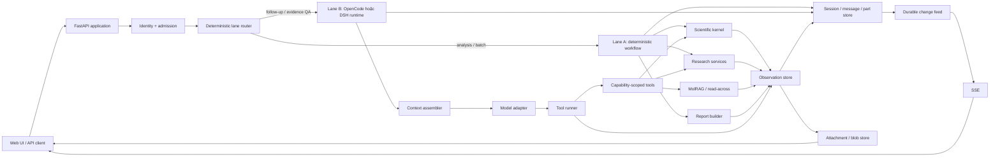
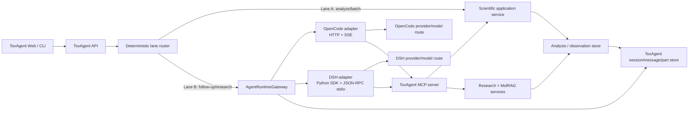
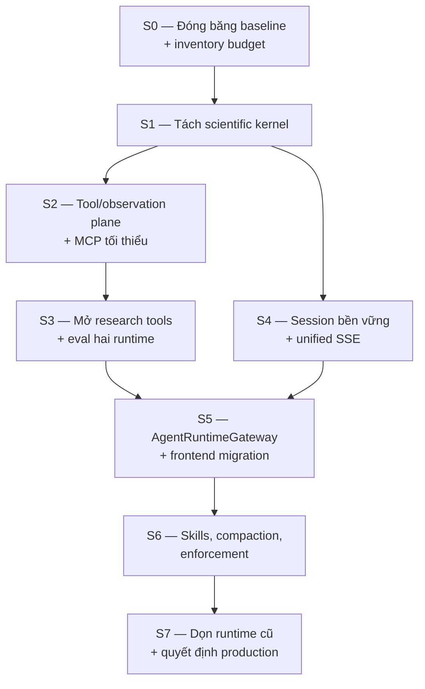

# ToxAgent Harness — Tài liệu tổng hợp: từ khái niệm đến lộ trình xây lại

> **Trạng thái:** đề xuất để thảo luận và trình bày<br>
> **Ngày rà soát:** 2026-09-03<br>
> **Phạm vi:** toàn bộ `docs/spec`, model server, agent layer, tools, services, frontend, storage<br>
> **Nguồn:** hệ thống hoá lại [TOXAGENT_HARNESS_REBUILD_STRATEGY_VI.md](./TOXAGENT_HARNESS_REBUILD_STRATEGY_VI.md) cùng bộ tài liệu harness đi kèm

Tài liệu này là **bản trình bày có cấu trúc** của chiến lược xây lại ToxAgent. So với
bản gốc, nó bổ sung phần nền tảng khái niệm (harness là gì, OpenCode và DSH là gì),
gộp hai lộ trình rời rạc thành một lộ trình duy nhất, và sắp xếp nội dung theo tám
phần lớn để có thể đọc tuần tự hoặc trình bày từng phần độc lập.

---

## Mục lục

| Phần | Nội dung | Dành cho ai |
|---|---|---|
| [0](#phần-0--tóm-tắt-điều-hành) | Tóm tắt điều hành | Mọi người, đọc trước |
| [I](#phần-i--nền-tảng-khái-niệm) | Harness là gì, OpenCode, DSH, nguyên tắc thiết kế, thuật ngữ | Người mới vào dự án |
| [II](#phần-ii--hiện-trạng-và-chẩn-đoán) | ToxAgent đang có gì và đang sai ở đâu | Engineering |
| [III](#phần-iii--quyết-định-giữ-bọc-viết-mới-xoá) | Ranh giới giữ/bọc/viết lại/xoá | Engineering + product |
| [IV](#phần-iv--kiến-trúc-đích) | Kiến trúc mục tiêu và từng primitive | Engineering |
| [V](#phần-v--tích-hợp-opencode-và-dsh) | Vận hành dưới ràng buộc LLM budget | Engineering + vận hành |
| [VI](#phần-vi--lộ-trình-triển-khai-hợp-nhất) | Lộ trình hợp nhất và điều kiện thoát | Quản lý dự án |
| [VII](#phần-vii--chất-lượng-eval-và-rủi-ro) | Eval, quality gate, rủi ro | QA + engineering |
| [VIII](#phần-viii--quyết-định-cần-chốt-và-phụ-lục) | Quyết định cần chốt, phụ lục, tài liệu liên quan | Ra quyết định |

---

# Phần 0 — Tóm tắt điều hành

## 0.1 Câu trả lời một dòng

> **Giữ và cô lập scientific kernel cùng deterministic analysis contract; thay thế
> toàn bộ control plane bằng một harness stateful, typed, provenance-first — trong đó
> agent loop được thuê từ OpenCode hoặc DSH thay vì tự viết.**

## 0.2 Ba mệnh đề chính

**1. Ranh giới "chỉ giữ `/predict`" là quá hẹp.** Thứ cần giữ là **scientific kernel**:
chuẩn hoá SMILES, model registry và inference, ensemble, threshold/calibration policy,
dự đoán clinical và Tox21, explanation, OOD assessment, phép tổng hợp xác định tạo
`final_verdict`, và contract của `/predict`, `/predict/batch`, `/explain`, đặc biệt là
`/analyze`. Nếu bỏ `/analyze`, mọi invariant khoa học sẽ rơi vào tay orchestration
không xác định.

**2. Gần như toàn bộ agent/control plane nên viết lại.** ADK declarations và các nhánh
fallback, orchestration trong `model_server/main.py`, report-chat planner và tool
dispatch bằng `if/elif`, session in-memory cùng cơ chế client gửi lại `report_state`,
SSE sinh trực tiếp từ call stack, prompt phẳng cắt theo ký tự, và việc gọi "agent"
cho các stage vốn deterministic.

**3. Đích đến là modular monolith, hai execution lane, một scientific kernel dùng chung.**

- **Làn A — deterministic:** analysis, batch, benchmark. Không có LLM. Là nền để audit.
- **Làn B — agent runtime:** hỏi đáp có căn cứ. Loop do OpenCode hoặc DSH cung cấp;
  ToxAgent sở hữu tool plane, product session, rules và provenance.

## 0.3 Điều không nên làm

Không bắt đầu bằng multi-agent, generic plugin framework, code execution, graph
framework, hay tự viết thêm một model loop. ToxAgent cần **tính truy nguyên và ổn định
khoa học**, không cần độ tự trị tối đa.

## 0.4 Lát cắt đầu tiên

Nếu chỉ chọn một đường để bắt đầu, theo đúng thứ tự này:

1. Freeze `/analyze` bằng contract test và golden test.
2. Extract `ToxicologyAnalyzer` ra khỏi FastAPI.
3. Cho screening/tool gọi service in-process, bỏ self-HTTP.
4. Tạo session/message/part store bền vững.
5. Dựng ToxAgent MCP server và `AgentRuntimeGateway` cho OpenCode/DSH.
6. Migrate frontend.
7. Xoá ADK và `/agent/*` cũ.

## 0.5 Cơ sở đánh giá

Đề xuất dựa trên: code và tài liệu hiện tại của ToxAgent; thiết kế trong local checkout
của [dsh-plugin](https://github.com/MinhQuangQu/dsh-plugin) (đặc biệt
`projects/toxagent_harness/DESIGN.md` và ghi chép G1–G7);
[DeepSeek Harness](https://github.com/deepseek-ai/deepseek-harness) và
[tài liệu kiến trúc DSH](https://github.com/deepseek-ai/deepseek-harness/blob/master/docs/architecture.md);
[OpenCode server](https://opencode.ai/docs/server/), [agents](https://opencode.ai/docs/agents),
[skills](https://opencode.ai/docs/skills), [permissions](https://opencode.ai/docs/permissions/),
[plugins](https://opencode.ai/docs/plugins/);
[Codex App Server](https://learn.chatgpt.com/docs/app-server),
[AGENTS.md](https://learn.chatgpt.com/docs/agent-configuration/agents-md),
[skills](https://learn.chatgpt.com/docs/build-skills), [hooks](https://learn.chatgpt.com/docs/hooks);
[Claude Code extension model](https://code.claude.com/docs/en/features-overview),
[agent loop](https://code.claude.com/docs/en/how-claude-code-works),
[memory](https://code.claude.com/docs/en/memory), [hooks](https://code.claude.com/docs/en/hooks-guide);
[Hermes Agent](https://github.com/NousResearch/hermes-agent/blob/main/website/docs/developer-guide/architecture.md)
(sessions, skills, toolsets); và [MCP tools specification](https://modelcontextprotocol.io/specification/draft/server/tools).

Các sản phẩm trên **không** được dùng như template sao chép. Chúng được dùng để kiểm tra
các pattern đã hội tụ: vòng lặp model–tool, capability registry, progressive disclosure,
session persistence, compaction, lifecycle hooks, và ranh giới giữa hướng dẫn với enforcement.

---

# Phần I — Nền tảng khái niệm

## 1. Harness là gì

### 1.1 Định nghĩa

**Harness** là lớp phần mềm bao quanh một LLM, biến nó từ *một hàm sinh văn bản*
thành *một hệ thống thực thi có trạng thái, có công cụ, và có ràng buộc*.

Ranh giới trách nhiệm rất rõ:

- **Model** quyết định *nên làm gì tiếp theo*.
- **Harness** quyết định *điều gì được phép xảy ra, xảy ra ở đâu, được ghi lại thế nào,
  và cái gì đi vào context của lần gọi kế tiếp*.

Một cách ví von: model là động cơ; harness là khung xe, hộp số, phanh và bảng đồng hồ.
Động cơ mạnh không tự tạo ra một chiếc xe lái được.

### 1.2 Bảy trách nhiệm của một harness

| # | Trách nhiệm | Nội dung cụ thể |
|---|---|---|
| 1 | **Agent loop** | Vòng `model → tool call → observation → model`, điều kiện dừng, step cap |
| 2 | **Tool plane** | Registry, schema, capability filtering, execution, timeout/retry, typed error |
| 3 | **Context management** | Assembly, token budget, projection, compaction, checkpoint |
| 4 | **State & persistence** | Session/message/part, resume sau restart, audit trail |
| 5 | **Policy & enforcement** | Auth, permission, quota, invariant — cưỡng chế bằng code, **không bằng prompt** |
| 6 | **Lifecycle & observability** | Hooks, usage/cost telemetry, tracing, metrics |
| 7 | **Interface & streaming** | Event feed bền vững, cancel, reconnect, projection cho UI |

Đây chính là khung để đọc phần chẩn đoán ở Phần II: mỗi vấn đề của ToxAgent hiện tại
đều là một trong bảy trách nhiệm này đang bị thiếu hoặc bị đặt sai chỗ.

| Trách nhiệm harness | ToxAgent hiện tại đặt ở đâu | Hệ quả |
|---|---|---|
| Agent loop | ADK + nhánh deterministic fallback | Hai runtime semantics cho cùng use case |
| Tool plane | `if/elif` dispatch trong `main.py`, một số tool tự gọi HTTP vào chính process | Không có lifecycle, không có typed error |
| Context management | Ghép chuỗi phẳng, cắt theo ký tự, ước lượng token `len//4` | Mất anchor bằng chứng, không kiểm soát được budget |
| State & persistence | `_SESSION_STORE` in-memory + client gửi lại `report_state` | Không chịu được restart hay multi-instance |
| Policy & enforcement | Phần lớn nằm trong prompt | Không cưỡng chế được, không audit được |
| Lifecycle & observability | Rải rác, không thống nhất | Không đo được cost/latency theo tool |
| Interface & streaming | SSE sinh trực tiếp từ call stack | Mất event là mất trạng thái |

### 1.3 Harness khác gì với các khái niệm lân cận

| Khái niệm | Là gì | **Không** phải là gì |
|---|---|---|
| **Model / LLM** | Hàm sinh token, có thể phát tool-call request | Không có state, không có quyền, không tự thực thi |
| **Agent** | Một *cấu hình*: prompt + tool surface + policy + model route | Không phải một runtime; nhiều agent có thể chạy trên cùng một harness |
| **Framework** (LangGraph, CrewAI, ADK) | Thư viện để **tự lắp** một loop | Không phải sản phẩm chạy được ngay; bạn vẫn phải tự làm 7 trách nhiệm trên |
| **Harness** (OpenCode, DSH, Claude Code, Codex) | Runtime hoàn chỉnh đã có sẵn 7 trách nhiệm | Không chứa domain logic của bạn |
| **MCP** | Giao thức mô tả và gọi tool **giữa các process** | Không phải harness; không nên làm bus nội bộ trong cùng process |
| **Skill** | Playbook/tri thức chuyên ngành nạp theo nhu cầu | Không phải cơ chế cấp quyền, không phải enforcement |

Điểm quan trọng cho ToxAgent: thay ADK bằng LangGraph/CrewAI/AutoGen là **đổi framework
này lấy framework khác** — vẫn phải tự xây bảy trách nhiệm. Dùng OpenCode hoặc DSH là
**thuê nguyên một harness đã có sẵn cả bảy**.

### 1.4 Vì sao ToxAgent nên thuê harness thay vì tự viết

| Lý do | Diễn giải |
|---|---|
| Bảy trách nhiệm đều đắt | Mỗi cái là vài tuần engineering, và đều là hạ tầng chứ không phải giá trị khoa học |
| Budget LLM đang nằm trong runtime | Provider route đã được xác thực bên trong OpenCode/DSH, không ở phía ToxAgent |
| Không có lợi thế cạnh tranh ở loop | Lợi thế của ToxAgent nằm ở model độc tính, evidence và provenance |
| Đường thoát rõ ràng | Khi có direct API budget, chỉ cần thêm một `AgentRuntimeProvider` thứ ba |

Điều **không** giao cho harness: session sản phẩm, observation, provenance, scientific
result, permission và audit. Đây là domain của ToxAgent và phải nằm trong ToxAgent store.

### 1.5 Mười tiêu chí chấm điểm một harness

Dùng để so sánh OpenCode và DSH ở mục 4, và để đánh giá bất kỳ runtime nào trong tương lai.

1. Có headless/programmatic interface không (HTTP, SDK)?
2. Session có bền vững và resume được không?
3. Event stream có typed và reconnect được không?
4. Có cancel giữa turn không?
5. Có MCP client không, local và remote?
6. Có tắt được built-in tool (shell, edit, subagent) không?
7. Tool restriction có áp dụng cả ở prompt lẫn ở execution không?
8. Có báo cáo usage/token/cost không?
9. Config có fail-loud khi sai không?
10. Wire protocol/API có đủ ổn định để tích hợp production không?

### 1.6 Hai lớp model không được nhầm lẫn

Đây là hiểu lầm phổ biến nhất khi nói "dùng OpenCode/DSH làm LLM budget":

```text
Lớp 1 — ToxAgent scientific models
  → model dự đoán độc tính của dự án
  → chạy deterministic, không phải LLM
  → là tài sản khoa học, phải versioned và reproducible

Lớp 2 — OpenCode / DSH model route
  → LLM dùng để hiểu câu hỏi, chọn tool và viết câu trả lời
  → budget thực tế nằm ở provider phía sau runtime, không ở runtime
```

OpenCode và DSH **không phải nguồn LLM budget**. Chúng là runtime; budget nằm ở
provider/model route mà người dùng đã kết nối vào runtime bằng API key, OAuth hoặc
subscription. Chi tiết ràng buộc này ở [Phần V](#phần-v--tích-hợp-opencode-và-dsh).

## 2. OpenCode là gì

> Mô tả ứng với thời điểm rà soát 2026-09-03; phải kiểm lại theo version được pin
> trước khi tích hợp. Nguồn: [opencode.ai/docs](https://opencode.ai/docs/server/).

### 2.1 Bản chất

OpenCode là một **agent harness mã nguồn mở, provider-agnostic**, ban đầu hướng tới
coding agent, kiến trúc **client/server**: phần runtime chạy như một server, còn TUI,
web hoặc bất kỳ client nào giao tiếp với nó qua HTTP và SSE.

Chính đặc điểm client/server này khiến nó dùng được làm backend runtime cho một ứng dụng
khác — trường hợp của ToxAgent.

### 2.2 Những gì OpenCode cung cấp sẵn

| Thành phần | Nội dung |
|---|---|
| **Headless server** | `opencode serve`, HTTP API có OpenAPI 3.1, message sync/async, SSE event stream |
| **Session model** | `session → message → part` với typed state; event là change feed |
| **Agents** | `mode: primary` / `subagent`, mỗi agent có model route, prompt, tool surface, `steps` cap |
| **Permissions** | Cho phép/deny theo tool pattern, ở mức global và mức per-agent |
| **Skills** | Playbook nạp theo nhu cầu, progressive disclosure |
| **MCP client** | Kết nối MCP server local và remote |
| **Plugins** | Mở rộng bằng JS/TS |
| **Provider routing** | Kết nối nhiều provider; model route do config/auth quyết định |

### 2.3 Bề mặt API mà ToxAgent sẽ dùng

```text
POST /session                       # tạo runtime session
GET  /event                         # subscribe SSE
POST /session/{id}/prompt_async     # gửi một turn
GET  /session/{id}/message          # đọc message/part
POST /session/{id}/abort            # cancel turn
```

### 2.4 Pattern nên lấy và điều không nên sao chép

| Nên lấy | Không nên sao chép |
|---|---|
| Headless server tách khỏi UI | Permission model thiết kế cho shell coding agent |
| `session/message/part` có typed state | Plugin surface quá rộng |
| Event là change feed, không phải callback | Coupling UI/runtime của một developer tool |
| Tool result có metadata và attachment tách biệt | |
| Compaction bằng checkpoint và con trỏ | |

## 3. DeepSeek Harness (DSH) là gì

> Mô tả ứng với thời điểm rà soát 2026-09-03. Nguồn:
> [deepseek-harness](https://github.com/deepseek-ai/deepseek-harness) và
> [docs/architecture.md](https://github.com/deepseek-ai/deepseek-harness/blob/master/docs/architecture.md).

### 3.1 Bản chất

DSH là **agent harness mã nguồn mở của DeepSeek**, thiên về khả năng compose sâu.
Toàn bộ runtime được lắp từ các plugin trên nền dependency-injection (Cordis), cấu hình
bằng YAML profile có thể patch chồng lên nhau. Điểm mạnh là mức độ tuỳ biến; điểm đánh
đổi là bề mặt cấu hình lớn hơn và wire protocol còn đang thay đổi.

### 3.2 Những gì DSH cung cấp sẵn

| Thành phần | Nội dung |
|---|---|
| **Plugin runtime** | Cordis dependency graph; "everything is a plugin" |
| **Profile/patch config** | YAML compose được, kiểm tra bằng `--dump-config`, fail-loud khi sai |
| **Session persistence** | Durable session events, JSONL event log |
| **Python SDK** | Spawn runtime cùng phiên bản qua JSON-RPC trên stdio, nhận session events và final response |
| **MCP client** | stdio và Streamable HTTP; tool đăng ký theo namespace `mcp__<server>__<tool>` |
| **Tool restriction** | Áp dụng ở **cả** prompt lẫn execution |
| **Native tool calling** | Có, kèm telemetry token/usage |
| **Web/CLI** | Giao diện sẵn có để thử nghiệm |

### 3.3 Giới hạn cần biết trước khi tích hợp

- **Chưa có mid-turn cancel** ở SDK: adapter phải công bố `cancel_turn=false`.
  Khi vượt deadline cứng, gateway đóng worker process, ghi `runtime.turn.failed` và tạo
  worker mới — **không** được giả lập "cancel thành công".
- SDK/wire còn pre-release churn; phải pin version.
- Xem [DSH Python SDK](https://github.com/deepseek-ai/deepseek-harness/blob/master/python/sdk/README.md)
  và [DSH SDK server](https://github.com/deepseek-ai/deepseek-harness/blob/master/packages/sdk/server/README.md).

### 3.4 Pattern nên lấy và điều không nên sao chép

| Nên lấy | Không nên sao chép |
|---|---|
| Seam definition/provider/consumer | "Everything is a plugin" |
| Mọi model-visible action đều phải được ghi | Cordis dependency graph cho một domain hẹp |
| Tool restriction áp dụng cả prompt và execution | JSONL event log làm canonical store |
| Fail-loud config | |

## 4. OpenCode và DSH trong kiến trúc ToxAgent

### 4.1 Vai trò

Cả hai được tích hợp như hai `AgentRuntimeProvider` sau một `AgentRuntimeGateway` chung.
Chúng **cho thuê agent loop và đường tới LLM**; ToxAgent giữ domain, tools, state và
provenance.

### 4.2 So sánh theo nhu cầu

| Nhu cầu | OpenCode | DSH | Khuyến nghị |
|---|---|---|---|
| Dùng ngay bằng TUI/Web | Tốt | Tốt | Cả hai, để A/B eval |
| Custom frontend gọi programmatically | HTTP server, OpenAPI 3.1, sync/async message, SSE | SDK subprocess qua JSON-RPC stdio | **OpenCode primary** |
| Cancel một turn | `POST /session/:id/abort` | SDK chưa có prompt-cancel | **OpenCode** |
| Worker Python/batch/eval | Gọi HTTP được | Python SDK trực tiếp | **DSH** |
| Session/event audit nội bộ runtime | Message/part + event stream | Durable session events/JSONL | Cả hai; ToxAgent vẫn giữ product audit |
| Custom composition sâu | Config/plugin được | Cordis profile/patch rất linh hoạt | DSH nếu thật sự cần |
| MCP | Local/remote | stdio/Streamable HTTP | Cả hai |
| Maturity của embedded wire | HTTP API dễ tích hợp | SDK/wire còn giới hạn và churn | **OpenCode** cho app-facing path |
| Model route chỉ có ở một runtime | Phụ thuộc auth đã kết nối | Phụ thuộc adapter/profile | **Runtime có route thắng** |

### 4.3 Khuyến nghị mặc định

- **OpenCode primary** cho ToxAgent custom web/chat.
- **DSH primary** khi provider/model budget cần dùng chỉ tồn tại trong DSH profile.
- **DSH worker** cho batch experiment, replay và evaluation.
- Cả hai chạy **cùng một test suite**; **không** gọi cả hai để ensemble mọi câu trả lời.

## 5. Bài học từ hệ sinh thái harness

| Hệ thống | Pattern đáng lấy | Điều không nên sao chép vào ToxAgent |
|---|---|---|
| **DSH** | Definition/provider/consumer seam; model-visible action phải được ghi; tool restriction áp dụng cả prompt và execution; fail-loud config | "Everything is a plugin", Cordis dependency graph, JSONL event log làm canonical store |
| **OpenCode** | Headless server; session/message/part typed; event là change feed; tool result có metadata/attachment; compaction bằng checkpoint | Permission model cho shell coding agent; plugin surface quá rộng; coupling UI/runtime |
| **Codex** | Thread/turn separation; streamed typed events; generated schemas; layered `AGENTS.md`; skill progressive disclosure; lifecycle hooks | App-server protocol nguyên bản; approval/sandbox cho code execution |
| **Claude Code** | Ranh giới rõ giữa instruction, skill, MCP, subagent và hook; hook/rule cho invariant; context isolation chỉ khi cần | Auto-memory ghi tự do; subagent/team topology cho một domain khoa học hẹp |
| **Hermes** | Toolsets lọc capability; durable session/search; skill vs tool guidance; memory/context provider seams | Tool registry và plugin ecosystem quá tổng quát; self-learning memory |
| **MCP** | Tool discovery/call contract và interoperability | Dùng MCP làm internal bus giữa các module cùng process |

**Mẫu số chung không phải "càng nhiều agent càng tốt".** Mẫu số chung là:
*một loop nhỏ, tool surface có kiểm soát, state bền vững, context có budget, và
enforcement nằm ngoài prompt.*

## 6. Mười nguyên tắc thiết kế của ToxAgent Harness

Đây là bộ nguyên tắc chi phối mọi quyết định trong các phần sau.

| # | Nguyên tắc | Hệ quả cụ thể |
|---|---|---|
| 1 | **Khoa học là hạt nhân, không phải plugin** | Scientific kernel được cô lập và giữ ổn định trước khi động vào bất cứ thứ gì khác |
| 2 | **Hai làn, một kernel** | Làn A deterministic tuyệt đối không gọi LLM; làn B gọi kernel qua tool |
| 3 | **Enforcement nằm ngoài prompt** | Auth, threshold, provenance, timeout là code/config, không phải câu "hãy luôn..." |
| 4 | **State là source of truth, event chỉ là feed** | `session → message → part`, không replay JSONL để dựng trạng thái |
| 5 | **Mọi con số phải truy nguyên được** | Mỗi claim khoa học trỏ về một `observation_id` + field path |
| 6 | **Model chỉ nhìn thấy projection** | Không base64, không raw JSON, không literature dump trong context |
| 7 | **Tool surface nhỏ và có capability profile** | 6–9 tool mỗi lần gọi; deny phải chặn cả exposure lẫn execution |
| 8 | **Runtime là thứ thay thế được** | Mọi runtime nằm sau `AgentRuntimeProvider`; session được pin, không đổi âm thầm |
| 9 | **Mọi thứ đều versioned** | Model artifact, policy, profile, rule set — để báo cáo cũ vẫn giải thích được |
| 10 | **Fail loud, không fallback âm thầm** | Sai config thì dừng; fallback chỉ hợp lệ khi là policy versioned và có trong metadata |

## 7. Từ điển thuật ngữ

| Thuật ngữ | Nghĩa trong tài liệu này |
|---|---|
| **Harness** | Runtime bao quanh LLM, đảm nhận bảy trách nhiệm ở mục 1.2 |
| **Lane A / Làn A** | Đường thực thi deterministic: analyze, batch, benchmark. Không LLM |
| **Lane B / Làn B** | Đường thực thi có agent loop: hỏi đáp, research, synthesis |
| **Scientific kernel** | Toàn bộ logic khoa học: SMILES, model, threshold, OOD, verdict |
| **Observation** | Kết quả typed từ một tool/model/domain service, có ID và provenance |
| **Projection** | View rút gọn của observation, dành cho model/UI/report. Không phải source of truth |
| **Attachment** | Ảnh, JSON lớn, raw evidence lưu ngoài context, tham chiếu bằng ID có ACL |
| **Part** | Đơn vị nhỏ nhất trong một message: text, tool_call, tool_result, citation, error… |
| **Checkpoint** | Bản tóm tắt có pin observation, dùng để compaction mà không mất anchor |
| **Provenance** | Chuỗi truy nguyên từ một con số trong câu trả lời về tới run tạo ra nó |
| **Capability profile** | Tập tool được phép thấy trong một ngữ cảnh (analysis, report_qa, …) |
| **Product session** | Session do ToxAgent sở hữu: history, report, ACL, audit |
| **Runtime session** | Session do OpenCode/DSH sở hữu: model context, provider cache |
| **MCP** | Model Context Protocol — giao thức mô tả/gọi tool giữa các process |
| **DSH** | DeepSeek Harness |
| **OOD** | Out-of-distribution — tín hiệu an toàn khi phân tử nằm ngoài miền huấn luyện |
| **MolRAG** | Retrieval phân tử tương tự phục vụ read-across |

---

# Phần II — Hiện trạng và chẩn đoán

## 8. ToxAgent thực ra đang chứa sáu sản phẩm

ToxAgent không phải "một agent". Code hiện tại chứa ít nhất sáu sản phẩm logic khác nhau:

| Sản phẩm logic | Năng lực hiện có | Giá trị cần bảo toàn |
|---|---|---|
| **ML inference platform** | Nhiều backend/model, ensemble, binary toxicity, Tox21 | Model artifact, preprocessing, calibration, output semantics |
| **Scientific analysis API** | `/predict`, `/explain`, `/analyze`, batch, OOD | Contract xác định và khả năng benchmark |
| **Compound input utilities** | SMILES validation, canonicalization, preview, image-to-SMILES | Trải nghiệm nhập phân tử đa phương thức |
| **Evidence platform** | PubChem, PubMed, Europe PMC, Semantic Scholar, bioassay | Provider logic, retry, parsing, evidence record |
| **MolRAG / read-across** | Fingerprint, similar-molecule retrieval, knowledge retrieval, fusion | Thuật toán retrieval/scoring và evidence |
| **Report application** | Report projection, evidence QA, grounded chat, history, export UI | User journey và cấu trúc domain report |

> **Vấn đề không phải thiếu feature.** Vấn đề là sáu sản phẩm này chưa có boundary rõ,
> nên model server đồng thời làm API, model registry, workflow engine, chat harness,
> tool dispatcher, state recovery, rendering và SSE.

## 9. Bảy chẩn đoán kiến trúc

### 9.1 Một "god module" nắm quá nhiều trách nhiệm

`model_server/main.py` hiện có **hơn 6.000 dòng**, cùng lúc xử lý: load và dispatch nhiều
model backend; endpoint prediction/explain/analyze; ADK runtime và deterministic fallback;
report-chat planning và tool execution; evidence QA trùng lặp; render ảnh/base64;
response normalization; SSE streaming.

Đây là điểm coupling lớn nhất. **Thêm một harness mới trực tiếp vào file này sẽ tạo lớp
orchestration thứ ba**, không giải quyết nguyên nhân gốc.

### 9.2 "Agent layer" hiện tại chủ yếu là workflow stage

`ScreeningAgent`, `ResearcherAgent`, `EvidenceQAAgent` và `WriterAgent` mang tên agent,
nhưng giá trị cốt lõi của chúng là hàm deterministic hoặc domain service:

- screening gọi analysis và optional MolRAG;
- researcher chạy các provider lookup/search;
- evidence QA deduplicate, chấm relevance và gắn cờ;
- writer chiếu state thành report có cấu trúc.

Các stage này không cần identity, memory và agent loop độc lập. Giữ chúng dưới dạng agent
làm tăng prompt/runtime surface nhưng **không tạo thêm autonomy hữu ích**.

### 9.3 Hai runtime chồng lên nhau

`/agent/analyze` có nhánh ADK, nhánh deterministic, state recovery và fallback. Runtime
deploy lại mặc định nghiêng về deterministic. Public response còn lộ `adk_available`,
`runtime_mode`, `runtime_note` và `state_keys` — đây là chi tiết triển khai, không phải
domain contract.

Hệ quả: cùng một use case có nhiều execution semantics; lỗi framework biến thành logic
nghiệp vụ; test phải biết runtime path; client bị buộc phải biết ADK có chạy hay không.

### 9.4 Chat state không bền vững

Backend report chat dùng `_SESSION_STORE` trong memory. Khi process restart hoặc request
sang instance khác, client phải gửi lại toàn bộ `report_state` để rehydrate.

Đây là dấu hiệu API đang bù cho việc thiếu persistence, và tạo ba vấn đề: payload lớn và
có thể bị client chỉnh sửa; server không có một nguồn sự thật duy nhất; audit transcript,
tool calls và evidence khó khôi phục chính xác.

Firestore frontend hiện lưu lịch sử hữu ích cho UI, nhưng **chưa phải session store của harness**.

### 9.5 Tool plane chưa thật sự là một plane

Capability đã tồn tại, nhưng chưa có contract/runtime chung:

- một số "tool" gọi HTTP ngược vào chính model server qua localhost;
- chat dispatch tool bằng chuỗi `if/elif`;
- tool result chưa tách model-view, UI-view, metadata, attachment và provenance;
- lỗi, timeout, retry và quan sát vận hành không có lifecycle thống nhất.

### 9.6 Context và output đang được sửa ở sai tầng

Report context được ghép thành chuỗi phẳng, cắt theo ký tự, ước lượng token kiểu gần đúng.
Một số lỗi câu trả lời được vá bằng **hậu xử lý chuỗi**.

Đó là dấu hiệu thiếu: typed message/part; context builder có budget; observation
projection; provenance validator; structured final response.

### 9.7 Có drift giữa code, config và docs

Tài liệu workflow, README và `workspace_mode.yaml` không hoàn toàn đồng thuận về workspace
mode/model path. Đây không chỉ là vấn đề documentation: **harness sẽ lắp prompt, tool
surface và policy sai nếu config source of truth không rõ.**

## 10. Bản đồ code làm căn cứ

| Bề mặt | File chính hiện tại | Nhận xét |
|---|---|---|
| HTTP route | `model_server/route_groups.py` | 11 route system/inference/agent/chat chính, chưa tính alias ẩn |
| Public schema | `model_server/schemas.py` | Scientific schema khá rõ; agent schema lộ runtime và rehydration debt |
| Model/API/chat runtime | `model_server/main.py` | Điểm coupling lớn nhất, hơn 6.000 dòng |
| Deterministic orchestration | `agents/orchestrator_agent.py` | Có baseline và benchmark value, nhưng trộn với ADK declarations |
| Screening/MolRAG shell | `agents/screening_agent.py` | Logic domain nên chuyển về application/molrag service |
| Literature workflow | `agents/researcher_agent.py`, `tools/research_tools.py` | Giữ provider/parsing/retry; bỏ agent wrapper |
| Evidence QA | `agents/evidence_qa_agent.py` + duplicate trong `main.py` | Chỉ giữ một implementation canonical |
| Report builder | `agents/writer_agent.py` | Giữ deterministic projection; đưa prose LLM tuỳ chọn sang làn B |
| Report chat/session | `agents/report_chat_agent.py` | In-memory state và context phẳng cần thay |
| Scientific implementation | `backend/`, `services/result_fusion.py` | Phần cần cô lập và giữ ổn định |
| MolRAG implementation | `services/molecule_retriever.py`, `services/knowledge_retriever.py`, `services/fingerprint_service.py` | Giữ thuật toán, chuẩn hoá output thành observations |
| Frontend contract | `frontend/src/lib/api.ts` | Schema client lớn và thủ công; nên generate từ OpenAPI |
| Client persistence | `frontend/src/firebase-config.ts`, `lib/firestore-history.ts`, `lib/chat-history.ts`, Firestore rules | Dùng làm migration input/projection, không làm transcript authority |
| Offline ML | `scripts/`, training modules, model artifacts | Tách lifecycle khỏi online harness, không rewrite cùng đợt |

---

# Phần III — Quyết định: giữ, bọc, viết mới, xoá

## 11. Bốn loại quyết định

| Quyết định | Nghĩa |
|---|---|
| **Giữ contract** | Bên ngoài tiếp tục nhìn thấy hành vi tương thích; bên trong vẫn được refactor |
| **Giữ logic, bọc lại** | Thuật toán/domain value còn đúng nhưng module/API hiện tại không còn là boundary |
| **Viết mới** | Không cố cứu kiến trúc runtime cũ; chỉ viết adapter migration khi cần |
| **Xoá** | Không mang pattern hoặc contract này sang kiến trúc đích |

## 12. Ma trận quyết định theo khối chức năng

### 12.1 Khối giữ nguyên hoặc bọc lại — tài sản khoa học

| Khối hiện tại | Quyết định | Lý do | Đích đến |
|---|---|---|---|
| RDKit validation/canonicalization | Giữ logic, bọc lại | Là invariant đầu vào | `MoleculeResolver` dùng chung cho API và tool |
| Model artifacts và inference trong `backend/` | Giữ | Tài sản khoa học khó tái tạo | Scientific kernel + model registry |
| Threshold/calibration/workspace policy | Giữ logic, tái cấu trúc | Ảnh hưởng trực tiếp semantics | Versioned `AnalysisPolicy` |
| Clinical/Tox21 prediction | Giữ contract | API sản phẩm ổn định | `/v1/predict*` |
| Explanation/GNN visualization | Giữ logic và contract chính | Giá trị khoa học/UI | Blob/attachment thay base64 |
| OOD assessment | Giữ | Safety signal, không phải agent feature | Bắt buộc trong `AnalysisResult` |
| `/analyze` deterministic | **Giữ và nâng thành canonical** | Đóng gói nhiều scientific invariants | Một application service in-process |
| Image-to-SMILES | Giữ capability | Input adapter, không thuộc harness loop | `MoleculeResolver` API/tool riêng |
| SMILES preview | Giữ capability, đổi media contract | Hữu ích cho UI, không phải reasoning | Media service/attachment |
| PubChem/PubMed/provider code | Giữ logic, bọc lại | Parsing/retry có giá trị | Research provider interfaces + tools |
| MolRAG retrieval/scoring/fusion | Giữ logic, bọc lại | Domain engine | Read-across service + typed observations |
| Frontend analysis/report/chat journey | Giữ | Giá trị sản phẩm đã rõ | Client của API/session mới |
| Firebase Auth | Giữ | Không liên quan harness rewrite | Identity boundary |

### 12.2 Khối đổi vai trò

| Khối hiện tại | Quyết định | Lý do | Đích đến |
|---|---|---|---|
| Evidence QA deterministic | Giữ logic, đổi vai trò | Đây là validator/projector | Post-tool và pre-final policy hook |
| Deterministic report projection trong writer | Giữ logic, đổi vai trò | Đây là report projector | `ReportBuilder`, không phải agent |
| `run_orchestrator_flow` | Giữ hành vi, viết lại shell | Benchmark đang phụ thuộc | `DeterministicAnalysisWorkflow` |
| Optional LLM prose/recommendation trong writer | Viết lại | Không thuộc deterministic scientific result | Làn B skill/model step có provenance |
| Firestore history hiện tại | Migration source | Có dữ liệu người dùng nhưng schema chưa đủ | Projection/index từ session store mới |
| Offline training/evaluation | Giữ và tách khỏi harness | Lifecycle khác online serving | `ml/` hoặc package/deploy pipeline riêng |

### 12.3 Khối xoá

| Khối hiện tại | Lý do xoá | Thay bằng |
|---|---|---|
| ADK declarations/compatibility | Tạo hai runtime và recovery debt | `AgentRuntimeGateway` + adapter OpenCode/DSH |
| Chat heuristic planner | Trùng chức năng tool calling của model | Native function calling + capability filter |
| Chat tool `if/elif` dispatcher | Không có registry/lifecycle contract | `ToolRegistry` + `ToolRunner` |
| String response normalizers | Vá triệu chứng sau generation | Structured output + provenance validator |
| `_SESSION_STORE` | Không chịu restart/multi-instance | Durable session/message/part store |
| `report_state` client rehydration | Client không nên là source of truth | Server-owned analysis snapshot |
| Self-HTTP từ tool vào cùng process | Thêm latency, timeout và failure mode | In-process application service call |
| Legacy Streamlit | Cản module boundary mới | `legacy/` có deadline removal |
| `src/` compatibility wrappers 3 dòng | Hai namespace cho cùng implementation | Import trực tiếp package canonical |

## 13. Quyết định theo từng API hiện tại

### 13.1 Scientific API — giữ

| Endpoint hiện tại | Quyết định | Contract mục tiêu |
|---|---|---|
| `GET /health` | Giữ | Tách readiness của process, model và dependency |
| `POST /predict` | Giữ | Contract versioned, thêm model/policy version trong metadata |
| `POST /predict/batch` | Giữ | Deterministic, không đi qua agent loop |
| `POST /explain` | Giữ | Kết quả typed; ảnh qua attachment URL, legacy adapter vẫn trả base64 |
| `POST /analyze` | **Giữ và xem là API lõi** | Một SMILES → một `AnalysisResult` đầy đủ, reproducible |
| `POST /extract-smiles-from-image` | Giữ capability, đổi namespace sau | `POST /v2/molecules:extract-from-image` |
| `POST /smiles/preview` | Giữ capability, đổi media contract | `POST /v2/molecules:preview` trả attachment |

> **Điểm quan trọng:** nếu chỉ giữ `/predict` mà bỏ `/analyze`, harness mới sẽ phải tự
> ghép clinical, mechanism, threshold, OOD, explanation gating và verdict. Khi đó logic
> khoa học bị chuyển vào orchestration không xác định. Vì vậy **`/analyze` phải là
> boundary của scientific kernel.**

### 13.2 Agent API — deprecate

| Endpoint hiện tại | Quyết định | Thay thế |
|---|---|---|
| `POST /agent/analyze` | Deprecate, giữ adapter tạm thời | Tạo session + chạy làn A + lưu typed parts |
| `POST /agent/analyze/stream` | Deprecate | Unified session event stream |
| `POST /agent/chat` | Deprecate | Gửi message vào session |
| `POST /agent/chat/stream` | Xoá sau migration | Cùng event stream với analyze/chat/tool events |

Không giữ schema v2 của `AgentAnalyzeResponse`: `adk_available`, `runtime_mode`,
`runtime_note` và `state_keys` là **accidental API**. Client cần biết trạng thái domain
và run, không cần biết framework nội bộ.

### 13.3 API harness mục tiêu

```text
POST   /v2/sessions
GET    /v2/sessions/{session_id}
POST   /v2/sessions/{session_id}/messages
GET    /v2/sessions/{session_id}/messages
GET    /v2/sessions/{session_id}/events
POST   /v2/sessions/{session_id}:cancel
GET    /v2/attachments/{attachment_id}
```

`POST /messages` nhận intent rõ ràng:

```json
{
  "content": [{"type": "text", "text": "Phân tích CC(=O)OC1=CC=CC=C1C(O)=O"}],
  "mode": "auto",
  "analysis_options": {
    "clinical_threshold": 0.35,
    "mechanism_threshold": 0.5,
    "molrag_enabled": true
  }
}
```

Router **deterministic** quyết định:

- yêu cầu phân tích/batch rõ ràng → **làn A**;
- câu hỏi follow-up, so sánh evidence hoặc giải thích linh hoạt → **làn B**;
- input không đủ → yêu cầu clarification **trước khi** gọi model/tool đắt tiền.

---

# Phần IV — Kiến trúc đích

## 14. Bức tranh tổng thể



### 14.1 Modular monolith, không phải microservices bắt buộc

Boundary logic cần rõ, nhưng scientific kernel và harness **có thể chạy cùng process**
trong giai đoạn đầu. Model artifacts nặng, cold start đắt, và self-HTTP hiện tại không
tạo isolation thật.

Chỉ tách deployment khi có bằng chứng về: nhu cầu scale khác nhau; tài nguyên CPU/GPU
khác nhau; fault isolation đáng giá hơn chi phí network; ownership/release cadence khác nhau.

### 14.2 Một active agent loop cho mỗi session, không subagent trong MVP

Screening, research và writer **không phải ba agent**. Chúng là service/tool/projector
được một làn gọi theo contract.

Trong giai đoạn chỉ có budget qua harness, ToxAgent **không tự triển khai vòng lặp
model–tool**. Mỗi product session được pin vào đúng một runtime — OpenCode hoặc DSH — và
runtime đó cung cấp loop. ToxAgent vẫn chịu trách nhiệm về session domain, observations,
permission, provenance và scientific result; không giao các invariant này cho prompt hoặc
plugin tuỳ chọn của runtime.

Chỉ cân nhắc subagent khi có use case thực sự cần **cả bốn** điều kiện: context isolation
lớn; nhiệm vụ độc lập chạy dài; kết quả trả về được bằng summary/typed artifact; lợi ích
song song lớn hơn chi phí provenance và latency. Ở trạng thái hiện tại, deterministic
parallelism giữa screening và research đã đủ cho làn A.

## 15. Mỗi primitive chịu trách nhiệm gì

| Primitive | Dùng cho | **Không** dùng cho |
|---|---|---|
| **API** | Contract sản phẩm ổn định cho client | Chi tiết framework/runtime |
| **Provider** | Backend có thể thay thế: model, PubMed, LLM, store | Workflow nghiệp vụ |
| **Tool** | Năng lực thực thi có schema mà model được phép gọi | Tài liệu dài hoặc policy bắt buộc |
| **Skill** | Playbook/tri thức chuyên ngành nạp theo nhu cầu | Security, provenance, validation bắt buộc |
| **Rule/policy** | Quyết định deterministic phải luôn đúng | Văn phong hoặc workflow linh hoạt |
| **Hook** | Điểm lifecycle nhỏ để quan sát/cưỡng chế/project | Một workflow nghiệp vụ lớn |
| **Memory** | State bền vững, có scope và quyền sở hữu | Kho tri thức khoa học hoặc raw tool dump |
| **Observation** | Kết quả typed từ model/tool/domain service | Transcript prose duy nhất |
| **Projection** | View rút gọn cho model/UI/report | Source of truth |
| **Attachment** | Ảnh, JSON lớn, raw evidence, artifact | Base64 nhét vào model context |

Ranh giới này khớp với pattern hội tụ ở Codex, Claude Code, OpenCode và Hermes: hướng dẫn
nạp dần; tool là capability; hook/rule xử lý điều phải cưỡng chế; session/history tách
khỏi active model context.

## 16. Scientific kernel

### 16.1 Interface đề xuất

```python
class ToxicologyAnalyzer(Protocol):
    async def predict(self, request: PredictRequest) -> PredictResult: ...
    async def predict_batch(self, request: BatchPredictRequest) -> BatchPredictResult: ...
    async def explain(self, request: ExplainRequest) -> ExplainResult: ...
    async def analyze(self, request: AnalyzeRequest) -> AnalysisResult: ...
```

Mọi kết quả phải mang metadata đủ để tái hiện:

- canonical SMILES;
- model key và artifact/version/hash;
- inference backend;
- threshold và threshold policy version;
- workspace/config snapshot version;
- explainer và seed/config nếu có;
- thời điểm chạy và duration;
- warning/OOD status;
- correlation/run ID.

### 16.2 Model registry

Tách logic load/resolve/dispatch model ra khỏi FastAPI handler:

```python
class ModelProvider(Protocol):
    key: str
    capabilities: set[str]

    def load(self) -> None: ...
    def health(self) -> ModelHealth: ...
    def predict(self, batch: MoleculeBatch) -> ModelOutput: ...
```

Registry phải **fail loud** khi model/config không hợp lệ. Không âm thầm đổi model vì một
key sai, trừ khi fallback đó là policy versioned và được trả trong metadata.

### 16.3 Một source of truth cho policy

`workspace_mode`, env defaults, request override và model metadata phải được resolve **một
lần** thành `AnalysisPolicySnapshot`. API, tool và benchmark cùng nhận snapshot này; không
module nào tự đọc env để tạo semantics riêng giữa các run.

## 17. Tool plane

### 17.1 Tool catalog cho MVP

Không cần đưa mọi hàm Python thành tool. Model chỉ nên thấy **6–9 tool** tuỳ capability profile.

| Tool | Trách nhiệm | Gọi vào |
|---|---|---|
| `resolve_molecule` | Tên/SMILES/ảnh → canonical molecule | Molecule resolver |
| `run_toxicity_analysis` | Chạy analysis deterministic đầy đủ | Scientific kernel `/analyze` service |
| `get_report_section` | Lấy projection nhỏ của report hiện tại | Report store |
| `lookup_compound` | Metadata/identifier từ PubChem | Research provider |
| `search_toxicology_literature` | Tìm evidence có cấu trúc | Literature providers |
| `get_article_detail` | Abstract/metadata cho bài đã chọn | Literature provider/cache |
| `find_similar_molecules` | Analog/read-across retrieval | MolRAG service |
| `lookup_structural_alerts` | Alert đã chuẩn hoá | Knowledge service |
| `explain_mechanism` | Context cơ chế theo endpoint/task | Knowledge + evidence service |

`check_claim_support` **không** nên là model tool — nó là deterministic validator/hook chạy
trước final answer. `rerun_screening` cũng không cần là tool riêng nếu
`run_toxicity_analysis` nhận policy/options rõ ràng.

### 17.2 Capability profiles

Tool surface phải được lọc **trước** model call:

| Profile | Tool được thấy |
|---|---|
| `analysis` | `resolve_molecule`, `run_toxicity_analysis` |
| `report_qa` | `get_report_section`, article/evidence tools, analog, mechanism |
| `literature_review` | compound, literature, article detail |
| `read_across` | report section, analog, structural alert, mechanism |

Việc cấm tool phải làm **cả hai** việc:

1. loại schema khỏi prompt/model request;
2. chặn ở execution layer nếu model/client vẫn gửi tool call trực tiếp.

### 17.3 Tool contract

```python
@dataclass(frozen=True)
class ToolDefinition:
    name: str
    description: str
    input_schema: dict
    output_schema: dict
    capability: str
    timeout_ms: int
    idempotency: str
    handler: Callable[..., Awaitable[ToolResult]]

@dataclass(frozen=True)
class ToolResult:
    observation_id: str
    model_view: dict | str
    ui_view: dict | None
    metadata: dict
    attachments: list[AttachmentRef]
```

Tool handler trả **typed error**, không giả error thành một đoạn prose thành công. Args
được parse/validate đúng một lần và chuyển thành immutable value trước execution.

### 17.4 MCP dùng ở đâu

Nên có một MCP adapter cho tool catalog để: test tool độc lập bằng client chuẩn; tái sử dụng
từ notebook/IDE/harness khác; tách external research connectors khi cần.

**Không** bắt scientific kernel gọi chính nó qua MCP/HTTP trong cùng process. MCP là
compatibility boundary ở rìa, không phải internal bus bắt buộc.

## 18. Rules và policy

Rules là **code/config deterministic**, không phải đoạn prompt "hãy luôn...".

| Rule | Điểm thực thi | Failure behavior |
|---|---|---|
| Authentication/ownership | Admission + store query | 401/403, không leak tồn tại session |
| Input schema và canonical SMILES | Admission/pre-tool | Typed validation error |
| Lane routing | Sau intent classification deterministic | Chọn A/B hoặc clarification |
| Allowed tool surface | Trước model **và** trước tool | Tool bị ẩn và execution bị deny |
| Deadline/quota/retry | Tool runner | Timeout/circuit-open observation |
| Model/policy version | Scientific kernel | Fail loud hoặc explicit versioned fallback |
| Evidence dedup/relevance | Sau research tool | Curated evidence observation |
| Numeric provenance | Trước final answer | Regenerate hoặc deterministic fallback |
| Citation requirement | Trước final answer | Gắn warning / hạ confidence / chặn claim |
| No raw blob in context | Observation projector | Chỉ đưa attachment reference/summary |
| Deterministic lane no LLM | Làn A workflow | Test và runtime assertion |

Các policy này phải **versioned** để một report cũ vẫn giải thích được bằng rule set lúc
nó được tạo.

## 19. Hooks

ToxAgent chỉ cần một bộ hook typed, thứ tự cố định và nhỏ:

```text
on_request_admitted
before_model_call
after_model_call
before_tool_call
after_tool_call
before_compaction
after_compaction
before_turn_commit
after_state_commit
on_run_failed
```

| Hook | Việc chính |
|---|---|
| `on_request_admitted` | auth, normalize locale, correlation ID, route intent |
| `before_model_call` | assemble context, filter tools, token budget |
| `after_model_call` | usage/cost/finish reason telemetry |
| `before_tool_call` | schema, canonicalization, quota, deadline, dedupe key |
| `after_tool_call` | tạo observation, projection, numeric index, attachment |
| `before_compaction` | pin report/evidence/provenance references |
| `after_compaction` | verify retained anchors và tăng context epoch |
| `before_turn_commit` | provenance/citation/final schema validation |
| `after_state_commit` | publish durable change cho SSE/metrics |
| `on_run_failed` | typed failure part và cleanup lease |

Không xây Cordis/plugin graph đầy đủ. Với một product domain, `Protocol + registry + fixed
hook chain` dễ test và dễ audit hơn dynamic plugin dependency graph.

Không cho hook quyền sửa tuỳ ý kết quả tool sau provenance: vùng kết quả gốc phải
**immutable**; hook chỉ tạo projection/metadata/derived observation mới.

## 20. Skills

Skill là tài liệu/playbook chuyên ngành, quảng bá bằng name/description và chỉ nạp
body/reference khi cần.

```text
skills/
  interpret-clinical-risk/SKILL.md
  interpret-tox21-mechanisms/SKILL.md
  assess-herg-risk/SKILL.md
  assess-hepatotoxicity/SKILL.md
  assess-genotoxicity/SKILL.md
  interpret-ood/SKILL.md
  perform-read-across/SKILL.md
  review-toxicology-literature/SKILL.md
  write-toxicity-report/SKILL.md
```

| Một skill **nên** chứa | Một skill **không** được chứa |
|---|---|
| Khi nào dùng và khi nào không dùng | Threshold bắt buộc |
| Vocabulary/ontology liên quan | Rule "mọi số phải có provenance" |
| Workflow suy luận | Auth/permission |
| Cách diễn giải uncertainty | Retry/timeout |
| Loại evidence cần ưu tiên | Logic thay đổi label |
| Reference files hoặc template | Bí mật hoặc API key |
| Tool names chỉ như hướng dẫn, không trao thêm quyền | |

> Skill là **procedural knowledge**, không phải enforcement. Claude Code mô tả đúng ranh
> giới này: hook phù hợp khi hành động phải xảy ra nhất quán; skill phù hợp khi model cần
> áp dụng tri thức/quy trình. Hermes cũng phân biệt tool cho xử lý chính xác,
> binary/stream/auth, và skill cho workflow biểu diễn được bằng instruction cùng tool hiện có.

## 21. Memory và session

### 21.1 Không gọi mọi thứ là memory

| Loại state | Ví dụ | Retention | Vào context tự động? |
|---|---|---|---|
| **Working state** | tool call đang chạy, current plan | Một run | Có chọn lọc |
| **Session transcript** | user/assistant/tool parts | Theo policy người dùng | Chỉ recent tail + checkpoint |
| **Analysis snapshot** | kết quả model, policy, report | Immutable/versioned | Qua projection/reference |
| **Evidence store** | article, analog, raw payload | Theo report/compliance | Chỉ projection cần thiết |
| **User preference** | ngôn ngữ, format, threshold preset | Explicit opt-in | Khi có scope phù hợp |

Kho literature/knowledge **không phải** "agent memory" — đó là retrieval corpus. Model
artifacts cũng không phải memory.

### 21.2 Không triển khai self-learning memory ở MVP

Hermes cho thấy memory provider, past-session search và skill learning là khả thi. Nhưng
trong toxicology, tự ghi "fact" xuyên session có thể biến stale evidence hoặc user-specific
assumption thành ngữ cảnh khoa học không được kiểm chứng.

MVP chỉ cho phép: user tự đặt preference; report/evidence snapshot immutable; session
resume/search có ACL; suggestion để **con người xác nhận** trước khi biến một pattern thành
skill hoặc rule.

### 21.3 State-sourced, không dùng JSONL làm canonical store

Nguồn sự thật là `session → message → part`; change event chỉ là feed cho UI/telemetry.

```text
Session
  id, owner_id, status, title, mode
  active_analysis_id, context_epoch
  created_at, updated_at, version

Message
  id, session_id, role, created_at, sequence
  model, usage, finish_reason

Part
  id, message_id, type, status, sequence
  text | tool_call | tool_result | analysis_ref | citation | error
  observation_id, metadata

Observation
  id, run_id, producer, schema_version
  payload_ref, model_projection, provenance

Attachment
  id, owner_id, media_type, storage_uri
  sha256, size, retention_class

Checkpoint
  id, session_id, through_sequence, context_epoch
  summary, pinned_observation_ids, token_count
```

Firestore có thể giữ metadata/session/message/part trong giai đoạn đầu. Ảnh, raw literature
payload và JSON lớn nên ở Cloud Storage/object store. Mọi SSE update chỉ phát **sau** durable
write, hoặc mang sequence/version để client reconcile.

### 21.4 Compaction

Compaction giảm active model context, **không** xoá transcript/audit history:

1. Dùng observation projection thay raw output trước.
2. Bỏ phần có thể lookup lại bằng ID.
3. Pin analysis ID, canonical SMILES, model/policy version, cited evidence và unresolved user intent.
4. Tóm tắt phần hội thoại còn lại thành checkpoint.
5. Giữ recent tail.
6. Kiểm tra provenance anchors sau compaction.

Không ước lượng token bằng `len(text) // 4` cho quyết định correctness. Dùng
tokenizer/provider usage và giữ safety margin.

## 22. Provenance là invariant trung tâm

Mỗi số hoặc khẳng định khoa học quan trọng trong câu trả lời làn B phải truy về một
observation đã lưu:

```text
final numeric/scientific claim
        ↓
claim index / citation marker
        ↓
observation_id + field path
        ↓
tool/model run + policy/model version
```

Pipeline trước khi commit final answer:

1. Parse structured answer/claim map.
2. Kiểm tra observation/citation reference tồn tại và thuộc session.
3. Kiểm tra giá trị số khớp field gốc trong tolerance cho phép.
4. Kiểm tra evidence không bị dedupe/relevance policy loại.
5. Nếu vi phạm: **một lần** regenerate có feedback typed.
6. Nếu vẫn vi phạm: trả deterministic safe answer dựa trên report projection, kèm warning.

Evidence QA hiện tại là nền cho validator này — nhưng chỉ giữ **một** implementation canonical.

## 23. Streaming và trạng thái run

SSE không nên là callback tạm thời từ call stack. UI cần nhận **projection của state đã lưu**:

```text
run.created        message.created    tool.started        observation.created
run.started        part.created       tool.completed      part.delta
checkpoint.created run.completed      run.failed
```

Mỗi event có: `session_id`, `run_id`, `sequence`, `entity_type`, `entity_id`, `version`,
`occurred_at`, và payload nhỏ.

Client reconnect bằng `Last-Event-ID` hoặc sequence. Nếu mất event, client đọc lại
session/messages/parts; **không** phụ thuộc việc replay stream trong RAM.

## 24. Cấu trúc package đề xuất

```text
toxagent/
  api/
    app.py
    v1_scientific.py
    v1_compat_agent.py
    v2_sessions.py
    v2_attachments.py
  domain/
    molecule.py  analysis.py  evidence.py  report.py  provenance.py
  application/
    analyze_molecule.py  analyze_batch.py  build_report.py  answer_report_question.py
  scientific/
    model_registry.py  providers/  inference.py  explanation.py  ood.py  policy.py
  research/
    providers/  literature.py  compound.py  bioassay.py
  molrag/
    retrieval.py  knowledge.py  fusion.py
  harness/
    router.py  runtime_gateway.py  runtime_provider.py
    adapters/
      opencode.py
      deepseek_harness.py
    context.py  compaction.py  tool_registry.py  tool_runner.py  hooks.py  rules.py
    model_adapter.py
  tools/
    molecule_tools.py  analysis_tools.py  research_tools.py  report_tools.py  molrag_tools.py
  skills/
  persistence/
    session_store.py  observation_store.py  attachment_store.py  firestore/
  streaming/
    change_feed.py  sse.py
  telemetry/
    traces.py  metrics.py
```

Rule phụ thuộc:

```text
api → application → domain
                  → scientific/research/molrag interfaces
harness → application/tools → domain interfaces
persistence/providers → domain interfaces
domain → không phụ thuộc FastAPI, ADK, Firestore hoặc model SDK
```

Không cần đổi toàn bộ path trong một commit. Đây là **package map đích** cho strangler migration.

## 25. Frontend: giữ gì và sửa gì

| Giữ | Sửa |
|---|---|
| Text/drawing/image molecule input | Sinh TypeScript client/type từ OpenAPI thay vì duy trì schema thủ công |
| Progress visualization | Dùng session/message/part và một SSE stream thống nhất |
| Quick verdict và full report navigation | Chỉ lưu client cache/projection; localStorage không phải source of truth |
| Clinical, mechanism, structural, MolRAG và literature views | Hiển thị model/policy/evidence provenance theo mức phù hợp |
| Authenticated history | Dùng attachment URL thay base64 trong JSON lớn |
| Report follow-up chat | Phân biệt `queued/running/completed/failed/cancelled` |
| Export/copy flows nếu có user thực | Sửa hoặc bỏ settings toggle không có backend enforcement |
| | Xoá thông điệp privacy không đúng với việc dùng Firestore/external research APIs |

---

# Phần V — Tích hợp OpenCode và DSH

> Phần này áp dụng ràng buộc thực tế: **LLM budget hiện chỉ đến qua OpenCode và
> DeepSeek Harness.** Xem lại [mục 1.6](#16-hai-lớp-model-không-được-nhầm-lẫn) trước khi đọc tiếp.

## 26. Hiểu đúng ràng buộc budget

### 26.1 Budget nằm ở provider, không ở runtime

OpenCode và DSH là **agent harness/runtime**, không phải scientific model và cũng không tự
động là nguồn LLM budget. Budget thực tế nằm ở provider/model route đã được kết nối vào
từng runtime bằng API credential, OAuth hoặc subscription.

**Không** chuyển credential/OAuth token từ OpenCode hoặc DSH sang code ToxAgent. Mỗi runtime
tiếp tục sở hữu credential, refresh và provider-specific wire protocol của nó. ToxAgent chỉ
gọi interface headless/SDK của runtime.

### 26.2 Inventory bắt buộc trước khi dùng budget cho một deployment

| Thuộc tính | Cần biết |
|---|---|
| Runtime | OpenCode hay DSH, phiên bản binary/profile |
| Provider route | Provider ID và model ID thật phía sau |
| Auth | API key, OAuth hay coding subscription |
| Scope | Cá nhân, internal team, hay được phép phục vụ end-user |
| Limit | Request/token/concurrency/context/output limit |
| Automation | Provider/subscription có cho headless automation không |
| Persistence | Credential/session nằm ở đâu, có survive restart không |
| Data policy | Prompt, SMILES, report và evidence được gửi tới đâu |

> **Cảnh báo pháp lý/vận hành:** nếu budget đến từ coding subscription cá nhân hoặc bundle
> OAuth bên thứ ba, mặc định **chỉ dùng cho local development và internal evaluation** cho
> đến khi điều khoản provider xác nhận backend automation và multi-user serving được phép.
> Basic Auth trước OpenCode server hoặc một container riêng **không** tự biến subscription
> cá nhân thành production entitlement.

## 27. Quyết định kiến trúc dưới ràng buộc này

Không tự viết một function-calling loop mới. Thay vào đó:

1. ToxAgent expose scientific/research capabilities qua **một MCP server**.
2. OpenCode và DSH đều kết nối tới MCP server đó.
3. Một **`AgentRuntimeGateway`** chuẩn hoá cách ToxAgent khởi tạo session, gửi turn, nhận
   event, cancel và đọc usage từ hai runtime.
4. Product session, analysis snapshot, observation, attachment và provenance **vẫn do
   ToxAgent sở hữu**.
5. Runtime được chọn và **pin** khi tạo session; không đổi runtime âm thầm giữa các turn.



Kiến trúc này dùng được budget hiện có ngay, nhưng **không** để domain ToxAgent phụ thuộc
trực tiếp vào schema session/tool nội bộ của OpenCode hay Cordis/JSONL của DSH.

## 28. Ba mức tích hợp

### 28.1 Mức A — MCP-first, dùng UI của harness

```text
OpenCode TUI/Web ─┐
                  ├─→ ToxAgent MCP ─→ scientific/research services
DSH Web/CLI ──────┘
```

**Đây là mức nên làm đầu tiên.** Lợi ích: chưa cần sửa frontend ToxAgent; chưa cần viết
agent loop; kiểm tra ngay model nào gọi tool tốt hơn; so sánh prompt, tool schema, latency
và token usage; tool plane được kiểm thử độc lập với harness.

Phù hợp cho developer workflow, internal demo và xây eval dataset. Chưa tạo sản phẩm web
ToxAgent hoàn chỉnh.

### 28.2 Mức B — Runtime gateway cho frontend ToxAgent

```text
ToxAgent UI
   → ToxAgent session API
   → AgentRuntimeGateway
   → OpenCode server hoặc DSH subprocess
   → ToxAgent MCP
```

Đây là **kiến trúc mục tiêu** khi cần giữ UI hiện tại. Gateway không tái triển khai reasoning
loop; nó là adapter và policy boundary: map product session sang runtime session; chọn/pin
runtime và model route; gửi prompt/parts; normalize external events; mirror tool/message
usage cần audit; quản lý deadline/cancel/failure; commit final answer sau provenance validation.

### 28.3 Mức C — Direct LLM provider trong tương lai

Khi có direct API budget phù hợp cho production, thêm adapter thứ ba:

```text
AgentRuntimeProvider
  ├── OpenCodeRuntime
  ├── DeepSeekHarnessRuntime
  └── DirectModelRuntime       # tương lai
```

Scientific kernel, MCP tools, product session và frontend **không phải viết lại**. Chỉ thay
execution provider cho làn B.

## 29. `AgentRuntimeProvider` contract

```python
class AgentRuntimeProvider(Protocol):
    kind: Literal["opencode", "deepseek_harness"]

    async def health(self) -> RuntimeHealth: ...
    async def capabilities(self) -> RuntimeCapabilities: ...

    async def create_session(
        self,
        *,
        product_session_id: str,
        model_route: ModelRoute,
        profile_version: str,
    ) -> RuntimeSession: ...

    async def run_turn(
        self,
        *,
        runtime_session_id: str,
        parts: list[InputPart],
        limits: TurnLimits,
        on_event: Callable[[RuntimeEvent], Awaitable[None]],
    ) -> RuntimeTurnResult: ...

    async def cancel(self, runtime_session_id: str) -> CancelResult: ...
```

`RuntimeCapabilities` phải **nói rõ thay vì giả định**:

```python
@dataclass(frozen=True)
class RuntimeCapabilities:
    streaming: bool
    cancel_turn: bool
    durable_sessions: bool
    native_tools: bool
    mcp: bool
    usage_reporting: bool
    image_input: bool
```

Mỗi binding phải được lưu:

```text
RuntimeSessionBinding
  product_session_id
  runtime_kind
  runtime_session_id
  provider_id
  model_id
  profile/config hash
  auth principal reference        # KHÔNG lưu token
  capabilities snapshot
  created_at, last_seen_at
```

Adapter chuẩn hoá event của hai runtime về một vocabulary nhỏ của ToxAgent:

```text
runtime.turn.started      runtime.tool.started      runtime.usage.updated
runtime.assistant.delta   runtime.tool.completed    runtime.turn.completed
runtime.turn.failed       runtime.session.idle
```

Raw runtime event có thể giữ để debug với retention ngắn. **Product message/part,
observations và provenance là contract bền vững của ToxAgent.**

## 30. Hai session layer không được trộn vai trò

| Session | Chủ sở hữu | Mục đích |
|---|---|---|
| **Product session** | ToxAgent | User history, report, observations, ACL, audit, UI state |
| **Runtime session** | OpenCode/DSH | Model-visible context, provider cache, execution bookkeeping |

Không coi OpenCode DB hoặc DSH JSONL là database sản phẩm: chúng có thể đổi schema theo
phiên bản runtime, nằm trên local disk, và mang semantics của một coding harness.

**Sáu quy tắc:**

1. ToxAgent lưu mapping giữa hai session ID.
2. Mọi analysis/evidence quan trọng phải tồn tại trong ToxAgent store, không chỉ trong runtime transcript.
3. Runtime transcript phải được capture đủ để audit *cái model đã nhìn thấy*.
4. Nếu runtime session mất, tạo session mới từ ToxAgent checkpoint + pinned observation projections.
5. Recovery phải gắn `reconstructed_runtime=true`; **không** tuyên bố là resume bit-for-bit.
6. Không gửi toàn bộ raw report vào lại runtime; chỉ gửi checkpoint và observation references/projections.

## 31. ToxAgent MCP server — điểm đầu tư quan trọng nhất

Một server duy nhất phục vụ cả OpenCode lẫn DSH:

```text
toxagent-mcp
  resolve_molecule            lookup_compound                 find_similar_molecules
  run_toxicity_analysis       search_toxicology_literature    lookup_structural_alerts
  get_report_section          get_article_detail              explain_mechanism
```

MCP server **phải**:

- gọi application/scientific services, không import FastAPI handlers;
- trả structured content + observation ID;
- có timeout và typed error;
- không trả base64 ảnh vào model output;
- cấp attachment reference có ACL;
- ghi model/artifact/policy/evidence version;
- chỉ expose read-only/deterministic capability trong MVP;
- **không** expose training, filesystem, shell hoặc arbitrary HTTP fetch.

Với remote MCP, auth token phải bind vào một runtime/user scope. **Không** yêu cầu model tự
điền security-sensitive `session_id` hay bearer token trong tool args. `analysis_id`/
`report_id` là domain input hợp lệ; authorization context phải đến từ transport hoặc runtime binding.

OpenCode hỗ trợ local và remote MCP, và có thể disable tool theo pattern global/per-agent.
DSH MCP client hỗ trợ stdio và Streamable HTTP, register tool theo namespace
`mcp__<server>__<tool>`; cấu hình production nên bật **fail-loud** cho initial discovery thay
vì chạy với tool list rỗng. Xem [OpenCode MCP docs](https://opencode.ai/docs/mcp-servers/) và
[DSH MCP client](https://github.com/deepseek-ai/deepseek-harness/blob/master/packages/mcp/mcp-client/README.md).

## 32. Cấu hình OpenCode đề xuất

Một OpenCode agent riêng cho ToxAgent cần: `mode: primary`; model route lấy từ
config/runtime (không hard-code trong repo); `steps` khoảng 6–8 cho report QA; **deny** edit,
bash, task/subagent và web tools; chỉ allow ToxAgent MCP tools và skill cần thiết; không dùng
workspace coding instructions không liên quan.

Khung cấu hình ví dụ — cần generate/validate lại theo phiên bản OpenCode được pin:

```json
{
  "$schema": "https://opencode.ai/config.json",
  "mcp": {
    "toxagent": {
      "type": "remote",
      "url": "http://127.0.0.1:8000/mcp",
      "enabled": true
    }
  },
  "agent": {
    "toxagent": {
      "mode": "primary",
      "description": "Grounded toxicology analysis over ToxAgent tools",
      "steps": 8,
      "permission": {
        "edit": "deny",
        "bash": "deny",
        "task": "deny",
        "webfetch": "deny",
        "websearch": "deny",
        "toxagent_*": "allow"
      }
    }
  }
}
```

Gateway flow dùng API server:

```text
POST /session
GET  /event                         # subscribe SSE
POST /session/{id}/prompt_async
GET  /session/{id}/message
POST /session/{id}/abort            # khi user cancel
```

Chạy `opencode serve` trên loopback/private network, pin version và đặt server password.
HTTP Basic Auth chỉ bảo vệ bề mặt OpenCode; **ToxAgent vẫn phải enforce user/session
ownership ở gateway và MCP server.**

## 33. Cấu hình DSH đề xuất

DSH nên có profile riêng `toxagent`, không dùng nguyên full coding profile. Profile cần:

- SDK JSON-RPC serving plugin;
- đúng provider/model adapter chứa budget hiện có;
- ToxAgent MCP client;
- native tool calling;
- session persistence và compaction;
- token/usage telemetry;
- **không** Bash/editor/filesystem/job/subagent/code-mode tools;
- fail startup nếu MCP discovery thất bại;
- giới hạn output token và parallel tool calls.

Hình dạng MCP row theo tài liệu DSH:

```yaml
- insert:
    - id: mcp-toxagent
      name: '@deepseek-ai/dsh-mcp-client'
      config:
        serverName: toxagent
        transport: streamable-http
        url: http://127.0.0.1:8000/mcp
        toolCallTimeoutMs: 240000
        failOnStartupError: true
```

Không copy patch này đè lên home patch đang có; compose nó vào profile riêng và kiểm tra
bằng `--dump-config`. Python SDK được khởi tạo với `provider`, `model`, `max_tokens`,
isolated `dsh_home` và explicit `session_id`.

> **DSH SDK hiện không có mid-turn cancel.** Adapter phải công bố `cancel_turn=false`. Khi
> deadline cứng bị vượt, gateway đóng worker process, ghi `runtime.turn.failed`, và tạo
> worker mới. **Không giả lập "cancel thành công"** chỉ vì client ngừng chờ.

## 34. Giảm LLM cost trong điều kiện budget hẹp

### 34.1 LLM không tham gia mọi use case

| Use case | LLM calls mục tiêu |
|---|---|
| `/predict`, `/predict/batch`, `/explain`, `/analyze` | **0** |
| Build structured report mặc định | **0** — dùng deterministic `ReportBuilder` |
| Tóm tắt report bằng ngôn ngữ tự nhiên | 1 |
| Một câu hỏi follow-up đơn giản | 1–2 |
| Research + synthesis có tool calls | 2–4, có hard step cap |
| Evidence QA / provenance validation | **0** |
| Retry do final answer vi phạm provenance | Tối đa 1 |
| Multi-agent/reflection ensemble | **0** trong MVP |

### 34.2 Các đòn bẩy chính

- giữ tool roster nhỏ và ổn định trong một runtime session;
- không bật tool coding mặc định;
- projection trước, compaction sau;
- không gửi base64/raw JSON/literature dump;
- pin system prompt, agent profile, tool order và model trong session;
- đặt output-token cap;
- giới hạn `steps`/iteration;
- cache analysis và research bằng canonical SMILES + policy/provider version;
- reuse observation, không gọi lại scientific/research tool chỉ để model nhớ kết quả;
- dùng deterministic fallback thay vì model reflection loop.

> Đo đạc trong local DSH research cho thấy tool schema từng chiếm phần lớn static prefix của
> session mẫu. Con số đó **không** được suy rộng cho mọi provider, nhưng đủ để yêu cầu đo
> `input`, `cache read/write`, `output`, `reasoning` và cost theo từng runtime/model route
> **trước khi** mở rộng tool catalog.

## 35. Runtime routing và fallback

Runtime selector chỉ chạy **khi tạo product session**:

```text
1. Lọc runtime có provider/model route đã xác thực.
2. Lọc theo capability bắt buộc: MCP, streaming, image, cancel nếu cần.
3. Kiểm tra health và quota state gần nhất.
4. Chọn theo policy/user preference.
5. Lưu binding và pin cho session.
```

**Không** route từng model call giữa OpenCode và DSH, vì: hai runtime render system
prompt/tool schema khác nhau; session/context/cache khác nhau; cách phát event/tool result
khác nhau; nguy cơ gọi tool lặp và tiêu budget hai lần; audit khó giải thích một câu trả lời
do runtime nào tạo.

| Thời điểm lỗi | Hành vi fallback |
|---|---|
| Trước model request đầu tiên | Có thể chọn runtime khác tự động |
| Sau request nhưng trước tool call | Có thể recover với run mới, phải ghi rõ |
| Sau một hoặc nhiều tool call | Reuse stored observations; tạo runtime turn mới với checkpoint |
| Sau khi assistant delta đã gửi client | **Không** nối text âm thầm; kết thúc run cũ rồi tạo recovery run |
| Không rõ provider đã charge hay chưa | Tính là potentially billed, **không** retry vô hạn |

## 36. Deployment theo giai đoạn

### 36.1 Local development

- ToxAgent API/model server chạy local hoặc Cloud Run.
- `toxagent-mcp` chạy local hoặc remote private.
- OpenCode và DSH dùng credential/home hiện có trên máy developer.
- **Không** expose runtime port ra public internet.

### 36.2 Internal demo

- Tách scientific model service và agent runtime host.
- Runtime host là máy/VM/container sống lâu, có persistent encrypted home.
- Một auth principal hoặc một isolated runtime home cho mỗi người được phép dùng.
- ToxAgent gateway là **điểm duy nhất** frontend gọi.
- **Không** đặt OAuth home cá nhân trong stateless Cloud Run instance.

### 36.3 Multi-user production

Chỉ triển khai khi provider terms và credential model cho phép. **Không** dùng chung một
personal OAuth/subscription cho toàn bộ user. Phương án production dài hạn vẫn là direct
API/enterprise gateway adapter, hoặc provider account được cấp cho server workload.

---

# Phần VI — Lộ trình triển khai hợp nhất

Bản gốc có hai lộ trình song song: **track nội bộ** (tách kernel, tool plane, session,
lane B, dọn dẹp) và **track runtime** (inventory budget, MCP, gateway, frontend). Phần này
gộp chúng thành **một chuỗi giai đoạn duy nhất** theo đúng quan hệ phụ thuộc.

## 37. Bản đồ phụ thuộc



S4 chỉ phụ thuộc S1, nên có thể chạy **song song** với S2–S3 nếu có đủ người.

## 38. Chi tiết từng giai đoạn

### S0 — Đóng băng baseline và inventory budget

*(track nội bộ P0 + track runtime B0)*

| | |
|---|---|
| **Mục tiêu** | Có một mốc so sánh không đổi trước khi động vào code, và biết chính xác budget nằm ở đâu |
| **Việc làm — nội bộ** | Snapshot OpenAPI hiện tại; contract test cho mọi endpoint scientific; golden cases cho valid/invalid SMILES, clinical/Tox21, OOD và explanation; ghi model/config/artifact version vào benchmark; xác nhận config source of truth; đo latency, error rate và report quality hiện tại |
| **Việc làm — runtime** | Pin version OpenCode/DSH; ghi provider/model route, auth type và limit; xác minh automation/deployment scope; chạy một prompt không tool và ghi usage/latency |
| **Điều kiện thoát** | Cùng input + policy + artifact tạo output trong tolerance đã định; benchmark không còn phụ thuộc ngầm vào env của máy chạy; biết chính xác budget nằm ở provider nào — không gọi chung là "budget OpenCode/DSH" |

### S1 — Tách scientific kernel

*(P1)*

| | |
|---|---|
| **Mục tiêu** | Logic khoa học tồn tại độc lập với FastAPI và với mọi runtime |
| **Việc làm** | Chuyển load/resolve/dispatch model khỏi `model_server/main.py`; tạo `ToxicologyAnalyzer` và `AnalysisPolicySnapshot`; cho endpoint cũ gọi application service in-process; bỏ self-HTTP nội bộ |
| **Điều kiện thoát** | `/predict`, `/explain`, `/analyze` giữ contract; unit test scientific kernel chạy được không cần FastAPI; làn A không gọi LLM |

### S2 — Tool/observation plane và MCP tối thiểu

*(P2 + B1)*

| | |
|---|---|
| **Mục tiêu** | Có một tool plane thật, và chứng minh cả hai runtime gọi được cùng contract |
| **Việc làm — nội bộ** | Registry/runner typed; 6–9 tool MVP; observation/attachment contract; provider adapters cho PubChem/literature/MolRAG |
| **Việc làm — runtime** | Expose 3 tool đầu qua MCP: `resolve_molecule`, `run_toxicity_analysis`, `get_report_section`; kết nối từ OpenCode và DSH; disable coding tools; chạy golden prompts trên cùng 20–30 ca |
| **Điều kiện thoát** | Mọi tool có schema, timeout, fixture và typed error; raw/base64 payload không đi vào model context; denied tool không xuất hiện trong model request và không chạy được; **cả hai runtime gọi cùng tool contract và không bịa số ngoài observation** |

### S3 — Mở research tools và eval hai runtime

*(B2)*

| | |
|---|---|
| **Mục tiêu** | Mở rộng tool catalog **có bằng chứng**, không mở theo cảm tính |
| **Việc làm** | Thêm compound, literature, analog và mechanism tools; projection/attachment/provenance; step/output budget; đo tool-selection accuracy và cost |
| **Điều kiện thoát** | Tool catalog chỉ tăng khi eval chứng minh cần thiết; có số liệu cost/latency theo từng runtime và model route |

### S4 — Session bền vững và unified SSE

*(P3)* — có thể chạy song song với S2–S3

| | |
|---|---|
| **Mục tiêu** | Xoá hoàn toàn nợ state: in-memory store và client rehydration |
| **Việc làm** | Session/message/part/checkpoint store; analysis snapshot do server sở hữu; change feed và reconnectable SSE; frontend đọc state mới; migrate/link history cũ |
| **Điều kiện thoát** | Restart hoặc chuyển Cloud Run instance vẫn resume được; bỏ được nhu cầu gửi `report_state` từ client; UI reconstruct được từ REST state nếu mất stream |

### S5 — AgentRuntimeGateway và frontend migration

*(P4 + B3 + B4)*

| | |
|---|---|
| **Mục tiêu** | Làn B chạy trên runtime thuê ngoài, frontend không còn biết đến ADK |
| **Việc làm — gateway** | `AgentRuntimeGateway`; implement OpenCode adapter trước, DSH adapter sau theo cùng contract; runtime binding, normalized events, deadline và recovery; shadow persistence vào ToxAgent session store; deterministic router; context assembly + budgets; provenance validator chạy **shadow mode**; compatibility adapter cho `/agent/*` |
| **Việc làm — frontend** | Frontend gửi product message; gateway chọn/pin runtime; unified SSE từ ToxAgent state; bỏ `report_state` rehydration và chat endpoints cũ |
| **Điều kiện thoát** | Không cần ADK để analyze/chat; tool calls và final claims replay/audit được; cùng một frontend API chạy được trên hai runtime mà domain schema không đổi; restart frontend/API không làm mất report/chat; runtime failure có recovery run rõ ràng; old/new eval suite đạt ngưỡng đã chốt |

### S6 — Skills, compaction và enforcement

*(P5)*

| | |
|---|---|
| **Mục tiêu** | Bật các invariant ở chế độ cưỡng chế sau khi đã có telemetry |
| **Việc làm** | Skill discovery/progressive disclosure; context checkpoint; bật strict numeric/citation provenance sau shadow telemetry; cost/token metrics |
| **Điều kiện thoát** | Session dài không mất evidence anchors; provenance violation sau retry ở dưới ngưỡng; context budget có test và dashboard |

### S7 — Dọn runtime cũ và quyết định production

*(P6 + B5)*

| | |
|---|---|
| **Mục tiêu** | Trả lại codebase một control plane duy nhất và chốt runtime cho deployment |
| **Việc xoá** | ADK declarations và `adk_compat`; ADK recovery/fallback branch; in-memory chat store; heuristic planner và string normalizers; duplicate evidence QA; `/agent/*` compatibility endpoints sau deprecation window; legacy UI/import wrappers không còn consumer |
| **Việc quyết định** | So sánh OpenCode/DSH theo quality, latency, usage, failure và vận hành; xác nhận licensing/provider terms; chọn một primary runtime cho deployment cụ thể; giữ adapter còn lại cho development/eval hoặc documented fallback |

## 39. Nguyên tắc vận hành lộ trình

| Nguyên tắc | Diễn giải |
|---|---|
| **Strangler, không big-bang** | Endpoint cũ tiếp tục chạy qua adapter; không đổi toàn bộ path trong một commit |
| **Golden test đi trước refactor** | Không refactor bất cứ thứ gì trong scientific kernel khi chưa có contract test |
| **Shadow → warn → enforce** | Mọi validator mới (đặc biệt provenance) phải qua ba bước, không bật strict ngay |
| **Mỗi giai đoạn có điều kiện thoát đo được** | Không chuyển giai đoạn bằng cảm tính |
| **Deprecation có chủ và có hạn** | Mỗi API cũ phải có owner, metric consumer và ngày xoá |

---

# Phần VII — Chất lượng, eval và rủi ro

## 40. Bốn nhóm eval

### 40.1 Scientific regression

- golden prediction theo model artifact;
- threshold/calibration regression;
- canonicalization và invalid input;
- Tox21 task ordering/labels;
- OOD warnings;
- explanation availability và timeout;
- làn deterministic không phát sinh LLM/network research ngoài contract.

### 40.2 Harness correctness

- tool schema/timeout/retry/cancellation;
- same-process tool không đi vòng HTTP;
- tool deny kiểm tra **cả** exposure và execution;
- session resume qua restart/cross-instance;
- SSE state convergence;
- compaction giữ pinned observation/citation;
- attachment ACL và retention;
- concurrent message/run ownership.

### 40.3 Answer quality

- numeric provenance precision/recall;
- unsupported-claim rate;
- citation validity;
- grounded answer rate;
- correct refusal/uncertainty;
- report-question relevance;
- old vs new semantic report coverage — **không** bắt exact prose.

### 40.4 Vận hành

- p50/p95 latency theo lane/tool/provider;
- token/cost theo turn/session;
- model cache hit và cold start;
- tool failure/retry/circuit-open rate;
- compaction frequency;
- payload/attachment size;
- session restore failure rate.

## 41. Quality gates riêng cho thiết kế runtime-backed

Mười điều kiện dưới đây là **gate bắt buộc** khi làn B chạy trên OpenCode/DSH:

1. Một product session không đổi runtime nếu chưa tạo recovery run mới.
2. Runtime/version/model/profile hash xuất hiện trong run metadata.
3. OpenCode/DSH built-in shell/edit/subagent tools không hiện trong model tool surface.
4. ToxAgent MCP tool bị deny không thể gọi trực tiếp qua transport.
5. Scientific observations giống nhau bất kể harness nào gọi chúng.
6. Final numeric claims trỏ về ToxAgent observation, **không** trỏ vào runtime transcript text.
7. OpenCode cancel được phản ánh đúng; DSH **không** tuyên bố hỗ trợ cancel.
8. Runtime session bị mất có thể reconstruct từ checkpoint với cờ rõ ràng.
9. Provider credential không xuất hiện trong ToxAgent DB/log/event.
10. Có usage/latency/error dashboard tách theo `runtime_kind` / `provider` / `model`.

## 42. Rủi ro và cách giảm

| Rủi ro | Tác động | Cách giảm |
|---|---|---|
| Rewrite làm đổi semantics model | **Rất cao** | Contract/golden test **trước** refactor |
| Hai API tồn tại quá lâu | Trung bình | Deprecation owner, metric consumer, removal date |
| Firestore update nóng khi stream token | Trung bình | Buffer delta, persist theo chunk/part version |
| Provenance strict làm giảm UX | Trung bình | Shadow → warn → enforce, deterministic fallback |
| Skill overlap/load sai | Thấp–trung bình | Description không chồng lấn, eval activation |
| Tool surface lớn làm tăng token/sai routing | Trung bình | Capability profiles, tối đa ~6–9 tool mỗi call |
| External evidence provider không ổn định | **Cao** | Provider interface, cache, typed degradation |
| Context summary làm mất uncertainty | **Cao** | Pin observations/citations/policy; verify checkpoint |
| Generic hook/plugin framework phình to | Trung bình | Fixed typed hooks, không dynamic dependency graph |
| User memory gây contamination khoa học | **Cao** | Explicit preference only; không auto-learn fact |
| Budget đến từ subscription cá nhân | **Cao** | Giới hạn ở local dev/internal eval cho tới khi terms cho phép |
| Wire protocol runtime thay đổi | Trung bình | Pin version; giữ adapter mỏng sau `AgentRuntimeProvider` |

## 43. Những điều chưa nên làm

- **Không** tự viết model loop hoặc thêm LangGraph/CrewAI/AutoGen chỉ để thay ADK; dùng OpenCode/DSH qua adapter.
- **Không** tách từng tool thành microservice.
- **Không** biến mọi domain function thành model-visible tool.
- **Không** cho model tự chọn làn A hay làn B.
- **Không** dùng prompt để enforce auth, threshold, provenance hoặc timeout.
- **Không** cho skill cấp thêm quyền tool.
- **Không** nạp toàn bộ literature/report/raw JSON vào context.
- **Không** dùng subagent cho screening/research/writer trong MVP.
- **Không** triển khai self-editing skills hoặc auto-memory khoa học trong MVP.
- **Không** rewrite model/training pipeline cùng lúc với harness.

---

# Phần VIII — Quyết định cần chốt và phụ lục

## 44. Đề xuất mặc định

| Câu hỏi | Mặc định khuyến nghị |
|---|---|
| Store session/message/part | Firestore giai đoạn đầu, sau interface; blob ở Cloud Storage |
| Runtime topology | Modular monolith trên Cloud Run |
| Agent runtime | OpenCode primary cho custom web; DSH SDK cho worker/eval hoặc route chỉ DSH có; **không** ADK |
| Tool interoperability | Internal registry là canonical, MCP là adapter |
| LLM ở làn A | **Cấm** |
| LLM ở làn B | Cho phép qua model adapter và budget |
| Subagents | Không trong MVP |
| Generic plugins | Không; fixed hooks/providers/skills |
| Old `/agent/*` | Compatibility adapter có thời hạn |
| Provenance | Shadow trước, sau đó strict cho số/claim quan trọng |
| User memory | Opt-in preferences only |

## 45. Bảy câu hỏi cần product/engineering xác nhận

1. Public scientific API có external consumer ngoài frontend hay chưa?
2. Có cần giữ **exact** response schema của `/analyze`, hay chỉ semantic compatibility?
3. Report/history cần retention bao lâu, và có yêu cầu xoá dữ liệu theo user không?
4. Raw literature/compound response có cần lưu để audit, hay chỉ lưu normalized evidence?
5. Image/heatmap có thể chuyển sang signed URL ngay, hay cần base64 compatibility window?
6. Frontend cần stream token-level hay part/status-level là đủ?
7. Ngưỡng provenance nào **chặn** final answer, ngưỡng nào chỉ hiện warning?

## 46. Kết luận

### 46.1 Cách mô tả đúng dự án

Không nên mô tả là "giữ model API, viết một agent mới bên ngoài". Cách mô tả đúng hơn:

> **Giữ và cô lập scientific kernel cùng deterministic analysis contract; thay thế toàn bộ
> control plane bằng một harness stateful, typed, provenance-first.**

Ranh giới này bảo toàn phần có giá trị khoa học và benchmark cao nhất, đồng thời cho phép
xoá mạnh tay phần kiến trúc đang gây nợ: ADK dual runtime, god module, in-memory chat,
manual planner/dispatcher, context phẳng và stream không bền vững.

### 46.2 Kết luận cho ràng buộc budget

Với budget hiện tại, đường đi hợp lý nhất **không phải** xây một harness thứ ba:

> **ToxAgent sở hữu domain, tools, state và provenance;
> OpenCode/DSH cho thuê agent loop và đường tới LLM.**

Thứ tự đầu tư:

1. ToxAgent MCP server;
2. agent/profile tối giản cho OpenCode và DSH;
3. eval hai runtime trên cùng prompts và tools;
4. OpenCode-first runtime gateway cho custom web;
5. DSH adapter cho worker/eval hoặc model route đặc thù;
6. direct-provider adapter khi có production budget phù hợp.

Cách này tận dụng ngay LLM budget sẵn có, tránh duy trì ADK/custom loop, và vẫn giữ lối
thoát khi budget, provider hoặc điều khoản deployment thay đổi.

## 47. Phụ lục A — Bảng tra nhanh "khối này đi về đâu"

| Nếu bạn đang sửa… | Thì đọc mục | Quyết định tóm tắt |
|---|---|---|
| `model_server/main.py` | [9.1](#91-một-god-module-nắm-quá-nhiều-trách-nhiệm), [S1](#s1--tách-scientific-kernel) | Tách kernel ra trước, không thêm gì vào đây |
| `agents/*_agent.py` | [9.2](#92-agent-layer-hiện-tại-chủ-yếu-là-workflow-stage), [12.2](#122-khối-đổi-vai-trò) | Đổi vai trò thành service/projector/validator |
| `report_chat_agent.py` | [9.4](#94-chat-state-không-bền-vững), [21](#21-memory-và-session) | Thay bằng session store + runtime gateway |
| Tool mới | [17](#17-tool-plane), [31](#31-toxagent-mcp-server--điểm-đầu-tư-quan-trọng-nhất) | Vào registry + MCP, có capability profile |
| Prompt/hướng dẫn dài | [20](#20-skills) | Thành skill, không nhét vào system prompt |
| Invariant phải luôn đúng | [18](#18-rules-và-policy), [19](#19-hooks) | Thành rule/hook, không phải câu trong prompt |
| Kết quả tool lớn/ảnh | [15](#15-mỗi-primitive-chịu-trách-nhiệm-gì), [17.3](#173-tool-contract) | Attachment + projection, không base64 |
| Frontend API client | [25](#25-frontend-giữ-gì-và-sửa-gì) | Generate từ OpenAPI |

## 48. Phụ lục B — Checklist trước khi merge một thay đổi vào harness

- [ ] Thay đổi này thuộc làn A hay làn B? Nếu làn A: có chắc không gọi LLM?
- [ ] Có tool mới không? Nó thuộc capability profile nào?
- [ ] Tool có schema, timeout, typed error và fixture chưa?
- [ ] Kết quả có tạo observation với `observation_id` và provenance chưa?
- [ ] Có payload lớn/base64 nào lọt vào model context không?
- [ ] Invariant mới được cưỡng chế bằng code hay chỉ bằng prompt?
- [ ] Model/policy/profile version có xuất hiện trong metadata không?
- [ ] Có golden/contract test bao phủ thay đổi này chưa?
- [ ] SSE event có phát sau durable write không?
- [ ] Có làm rò credential vào DB/log/event không?

## 49. Tài liệu liên quan trong repository

| Tài liệu | Nội dung |
|---|---|
| [TOXAGENT_HARNESS_REBUILD_STRATEGY_VI.md](./TOXAGENT_HARNESS_REBUILD_STRATEGY_VI.md) | Bản gốc của tài liệu này, chi tiết theo 26 mục |
| [HARNESS_ARCHITECTURE.md](./HARNESS_ARCHITECTURE.md) | Kiến trúc harness đầy đủ (tiếng Anh) |
| [HARNESS_SYSTEM_DESIGN_VI.md](./HARNESS_SYSTEM_DESIGN_VI.md) | Đặc tả thiết kế hệ thống: module, dữ liệu, pipeline, bảo mật |
| [HARNESS_USE_CASES_VI.md](./HARNESS_USE_CASES_VI.md) | 11 tình huống sử dụng UC-01…UC-11 |
| [HARNESS_USER_STORIES_VI.md](./HARNESS_USER_STORIES_VI.md) | User stories US-01…US-12 và tiêu chí nghiệm thu |
| [FUNCTION_CALLING_FLOW.md](./FUNCTION_CALLING_FLOW.md) | Luồng function calling hiện tại |
| [WORKFLOW_TONG_QUAN.md](./WORKFLOW_TONG_QUAN.md) | Tổng quan workflow hiện tại |
| [REPORT_CHAT_FIRESTORE_PERSISTENCE_PLAN.md](./REPORT_CHAT_FIRESTORE_PERSISTENCE_PLAN.md) | Kế hoạch persistence cho report chat |
| [toxagent_ui_spec.md](./toxagent_ui_spec.md) | Đặc tả UI |

### Thứ tự đọc đề xuất

```text
Người mới          : Phần 0 → Phần I → HARNESS_USE_CASES_VI
Engineer làm kernel: Phần II → Phần III → Phần IV (mục 16) → S0, S1
Engineer làm harness: Phần I (mục 1) → Phần IV → Phần V → S2–S5
Quản lý dự án      : Phần 0 → Phần VI → Phần VII (mục 42) → Phần VIII (mục 45)
```
