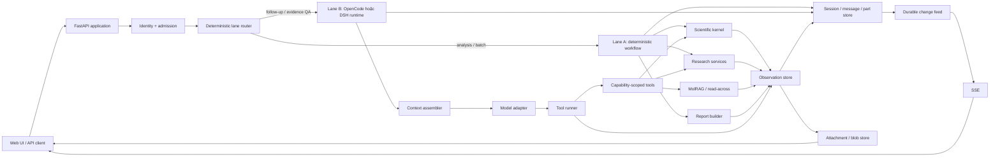
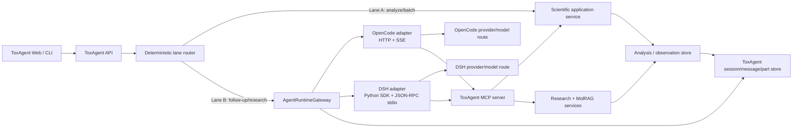

# ToxAgent — Đánh giá kiến trúc và chiến lược xây lại theo harness

> Trạng thái: đề xuất để thảo luận<br>
> Ngày rà soát: 2026-09-03<br>
> Phạm vi: toàn bộ `docs/spec`, backend/model server, agent layer, tools, services, frontend và các bề mặt lưu trữ hiện có

## 1. Kết luận ngắn

Trực giác “chỉ giữ API dự đoán độc tính, đập đi xây lại phần còn lại” là đúng hướng, nhưng ranh giới đó hơi hẹp.

Nên giữ **scientific kernel** chứ không chỉ giữ `/predict`. Scientific kernel gồm:

- chuẩn hoá và kiểm tra SMILES;
- model loading, model registry, inference và ensemble;
- threshold/calibration policy;
- dự đoán clinical và Tox21 mechanism;
- explanation và OOD assessment;
- phép tổng hợp xác định tạo `final_verdict`;
- contract của `/predict`, `/predict/batch`, `/explain` và đặc biệt là `/analyze`.

Nên xây lại gần như toàn bộ **agent/control plane**:

- ADK agent declarations và các nhánh fallback/recovery;
- orchestration nằm trong `model_server/main.py`;
- report chat planner, heuristic routing, tool dispatch bằng `if/elif`;
- session in-memory và cơ chế client gửi lại `report_state`;
- SSE sinh trực tiếp từ call stack;
- prompt phẳng, cắt context theo ký tự và hậu xử lý câu trả lời bằng thay chuỗi;
- cách dùng tên “agent” cho các stage deterministic như screening, evidence QA và writer.

Đích đến nên là **một ứng dụng modular monolith, hai execution lane, một scientific kernel dùng chung**:

1. Làn A deterministic phục vụ analysis/batch/benchmark và là nền để audit.
2. Làn B là agent runtime cho hỏi đáp. Trong điều kiện chỉ có LLM budget qua OpenCode và DSH, loop này do một trong hai harness cung cấp; ToxAgent sở hữu tool plane, product session, rules và provenance.

Không nên bắt đầu bằng multi-agent, generic plugin framework, code execution, graph framework hoặc tự viết thêm một model loop. ToxAgent cần tính truy nguyên và ổn định khoa học hơn là độ tự trị tối đa.

> **Cập nhật theo ràng buộc budget:** OpenCode và DSH sẽ được tích hợp như hai `AgentRuntimeProvider`. Bước đầu tiên là expose ToxAgent thành một MCP server để dùng được ngay từ cả hai harness. Khi nối custom frontend, ưu tiên OpenCode headless server; DSH SDK là worker/eval runtime hoặc primary runtime khi route model khả dụng chỉ tồn tại trong DSH. Xem mục 26.

## 2. Cơ sở đánh giá

Đề xuất này dựa trên:

- code và tài liệu hiện tại trong repository ToxAgent;
- thiết kế và nghiên cứu trong local checkout của [dsh-plugin](https://github.com/MinhQuangQu/dsh-plugin), đặc biệt `projects/toxagent_harness/DESIGN.md` và các ghi chép G1–G7;
- [DeepSeek Harness](https://github.com/deepseek-ai/deepseek-harness) và [tài liệu kiến trúc DSH](https://github.com/deepseek-ai/deepseek-harness/blob/master/docs/architecture.md);
- [OpenCode server](https://opencode.ai/docs/server/), [agents](https://opencode.ai/docs/agents), [skills](https://opencode.ai/docs/skills), [permissions](https://opencode.ai/docs/permissions/) và [plugins](https://opencode.ai/docs/plugins/);
- [Codex App Server](https://learn.chatgpt.com/docs/app-server), [AGENTS.md](https://learn.chatgpt.com/docs/agent-configuration/agents-md), [skills](https://learn.chatgpt.com/docs/build-skills) và [hooks](https://learn.chatgpt.com/docs/hooks);
- [Claude Code extension model](https://code.claude.com/docs/en/features-overview), [agent loop](https://code.claude.com/docs/en/how-claude-code-works), [memory](https://code.claude.com/docs/en/memory) và [hooks](https://code.claude.com/docs/en/hooks-guide);
- [Hermes Agent architecture](https://github.com/NousResearch/hermes-agent/blob/main/website/docs/developer-guide/architecture.md), [sessions](https://github.com/NousResearch/hermes-agent/blob/main/website/docs/user-guide/sessions.md), [skills](https://github.com/NousResearch/hermes-agent/blob/main/website/docs/guides/work-with-skills.md), [toolsets](https://github.com/NousResearch/hermes-agent/blob/main/website/docs/reference/toolsets-reference.md) và [contributor guidance](https://github.com/NousResearch/hermes-agent/blob/main/CONTRIBUTING.md);
- [MCP tools specification](https://modelcontextprotocol.io/specification/draft/server/tools).

Các sản phẩm trên không được dùng như template để sao chép nguyên xi. Chúng được dùng để kiểm tra các pattern đã hội tụ: vòng lặp model–tool, capability registry, progressive disclosure, session persistence, compaction, lifecycle hooks và ranh giới giữa hướng dẫn với enforcement.

### 2.1 Bài học nào được lấy, bài học nào bị loại

| Hệ thống | Pattern đáng lấy | Điều không nên sao chép vào ToxAgent |
|---|---|---|
| DSH | Definition/provider/consumer seam; model-visible action phải được ghi; tool restriction áp dụng cả prompt và execution; fail-loud config | “Everything is a plugin”, Cordis dependency graph và JSONL event log làm canonical store |
| OpenCode | Headless server; session/message/part có typed state; event là change feed; tool result có metadata/attachment; compaction bằng checkpoint/con trỏ | Permission model dành cho shell coding agent; plugin surface quá rộng; coupling UI/runtime của một developer tool |
| Codex | Thread/turn separation; streamed typed events; generated schemas; layered `AGENTS.md`; skill progressive disclosure; lifecycle hooks | App-server protocol nguyên bản và approval/sandbox dành cho code execution |
| Claude Code | Phân ranh rõ giữa instruction, skill, MCP, subagent và hook; hook/rule cho invariant cần đảm bảo; context isolation chỉ khi thật sự cần | Auto-memory ghi tự do và subagent/team topology cho một domain khoa học hẹp |
| Hermes | Toolsets lọc capability; durable session/search; skill vs tool guidance; memory/context provider seams | Tool registry và plugin ecosystem quá tổng quát; self-learning memory chưa phù hợp với evidence khoa học |
| MCP | Tool discovery/call contract và interoperability | Dùng MCP làm internal bus giữa các module cùng process |

Mẫu số chung không phải “càng nhiều agent càng tốt”. Mẫu số chung là: **một loop nhỏ, tool surface có kiểm soát, state bền vững, context có budget, và enforcement nằm ngoài prompt**.

## 3. ToxAgent hiện đang có những sản phẩm nào

ToxAgent không chỉ là một agent. Code hiện tại chứa ít nhất sáu sản phẩm logic khác nhau:

| Sản phẩm logic | Năng lực hiện có | Giá trị cần bảo toàn |
|---|---|---|
| ML inference platform | Nhiều backend/model, ensemble, binary toxicity, Tox21 | Model artifact, preprocessing, calibration, output semantics |
| Scientific analysis API | `/predict`, `/explain`, `/analyze`, batch, OOD | Contract xác định và khả năng benchmark |
| Compound input utilities | SMILES validation, canonicalization, preview, image-to-SMILES | Trải nghiệm nhập phân tử đa phương thức |
| Evidence platform | PubChem, PubMed, Europe PMC, Semantic Scholar, bioassay | Provider logic, retry, parsing, evidence record |
| MolRAG/read-across | Fingerprint, similar-molecule retrieval, knowledge retrieval, fusion | Thuật toán retrieval/scoring và evidence |
| Report application | Report projection, evidence QA, grounded chat, history, export UI | User journey và cấu trúc domain report |

Vấn đề chính không phải thiếu feature. Vấn đề là các sản phẩm logic này chưa có boundary rõ, nên model server đồng thời làm API, model registry, workflow engine, chat harness, tool dispatcher, state recovery, rendering và SSE.

## 4. Chẩn đoán kiến trúc hiện tại

### 4.1 Một “god module” đang nắm quá nhiều trách nhiệm

`model_server/main.py` hiện có hơn 6.000 dòng. Nó cùng lúc xử lý:

- load và dispatch nhiều model backend;
- endpoint prediction, explain và analyze;
- ADK runtime và deterministic fallback;
- report-chat planning và tool execution;
- evidence QA trùng lặp;
- render ảnh/base64;
- response normalization;
- SSE streaming.

Đây là điểm coupling lớn nhất. Việc thêm một harness mới trực tiếp vào file này sẽ tạo lớp orchestration thứ ba, không giải quyết nguyên nhân gốc.

### 4.2 “Agent layer” hiện tại chủ yếu là workflow stage

`ScreeningAgent`, `ResearcherAgent`, `EvidenceQAAgent` và `WriterAgent` có tên agent, nhưng phần giá trị cốt lõi của chúng là các hàm deterministic hoặc domain service:

- screening gọi analysis và optional MolRAG;
- researcher chạy các provider lookup/search;
- evidence QA deduplicate, chấm relevance và gắn cờ;
- writer chiếu state thành report có cấu trúc.

Các stage này không cần identity, memory và agent loop độc lập. Giữ chúng dưới dạng agent làm tăng prompt/runtime surface nhưng không tạo thêm autonomy hữu ích.

### 4.3 Hai runtime chồng lên nhau

`/agent/analyze` có nhánh ADK, nhánh deterministic, state recovery và fallback. Runtime deploy lại mặc định nghiêng về deterministic. Public response còn lộ `adk_available`, `runtime_mode`, `runtime_note` và `state_keys`—đây là chi tiết triển khai, không phải domain contract.

Hệ quả:

- cùng một use case có nhiều execution semantics;
- lỗi framework biến thành logic nghiệp vụ;
- test phải biết runtime path;
- client bị buộc biết ADK có chạy hay không.

### 4.4 Chat state không bền vững

Backend report chat dùng `_SESSION_STORE` trong memory. Khi process restart hoặc request sang instance khác, client phải gửi lại toàn bộ `report_state` để rehydrate.

Đây là dấu hiệu API đang bù cho thiếu persistence. Nó cũng tạo ba vấn đề:

- payload lớn và có thể bị client chỉnh sửa;
- server không có một nguồn sự thật duy nhất;
- audit transcript, tool calls và evidence khó khôi phục chính xác.

Firestore frontend hiện lưu lịch sử hữu ích cho UI, nhưng chưa phải session store của harness.

### 4.5 Tool plane chưa thật sự là một plane

Các capability đã tồn tại, nhưng chưa có contract/runtime chung:

- một số “tool” gọi HTTP ngược vào chính model server qua localhost;
- chat dispatch tool bằng chuỗi `if/elif`;
- tool result chưa có model-view, UI-view, metadata, attachment và provenance tách biệt;
- lỗi, timeout, retry và quan sát vận hành không có lifecycle thống nhất.

### 4.6 Context và output đang được sửa ở sai tầng

Report context được ghép thành chuỗi phẳng, cắt theo ký tự và ước lượng token kiểu gần đúng. Một số lỗi câu trả lời được vá bằng hậu xử lý chuỗi.

Đó là dấu hiệu thiếu:

- typed message/part;
- context builder có budget;
- observation projection;
- provenance validator;
- structured final response.

### 4.7 Có drift giữa code, config và docs

Ví dụ, tài liệu workflow, README và `workspace_mode.yaml` không hoàn toàn đồng thuận về workspace mode/model path. Đây không chỉ là vấn đề documentation: harness sẽ lắp prompt, tool surface và policy sai nếu config source of truth không rõ.

### 4.8 Bản đồ code làm căn cứ

| Bề mặt | File chính hiện tại | Nhận xét |
|---|---|---|
| HTTP route | `model_server/route_groups.py` | Liệt kê 11 route system/inference/agent/chat chính, chưa tính alias ẩn |
| Public schema | `model_server/schemas.py` | Scientific schema khá rõ; agent schema lộ runtime và rehydration debt |
| Model/API/chat runtime | `model_server/main.py` | Điểm coupling lớn nhất, hơn 6.000 dòng |
| Deterministic orchestration | `agents/orchestrator_agent.py` | Có baseline và benchmark value, nhưng đang trộn với ADK declarations |
| Screening/MolRAG shell | `agents/screening_agent.py` | Logic domain nên chuyển về application/molrag service |
| Literature workflow | `agents/researcher_agent.py`, `tools/research_tools.py` | Giữ provider/parsing/retry; bỏ agent wrapper |
| Evidence QA | `agents/evidence_qa_agent.py`, duplicate trong `model_server/main.py` | Chỉ giữ một implementation canonical |
| Report builder | `agents/writer_agent.py` | Giữ deterministic projection; đưa prose LLM tuỳ chọn sang lane B |
| Report chat/session | `agents/report_chat_agent.py` | In-memory state và context phẳng cần thay |
| Scientific implementation | `backend/`, `services/result_fusion.py` | Phần cần cô lập và giữ ổn định |
| MolRAG implementation | `services/molecule_retriever.py`, `services/knowledge_retriever.py`, `services/fingerprint_service.py` | Giữ thuật toán, chuẩn hoá output thành observations |
| Frontend contract | `frontend/src/lib/api.ts` | Schema client lớn và thủ công; nên generate từ OpenAPI |
| Client persistence | `frontend/src/firebase-config.ts`, `frontend/src/lib/firestore-history.ts`, `frontend/src/lib/chat-history.ts`, Firestore rules | Dùng làm migration input/projection, không làm transcript authority kiểu hiện tại |
| Offline ML | `scripts/`, training modules, model artifacts | Tách lifecycle khỏi online harness, không rewrite cùng đợt |

## 5. Ranh giới nên giữ, bọc lại, viết mới và xoá

### 5.1 Định nghĩa bốn quyết định

- **Giữ contract**: bên ngoài tiếp tục nhìn thấy hành vi tương thích; bên trong vẫn được refactor.
- **Giữ logic, bọc lại**: thuật toán/domain value còn đúng nhưng module/API hiện tại không còn là boundary.
- **Viết mới**: không cố cứu kiến trúc runtime cũ; chỉ viết adapter migration khi cần.
- **Xoá**: không mang pattern hoặc contract này sang kiến trúc đích.

### 5.2 Ma trận feature

| Khối hiện tại | Quyết định | Lý do | Đích đến |
|---|---|---|---|
| RDKit validation/canonicalization | Giữ logic, bọc lại | Là invariant đầu vào | `MoleculeResolver` dùng chung cho API và tool hook |
| Model artifacts và inference code trong `backend/` | Giữ | Là tài sản khoa học khó tái tạo | Scientific kernel + provider/model registry |
| Threshold/calibration/workspace policy | Giữ logic, tái cấu trúc | Ảnh hưởng trực tiếp semantics | Versioned `AnalysisPolicy` |
| Clinical/Tox21 prediction | Giữ contract | Là API sản phẩm ổn định | `/v1/predict*`, sau đó REST naming mới nếu cần |
| Explanation/GNN visualization | Giữ logic và contract chính | Có giá trị khoa học/UI | Blob/attachment thay base64 trong model context |
| OOD assessment | Giữ | Là safety signal, không phải agent feature | Bắt buộc trong `AnalysisResult` |
| `/analyze` deterministic | Giữ và nâng thành canonical | Đóng gói nhiều scientific invariants | Một application service in-process |
| Image-to-SMILES | Giữ capability | Là input adapter, không thuộc harness loop | `MoleculeResolver` API/tool riêng |
| SMILES preview | Giữ capability | Hữu ích cho UI, không phải reasoning | Media service/attachment |
| PubChem/PubMed/provider code | Giữ logic, bọc lại | Parsing/retry có giá trị | Research provider interfaces + tools |
| MolRAG retrieval/scoring/fusion | Giữ logic, bọc lại | Là domain engine | Read-across service + typed observations |
| Evidence QA deterministic | Giữ logic, đổi vai trò | Đây là validator/projector | Post-tool và pre-final policy hook |
| Deterministic report projection trong writer | Giữ logic, đổi vai trò | Đây là report projector | `ReportBuilder`, không phải agent |
| Optional LLM prose/recommendation trong writer | Viết lại | Không thuộc deterministic scientific result | Lane B skill/model step với provenance |
| Frontend analysis/report/chat journey | Giữ | Giá trị sản phẩm đã rõ | Client của API/session mới |
| Firebase Auth | Giữ | Không liên quan đến harness rewrite | Identity boundary |
| Firestore history hiện tại | Migration source | Có dữ liệu người dùng nhưng schema chưa đủ | Projection/index từ session store mới |
| ADK declarations/compatibility | Xoá | Tạo hai runtime và recovery debt | `AgentRuntimeGateway` với OpenCode/DSH adapters |
| `run_orchestrator_flow` | Giữ hành vi, viết lại shell | Benchmark đang phụ thuộc | `DeterministicAnalysisWorkflow` |
| Chat heuristic planner | Xoá | Trùng chức năng tool calling của model | Native function calling + capability filter |
| Chat tool `if/elif` dispatcher | Xoá | Không có registry/lifecycle contract | `ToolRegistry` + `ToolRunner` |
| String response normalizers | Xoá | Vá triệu chứng sau generation | Structured output + provenance validator |
| `_SESSION_STORE` | Xoá | Không chịu restart/multi-instance | Durable session/message/part store |
| `report_state` client rehydration | Xoá khỏi v2 | Client không nên là source of truth | Server-owned analysis snapshot |
| Self-HTTP từ tool vào cùng process | Xoá | Thêm latency, timeout và failure mode | In-process application service call |
| Legacy Streamlit | Archive rồi xoá nếu không còn user | Không nên cản module boundary mới | `legacy/` có deadline removal |
| `src/` compatibility wrappers 3 dòng | Deprecate dần | Tăng hai namespace cho cùng implementation | Import trực tiếp package canonical |
| Offline training/evaluation | Giữ và tách khỏi harness | Lifecycle khác online serving | `ml/` hoặc package/deploy pipeline riêng |

## 6. Quyết định theo từng API hiện tại

### 6.1 Scientific API

| Endpoint hiện tại | Quyết định | Contract mục tiêu |
|---|---|---|
| `GET /health` | Giữ | Tách readiness của process, model và dependency |
| `POST /predict` | Giữ | Contract versioned, thêm model/policy version trong metadata |
| `POST /predict/batch` | Giữ | Deterministic, không đi qua agent loop |
| `POST /explain` | Giữ | Kết quả typed; ảnh qua attachment URL, legacy adapter vẫn trả base64 |
| `POST /analyze` | Giữ và xem là API lõi | Một SMILES → một `AnalysisResult` đầy đủ, reproducible |
| `POST /extract-smiles-from-image` | Giữ capability, đổi namespace sau | `POST /v2/molecules:extract-from-image` |
| `POST /smiles/preview` | Giữ capability, đổi media contract | `POST /v2/molecules:preview` trả attachment |

Điểm quan trọng: nếu chỉ giữ `/predict` mà bỏ `/analyze`, harness mới sẽ phải tự ghép clinical, mechanism, threshold, OOD, explanation gating và verdict. Khi đó logic khoa học bị chuyển vào orchestration không xác định. Vì vậy `/analyze` phải là boundary của scientific kernel.

### 6.2 Agent API

| Endpoint hiện tại | Quyết định | Thay thế |
|---|---|---|
| `POST /agent/analyze` | Deprecate, giữ adapter tạm thời | Tạo session + chạy lane A + lưu typed parts |
| `POST /agent/analyze/stream` | Deprecate | Unified session event stream |
| `POST /agent/chat` | Deprecate | Gửi message vào session |
| `POST /agent/chat/stream` | Xoá sau migration | Dùng cùng event stream với analyze/chat/tool events |

Không nên giữ schema v2 của `AgentAnalyzeResponse`, vì `adk_available`, `runtime_mode`, `runtime_note` và `state_keys` là accidental API. Client cần biết trạng thái domain và run, không cần biết framework nội bộ.

### 6.3 API harness mục tiêu

Một bề mặt tối thiểu:

```text
POST   /v2/sessions
GET    /v2/sessions/{session_id}
POST   /v2/sessions/{session_id}/messages
GET    /v2/sessions/{session_id}/messages
GET    /v2/sessions/{session_id}/events
POST   /v2/sessions/{session_id}:cancel
GET    /v2/attachments/{attachment_id}
```

`POST /messages` có thể nhận một trong các intent rõ ràng:

```json
{
  "content": [{"type": "text", "text": "Phân tích CC(=O)OC1=CC=CC=C1C(O)=O"}],
  "mode": "auto",
  "analysis_options": {
    "clinical_threshold": 0.35,
    "mechanism_threshold": 0.5,
    "molrag_enabled": true
  }
}
```

Router deterministic quyết định:

- yêu cầu phân tích/batch rõ ràng → lane A;
- câu hỏi follow-up, so sánh evidence hoặc giải thích linh hoạt → lane B;
- input không đủ → yêu cầu clarification trước khi gọi model/tool đắt tiền.

## 7. Kiến trúc đích



### 7.1 Đây là modular monolith, không phải microservices bắt buộc

Boundary logic cần rõ, nhưng scientific kernel và harness có thể chạy cùng process trong giai đoạn đầu. Model artifacts nặng, cold start đắt và self-HTTP hiện tại không tạo isolation thật.

Chỉ tách deployment khi có bằng chứng về:

- nhu cầu scale khác nhau;
- tài nguyên CPU/GPU khác nhau;
- fault isolation đáng giá hơn chi phí network;
- ownership/release cadence khác nhau.

### 7.2 Một active agent loop cho mỗi session, không có subagent trong MVP

Screening, research và writer không phải ba agent. Chúng là service/tool/projector được một lane gọi theo contract.

Trong giai đoạn chỉ có budget qua harness, ToxAgent không tự triển khai vòng lặp model–tool. Mỗi product session được pin vào đúng một runtime—OpenCode hoặc DSH—và runtime đó cung cấp loop. ToxAgent vẫn chịu trách nhiệm về session domain, observations, permission, provenance và scientific result; không giao các invariant này cho prompt hoặc plugin tùy chọn của runtime.

Chỉ cân nhắc subagent khi có use case thực sự cần:

- context isolation lớn;
- nhiệm vụ độc lập chạy dài;
- kết quả có thể trả về bằng một summary/typed artifact;
- lợi ích song song lớn hơn chi phí provenance và latency.

Ở trạng thái hiện tại, deterministic parallelism giữa screening và research đã đủ cho lane A.

## 8. Mỗi primitive chịu trách nhiệm gì

| Primitive | Dùng cho | Không dùng cho |
|---|---|---|
| API | Contract sản phẩm ổn định cho client | Chi tiết framework/runtime |
| Provider | Backend có thể thay thế: model, PubMed, LLM, store | Workflow nghiệp vụ |
| Tool | Năng lực thực thi có schema mà model được phép gọi | Tài liệu dài hoặc policy bắt buộc |
| Skill | Playbook/tri thức chuyên ngành nạp theo nhu cầu | Security, provenance, validation bắt buộc |
| Rule/policy | Quyết định deterministic phải luôn đúng | Văn phong hoặc workflow linh hoạt |
| Hook | Điểm lifecycle nhỏ để quan sát/cưỡng chế/project | Một workflow nghiệp vụ lớn |
| Memory | State bền vững, có scope và quyền sở hữu | Kho tri thức khoa học hoặc raw tool dump |
| Observation | Kết quả typed từ model/tool/domain service | Transcript prose duy nhất |
| Projection | View rút gọn cho model/UI/report | Source of truth |
| Attachment | Ảnh, JSON lớn, raw evidence, artifact | Base64 nhét vào model context |

Ranh giới này phù hợp với pattern hội tụ ở Codex, Claude Code, OpenCode và Hermes: hướng dẫn có thể nạp dần; tool là capability; hook/rule xử lý điều phải cưỡng chế; session/history tách khỏi active model context.

## 9. Scientific kernel cần có hình dạng nào

### 9.1 Interface đề xuất

```python
class ToxicologyAnalyzer(Protocol):
    async def predict(self, request: PredictRequest) -> PredictResult: ...
    async def predict_batch(self, request: BatchPredictRequest) -> BatchPredictResult: ...
    async def explain(self, request: ExplainRequest) -> ExplainResult: ...
    async def analyze(self, request: AnalyzeRequest) -> AnalysisResult: ...
```

Mọi kết quả phải mang metadata đủ để tái hiện:

- canonical SMILES;
- model key và artifact/version/hash;
- inference backend;
- threshold và threshold policy version;
- workspace/config snapshot version;
- explainer và seed/config nếu có;
- thời điểm chạy và duration;
- warning/OOD status;
- correlation/run ID.

### 9.2 Model registry

Tách logic load/resolve/dispatch model ra khỏi FastAPI handler:

```python
class ModelProvider(Protocol):
    key: str
    capabilities: set[str]

    def load(self) -> None: ...
    def health(self) -> ModelHealth: ...
    def predict(self, batch: MoleculeBatch) -> ModelOutput: ...
```

Registry phải fail loud khi model/config không hợp lệ. Không được âm thầm đổi model vì một key sai, trừ khi fallback đó là policy versioned và được trả trong metadata.

### 9.3 Một source of truth cho policy

`workspace_mode`, env defaults, request override và model metadata cần được resolve một lần thành `AnalysisPolicySnapshot`. API, tool và benchmark cùng nhận snapshot này; không module nào tự đọc env để tạo semantics riêng giữa run.

## 10. Tool design

### 10.1 Tool catalog cho MVP

Không cần đưa mọi hàm Python thành tool. Model chỉ nên thấy 6–9 tool tùy capability profile.

| Tool | Trách nhiệm | Gọi vào |
|---|---|---|
| `resolve_molecule` | Tên/SMILES/ảnh → canonical molecule | Molecule resolver |
| `run_toxicity_analysis` | Chạy analysis deterministic đầy đủ | Scientific kernel `/analyze` service |
| `get_report_section` | Lấy projection nhỏ của report hiện tại | Report store |
| `lookup_compound` | Metadata/identifier từ PubChem | Research provider |
| `search_toxicology_literature` | Tìm evidence có cấu trúc | Literature providers |
| `get_article_detail` | Lấy abstract/metadata cho bài đã chọn | Literature provider/cache |
| `find_similar_molecules` | Analog/read-across retrieval | MolRAG service |
| `lookup_structural_alerts` | Alert đã chuẩn hoá | Knowledge service |
| `explain_mechanism` | Context cơ chế theo endpoint/task | Knowledge + evidence service |

`check_claim_support` không nhất thiết là model tool. Nên là deterministic validator/hook chạy trước final answer. `rerun_screening` cũng không cần là tool riêng nếu `run_toxicity_analysis` nhận policy/options rõ ràng.

### 10.2 Capability profiles

Tool surface phải được lọc trước model call:

| Profile | Tool được thấy |
|---|---|
| `analysis` | `resolve_molecule`, `run_toxicity_analysis` |
| `report_qa` | `get_report_section`, article/evidence tools, analog, mechanism |
| `literature_review` | compound, literature, article detail |
| `read_across` | report section, analog, structural alert, mechanism |

Việc cấm tool phải vừa:

1. loại schema khỏi prompt/model request;
2. chặn ở execution layer nếu model/client vẫn gửi tool call trực tiếp.

### 10.3 Tool contract

```python
@dataclass(frozen=True)
class ToolDefinition:
    name: str
    description: str
    input_schema: dict
    output_schema: dict
    capability: str
    timeout_ms: int
    idempotency: str
    handler: Callable[..., Awaitable[ToolResult]]

@dataclass(frozen=True)
class ToolResult:
    observation_id: str
    model_view: dict | str
    ui_view: dict | None
    metadata: dict
    attachments: list[AttachmentRef]
```

Tool handler trả typed error, không giả error thành một đoạn prose thành công. Args được parse/validate đúng một lần và chuyển thành immutable value trước execution.

### 10.4 MCP dùng ở đâu

Nên có một MCP adapter cho tool catalog để:

- test tool độc lập bằng client chuẩn;
- tái sử dụng từ notebook/IDE/harness khác;
- tách external research connectors khi cần.

Không nên bắt scientific kernel gọi chính nó qua MCP/HTTP trong cùng process. MCP là compatibility boundary ở rìa, không phải internal bus bắt buộc.

## 11. Rules và policy

Rules là code/config deterministic, không phải đoạn prompt “hãy luôn...”. Bộ rule tối thiểu:

| Rule | Điểm thực thi | Failure behavior |
|---|---|---|
| Authentication/ownership | Admission + store query | 401/403, không leak tồn tại session |
| Input schema và canonical SMILES | Admission/pre-tool | Typed validation error |
| Lane routing | Sau intent classification deterministic | Chọn A/B hoặc clarification |
| Allowed tool surface | Trước model và trước tool | Tool bị ẩn và execution bị deny |
| Deadline/quota/retry | Tool runner | Timeout/circuit-open observation |
| Model/policy version | Scientific kernel | Fail loud hoặc explicit versioned fallback |
| Evidence dedup/relevance | Sau research tool | Curated evidence observation |
| Numeric provenance | Trước final answer | Regenerate hoặc deterministic fallback |
| Citation requirement | Trước final answer | Gắn warning/hạ confidence/chặn claim |
| No raw blob in context | Observation projector | Chỉ đưa attachment reference/summary |
| Deterministic lane no LLM | Lane A workflow | Test và runtime assertion |

Các policy này phải versioned để một report cũ vẫn giải thích được bằng rule set lúc nó được tạo.

## 12. Hooks

ToxAgent chỉ cần một bộ hook typed, thứ tự cố định và nhỏ:

```text
on_request_admitted
before_model_call
after_model_call
before_tool_call
after_tool_call
before_compaction
after_compaction
before_turn_commit
after_state_commit
on_run_failed
```

Mapping use case:

| Hook | Việc chính |
|---|---|
| `on_request_admitted` | auth, normalize locale, correlation ID, route intent |
| `before_model_call` | assemble context, filter tools, token budget |
| `after_model_call` | usage/cost/finish reason telemetry |
| `before_tool_call` | schema, canonicalization, quota, deadline, dedupe key |
| `after_tool_call` | tạo observation, projection, numeric index, attachment |
| `before_compaction` | pin report/evidence/provenance references |
| `after_compaction` | verify retained anchors và tăng context epoch |
| `before_turn_commit` | provenance/citation/final schema validation |
| `after_state_commit` | publish durable change cho SSE/metrics |
| `on_run_failed` | typed failure part và cleanup lease |

Không nên xây Cordis/plugin graph đầy đủ. Với một product domain, `Protocol + registry + fixed hook chain` dễ test và dễ audit hơn dynamic plugin dependency graph.

Không nên cho hook có quyền sửa tuỳ ý kết quả tool sau provenance. Vùng kết quả gốc phải immutable; hook chỉ tạo projection/metadata/derived observation mới.

## 13. Skills

Skill là tài liệu/playbook chuyên ngành được quảng bá bằng name/description và chỉ nạp body/reference khi cần. Bộ skill ban đầu có thể là:

```text
skills/
  interpret-clinical-risk/SKILL.md
  interpret-tox21-mechanisms/SKILL.md
  assess-herg-risk/SKILL.md
  assess-hepatotoxicity/SKILL.md
  assess-genotoxicity/SKILL.md
  interpret-ood/SKILL.md
  perform-read-across/SKILL.md
  review-toxicology-literature/SKILL.md
  write-toxicity-report/SKILL.md
```

Một skill nên chứa:

- khi nào dùng và khi nào không dùng;
- vocabulary/ontology liên quan;
- workflow suy luận;
- cách diễn giải uncertainty;
- loại evidence cần ưu tiên;
- reference files hoặc template liên quan;
- tool names chỉ như hướng dẫn, không trao thêm quyền.

Không đặt vào skill:

- threshold bắt buộc;
- rule “mọi số phải có provenance”;
- auth/permission;
- retry/timeout;
- logic thay đổi label;
- bí mật hoặc API key.

Skill là procedural knowledge, không phải enforcement. Claude Code mô tả đúng ranh giới này: hook phù hợp khi hành động phải xảy ra nhất quán; skill phù hợp khi model cần áp dụng tri thức/quy trình. Hermes cũng phân biệt tool cho xử lý chính xác, binary/stream/auth và skill cho workflow có thể biểu diễn bằng instruction cùng tool hiện có.

## 14. Memory và session

### 14.1 Không gọi mọi thứ là memory

Tách năm loại state:

| Loại | Ví dụ | Retention | Có vào context tự động? |
|---|---|---|---|
| Working state | tool call đang chạy, current plan | Một run | Có chọn lọc |
| Session transcript | user/assistant/tool parts | Theo policy người dùng | Chỉ recent tail + checkpoint |
| Analysis snapshot | kết quả model, policy, report | Immutable/versioned | Qua projection/reference |
| Evidence store | article, analog, raw payload | Theo report/compliance | Chỉ projection cần thiết |
| User preference | ngôn ngữ, format, threshold preset | Explicit opt-in | Khi có scope phù hợp |

Kho literature/knowledge không phải “agent memory”; đó là retrieval corpus. Model artifacts cũng không phải memory.

### 14.2 Không triển khai self-learning memory ở MVP

Hermes cho thấy memory provider, past-session search và skill learning là khả thi. Nhưng trong toxicology, tự ghi “fact” xuyên session có thể làm stale evidence hoặc user-specific assumption trở thành ngữ cảnh khoa học không được kiểm chứng.

MVP chỉ nên cho:

- user tự đặt preference;
- report/evidence snapshot immutable;
- session resume/search có ACL;
- suggestion để con người xác nhận trước khi biến một pattern thành skill hoặc rule.

### 14.3 State-sourced, không dùng JSONL như canonical store

Nguồn sự thật nên là `session → message → part`, trong đó change event chỉ là feed cho UI/telemetry. Đây là pattern phù hợp với OpenCode và với yêu cầu resume/audit của web app hơn việc replay một JSONL log để dựng trạng thái.

Mô hình logic:

```text
Session
  id, owner_id, status, title, mode
  active_analysis_id, context_epoch
  created_at, updated_at, version

Message
  id, session_id, role, created_at, sequence
  model, usage, finish_reason

Part
  id, message_id, type, status, sequence
  text | tool_call | tool_result | analysis_ref | citation | error
  observation_id, metadata

Observation
  id, run_id, producer, schema_version
  payload_ref, model_projection, provenance

Attachment
  id, owner_id, media_type, storage_uri
  sha256, size, retention_class

Checkpoint
  id, session_id, through_sequence, context_epoch
  summary, pinned_observation_ids, token_count
```

Firestore có thể giữ metadata/session/message/part trong giai đoạn đầu. Ảnh, raw literature payload và JSON lớn nên ở Cloud Storage/object store. Mọi SSE update chỉ phát sau durable write hoặc mang sequence/version để client reconcile.

### 14.4 Compaction

Compaction giảm active model context, không xoá transcript/audit history. Quy trình:

1. Dùng observation projection thay raw output trước.
2. Bỏ phần có thể lookup lại bằng ID.
3. Pin analysis ID, canonical SMILES, model/policy version, cited evidence và unresolved user intent.
4. Tóm tắt phần hội thoại còn lại thành checkpoint.
5. Giữ recent tail.
6. Kiểm tra provenance anchors sau compaction.

Không ước lượng token bằng `len(text) // 4` cho quyết định correctness. Dùng tokenizer/provider usage và giữ safety margin.

## 15. Provenance là invariant trung tâm

Mỗi số hoặc khẳng định khoa học quan trọng trong câu trả lời lane B phải có nguồn từ một observation đã lưu:

```text
final numeric/scientific claim
        ↓
claim index / citation marker
        ↓
observation_id + field path
        ↓
tool/model run + policy/model version
```

Pipeline trước khi commit final answer:

1. Parse structured answer/claim map.
2. Kiểm tra observation/citation reference tồn tại và thuộc session.
3. Kiểm tra giá trị số khớp field gốc trong tolerance cho phép.
4. Kiểm tra evidence không bị dedupe/relevance policy loại.
5. Nếu vi phạm: một lần regenerate có feedback typed.
6. Nếu vẫn vi phạm: trả deterministic safe answer dựa trên report projection, kèm warning.

Evidence QA hiện tại nên được giữ làm nền cho validator này, nhưng chỉ có một implementation canonical.

## 16. Streaming và trạng thái run

SSE không nên là các callback tạm thời từ call stack. UI cần nhận projection của state đã lưu:

```text
run.created
run.started
message.created
part.created
tool.started
tool.completed
observation.created
part.delta
checkpoint.created
run.completed
run.failed
```

Mỗi event có:

- `session_id`;
- `run_id`;
- `sequence`;
- `entity_type` và `entity_id`;
- `version`;
- `occurred_at`;
- payload nhỏ.

Client reconnect bằng `Last-Event-ID` hoặc sequence. Nếu mất event, client đọc lại session/messages/parts; không phụ thuộc việc replay stream trong RAM.

## 17. Cấu trúc package đề xuất

```text
toxagent/
  api/
    app.py
    v1_scientific.py
    v1_compat_agent.py
    v2_sessions.py
    v2_attachments.py
  domain/
    molecule.py
    analysis.py
    evidence.py
    report.py
    provenance.py
  application/
    analyze_molecule.py
    analyze_batch.py
    build_report.py
    answer_report_question.py
  scientific/
    model_registry.py
    providers/
    inference.py
    explanation.py
    ood.py
    policy.py
  research/
    providers/
    literature.py
    compound.py
    bioassay.py
  molrag/
    retrieval.py
    knowledge.py
    fusion.py
  harness/
    router.py
    runtime_gateway.py
    runtime_provider.py
    adapters/
      opencode.py
      deepseek_harness.py
    context.py
    compaction.py
    tool_registry.py
    tool_runner.py
    hooks.py
    rules.py
    model_adapter.py
  tools/
    molecule_tools.py
    analysis_tools.py
    research_tools.py
    report_tools.py
    molrag_tools.py
  skills/
  persistence/
    session_store.py
    observation_store.py
    attachment_store.py
    firestore/
  streaming/
    change_feed.py
    sse.py
  telemetry/
    traces.py
    metrics.py
```

Rule phụ thuộc:

```text
api → application → domain
                  → scientific/research/molrag interfaces
harness → application/tools → domain interfaces
persistence/providers → domain interfaces
domain → không phụ thuộc FastAPI, ADK, Firestore hoặc model SDK
```

Không cần đổi toàn bộ path trong một commit. Đây là package map đích để strangler migration.

## 18. Chiến lược migration

### Giai đoạn 0 — Đóng băng baseline

Việc làm:

- snapshot OpenAPI hiện tại;
- contract test cho mọi endpoint scientific;
- golden cases cho valid/invalid SMILES, clinical/Tox21, OOD và explanation;
- ghi model/config/artifact version vào benchmark;
- xác nhận config source of truth;
- đo latency, error rate và report quality hiện tại.

Điều kiện thoát:

- cùng input + policy + artifact tạo output trong tolerance đã định;
- benchmark không còn phụ thuộc ngầm vào env của máy chạy.

### Giai đoạn 1 — Tách scientific kernel

Việc làm:

- chuyển load/resolve/dispatch model khỏi `model_server/main.py`;
- tạo `ToxicologyAnalyzer` và `AnalysisPolicySnapshot`;
- cho endpoint cũ gọi application service in-process;
- bỏ self-HTTP nội bộ.

Điều kiện thoát:

- `/predict`, `/explain`, `/analyze` giữ contract;
- unit test scientific kernel không cần FastAPI;
- lane A không gọi LLM.

### Giai đoạn 2 — Tool và observation plane

Việc làm:

- registry/runner typed;
- 6–9 tools MVP;
- observation/attachment contract;
- provider adapters cho PubChem/literature/MolRAG;
- optional MCP facade để test/integrate.

Điều kiện thoát:

- mọi tool có schema, timeout, fixture và typed error;
- raw/base64 payload không đi vào model context;
- denied tool không xuất hiện trong model request và không chạy được.

### Giai đoạn 3 — Session bền vững và unified SSE

Việc làm:

- session/message/part/checkpoint store;
- analysis snapshot do server sở hữu;
- change feed và reconnectable SSE;
- frontend đọc state mới;
- migrate/link history cũ.

Điều kiện thoát:

- restart hoặc chuyển Cloud Run instance vẫn resume được;
- bỏ nhu cầu gửi `report_state` từ client;
- UI có thể reconstruct từ REST state nếu mất stream.

### Giai đoạn 4 — Runtime-backed lane B

Việc làm:

- `AgentRuntimeGateway` và adapter OpenCode/DSH;
- một runtime được pin cho mỗi session;
- deterministic router;
- context assembly + budgets;
- provenance validator chạy shadow mode;
- compatibility adapter cho `/agent/*`.

Điều kiện thoát:

- không cần ADK để analyze/chat;
- tool calls và final claims replay/audit được;
- old/new eval suite đạt ngưỡng đã chốt.

### Giai đoạn 5 — Skills, compaction và enforcement

Việc làm:

- skill discovery/progressive disclosure;
- context checkpoint;
- bật strict numeric/citation provenance sau shadow telemetry;
- cost/token metrics.

Điều kiện thoát:

- session dài không mất evidence anchors;
- provenance violation sau retry ở dưới ngưỡng;
- context budget có test và dashboard.

### Giai đoạn 6 — Dọn runtime cũ

Xoá:

- ADK declarations và `adk_compat`;
- ADK recovery/fallback branch;
- in-memory chat store;
- heuristic planner và string normalizers;
- duplicate evidence QA;
- `/agent/*` compatibility endpoints sau deprecation window;
- legacy UI/import wrappers không còn consumer.

## 19. Phần frontend nên giữ và phần cần sửa

### Giữ

- text/drawing/image molecule input;
- progress visualization;
- quick verdict và full report navigation;
- clinical, mechanism, structural, MolRAG và literature views;
- authenticated history;
- report follow-up chat;
- export/copy flows nếu có user thực.

### Sửa

- sinh TypeScript client/type từ OpenAPI thay vì duy trì schema thủ công trong file API lớn;
- dùng session/message/part và một SSE stream thống nhất;
- chỉ lưu client cache/projection, không coi localStorage là source of truth;
- hiển thị model/policy/evidence provenance theo mức phù hợp;
- dùng attachment URL thay base64 trong JSON lớn;
- phân biệt trạng thái `queued/running/completed/failed/cancelled`;
- sửa hoặc bỏ settings toggle không có backend enforcement;
- xoá thông điệp privacy không đúng với việc dùng Firestore/external research APIs.

## 20. Eval và quality gates

### 20.1 Scientific regression

- golden prediction theo model artifact;
- threshold/calibration regression;
- canonicalization và invalid input;
- Tox21 task ordering/labels;
- OOD warnings;
- explanation availability và timeout;
- deterministic lane không phát sinh LLM/network research ngoài contract.

### 20.2 Harness correctness

- tool schema/timeout/retry/cancellation;
- same-process tool không đi vòng HTTP;
- tool deny kiểm tra cả exposure và execution;
- session resume qua restart/cross-instance;
- SSE state convergence;
- compaction giữ pinned observation/citation;
- attachment ACL và retention;
- concurrent message/run ownership.

### 20.3 Answer quality

- numeric provenance precision/recall;
- unsupported-claim rate;
- citation validity;
- grounded answer rate;
- correct refusal/uncertainty;
- report-question relevance;
- old vs new semantic report coverage, không bắt exact prose.

### 20.4 Vận hành

- p50/p95 latency theo lane/tool/provider;
- token/cost theo turn/session;
- model cache hit và cold start;
- tool failure/retry/circuit-open rate;
- compaction frequency;
- payload/attachment size;
- session restore failure rate.

## 21. Rủi ro và cách giảm

| Rủi ro | Tác động | Cách giảm |
|---|---|---|
| Rewrite làm đổi semantics model | Rất cao | Contract/golden test trước refactor |
| Hai API tồn tại quá lâu | Trung bình | Deprecation owner, metric consumer, removal date |
| Firestore update nóng khi stream token | Trung bình | Buffer delta, persist theo chunk/part version |
| Provenance strict làm giảm UX | Trung bình | Shadow → warn → enforce, deterministic fallback |
| Skill overlap/load sai | Thấp–trung bình | Description không chồng lấn, eval activation |
| Tool surface lớn làm tăng token/sai routing | Trung bình | Capability profiles, tối đa khoảng 6–9 tool/call |
| External evidence provider không ổn định | Cao | Provider interface, cache, typed degradation |
| Context summary làm mất uncertainty | Cao | Pin observations/citations/policy; verify checkpoint |
| Generic hook/plugin framework phình to | Trung bình | Fixed typed hooks, không dynamic dependency graph |
| User memory gây contamination khoa học | Cao | Explicit preference only; không auto-learn fact |

## 22. Những điều chưa nên làm

- Không tự viết model loop hoặc thêm LangGraph/CrewAI/AutoGen chỉ để thay ADK; dùng OpenCode/DSH qua adapter.
- Không tách từng tool thành microservice.
- Không biến mọi domain function thành model-visible tool.
- Không cho model tự chọn lane A hay B.
- Không dùng prompt để enforce auth, threshold, provenance hoặc timeout.
- Không cho skill cấp thêm quyền tool.
- Không nạp toàn bộ literature/report/raw JSON vào context.
- Không dùng subagent cho screening/research/writer trong MVP.
- Không triển khai self-editing skills hoặc auto-memory khoa học trong MVP.
- Không rewrite model/training pipeline cùng lúc với harness.

## 23. Các quyết định cần chốt trước khi code

### Đề xuất mặc định

| Câu hỏi | Mặc định khuyến nghị |
|---|---|
| Store session/message/part | Firestore giai đoạn đầu, sau interface; blob ở Cloud Storage |
| Runtime topology | Modular monolith trên Cloud Run |
| Agent runtime | OpenCode primary cho custom web; DSH SDK cho worker/eval hoặc route chỉ DSH có; không ADK |
| Tool interoperability | Internal registry là canonical, MCP là adapter |
| LLM lane A | Cấm |
| LLM lane B | Cho phép qua model adapter và budget |
| Subagents | Không trong MVP |
| Generic plugins | Không; fixed hooks/providers/skills |
| Old `/agent/*` | Compatibility adapter có thời hạn |
| Provenance | Shadow trước, sau đó strict cho số/claim quan trọng |
| User memory | Opt-in preferences only |

### Cần product/engineering xác nhận

1. Public scientific API có external consumer ngoài frontend hay chưa?
2. Có cần giữ exact response schema của `/analyze`, hay chỉ semantic compatibility?
3. Report/history cần retention bao lâu và có yêu cầu xoá dữ liệu theo user không?
4. Raw literature/compound response có cần lưu để audit hay chỉ lưu normalized evidence?
5. Image/heatmap có thể chuyển sang signed URL ngay hay cần base64 compatibility window?
6. Frontend cần stream token-level hay part/status-level là đủ?
7. Ngưỡng provenance nào chặn final answer, ngưỡng nào chỉ hiện warning?

## 24. Quyết định cuối cùng

Không nên mô tả dự án là “giữ model API, viết một agent mới bên ngoài”. Cách mô tả đúng hơn là:

> Giữ và cô lập scientific kernel cùng deterministic analysis contract; thay thế toàn bộ control plane bằng một harness stateful, typed, provenance-first.

Ranh giới này bảo toàn phần có giá trị khoa học và benchmark cao nhất, đồng thời cho phép xoá mạnh tay phần kiến trúc đang gây nợ: ADK dual runtime, god module, in-memory chat, manual planner/dispatcher, context phẳng và stream không bền vững.

Nếu chỉ chọn một lát cắt để bắt đầu, hãy làm theo thứ tự:

1. freeze `/analyze` bằng contract/golden tests;
2. extract `ToxicologyAnalyzer` khỏi FastAPI;
3. cho screening/tool gọi service in-process;
4. tạo session/message/part store;
5. dựng ToxAgent MCP server và `AgentRuntimeGateway` cho OpenCode/DSH;
6. migrate frontend;
7. xoá ADK và `/agent/*` cũ.

Đây là con đường ngắn nhất để thật sự “đập đi xây lại” mà không vô tình đập luôn phần khoa học đáng giữ nhất của ToxAgent.

## 25. Tài liệu liên quan trong repository

- [HARNESS_ARCHITECTURE.md](./HARNESS_ARCHITECTURE.md)
- [HARNESS_SYSTEM_DESIGN_VI.md](./HARNESS_SYSTEM_DESIGN_VI.md)
- [HARNESS_USE_CASES_VI.md](./HARNESS_USE_CASES_VI.md)
- [HARNESS_USER_STORIES_VI.md](./HARNESS_USER_STORIES_VI.md)
- [FUNCTION_CALLING_FLOW.md](./FUNCTION_CALLING_FLOW.md)
- [WORKFLOW_TONG_QUAN.md](./WORKFLOW_TONG_QUAN.md)
- [REPORT_CHAT_FIRESTORE_PERSISTENCE_PLAN.md](./REPORT_CHAT_FIRESTORE_PERSISTENCE_PLAN.md)
- [toxagent_ui_spec.md](./toxagent_ui_spec.md)

## 26. Áp dụng khi chỉ có LLM budget qua OpenCode và DeepSeek Harness

### 26.1 Hiểu đúng ràng buộc

OpenCode và DeepSeek Harness là **agent harness/runtime**, không phải scientific model và cũng không tự động là nguồn LLM budget. Budget thực tế nằm ở provider/model route đã được người dùng kết nối vào từng runtime bằng API credential, OAuth hoặc subscription.

Điều này tạo hai lớp hoàn toàn khác nhau:

```text
ToxAgent scientific models
  → model độc tính của dự án, chạy deterministic

OpenCode / DSH model route
  → LLM dùng để hiểu câu hỏi, chọn tool và viết câu trả lời
```

Không chuyển credential/OAuth token từ OpenCode hoặc DSH sang code ToxAgent. Mỗi runtime tiếp tục sở hữu credential, refresh và provider-specific wire protocol của nó. ToxAgent chỉ gọi interface headless/SDK của runtime.

Trước khi dùng budget cho một deployment, phải inventory rõ:

| Thuộc tính | Cần biết |
|---|---|
| Runtime | OpenCode hay DSH, phiên bản binary/profile |
| Provider route | Provider ID và model ID thật phía sau |
| Auth | API key, OAuth hay coding subscription |
| Scope | Cá nhân, internal team hay được phép phục vụ end-user |
| Limit | Request/token/concurrency/context/output limit |
| Automation | Provider/subscription có cho headless automation không |
| Persistence | Credential/session nằm ở đâu, có survive restart không |
| Data policy | Prompt, SMILES, report và evidence được gửi tới đâu |

Nếu budget đến từ coding subscription cá nhân hoặc bundle OAuth bên thứ ba, mặc định chỉ dùng cho local development/internal evaluation cho đến khi điều khoản provider xác nhận việc backend automation và multi-user serving được phép. Basic Auth trước OpenCode server hoặc một container riêng không tự biến subscription cá nhân thành production entitlement.

### 26.2 Quyết định kiến trúc cập nhật

Không tự viết một function-calling loop mới trong giai đoạn này. Thay vào đó:

1. ToxAgent expose scientific/research capabilities qua một MCP server.
2. OpenCode và DSH đều kết nối tới MCP server đó.
3. Một `AgentRuntimeGateway` chuẩn hoá cách ToxAgent khởi tạo session, gửi turn, nhận event, cancel và đọc usage từ hai runtime.
4. Product session, analysis snapshot, observation, attachment và provenance vẫn do ToxAgent sở hữu.
5. Runtime được chọn và pin khi tạo session; không đổi runtime âm thầm giữa các turn.



Kiến trúc này dùng được budget hiện có ngay, nhưng không để domain ToxAgent phụ thuộc trực tiếp vào schema session/tool nội bộ của OpenCode hoặc Cordis/JSONL của DSH.

### 26.3 Ba mức tích hợp

#### Mức A — MCP-first, dùng UI của harness

```text
OpenCode TUI/Web ─┐
                  ├─→ ToxAgent MCP ─→ scientific/research services
DSH Web/CLI ──────┘
```

Đây là mức nên làm đầu tiên:

- chưa cần sửa frontend ToxAgent;
- chưa cần viết agent loop;
- kiểm tra ngay model nào gọi tool tốt hơn;
- so sánh prompt, tool schemas, latency và token usage;
- tool plane được kiểm thử độc lập với harness.

Mức này phù hợp cho developer workflow, internal demo và xây eval dataset. Nó chưa tạo sản phẩm web ToxAgent hoàn chỉnh.

#### Mức B — Runtime gateway cho frontend ToxAgent

```text
ToxAgent UI
   → ToxAgent session API
   → AgentRuntimeGateway
   → OpenCode server hoặc DSH subprocess
   → ToxAgent MCP
```

Đây là kiến trúc mục tiêu khi cần giữ UI hiện tại. Gateway không tái triển khai reasoning loop; nó làm adapter và policy boundary:

- map product session sang runtime session;
- chọn/pin runtime và model route;
- gửi prompt/parts;
- normalize external events;
- mirror tool/message usage cần audit;
- quản lý deadline/cancel/failure;
- commit final answer sau provenance validation.

#### Mức C — Direct LLM provider trong tương lai

Khi có direct API budget phù hợp cho production, thêm adapter thứ ba:

```text
AgentRuntimeProvider
  ├── OpenCodeRuntime
  ├── DeepSeekHarnessRuntime
  └── DirectModelRuntime       # tương lai
```

Scientific kernel, MCP tools, product session và frontend không phải viết lại. Chỉ thay execution provider cho lane B.

### 26.4 Chọn OpenCode hay DSH cho việc gì

| Nhu cầu | OpenCode | DSH | Khuyến nghị |
|---|---|---|---|
| Dùng ngay bằng TUI/Web | Tốt | Tốt | Cả hai để A/B eval |
| Custom frontend gọi programmatically | HTTP server, OpenAPI 3.1, sync/async message, SSE | SDK subprocess qua JSON-RPC stdio | OpenCode primary |
| Cancel một turn | Có `/session/:id/abort` | SDK hiện chưa có prompt-cancel | OpenCode |
| Worker Python/batch/eval | Gọi HTTP được | Python SDK trực tiếp, trả events/final response | DSH |
| Session/event audit nội bộ runtime | Message/part + event stream | Durable session events/JSONL | Cả hai, nhưng ToxAgent vẫn giữ product audit |
| Custom composition sâu | Config/plugin được | Cordis profile/patch rất linh hoạt | DSH nếu thật sự cần |
| MCP | Local/remote MCP | Stdio/Streamable HTTP MCP client | Cả hai |
| Maturity của embedded wire | HTTP API dễ tích hợp hơn | SDK/wire còn một số giới hạn và pre-release churn | OpenCode cho app-facing path |
| Model route chỉ có ở một runtime | Phụ thuộc auth đã kết nối | Phụ thuộc adapter/profile đã kết nối | Runtime có route thắng |

[OpenCode server](https://opencode.ai/docs/server/) cung cấp `POST /session`, sync/async message, session abort, SSE và OpenAPI. [DSH Python SDK](https://github.com/deepseek-ai/deepseek-harness/blob/master/python/sdk/README.md) spawn runtime cùng phiên bản qua JSON-RPC stdio, nhận session events và final response; [DSH SDK server](https://github.com/deepseek-ai/deepseek-harness/blob/master/packages/sdk/server/README.md) hiện chưa có per-prompt cancel hoặc session close.

Khuyến nghị mặc định:

- **OpenCode primary** cho ToxAgent custom web/chat.
- **DSH primary** khi provider/model budget cần dùng chỉ có trong DSH profile.
- **DSH worker** cho batch experiment, replay và evaluation.
- Cả hai cùng chạy cùng test suite; không gọi cả hai để ensemble mọi câu trả lời.

### 26.5 `AgentRuntimeProvider` contract

```python
class AgentRuntimeProvider(Protocol):
    kind: Literal["opencode", "deepseek_harness"]

    async def health(self) -> RuntimeHealth: ...
    async def capabilities(self) -> RuntimeCapabilities: ...

    async def create_session(
        self,
        *,
        product_session_id: str,
        model_route: ModelRoute,
        profile_version: str,
    ) -> RuntimeSession: ...

    async def run_turn(
        self,
        *,
        runtime_session_id: str,
        parts: list[InputPart],
        limits: TurnLimits,
        on_event: Callable[[RuntimeEvent], Awaitable[None]],
    ) -> RuntimeTurnResult: ...

    async def cancel(self, runtime_session_id: str) -> CancelResult: ...
```

`RuntimeCapabilities` phải nói rõ thay vì giả định:

```python
@dataclass(frozen=True)
class RuntimeCapabilities:
    streaming: bool
    cancel_turn: bool
    durable_sessions: bool
    native_tools: bool
    mcp: bool
    usage_reporting: bool
    image_input: bool
```

Mỗi binding cần được lưu:

```text
RuntimeSessionBinding
  product_session_id
  runtime_kind
  runtime_session_id
  provider_id
  model_id
  profile/config hash
  auth principal reference        # không lưu token
  capabilities snapshot
  created_at, last_seen_at
```

Adapter chuẩn hoá event của hai runtime về vocabulary nhỏ của ToxAgent:

```text
runtime.turn.started
runtime.assistant.delta
runtime.tool.started
runtime.tool.completed
runtime.usage.updated
runtime.turn.completed
runtime.turn.failed
runtime.session.idle
```

Raw runtime event có thể giữ cho debug với retention ngắn. Product message/part, observations và provenance là contract bền vững của ToxAgent.

### 26.6 Hai session layer không được trộn vai trò

Khi dùng external harness, sẽ tồn tại hai loại session:

| Session | Chủ sở hữu | Mục đích |
|---|---|---|
| Product session | ToxAgent | User history, report, observations, ACL, audit, UI state |
| Runtime session | OpenCode/DSH | Model-visible context, provider cache, execution bookkeeping |

Không coi OpenCode DB hoặc DSH JSONL là database sản phẩm. Chúng có thể đổi schema theo phiên bản runtime, nằm trên local disk và mang semantics của coding harness.

Quy tắc:

1. ToxAgent lưu mapping giữa hai session ID.
2. Mọi analysis/evidence quan trọng phải tồn tại trong ToxAgent store, không chỉ trong runtime transcript.
3. Runtime transcript phải được capture đủ để audit cái model đã nhìn thấy.
4. Nếu runtime session mất, tạo session mới từ ToxAgent checkpoint + pinned observation projections.
5. Recovery phải gắn `reconstructed_runtime=true`; không tuyên bố là resume bit-for-bit.
6. Không gửi toàn bộ raw report vào lại runtime; chỉ gửi checkpoint và observation references/projections.

### 26.7 ToxAgent MCP server là điểm đầu tư quan trọng nhất

Một server duy nhất phục vụ cả OpenCode lẫn DSH:

```text
toxagent-mcp
  resolve_molecule
  run_toxicity_analysis
  get_report_section
  lookup_compound
  search_toxicology_literature
  get_article_detail
  find_similar_molecules
  lookup_structural_alerts
  explain_mechanism
```

MCP server phải:

- gọi application/scientific services, không import FastAPI handlers;
- trả structured content + observation ID;
- có timeout và typed error;
- không trả base64 ảnh vào model output;
- cấp attachment reference có ACL;
- ghi model/artifact/policy/evidence version;
- chỉ expose read-only/deterministic capability trong MVP;
- không expose training, filesystem, shell hoặc arbitrary HTTP fetch.

Với remote MCP, auth token phải bind vào một runtime/user scope. Không yêu cầu model tự điền security-sensitive `session_id` hay bearer token trong tool args. `analysis_id`/`report_id` là domain input hợp lệ; authorization context phải đến từ transport hoặc runtime binding.

OpenCode hỗ trợ local và remote MCP, đồng thời có thể disable tool theo global/per-agent pattern. DSH MCP client hỗ trợ stdio và Streamable HTTP, register tool theo namespace `mcp__<server>__<tool>`; cấu hình production nên bật fail-loud cho initial discovery thay vì chạy với tool list rỗng. Xem [OpenCode MCP docs](https://opencode.ai/docs/mcp-servers/) và [DSH MCP client](https://github.com/deepseek-ai/deepseek-harness/blob/master/packages/mcp/mcp-client/README.md).

### 26.8 Cấu hình OpenCode đề xuất

OpenCode agent riêng cho ToxAgent cần:

- `mode: primary`;
- model route lấy từ config/runtime, không hard-code trong repo;
- `steps` khoảng 6–8 cho report QA;
- deny edit, bash, task/subagent và web tools;
- chỉ allow ToxAgent MCP tools và skill cần thiết;
- không dùng workspace coding instructions không liên quan.

Ví dụ khung cấu hình, cần generate/validate lại theo phiên bản OpenCode được pin:

```json
{
  "$schema": "https://opencode.ai/config.json",
  "mcp": {
    "toxagent": {
      "type": "remote",
      "url": "http://127.0.0.1:8000/mcp",
      "enabled": true
    }
  },
  "agent": {
    "toxagent": {
      "mode": "primary",
      "description": "Grounded toxicology analysis over ToxAgent tools",
      "steps": 8,
      "permission": {
        "edit": "deny",
        "bash": "deny",
        "task": "deny",
        "webfetch": "deny",
        "websearch": "deny",
        "toxagent_*": "allow"
      }
    }
  }
}
```

Gateway flow dùng API server:

```text
POST /session
GET  /event                         # subscribe SSE
POST /session/{id}/prompt_async
GET  /session/{id}/message
POST /session/{id}/abort            # khi user cancel
```

Chạy `opencode serve` trên loopback/private network, pin version và đặt server password. HTTP Basic Auth chỉ bảo vệ bề mặt OpenCode; ToxAgent vẫn phải enforce user/session ownership ở gateway và MCP server.

### 26.9 Cấu hình DSH đề xuất

DSH nên có profile riêng `toxagent`, không dùng nguyên full coding profile. Profile cần:

- SDK JSON-RPC serving plugin;
- đúng provider/model adapter chứa budget hiện có;
- ToxAgent MCP client;
- native tool calling;
- session persistence và compaction;
- token/usage telemetry;
- không Bash/editor/filesystem/job/subagent/code-mode tools;
- fail startup nếu MCP discovery thất bại;
- giới hạn output token và parallel tool calls.

Hình dạng MCP row theo tài liệu DSH:

```yaml
- insert:
    - id: mcp-toxagent
      name: '@deepseek-ai/dsh-mcp-client'
      config:
        serverName: toxagent
        transport: streamable-http
        url: http://127.0.0.1:8000/mcp
        toolCallTimeoutMs: 240000
        failOnStartupError: true
```

Không copy patch này đè lên home patch đang có; compose nó vào profile riêng và kiểm tra bằng `--dump-config`. Python SDK được khởi tạo với `provider`, `model`, `max_tokens`, isolated `dsh_home` và explicit `session_id`.

DSH SDK hiện không có mid-turn cancel. Adapter phải công bố `cancel_turn=false`; khi deadline cứng bị vượt, gateway có thể đóng worker process, ghi `runtime.turn.failed`, và tạo worker mới. Không giả lập “cancel thành công” chỉ vì client ngừng chờ.

### 26.10 Giảm LLM cost trong điều kiện budget hẹp

LLM không tham gia mọi use case:

| Use case | LLM calls mục tiêu |
|---|---|
| `/predict`, `/predict/batch`, `/explain`, `/analyze` | 0 |
| Build structured report mặc định | 0, dùng deterministic `ReportBuilder` |
| Tóm tắt report bằng ngôn ngữ tự nhiên | 1 |
| Một câu hỏi follow-up đơn giản | 1–2 |
| Research + synthesis có tool calls | 2–4, có hard step cap |
| Evidence QA/provenance validation | 0 |
| Retry do final answer vi phạm provenance | Tối đa 1 |
| Multi-agent/reflection ensemble | 0 trong MVP |

Các đòn bẩy chính:

- giữ tool roster nhỏ và ổn định trong một runtime session;
- không bật tool coding mặc định;
- projection trước, compaction sau;
- không gửi base64/raw JSON/literature dump;
- pin system prompt, agent profile, tool order và model trong session;
- đặt output-token cap;
- giới hạn `steps`/iteration;
- cache analysis và research bằng canonical SMILES + policy/provider version;
- reuse observation, không gọi lại scientific/research tool chỉ để model nhớ kết quả;
- dùng deterministic fallback thay model reflection loop.

Đo đạc trong local DSH research cho thấy tool schema từng chiếm phần lớn static prefix của session mẫu. Con số đó không được suy rộng cho mọi provider, nhưng đủ để yêu cầu đo `input`, `cache read/write`, `output`, `reasoning` và cost theo từng runtime/model route trước khi mở rộng tool catalog.

### 26.11 Runtime routing và fallback

Runtime selector chỉ chạy khi tạo product session:

```text
1. Lọc runtime có provider/model route đã xác thực.
2. Lọc theo capability bắt buộc: MCP, streaming, image, cancel nếu cần.
3. Kiểm tra health và quota state gần nhất.
4. Chọn theo policy/user preference.
5. Lưu binding và pin cho session.
```

Không route từng model call giữa OpenCode và DSH vì:

- hai runtime render system prompt/tool schema khác nhau;
- session/context/cache khác nhau;
- cách phát event/tool result khác nhau;
- có nguy cơ gọi tool lặp và tiêu budget hai lần;
- audit khó giải thích một câu trả lời do runtime nào tạo.

Fallback policy:

| Thời điểm lỗi | Hành vi |
|---|---|
| Trước model request đầu tiên | Có thể chọn runtime khác tự động |
| Sau request nhưng trước tool call | Có thể recover với run mới, phải ghi rõ |
| Sau một hoặc nhiều tool call | Reuse stored observations; tạo runtime turn mới với checkpoint |
| Sau assistant delta đã gửi client | Không nối text âm thầm; kết thúc run cũ rồi tạo recovery run |
| Không rõ provider đã charge hay chưa | Tính là potentially billed, không retry vô hạn |

### 26.12 Deployment theo giai đoạn

#### Local development

- ToxAgent API/model server chạy local hoặc Cloud Run.
- `toxagent-mcp` chạy local/remote private.
- OpenCode và DSH dùng credential/home hiện có trên máy developer.
- Không expose runtime port ra public internet.

#### Internal demo

- Tách scientific model service và agent runtime host.
- Runtime host là máy/VM/container sống lâu, có persistent encrypted home.
- Một auth principal hoặc một isolated runtime home cho mỗi người được phép dùng.
- ToxAgent gateway là điểm duy nhất frontend gọi.
- Không đặt OAuth home cá nhân trong stateless Cloud Run instance.

#### Multi-user production

Chỉ triển khai khi provider terms và credential model cho phép. Không dùng chung một personal OAuth/subscription cho toàn bộ user. Phương án production dài hạn vẫn là direct API/enterprise gateway adapter hoặc provider account được cấp cho server workload.

### 26.13 Lộ trình triển khai cập nhật

#### B0 — Inventory budget/runtime

- pin version OpenCode/DSH;
- ghi provider/model route, auth type và limit;
- xác minh automation/deployment scope;
- chạy một prompt không tool và ghi usage/latency.

Điều kiện thoát: biết chính xác budget nằm ở provider nào, không gọi chung là “budget OpenCode/DSH”.

#### B1 — ToxAgent MCP

- expose 3 tool đầu: `resolve_molecule`, `run_toxicity_analysis`, `get_report_section`;
- kết nối từ OpenCode và DSH;
- disable coding tools;
- chạy golden prompts trên cùng 20–30 ca.

Điều kiện thoát: cả hai runtime gọi cùng tool contract và không bịa số ngoài observation.

#### B2 — Mở research tools

- thêm compound, literature, analog và mechanism tools;
- projection/attachment/provenance;
- step/output budget;
- đo tool-selection accuracy và cost.

Điều kiện thoát: tool catalog chỉ tăng khi eval chứng minh cần thiết.

#### B3 — AgentRuntimeGateway

- implement OpenCode adapter trước;
- implement DSH adapter sau cùng contract;
- runtime binding, normalized events, deadline và recovery;
- shadow persistence vào ToxAgent session store.

Điều kiện thoát: cùng một frontend API chạy được trên hai runtime mà domain schema không đổi.

#### B4 — Frontend migration

- frontend gửi product message;
- gateway chọn/pin runtime;
- unified SSE từ ToxAgent state;
- bỏ `report_state` rehydration và chat endpoints cũ.

Điều kiện thoát: restart frontend/API không làm mất report/chat; runtime failure có recovery run rõ ràng.

#### B5 — Production decision

- so sánh OpenCode/DSH theo quality, latency, usage, failure và vận hành;
- xác nhận licensing/provider terms;
- chọn một primary runtime cho deployment cụ thể;
- giữ adapter còn lại cho development/eval hoặc documented fallback.

### 26.14 Quality gates riêng cho runtime-backed design

- Một product session không đổi runtime nếu chưa tạo recovery run mới.
- Runtime/version/model/profile hash xuất hiện trong run metadata.
- OpenCode/DSH built-in shell/edit/subagent tools không hiện trong model tool surface.
- ToxAgent MCP tool bị deny không thể gọi trực tiếp qua transport.
- Scientific observations giống nhau bất kể harness gọi chúng.
- Final numeric claims trỏ về ToxAgent observation, không trỏ vào runtime transcript text.
- OpenCode cancel được phản ánh đúng; DSH không tuyên bố hỗ trợ cancel.
- Runtime session bị mất có thể reconstruct từ checkpoint với cờ rõ ràng.
- Provider credential không xuất hiện trong ToxAgent DB/log/event.
- Có usage/latency/error dashboard tách theo `runtime_kind/provider/model`.

### 26.15 Kết luận cho ràng buộc budget

Với budget hiện tại, đường đi hợp lý nhất không phải xây một harness thứ ba:

> **ToxAgent sở hữu domain, tools, state và provenance; OpenCode/DSH cho thuê agent loop và đường tới LLM.**

Thứ tự đầu tư nên là:

1. ToxAgent MCP server;
2. agent/profile tối giản cho OpenCode và DSH;
3. eval hai runtime trên cùng prompts và tools;
4. OpenCode-first runtime gateway cho custom web;
5. DSH adapter cho worker/eval hoặc model route đặc thù;
6. direct-provider adapter khi có production budget phù hợp.

Cách này tận dụng ngay LLM budget sẵn có, tránh duy trì ADK/custom loop, và vẫn giữ lối thoát khi budget, provider hoặc điều khoản deployment thay đổi.
