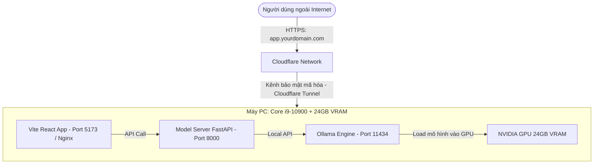

# Hướng dẫn chi tiết: Thiết lập "Local Cloud" với GPU 24GB VRAM & i9-10900

Tài liệu này hướng dẫn chi tiết từng bước để biến máy tính cá nhân chạy Windows của bạn thành một đám mây nội bộ (Local Cloud) hiệu năng cao, bảo mật và an toàn để phục vụ ứng dụng dự đoán độc tính (Tox-Agent) kết hợp LLM Local (Qwen 2.5) cho hơn 100 người dùng truy cập từ Internet.

---

## ⚠️ CÁC VẤN ĐỀ CẦN LƯU Ý (Đã kiểm tra ngày 2026-06-03)

Sau khi đối chiếu hướng dẫn này với cấu trúc thực tế của dự án, có **4 vấn đề** cần xử lý trước khi triển khai:

### 🔴 Vấn đề 1 (NGHIÊM TRỌNG): Frontend gọi sai API URL khi qua Cloudflare Tunnel

File `frontend/.env.local` hiện đang cấu hình:
```
VITE_API_BASE_URL=http://127.0.0.1:8000
```
Khi người dùng bên ngoài truy cập qua Tunnel (`https://app.yourdomain.com`), trình duyệt của họ sẽ gọi API về `localhost` của **chính máy họ**, không phải máy server. Toàn bộ API call sẽ thất bại.

**Cần làm trước khi build:** Sửa `frontend/.env.production`:
```
VITE_API_BASE_URL=https://api.yourdomain.com
```
*(Thay `yourdomain.com` bằng domain thực của bạn)*

---

### 🔴 Vấn đề 2 (NGHIÊM TRỌNG): Dùng `npm run dev` cho production là sai

Hướng dẫn (Giai đoạn 2 & 4) chỉ định chạy `npm run dev` để serve frontend. Vite dev server **không được thiết kế cho môi trường production** — không tối ưu, tốn tài nguyên, và không xử lý được concurrent users hiệu quả.

**Quy trình đúng:**
```powershell
# Bước 1: Build một lần (sau khi đã sửa .env.production)
cd d:\tox-agent\frontend
npm run build

# Bước 2: Serve thư mục dist/ (thay cho npm run dev)
npx serve -s dist -l 5173
```

---

### 🟡 Vấn đề 3 (VỪA): Có thể bị lỗi CORS khi Frontend và API dùng subdomain khác nhau

Khi Frontend (`https://app.yourdomain.com`) gọi API về (`https://api.yourdomain.com`), FastAPI backend cần cấu hình CORS cho phép domain này. Cần kiểm tra `model_server/main.py` đảm bảo `allow_origins` đã bao gồm domain production của bạn (hoặc dùng `["*"]` nếu không cần bảo mật strict).

---

### 🟡 Vấn đề 4 (NHỎ): Script NSSM `run_frontend.bat` cần dùng lệnh serve, không phải `npm run dev`

Do Vấn đề 2, file `run_frontend.bat` trong Giai đoạn 4 cần được viết lại:
```bat
@echo off
cd /d d:\tox-agent\frontend
npx serve -s dist -l 5173
```
*(Đã tích hợp ghi chú sửa đổi vào phần tương ứng bên dưới)*

---

## 🗺️ Bản đồ kiến trúc hệ thống



---

## ⚡ GIAI ĐOẠN 1: Chuẩn bị hệ thống & Tối ưu hóa GPU

Với **24GB VRAM**, mục tiêu của bạn là tối ưu hóa để GPU có thể xử lý đồng thời nhiều yêu cầu (concurrency) cùng lúc mà không bị treo hay nghẽn cổ chai.

### 1. Thiết lập biến môi trường để Ollama chạy song song (Multi-Concurrency)
Mặc định, Ollama chỉ xử lý tuần tự từng request (người này xong mới đến người kia). Để phục vụ 100 users thường xuyên, bạn cần cấu hình lại:

1. Nhấp phím `Windows` -> Gõ **"Environment Variables"** -> Chọn **Edit the system environment variables**.
2. Click nút **Environment Variables...** ở phía dưới.
3. Tại ô **System variables** (phía dưới), click **New...** và thêm 2 biến sau:
   *   **Variable Name:** `OLLAMA_NUM_PARALLEL`
   *   **Variable Value:** `4` *(Cho phép xử lý song song tối đa 4 yêu cầu sinh văn bản cùng một tích tắc. Với 24GB VRAM, mức 4-6 là lý tưởng).*
   *   **Variable Name:** `OLLAMA_MAX_LOADED_MODELS`
   *   **Variable Value:** `1` *(Chỉ giữ duy nhất mô hình Qwen trong VRAM để dành trọn dung lượng cho xử lý song song).*
4. Click **OK** để lưu lại toàn bộ.
5. **Khởi động lại Ollama** để áp dụng cấu hình (Tắt icon Ollama ở thanh Taskbar dưới góc phải rồi mở lại).

### 2. Tải và kiểm tra mô hình Qwen tối ưu nhất
Với 24GB VRAM, bạn có 2 sự lựa chọn tuyệt vời:
*   **Lựa chọn 1 (Tốc độ tối đa):** `qwen2.5:7b-instruct` (~4.7 GB). Xử lý cực nhanh, cực nhẹ.
*   **Lựa chọn 2 (Độ thông minh vượt trội):** `qwen2.5:14b-instruct` (~9 GB). Khuyên dùng vì máy của bạn dư sức chạy mô hình này với hiệu năng đỉnh cao.

> [!TIP]
> Để tải mô hình 14B, hãy mở terminal (PowerShell) và chạy lệnh:
> ```powershell
> ollama pull qwen2.5:14b-instruct
> ```

---

## 🚀 GIAI ĐOẠN 2: Khởi chạy các Service trong dự án

Để dự án hoạt động ổn định trên máy của bạn như một Cloud thực thụ, chúng ta sẽ bật cả 3 thành phần chính:

### 1. Cấu hình file `.env` cho Production Local
Chỉnh sửa file `.env` tại thư mục gốc của dự án ([`d:\tox-agent\.env`](file:///d:/tox-agent/.env)) để chỉ định chạy hoàn toàn local:

```env
LOCAL_LLM_PROVIDER=ollama
LOCAL_LLM_BASE_URL=http://127.0.0.1:11434
LOCAL_LLM_MODEL=qwen2.5:7b-instruct  # Đổi thành qwen2.5:14b-instruct nếu tải bản 14B
LOCAL_LLM_ONLY=true
```

### 2. Khởi chạy FastAPI Model Server
Mở một cửa sổ PowerShell mới và chạy backend FastAPI:

```powershell
cd d:\tox-agent
.venv\Scripts\python.exe -m uvicorn model_server.main:app --host 0.0.0.0 --port 8000
```
> [!NOTE]
> Khi chạy lần đầu, server sẽ load các mô hình học máy cục bộ (GNNs, Tox21, XSmiles). Quá trình này sẽ tốn khoảng 3-4GB RAM hệ thống và mất khoảng 1 phút. Hãy kiên nhẫn đợi cho đến khi xuất hiện dòng chữ `Application startup complete.`

### 3. Khởi chạy Frontend React/Vite
Mở một cửa sổ PowerShell khác để chạy Frontend:

> [!CAUTION]
> **⚠️ Vấn đề 1 & 2:** Lệnh `npm run dev` bên dưới **KHÔNG phù hợp cho production**. Trước khi chạy, phải:
> 1. Sửa `frontend/.env.production` → đặt `VITE_API_BASE_URL=https://api.yourdomain.com`
> 2. Chạy `npm run build` để tạo thư mục `dist/`
> 3. Thay lệnh bên dưới bằng: `npx serve -s dist -l 5173`

```powershell
# ❌ KHÔNG dùng lệnh này cho production (chỉ dùng khi dev nội bộ):
# npm run dev -- --host 0.0.0.0 --port 5173

# ✅ Lệnh ĐÚNG cho production (sau khi đã chạy npm run build):
cd d:\tox-agent\frontend
npx serve -s dist -l 5173
```
> [!IMPORTANT]
> Khi dùng `npx serve`, flag `--host 0.0.0.0` không cần thiết — `serve` tự động lắng nghe trên tất cả interface, Cloudflare Tunnel sẽ kết nối được.

---

## 🌐 GIAI ĐOẠN 3: Đưa hệ thống ra Web bằng Cloudflare Tunnel

Đây là bước quan trọng nhất để người dùng bên ngoài Internet truy cập được vào máy tính của bạn mà không cần mở port mạng (Port Forwarding), đảm bảo an toàn tuyệt đối trước hacker.

### 1. Chuẩn bị tài khoản Cloudflare
1. Đăng ký một tài khoản miễn phí tại [cloudflare.com](https://www.cloudflare.com/).
2. Nếu bạn chưa có tên miền (Domain Name), hãy mua một tên miền giá rẻ (chỉ khoảng 2-5$/năm) trên Cloudflare Registry hoặc Namecheap, sau đó thêm tên miền đó vào Cloudflare.

### 2. Tạo và cài đặt Cloudflare Tunnel
1. Đăng nhập vào trang quản trị Cloudflare -> Chọn mục **Zero Trust** từ thanh menu bên trái.
2. Đi tới **Networks** -> **Tunnels** -> Click **Create a Tunnel**.
3. Chọn **Cloudflared** làm connector -> Nhấn **Next**.
4. Đặt tên cho tunnel của bạn (Ví dụ: `tox-agent-local-cloud`) -> Nhấn **Save tunnel**.
5. Hệ thống sẽ hiển thị tab **Install and run a connector**. Bạn chọn hệ điều hành là **Windows** và cấu trúc **64-bit**.
6. Sao chép dòng lệnh cài đặt môi trường được hiển thị trên màn hình. Nó sẽ có dạng như thế này:
   ```powershell
   # Ví dụ dòng lệnh cài đặt (Không copy nguyên văn dòng này, hãy copy từ trang Cloudflare của bạn)
   msiexec /i https://github.com/cloudflare/cloudflared/releases/latest/download/cloudflared-windows-amd64.msi /quiet
   sc create cloudflared binPath= "C:\Program Files (x86)\cloudflared\cloudflared.exe service run YOUR_SECRET_TOKEN"
   sc start cloudflared
   ```
7. Mở PowerShell với quyền **Administrator** (Run as Administrator) và dán dòng lệnh đó vào để chạy.
8. Quay lại trang Cloudflare, nếu cài đặt thành công, bạn sẽ thấy trạng thái chuyển sang màu xanh lá **Active**. Nhấn **Next**.

### 3. Cấu hình định tuyến (Route Traffic)
Chúng ta cần cấu hình để Cloudflare ánh xạ tên miền của bạn về đúng các port nội bộ trên máy PC:

#### A. Cấu hình đường truyền cho Frontend Web:
*   **Subdomain:** `app` (Hoặc để trống nếu muốn dùng tên miền chính)
*   **Domain:** Chọn tên miền của bạn (Ví dụ: `cuaban.com`)
*   **Type:** `HTTP`
*   **URL:** `localhost:5173`

#### B. Cấu hình đường truyền cho API Backend (Model Server):
1. Click **Add a public hostname**.
2. Cấu hình thông tin:
   *   **Subdomain:** `api`
   *   **Domain:** Chọn tên miền của bạn (Ví dụ: `cuaban.com`)
   *   **Type:** `HTTP`
   *   **URL:** `localhost:8000`
3. Click **Save Tunnel**.

> [!WARNING]
> **⚠️ Vấn đề 3 — CORS:** Sau khi cấu hình 2 subdomain khác nhau (`app.*` và `api.*`), kiểm tra `model_server/main.py` để đảm bảo `CORSMiddleware` cho phép origin từ domain frontend của bạn. Nếu API bị chặn, trình duyệt sẽ báo lỗi `CORS policy` và mọi request từ frontend sẽ thất bại.

> [!SUCCESS]
> Sau bước này, toàn bộ hệ thống của bạn đã hoạt động trên môi trường Internet toàn cầu thông qua giao thức HTTPS bảo mật:
> *   Người dùng vào web bằng địa chỉ: `https://app.cuaban.com`
> *   Ứng dụng React sẽ gọi API tới server của bạn tại: `https://api.cuaban.com`

---

## 🛠️ GIAI ĐOẠN 4: Chạy ngầm dự án ổn định 24/7 trên Windows

Để đảm bảo các service luôn tự động chạy khi máy tính khởi động và không bị tắt khi bạn lỡ tắt cửa sổ Command Prompt, hãy thiết lập chạy ngầm:

### 1. Biến các script thành Service Windows (Sử dụng NSSM - Non-Sucking Service Manager)
NSSM là một công cụ miễn phí rất mạnh giúp chạy bất kỳ file `.bat` hay `.exe` nào dưới dạng dịch vụ hệ thống của Windows (chạy ngầm, tự động khởi động lại nếu bị crash).

1. Tải NSSM từ trang [nssm.cc](https://nssm.cc/download). Giải nén và copy file `nssm.exe` (bản win64) vào thư mục `C:\Windows\System32\`.
2. Tạo 2 file batch nhỏ để chạy dự án:
   *   **File `run_backend.bat`:**
       ```bat
       @echo off
       cd /d d:\tox-agent
       .venv\Scripts\python.exe -m uvicorn model_server.main:app --host 0.0.0.0 --port 8000
       ```
   *   **File `run_frontend.bat`:** *(⚠️ Vấn đề 4: Đã sửa — dùng `serve` thay cho `npm run dev`)*
       ```bat
       @echo off
       cd /d d:\tox-agent\frontend
       npx serve -s dist -l 5173
       ```
       > **Lưu ý:** Phải chạy `npm run build` ít nhất một lần trước khi cài service này để thư mục `dist/` tồn tại.
3. Mở PowerShell (Admin) và chạy lệnh cài đặt Service:
   ```powershell
   nssm install ToxAgentBackend "d:\tox-agent\run_backend.bat"
   nssm install ToxAgentFrontend "d:\tox-agent\run_frontend.bat"
   ```
4. Hệ thống sẽ mở bảng giao diện đồ họa. Bạn chỉ cần nhấn **Install service**. Từ giờ, cả Frontend và Backend sẽ luôn chạy ngầm ổn định như một dịch vụ của hệ thống Windows.

---

## 📊 GIAI ĐOẠN 5: Giám sát và Bảo trì hệ thống

### 1. Giám sát tài nguyên GPU & CPU
Khi có nhiều người truy cập, bạn cần kiểm tra xem card đồ họa có bị quá tải VRAM hay không:
*   Mở PowerShell và chạy lệnh giám sát GPU thời gian thực:
    ```powershell
    nvidia-smi -l 2
    ```
    *(Màn hình sẽ cập nhật 2 giây/lần lượng VRAM đang sử dụng và công suất tiêu thụ điện của GPU)*.

### 2. Thiết lập Windows không tự động ngủ (Sleep Mode)
Vì máy tính của bạn đóng vai trò là Server nên bắt buộc **không được đi vào chế độ ngủ (Sleep)**:
1. Mở **Settings** -> **System** -> **Power & sleep**.
2. Tại mục **Sleep**, chọn **Never** cho cả hai lựa chọn.

---

🎉 **Chúc mừng!** Bạn đã sở hữu một hệ thống AI cục bộ cực kỳ mạnh mẽ, an toàn tuyệt đối và tự chủ 100% về mặt dữ liệu, sẵn sàng kiếm tiền từ dự án của mình mà không tốn một đồng chi phí vận hành đám mây hàng tháng nào!
